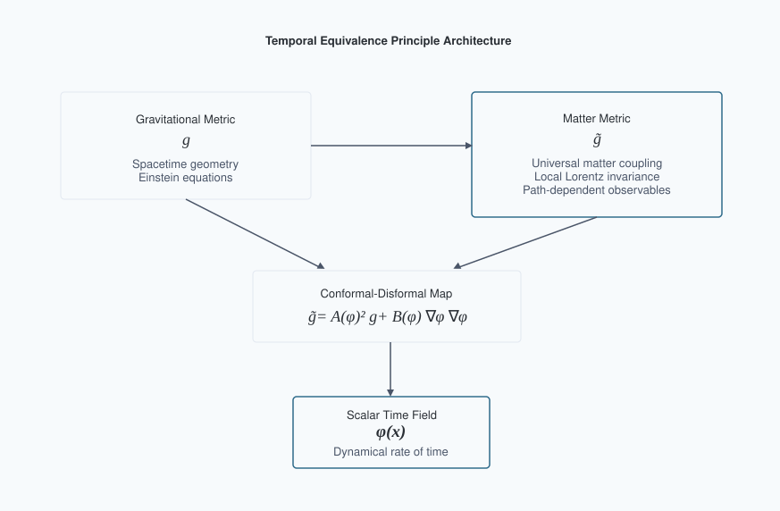
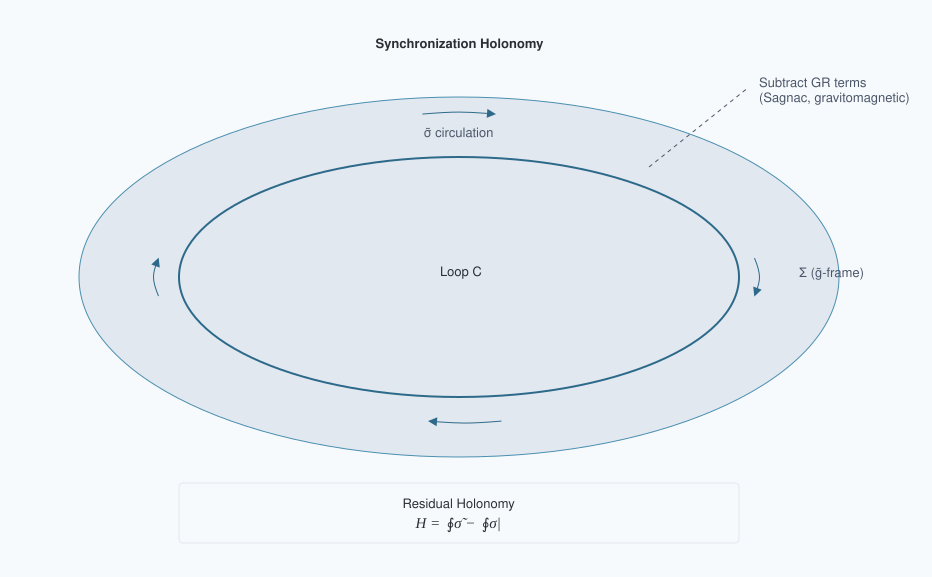
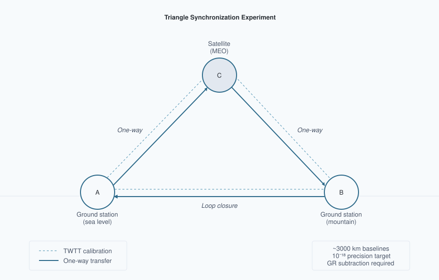

# Temporal Equivalence Principle: Dynamic Time & Emergent Light Speed
**Matthew Lukin Smawfield**
Version: v0.14 (Jakarta)
First published: 18 August 2025 · Last updated: 23 September 2026
DOI: 10.5281/zenodo.16921911

---

## Abstract

This paper proposes a covariant, testable reformulation of relativity in which proper time is a dynamical field and the "speed of light" is an emergent, strictly local invariant rather than a global constant. The framework is built on a single spacetime manifold endowed with two metrics: a gravitational metric $g_{\mu\nu}$ and a causal (matter) metric $\tilde{g}_{\mu\nu}$ to which all non-gravitational fields and clocks couple. The metrics are related by a controlled disformal map, $\tilde{g}_{\mu\nu} = A^2(\phi) g_{\mu\nu} + B(\phi) \nabla_\mu\phi \nabla_\nu\phi$, where $\phi$ is the time field, $A(\phi) = \exp(\beta_A \phi/M_{\text{Pl}})$ is a universal conformal factor, and $B(\phi)$ encodes tiny, direction-dependent deformations of the light cone consistent with GW170817-class multi-messenger constraints ($|c_\gamma - c_g|/c \lesssim \text{few}\times10^{-15}$ today). Proper time is elevated to a field by postulating that all matter, electromagnetism, and quantum phases evolve with respect to $\tilde{g}$-proper time $\tau$; in local freely falling frames, this guarantees exact local Lorentz invariance and a locally invariant c, while globally it implies that synchronization procedures and one-way light-time measurements can become path-dependent in the disformal/non-exact sector of a dynamical-time background. The covariant action, field equations, conservation laws, and PPN mapping are developed; screening is formulated via continuous Temporal Topology and the Temporal Shear. The breakdown of global simultaneity is formalized using a synchronization-transport law, deriving a convention-independent "synchronization holonomy," an invariant measure of non-integrability of time transport around closed loops. In the purely conformal subclass this holonomy vanishes after subtraction of the full GR, kinematic, clock-scale, and reference-frame synchronization model; nonzero holonomy at leading order requires residual non-exact synchronization structure, supplied in the minimal TEP model by disformal coupling $B(\phi)\neq0$, and in more general extensions by non-metricity or other explicitly non-exact transport structure. Explicit small-$B$ formulas are provided for the holonomy and the effective photon phase speed, showing how the measured one-way asymmetry is related to $\phi$-gradients and disformal scales under current constraints. The analysis demonstrates that Einstein's assumption of a universal c was a brilliant local theorem arising from the Temporal Equivalence Principle; transcending it demands dynamical time: c remains exactly invariant locally, but global, one-way-inferred "c" values differ by path-dependent amounts that experiments can detect or bound. Cosmologically, TEP adopts an eternal, spatially infinite, inhomogeneous background whose physical volume does not undergo cosmological expansion. Neither space nor matter changes size. The matter unit of time drifts relative to the static gravitational geometry, and because $c$ is locally invariant, the matter unit of length drifts with it. Distances and densities expressed in matter units therefore evolve without any physical stretching, allowing the observed redshift and apparent Hubble relation to emerge directly from the macroscopic historical drift of the inhomogeneous temporal network over coordinate time, governed by the exact conformal endpoint ratio. An exactly solved closed-static branch establishes that the specified action admits a static, eternal gravitational configuration with conformal unit drift; that branch is an analytical benchmark, neither an attractor nor capable of near-flat matter geometry; the infinite inhomogeneous solution — to be realized by a single universal potential, together with its horizon properties, the length of its matter-frame clock history, and its redshift–distance law — is posed as an explicit construction problem. A candidate early-universe closure, in which the Big Bang gravitational singularity is replaced by a matter-frame temporal boundary without phenomenological thermal screening, is developed through the companion transport analyses (TEP-BBN), whose conformal temporal geometry preserves the observed CMB acoustic structure. Known weaknesses in the variable-c literature are addressed by supplying a correct, operationally invariant observable (holonomy), clarifying when conformal couplings cannot produce a signal, and providing realistic, constraint-consistent benchmark sensitivity windows with explicit error budgets and statistical plans (pre-registration, blinding, publicly released code and data). The resulting theory preserves the empirical pillars of relativity (local Lorentz invariance, gravitational-wave causality, PPN bounds) while extending its conceptual foundation: simultaneity is not only relative but generally non-integrable; the speed of light is not a global constant but the local echo of a deeper, dynamical temporal geometry.

Long-standing confusions about "variable $c$" are resolved by replacing convention-dependent statements with invariant observables tied to measurement procedures. A synchronization one-form $\tilde{\sigma}$ is defined on spacelike slices of the matter metric; its curl $d\tilde{\sigma}$, after subtraction of the full GR, kinematic, clock-scale, and reference-frame synchronization model, yields a residual "temporal holonomy" $H$ that vanishes in GR and becomes nonzero only when time is dynamical in this sense. Two key theorems are proven: (i) conformal matter coupling preserves null cones, so photons and gravitons share the same causal structure at late times; (ii) a static $\phi$-gradient produces no direct propagation asymmetry in the static purely conformal limit—the cancellation is exact, not merely first-order. Disformal tilts ($B \neq 0$) are tightly constrained by GW170817-class multi-messenger observations but can source holonomy; the admissible-branch amplitude is not yet derived, and the triangle experiment is quoted as a bound rather than a prediction. The effective covariant architecture is presented; field equations, conservation laws, invertibility/causality conditions, and a 3+1 decomposition are derived to make the observables explicit. Screening via a continuous Temporal Topology governed by non-linear superposition of field gradients (Temporal Shear) reconciles precision local tests with cosmological evolution, with mapping to Parametrized Post-Newtonian parameters and to the EFT-of-dark-energy $\alpha$-functions with $c_T = 1$ enforced. Decisive experiments with quantitative error budgets are outlined: (1) a ground–ground–satellite triangle time-transfer experiment targeting holonomy at below $10^{-18}$ fractional after GR subtraction; (2) portable-clock "clock anholonomy" around closed paths at the $10^{-19}$ level over days; (3) multi-species clock networks seeking phase-locked annual modulations at $10^{-19}$–$10^{-17}$; (4) interplanetary one-way optical links at picoseconds over AU; (5) altitude-dependent screening maps with optical clocks and atom interferometers; and (6) ensemble multi-messenger tests. Cosmological inference is implemented through native hi_class and Cobaya analyses (Papers 18, 26), with commitment to open data and blinded analyses.

Einstein's postulate of universal $c$ was a brilliant, operationally perfect approximation in regimes where time's flow is effectively uniform. In a universe where the rate of time is dynamical yet locally Lorentzian, "the speed of light" emerges as an invariant in every local lab but ceases to be globally universal. The new invariant content resides in path-dependent synchronization defects and holonomies of time transport, not in naive one-way "speeds." If detected, these invariants would inaugurate a post-Einsteinian era: from dynamic geometry to dynamic time.

## 1. Introduction: From a Universal Speed to a Universal Principle of Time

Relativity and quantum theory disagree about time. General relativity (GR) makes proper time geometric—$d\tau^2 = -g_{\mu\nu} dx^\mu dx^\nu / c^2$—dynamical, and observer-dependent. Quantum mechanics (QM) treats time as an external parameter t in the Schrödinger equation, $i\hbar \partial_t|\psi\rangle = \hat{H}|\psi\rangle$. The clash has haunted quantization programs for a century and manifested operationally as subtle ambiguities in defining one-way light speeds and simultaneity across extended regions. Precision clocks and time-transfer links now measure gravitational redshifts and velocity-dependent dilations at $10^{-18}$ fractional levels, while cosmology exhibits persistent $H_0$ and $S_8$ tensions. In this context, Einstein's postulate of a universal speed c must be sharpened: it is exact for any local freely falling laboratory, but it cannot be a global property if the flow of time itself is dynamical.

The Temporal Equivalence Principle (TEP) is proposed: all non-gravitational dynamics, signals, and quantum phases evolve according to the proper time defined by a single causal metric $\tilde{g}_{\mu\nu}$ that couples universally to matter. The rate at which proper time accrues is a field. This elevates "when" to the status "where" acquired in 1915: as space was geometrized, now time's rate is dynamized. The consequence is that synchronization conventions can become globally non-integrable when the dynamical-time background contains a disformal or otherwise non-exact transport component: even after removing known GR effects, closed-loop time transport can then retain a residual path-dependent offset. The measured "speed of light" between distant clocks is revealed as an emergent ratio of distance to accrued proper time, not a fundamental constant comparable across regions without a theory of time's flow. Locally, c remains exactly invariant; globally, dynamical time imprints tiny, path-dependent asymmetries that can be detected or bounded.



Figure 1. Temporal Equivalence Principle (TEP) architecture. Matter couples to $\tilde{g}_{\mu\nu}$ via a conformal–disformal map controlled by the scalar time field $\phi$, preserving local Lorentz invariance while enabling new global invariants.

## 2. Axioms and the Temporal Equivalence Principle

The framework adopts four axioms:

- **A1. Two-metric structure on a single manifold.** Gravity is described by a Lorentzian metric $g_{\mu\nu}$; matter fields, clocks, and rulers couple to a causal (matter) metric $\tilde{g}_{\mu\nu}$. The metrics are related by a disformal map
$$\tilde{g}_{\mu\nu} = A^2(\phi) g_{\mu\nu} + B(\phi) \nabla_\mu\phi \nabla_\nu\phi,$$
with a universal conformal factor $A(\phi) = \exp(\beta_A \phi/M_{\text{Pl}})$ and a small disformal function $B(\phi)$ consistent with multi-messenger constraints today.

- **A2. Temporal Equivalence Principle (TEP).** All non-gravitational processes evolve according to proper time $d\tau$ defined by $\tilde{g}_{\mu\nu}$: $i\hbar d|\psi\rangle/d\tau = \hat{H}|\psi\rangle$, nongravitational fields propagate on $\tilde{g}$-null cones, and ideal clocks tick $d\tau^2 = -\tilde{g}_{\mu\nu} dx^\mu dx^\nu/c^2$. In local freely falling frames for $\tilde{g}_{\mu\nu}$, physics reduces to special relativity with invariant c.

- **A3. Causal safety and locality.** Today, $c_g = c_\gamma$ within current bounds ($|c_g - c_\gamma|/c \lesssim \text{few}\times10^{-15}$). This is enforced by choosing $A(\phi)$ universal, such that conformal transformations preserve null cones for photons and gravitons when $B = 0$, and by constraining the observable combination $B(\phi)(\partial\phi)^2$ along late-time astrophysical propagation paths. Different experiments constrain different integrals or responses involving the single disformal function $B(\phi)$; GW170817 does not require $B$ to vanish identically in all regimes. Hyperbolicity and energy conditions hold within the EFT domain.

- **A4. Screening and universality.** The coupling $A(\phi)$ is universal at leading order; loop-induced composition dependence is tightly bounded. Environmental suppression of the locally observable Temporal Shear/source-charge sector reconciles local tests with cosmological dynamics. Chameleon, Vainshtein, Galileon, DBI, and symmetron mechanisms are treated as candidate microscopic completions, not as the defining ontology of TEP. Screening manifests as a continuous spatial and covariance structure of the scalar time field (Temporal Topology) governed by the temporal potential field and its gradient (Temporal Shear), suppressing geometric deviations in screened regimes while leaving cosmology accessible to dynamics.

These axioms encode Einstein's local invariance as a theorem and extend it: c is exactly invariant for every tangent space of $\tilde{g}_{\mu\nu}$, but global synchronization and one-way timing depend on the dynamical field $\phi$.

The scalar time field $\phi$ is defined on the spacetime manifold of Axiom A1 and is present at every event. The ambient cosmological value $\phi_\infty = 0$ is a boundary condition, not an absence of the field. What distinguishes dense from dilute environments is not the presence or absence of $\phi$ but the matter trace $T^{(\rm m)}$ and the environmental state vector $\mathcal{E}$ (ambient density, compactness, gradients, boundary geometry). The term "vacuum" is retained in its standard field-theory sense — the $T^{(\rm m)} = 0$ limit of the matter sector — and does not denote a region devoid of the temporal field.

Environmental screening $\mathcal{S}_\Sigma(\mathcal{E})$ suppresses the conformal gradient $\Sigma_\mu = \nabla_\mu \ln A$. In TEP, this spatial gradient—measuring how clock tick-rates slope from one point to another—is formally named the Temporal Shear. It governs the geometric refraction of matter: when the slope is steep, matter geodesics bend; when it is flat ($\Sigma_\mu \to 0$), matter follows standard General Relativity paths. The Temporal Shear is suppressed via temporal-topology pinning in dense regions. It does not suppress the disformal sector $B(\phi)$, which is governed by its own field-space envelope (Section 2.2). The two are distinct mechanisms operating on distinct sectors of the disformal map. The amplitude/shear split ($\mathcal{S}_\Sigma \to 0$, $S_A \sim 1$) suppresses the spatial gradient while preserving the field value: $A(\phi)$ continues to vary inside screened matter, which is why clocks run slower in deeper wells. What is pinned is the gradient, not the field amplitude. Theorem 2 (Section 6) further establishes that a static conformal gradient produces no directional photon-propagation asymmetry; direction-dependent null propagation requires the disformal sector, time-dependent geometry, or another non-exact transport contribution.

## Sector mapping

| Sector | Physical effect | Coupling | Key bound |
| --- | --- | --- | --- |
| **Conformal $A(\phi)$** | Clock rates, proper time rescaling | Universal ($\beta_A$) | Cassini PPN-$\gamma$ (via $S_\Sigma$ source charge), redshift tests |
| **Disformal $B(\phi)$** | Null cone tilts, direction-dependent propagation | Small, environment-dependent | GW170817: $|c_\gamma - c_g|/c \lesssim \text{few}\times10^{-15}$ |
| **Temporal Topology** | Spatial/covariance structure of $\ln A(\phi)$ | Field configuration + gradient suppression | Clock/covariance correlation length $\lambda_T$ |

The conformal sector governs clock rates; the disformal sector governs cone tilts. GW170817 directly bounds disformal cone splits governed by $B$. It does not directly test common-mode conformal clock-rate structure governed by $A$, although local conformal gradients/source charges remain constrained by PPN, gravitational-redshift, clock-comparison, and equivalence-principle tests.

## 2.1 Relation to Other Modified Gravity Frameworks

The TEP framework can be situated within the broader landscape of modified gravity and scalar-tensor theories. To clarify its unique features, a comparative analysis is provided:

Table 1: Comparison with Other Scalar-Tensor Frameworks

| Theory/Framework | Key Fields | Matter Coupling | $c_g = c_γ$? | Key Observable Signature |
| --- | --- | --- | --- | --- |
| **TEP (This work)** | $g_{\mu\nu}$, $\phi$ | Universal to $\tilde{g}_{\mu\nu} = A^2 g_{\mu\nu} + B \partial_\mu\phi \partial_\nu\phi$ | Equal in conformal/common-mode limit; differential deviations possible through $B$ and constrained by same-path EM–GW timing | Synchronization Holonomy $H_{\rm resid}$ |
| **Horndeski** | $g_{\mu\nu}$, $\phi$ | Minimal to $g_{\mu\nu}$ | Yes, after GW170817 constraints | Modified growth, ISW |
| **DHOST** | $g_{\mu\nu}$, $\phi$ | Minimal to $g_{\mu\nu}$ | Yes, for specific degenerate classes | Modified growth, screening |
| **TeVeS** | $g_{\mu\nu}$, $A_\mu$, $\phi$ | To a combined metric | No | MOND phenomenology, lensing |
| **SMEFT** | SM fields | Lorentz-violating operators | Model-dependent | Anisotropic propagation, CPT violation |

The multi-messenger constraint from GW170817 constrains the integrated EM–GW differential disformal contribution along observed late-time astrophysical paths. It does not require the disformal sector to vanish identically in all regimes. In the conformal limit, common-mode path effects cancel in EM–GW timing; residual $B$-sector structure remains testable through multipath delays, closed-loop holonomy, and topological or interferometric regimes. The model, with a universal conformal coupling $A(\phi)$ and a disformal term $B(\phi)$, automatically satisfies $c_g = c_γ$ in the conformal limit ($B=0$). A non-zero $B(\phi)$ introduces a calculable deviation $c_γ ≠ c_g$ constrained by future multi-messenger observations.

Conceptually, TEP differs from many scalar-tensor theories by its foundational principle: the universal coupling of matter to a single metric $\tilde{g}_{\mu\nu}$. This is philosophically closer to Bekenstein's TeVeS theory, which also introduced a separate matter metric, but the framework is more minimal, using only a scalar, and makes a distinctive operational prediction in the form of the synchronization holonomy.

## 2.2 Minimal covariant action

The displayed low-curvature action below represents the leading sector of the master TEP Effective Field Theory. The strong-curvature completion includes higher-order curvature operators (such as the scalar-Gauss-Bonnet coupling $\alpha_{\rm GB} f(\phi)\mathcal{G}$) which are negligible in the weak-field and cosmological regimes studied here, but become active in the strong-field regime to supply real backreaction (as detailed in TEP-BH, Paper 28). The unified action, including the strong-curvature sector, is

$$S = \int d^4x\sqrt{-g} \left[ \frac{M_{\rm Pl}^2}{2}R -\frac{1}{2}K(\phi)(\nabla\phi)^2 -V(\phi) +\alpha_{\rm GB}\,f(\phi)\,\mathcal{G} \right] + S_m[\psi_i,\tilde g_{\mu\nu}],$$

with the conformal-disformal matter metric

$$\tilde g_{\mu\nu} = A^2(\phi)\,g_{\mu\nu} + B(\phi)\,\nabla_\mu\phi\,\nabla_\nu\phi .$$

In the weak-field regime ($\alpha_{\rm GB} f(\phi)\mathcal{G}\to 0$, $K\to 1$) this reduces to the minimal scalar-tensor action used throughout Papers 1–19. The strong-curvature sector is activated only in the black-hole completion (Paper 28) and does not participate in any GNSS, LLR, cosmological, or wide-binary calculation. The field-dependent coefficient $K(\phi)$ in this action is absorbable by a field redefinition ($\chi = \int\sqrt{K(u)}\,du$) and does not by itself constitute nonlinear derivative screening; the candidate derivative realization $K(X)$ introduced below is a distinct object, specified separately as a candidate microscopic completion.

### Canonical microscopic structure

The universal conformal coupling, the conformal–disformal matter metric architecture, and the observable Temporal-Topology response structure are fixed. The framework cleanly divides responsibilities: the two-body operator $\mathcal{S}_{\rm eff}$ governs pairwise Temporal Shear recovery, while the scalar self-interaction $V(\phi)$ must remain flat/shallow across the matter-hosting domain to satisfy cosmological background constraints. The candidate master potential of Section 8 is a single smooth ($C^\infty$) function whose essential singularity supplies the locally flat potential floor required by the temporal-well roll (Appendix E, R3). The items below specify the canonical microscopic structure.

*Conformal coupling.* The conformal factor is fixed universally as

$$A(\phi) = \exp\!\left(\frac{\beta_A\,\phi}{M_{\rm Pl}}\right), \qquad \beta_A = -1.0,$$

so that the dimensionless coupling $d\ln A/d\varphi = \beta_A = -1$ is frozen (equivalently $\alpha_0 = \sqrt{2}\,\beta_A$ in DEF normalization), where $\varphi \equiv \phi/M_{\rm Pl}$ is the dimensionless field variable. The weak-field Solar-System safety is not a second parameter $\beta\approx -0.013$ but the screened source charge $S_\Sigma^{(\odot)}\,\alpha_0$: because the photon probe is unscreened while the source charge is suppressed, the PPN deviation is linear in the solar charge fraction, providing the strict, sign-definite prediction $\gamma_{\rm PPN}-1 = -4\beta_A^2 S_\Sigma^{(\odot)}/(1+2\beta_A^2 S_\Sigma^{(\odot)}) < 0$, constrained by Cassini to $|\gamma_{\rm PPN}-1| < 2.3\times10^{-5}$, fixing $S_\Sigma^{(\odot)} \lesssim 5.8\times10^{-6}$ in the Solar-System environment. The terrestrial amplitude factor $S_A^{(\oplus)}$ governs GNSS clock-rate and covariance observables. The Solar-System source-charge factor $S_\Sigma^{(\odot)}$ is a different projection and need not equal $S_A^{(\oplus)}$.

*Sign convention for $\phi$ (corpus-wide).* The scalar field is defined so that **$\phi > 0$ in the vicinity of a mass concentration**, with the ambient cosmological value taken as the zero point by convention, $\phi_\infty = 0$. Combined with the frozen coupling $\beta_A = -1$, this fixes every downstream sign in the framework:

- $A(\phi) = \exp(\beta_A\varphi) < 1$ near a mass, so the conformal factor is *suppressed* in a potential well.

- Since matter clocks tick at $d\tau/dt \simeq A(\phi)$, clocks run slower in deeper wells. This reproduces the sign of the ordinary gravitational redshift and is therefore the convention consistent with general relativity in the screened limit.

- The Temporal Shear $\Sigma_\mu \equiv \nabla_\mu \ln A = \beta_A \nabla_\mu \varphi$ points *outward* from a mass (since $\beta_A < 0$ and $\nabla_\mu\varphi$ points inward).

- Consequently $\beta_A \phi < 0$ near a mass, and $\Delta \ln A < 0$ relative to the ambient environment.

The opposite choice ($\phi < 0$ near a mass, giving $A > 1$ and clocks running *faster* in wells) is inconsistent with the measured sign of gravitational redshift and is not used anywhere in this corpus. Any paper reporting a conformal-sector sign should be checked against this convention before its result is compared with another paper's. Where a manuscript quotes $\lvert\beta_A\rvert$ or an unsigned effective coupling, that is a magnitude and carries no sign information.

*Bidirectionality of the conformal factor.* The prohibition above concerns the sign of $A$ in potential wells. The conformal factor nevertheless deviates symmetrically relative to the ambient medium ($A = 1$): $A < 1$ in overdensities (clocks tick slower) and $A > 1$ in underdensities (clocks tick faster). In the weak-field limit, the scalar perturbation $\delta\phi \simeq 2\beta_A\,M_{\rm Pl}\,\Phi_N$ traces the Newtonian potential with a sign flip, forcing the temporal field to oscillate both above and below unity depending on the local matter distribution. Along an extended line of sight through the cosmic web, these exact conformal excursions spatially average out to recover the smooth cosmological background. However, the non-exact covariance $\mathcal{C}_T$ (Paper 26) retains a cumulative, macroscopic residual that resists spatial averaging. This distinction between exact conformal averaging and non-exact residual survival is the physical content of the $\Sigma_\parallel + \mathcal{C}_{T,\parallel}$ decomposition of Paper 26.

*Disformal coupling.* The matter metric contains a disformal coupling function $B(\phi)$. Observable disformal effects depend on the complete combination $B(\phi)\nabla_\mu\phi\nabla_\nu\phi$, rather than on $B(\phi)$ alone. Paper 28 employs the field-space envelope

$$B(\phi) = B_0\,\frac{\varphi^2}{1+\varphi^2}\, \exp\!\left(-\frac{\varphi^4}{2\,\sigma_B^4}\right), \qquad \varphi\equiv\phi/M_{\rm Pl},$$

as a prescribed strong-field realization. At weak-field values ($\varphi \sim 10^{-10}$), the exponential damping factor is unity to extremely high precision and $\varphi^2/(1+\varphi^2)\simeq\varphi^2$, so $B(\phi)\simeq B_0\varphi^2$ throughout terrestrial and typical astrophysical environments. Its rapid large-$|\varphi|$ damping provides additional strong-field suppression of the disformal contribution, enforcing conformal dominance and protecting the Lorentzian matter-metric branch when scalar gradients become extreme. This field-space envelope is not identified with ordinary environmental Temporal-Topology screening, which arises primarily through the environment-dependent scalar configuration and its active gradient. The unique corpus-wide microscopic form and normalization of $B(\phi)$ therefore remain part of the action-closure problem. In the dimensionful Jakarta field convention, $B_0$ carries mass dimension $-4$ so that $B(\phi)\,\nabla_\mu\phi\,\nabla_\nu\phi$ is dimensionless; numerical normalizations employed in Paper 28's geometrized, dimensionless-field strong-field construction are therefore not imported directly into the weak-field theory. GW170817 constrains the path-integral combination $B(\phi)(\partial\phi)^2$ along observed late-time astrophysical paths; it does not require $B\equiv 0$ in every regime. The theory field $\phi$ remains dimensionful (mass dimension 1) throughout, consistent with the canonical kinetic term $-\frac12(\nabla\phi)^2$ and the conformal factor $A=\exp(\beta_A\phi/M_{\rm Pl})$; $\varphi$ is introduced only as a shape variable for $B$. The strong-field regime in which this envelope is exercised by Paper 28 lies beyond the small-$B$ EFT domain in which the invertibility and signature conditions of Section 4 are established; those applications are conditional on the completed nonlinear realization.

*Temporal-Topology saturation sector.* Environmental suppression in TEP is defined by the continuous response of the Temporal Topology rather than by a discrete density threshold or thin-shell boundary. Writing $\Theta \equiv \ln A(\phi)$ and $\Sigma_\mu \equiv \nabla_\mu \Theta$, the conformal-amplitude response $S_A$ and the Temporal-Shear/source-charge response $S_\Sigma$ are distinct observable projections of the same environment-dependent scalar configuration. The macroscopic scale

$$\rho_T \simeq 20\ {\rm g\,cm^{-3}}$$

denotes the empirically calibrated Temporal-Topology saturation/reference scale. It is not a universal microscopic density cutoff and does not define a binary screened/unscreened transition. In the weak-field, canonical $K\to 1$, $B\to 0$, quasistatic limit, a particular microscopic completion must satisfy the scalar field equation $\nabla^2\phi = V_{,\phi} + \mathcal{Q}_m$, with the matter-source convention defined consistently with the action of Section 2.2. Defining the conserved Einstein-frame density $\rho_* = A^3\tilde\rho$, the field equation reads

$$\nabla^2\phi = V_{,\phi} + \rho_*\,A_{,\phi}.$$

In regions where a particular completion admits an adiabatic density-dependent equilibrium, this may reduce to a local balance of the form $V_{,\phi} + \rho_*\,A_{,\phi} \simeq 0$. Such an effective minimum is one possible local realization of Temporal-Topology saturation; it is not the defining screening ontology of TEP. Chameleon, Vainshtein, Galileon, DBI, symmetron, and related mechanisms therefore remain candidate microscopic realizations rather than definitions of the framework. The observable spatial gradient suppression is natively handled by the two-body kinetic operator, leaving the potential $V(\phi)$ free to satisfy the shallow background conditions required by cosmology.

*Screening operators.* Two projections of the solved nonlinear field configuration are needed. The field-amplitude (clock) screening $S_A$ measures the suppression of the conformal factor excursion relative to its unscreened cosmological baseline (Paper 26; Appendix E, R7):

$$S_A(\mathcal{E}) \equiv \frac{\bigl(A(\phi(\mathbf r)) - 1\bigr)_{\rm local}} {\bigl(A(\phi) - 1\bigr)_{\rm unscreened}},$$

The source-charge (shear) screening $S_\Sigma$ measures the suppression of the effective exterior scalar charge relative to the unscreened coupling:

$$S_\Sigma(\mathcal{E}) \equiv \frac{Q}{Q_0} = \frac{\alpha_{\rm eff}}{\alpha_0},$$

where $\phi(\mathbf r)$ is the solved static profile for the given source geometry, density, compactness, and boundary conditions, and $Q$ is the effective scalar charge sourced by the body. Both are defined as observable projections of the physical nonlinear field configuration rather than independent domain-by-domain couplings. Their macroscopic environmental response is supplied by the corpus-wide $\mathcal{S}_\Sigma(\mathcal{E})$ construction; derivation of a particular microscopic kinetic realization from the master action remains a separate calculation. $S_A$ governs clock-rate residuals and covariance; $S_\Sigma$ governs PPN deviations and geodesic deviation bounds. The two need not be numerically identical. Strong gradient flattening suppresses $S_\Sigma$, while $S_A$ depends separately on the local field amplitude relative to its reference environment. The mesoscopic screening law of Paper 25 ($\mathcal{S}_\Sigma^{\rm meso} = S_{\rm TEP}\times S_{\rm TF}\times S_{\rm boundary}\times S_{\rm decoherence}$) is a factorization of $S_\Sigma$ at intermediate scales.

*Radial ODE closure calculation.* The static weak-field scalar equation $\nabla^2\phi = V_{,\phi} + \rho_*\,A_{,\phi}$ is solved numerically for a spherical source with the bidirectional conformal coupling $A(\phi) = \exp(-\phi/M_{\rm Pl})$, $\beta_A = -1$, using `scipy.integrate.solve_bvp` with core regularity ($\phi'(0)=0$) and cosmological relaxation ($\phi(r_{\max})\to 0$) boundary conditions (Appendix E, R1). The key dimensionless parameter is the unscreened field amplitude $\psi_{\rm uns} = M/(4\pi M_{\rm Pl}^2 R)$, which controls the strength of the conformal nonlinearity. Two theoretical baselines are evaluated against the Cassini bound $|\gamma_{\rm PPN}-1| < 2.3\times 10^{-5}$ (requiring $S_\Sigma^{(\odot)} \lesssim 5.8\times 10^{-6}$ at 1 AU):

(i) $V = 0$ (pure bidirectional conformal screening). The nonlinear source $-(\rho_*/M_{\rm Pl})\exp(-\phi/M_{\rm Pl})$ provides gradient flattening in overdensities ($\phi > 0$, $\exp(-\phi/M_{\rm Pl}) < 1$, source weakened) and enhancement in underdensities ($\phi < 0$, $\exp(-\phi/M_{\rm Pl}) > 1$). The screening correction is $O(\psi_{\rm uns}) \sim 4\times 10^{-6}$ for the Sun — only a fractional reduction of the effective charge, leaving $S_\Sigma \approx 1$, far above the Cassini requirement $S_\Sigma \lesssim 5.8\times 10^{-6}$. The conformal nonlinearity alone is too weak for Solar-System screening.

**(ii) Candidate kinetic completion of two-body screening.** The effective Temporal-Topology response is produced by the nonlinear interaction of overlapping scalar-field gradients in the nested environmental landscape. A phenomenological target operator for this response is a noncanonical kinetic theory with response function

$$K(X)=1+\left(\frac{|X|}{\Lambda^4}\right)^n, \qquad X=-\frac12(\nabla\phi)^2,$$

When the gradients of two bodies overlap, nonlinear derivative interactions can suppress their effective scalar response in a separation-dependent manner. The effective pairwise projection is parameterized by

$$\mathcal S_{\rm eff} =S_{\rm body}(M_1)S_{\rm body}(M_2) \left[1+\left(\frac{R_s}{s}\right)^k\right]^{-1}.$$

(The sign-safe form $|X|$ is required: on the static branch $X<0$, and the power law is otherwise defined only for even integer $n$.) This response law, where $k \ge 4$ is strictly required to satisfy Saturn's ephemeris while activating the wide-binary Temporal Shear, defines the effective description tested against orbital observations. The factors $S_{\rm body}(M)$ are single-body exterior charge ratios — distinct quantities from the pairwise suppression $\mathcal S_{\rm eff}(s)$ itself: the adopted Solar-System source-charge conventions in the corpus (e.g., $S_\Sigma^{(\odot)}\sim2\times10^{-6}$) refer to the former, while Cassini-level pairwise suppression is orders of magnitude deeper. The displayed $K(X)$ is a phenomenological target operator for the already-established macroscopic Temporal-Topology response: its derivation from the master action remains an open calculation, while the covariant environmental screening operator itself is already constructed and tested across the corpus (Paper 26, \S2.5). The defining TEP architecture does not depend on selecting this particular kinetic completion.

With a mass-scaling $R_s(M) \propto M^p$ evaluated at $p=1/3$ (from wide-binary demographic splits), this single operator simultaneously fits 8 orders of magnitude in distance and 6 orders of magnitude in mass: it recovers the Temporal Shear at wide-binary scales ($2646$ AU), suppresses the pairwise Solar Temporal Shear to $\sim 6\times10^{-23}$ at the conjunction separation $s = 1.6\,R_\odot$ and $10^{-10}$ at Saturn ($9.5$ AU), and yields an Earth–Moon differential acceleration far below the LLR constraint (pairwise response factors $\sim 2.5\times10^{-14}$). Furthermore, in the shear sector it suppresses the Earth-vicinity pairwise response, $F(7013\text{ km}) \to 0$. This is a statement about $\mathcal S_\Sigma$ alone: the clock sector is a different projection, and the terrestrial amplitude factor $S_A^{(\oplus)}$ is not suppressed by $\mathcal S_{\rm eff}(s)$, so the GNSS clock-rate and covariance observables are unaffected; the effective response satisfies the stated benchmark constraints (Appendix E, R2).

*The Nested Hierarchy and the Pairwise Projection.* The use of a two-body operator does not imply the universe consists of isolated pairs in a vacuum. The full reality is a continuous nested hierarchy: a global cosmological baseline hosts galactic ambients, which in turn host solar and terrestrial wells. At Earth's surface, the field decomposition is overlapping and nested (approximately 93% galactic, 6.5% solar, 0.5% terrestrial). The two-body operator $\mathcal{S}_{\rm eff}$ is simply the effective pairwise projection of the master environmental operator $\mathcal{S}_\Sigma(\mathcal{E})$ — whose covariant EFT form, unifying the gradient and density control parameters, is constructed in Paper 26 \S2.5 — when solving a specific two-body Keplerian orbit (such as Saturn around the Sun, or wide binaries). It describes how the mutual separation $s$ allows the local gradient to recover against the ambient Galactic floor.

*The Flyby Reduction Artefact.* Because the two-body operator strongly screens the Earth-vicinity Temporal Shear, the $\sim 10^{-3}\,\mathrm{m/s}$ Earth flyby anomaly in $\Delta v$ cannot be a Temporal Shear anomaly. Instead, it is identified as a candidate Clock-Sector Reduction Artefact. Orbit determination codes reconstruct velocities using an assumed GR time standard; highly asymmetric, fast hyperbolic flybys accumulate rapid proper-time offsets at perigee due to the Temporal field's gradient, which are misread by the separate pre- and post-encounter fits as a $\Delta V$ discontinuity. This is consistent with the absence of the effect in circular orbits (GP-B, LAGEOS, GRACE), and with its intermittency across hyperbolic encounters, which a geometry- and pipeline-dependent reduction artefact predicts but a fixed dynamical anomaly does not.

*Cassini constraint interpretation.* The Cassini Shapiro-delay measurement is a round-trip radio ranging experiment performed during solar conjunction. The signal path samples the Sun's deep potential well, which in TEP corresponds to the strongly screened solar environment of the single-body response. The bound $S_\Sigma^{(\odot)} \lesssim 5.8\times 10^{-6}$ applies to the solar-vicinity environment along the signal path, not to the dilute interstellar medium where the effective coupling recovers for wide-binary dynamics. The pairwise factor $\mathcal S_{\rm eff}(s)$ governs two-body orbital dynamics and is not the projection tested by a massless probe; the Cassini channel is therefore governed by the single-body source charge $S_\Sigma^{(\odot)}$ through the screened-limit PPN relation $\gamma_{\rm PPN}-1 = -4\beta_A^2 S_\Sigma/(1+2\beta_A^2 S_\Sigma)$ of §7. The photon-probe projection of the recovery operator is specified in the companion screening analyses.

*Wide-binary and cross-scale consistency.* The wide-binary velocity excess (Paper 13, $\alpha_{\rm sat} = 0.366 \pm 0.012$, $R_s = 2646 \pm 182$ AU) is a geodesic kinematics observable. The cross-scale architecture rests on the universal two-body operator $\mathcal{S}_{\rm eff}$. The ten-order-of-magnitude gap between the Cassini and wide-binary single-body response requirements is resolved naturally by the separation factor $[1 + (R_s/s)^4]^{-1}$. The cross-scale structure spans from the solar-conjunction separation $s = 1.6\,R_\odot$ through $1$ AU (LLR), $9.5$ AU (Saturn), and up to $2646$ AU (wide binaries), satisfying the stated cross-scale benchmark constraints within the effective response model; the Cassini bound itself acts on the single-body charge $S_\Sigma^{(\odot)}$ rather than on this pairwise factor. The terrestrial scale is independently resolved, as the Earth-vicinity Temporal Shear is strongly screened, moving the Earth-flyby anomaly entirely into the clock sector as a reduction artefact.

*Recovery operator — defining constraints.* Locally the time field recovers Temporal Shear (a geometric acceleration) only in low-acceleration, two-source configurations, and saturates everywhere else. The recovery operator is fixed by six constraints: F1 — excludes the inverse-power thin-shell branch: with $\beta_A = -1$, the inverse-power potential has no admissible minimum and predicts the wrong environmental direction; F2 — not a pure gradient cap $P(X)$ (a gradient-cap scale $g_{\rm cap} \sim g_{\rm TEP}$ would leave an unsuppressed Solar-System acceleration floor $\approx 2\beta^2 g_{\rm cap} \approx 10^{-9}$ m s$^{-2}$, $10^5\times$ the Saturn bound); F3 — $K > 3\Omega_m$ (kinetic-sector stability bound); F4 — per-system recovery steepness $k \geq 4$ in separation, derived from the Saturn ephemeris bound and the wide-binary transition radius; the corresponding two-body configuration-dependent realization is developed in the companion screening analyses; F5 — transition radius larger in denser environments, amplitude rises with mass ratio $q$, transition radius grows as $R_s \propto M^{1/3}$ while amplitude falls with primary mass (weaker self-screening in lower-mass systems revealing larger unsuppressed response; measured, Paper 13); F6 — environmental coupling normalisation differs by $\approx 4$–6% between host disks and anchors (measured, Paper 11). The canonical exponential is a population curve; each system recovers steeply, $f_i(s) = [1 + (R_i/s)^k]^{-1}$, with transition radii $R_i$ spread by the environmental state. The operator is fixed by what it must do, not by an assumed potential. F3 is the screening-sector counterpart of the invertibility, hyperbolicity, and no-ghost conditions of Section 4: those conditions are established for the canonical branch $K \to 1$, and extending them to the noncanonical $K(X)$ realization belongs to the same open action-level derivation.

Variation with respect to the Einstein-frame metric, $\phi$, and matter fields gives the Einstein-frame field equations, scalar equation of motion, and matter-frame conservation law.

## 2.3 Field equations and conservation laws

The field equations below are the low-curvature $K\to 1$, $\alpha_{\rm GB}f(\phi)\mathcal{G}\to 0$ equations relevant to the sectors considered in this paper (GNSS, LLR, cosmological background, wide binaries). The strong-curvature sector is invoked only in the black-hole completion (Paper 28). Varying the action with respect to the Einstein-frame metric, $\phi$, and the matter fields yields three sets of equations.

### Einstein-frame field equations

$$G_{\mu\nu} = \frac{1}{M_{\rm Pl}^2}\left[ T_{\mu\nu}^{(\phi)} + T_{\mu\nu}^{(m)} \right],$$

with the scalar stress-energy

$$T_{\mu\nu}^{(\phi)} = \nabla_\mu\phi \nabla_\nu\phi - g_{\mu\nu}\left[\frac{1}{2}(\nabla\phi)^2 + V(\phi)\right].$$

The Einstein-frame matter stress-energy $T_{\mu\nu}^{(m)}$ is obtained from $S_m[\tilde{g}]$ by functional differentiation with respect to the inverse Einstein-frame metric $g^{\mu\nu}$:

$$T_{\mu\nu}^{(m)} = -\frac{2}{\sqrt{-g}}\frac{\delta S_m}{\delta g^{\mu\nu}} = \frac{\sqrt{-\tilde{g}}}{\sqrt{-g}}\,\tilde{T}_{\alpha\beta}^{(m)}\,\frac{\partial\tilde{g}^{\alpha\beta}}{\partial g^{\mu\nu}},$$

where $\tilde{T}_{\alpha\beta}^{(m)} = -\frac{2}{\sqrt{-\tilde{g}}}\frac{\delta S_m}{\delta\tilde{g}^{\alpha\beta}}$ is the matter-frame stress-energy. For the disformal inverse

$$\tilde{g}^{\mu\nu} = A^{-2}\left[g^{\mu\nu} - \frac{(B/A^2)\,\partial^\mu\phi\,\partial^\nu\phi}{1+(B/A^2)(\partial\phi)^2}\right],$$

the Jacobian $\partial\tilde{g}^{\alpha\beta}/\partial g^{\mu\nu}$ can be evaluated exactly. Writing $X=g^{\mu\nu}\nabla_\mu\phi\,\nabla_\nu\phi$, $D_2=B/A^2$ and $W=1+D_2X$, so that $\sqrt{-\tilde g}=A^4\sqrt W\,\sqrt{-g}$, variation of $S_m[\psi,\tilde g]$ with respect to $g^{\mu\nu}$ at fixed $\nabla_\mu\phi$ gives

$$T_{\mu\nu}^{(m)} = A^2\sqrt W\left[\tilde T_{\mu\nu}^{(m)} - \frac{2D_2}{W}\,\phi^\alpha\tilde T_{\alpha(\mu}^{(m)}\phi_{\nu)} + \frac{D_2^2}{W^2}\,(\phi^\alpha\phi^\beta\tilde T_{\alpha\beta}^{(m)})\,\phi_\mu\phi_\nu\right],$$

which reduces to the conformal result $T_{\mu\nu}^{(m)}=A^2\tilde T_{\mu\nu}^{(m)}$ at $B=0$ (indices on $\tilde T_{\alpha\beta}^{(m)}$ are lowered with the matter metric $\tilde g_{\alpha\beta}$ throughout). Thus the Einstein-frame equations reduce to a scalar-tensor theory with conformally-coupled matter at leading order; disformal corrections enter through the $\phi$-contraction terms at $O(B)$ and are suppressed by the same multi-messenger bounds that constrain the light-cone tilt. The exact (untruncated) source would be required in any regime where the volume-preservation condition of Section 8 were met by a large disformal correction, since the small-$B$ expansion is not uniformly valid there; Section 8 shows that no such regime is physically admissible — the reconstruction is excluded by its own null cone — so the untruncated source is needed only in the formal reconstruction test itself, not on the realized background.

### Scalar equation of motion

For the scalar equation it is useful to define the matter-frame stress tensor by

$$\tilde T^{\mu\nu} \equiv \frac{2}{\sqrt{-\tilde g}} \frac{\delta S_m}{\delta \tilde g_{\mu\nu}} .$$

This is equivalent to the covariant definition

$$\tilde T_{\mu\nu} = -\frac{2}{\sqrt{-\tilde g}} \frac{\delta S_m}{\delta \tilde g^{\mu\nu}},$$

with indices raised and lowered using $\tilde g_{\mu\nu}$.

The density-weighted tensor is also defined as

$$\mathcal T^{\mu\nu} \equiv \frac{\sqrt{-\tilde g}}{\sqrt{-g}} \tilde T^{\mu\nu}.$$

Varying the matter metric with respect to $\phi$ gives

$$\delta_\phi \tilde g_{\mu\nu} = 2AA_{,\phi}g_{\mu\nu}\delta\phi + B_{,\phi}\nabla_\mu\phi\nabla_\nu\phi\,\delta\phi + B \left( \nabla_\mu\delta\phi\,\nabla_\nu\phi + \nabla_\mu\phi\,\nabla_\nu\delta\phi \right).$$

After integrating the derivative terms by parts, the scalar equation can be written as

$$\Box\phi - V_{,\phi} = -\mathcal Q,$$

where

$$\mathcal Q = AA_{,\phi}g_{\mu\nu}\mathcal T^{\mu\nu} + \frac12 B_{,\phi} \mathcal T^{\mu\nu} \nabla_\mu\phi\nabla_\nu\phi - \nabla_\mu \left( B\mathcal T^{\mu\nu}\nabla_\nu\phi \right).$$

Equivalently,

$$\Box\phi = V_{,\phi} - AA_{,\phi}g_{\mu\nu}\mathcal T^{\mu\nu} - \frac12 B_{,\phi} \mathcal T^{\mu\nu} \nabla_\mu\phi\nabla_\nu\phi + \nabla_\mu \left( B\mathcal T^{\mu\nu}\nabla_\nu\phi \right).$$

In the conformal limit $B\to0$, this reduces to the standard conformally coupled scalar-tensor source equation,

$$\Box\phi - V_{,\phi} = - AA_{,\phi}g_{\mu\nu}\mathcal T^{\mu\nu}.$$

Equivalently, in terms of the effective scalar coupling

$$\alpha(\phi)\equiv \frac{d\ln A}{d\phi},$$

the conformal source is proportional to the matter trace. Nonrelativistic matter sources the scalar through $T\simeq-\rho$, while radiation with $T\simeq0$ weakly sources the conformal sector, as used in the cosmological discussion.

### Matter-frame conservation law

$$\tilde{\nabla}_\mu \tilde{T}^{\mu\nu}_{(m)} = 0,$$

which follows from diffeomorphism invariance of $S_m[\tilde{g}]$ and implies that non-gravitational test particles and light follow geodesics of the matter metric $\tilde{g}_{\mu\nu}$. In the Einstein frame, matter and the scalar exchange energy-momentum. Diffeomorphism invariance gives

$$\nabla_\mu T^{\mu\nu}_{(m)} = \mathcal Q\nabla^\nu\phi,$$

while the scalar stress tensor satisfies

$$\nabla_\mu T^{\mu\nu}_{(\phi)} = -\mathcal Q\nabla^\nu\phi .$$

Therefore the total Einstein-frame stress tensor is conserved:

$$\nabla_\mu \left( T^{\mu\nu}_{(m)} + T^{\mu\nu}_{(\phi)} \right) = 0.$$

The matter-frame conservation law remains

$$\tilde\nabla_\mu\tilde T^{\mu\nu}_{(m)}=0,$$

because matter is minimally coupled to $\tilde g_{\mu\nu}$.

These equations define the EFT structure used throughout the paper. The scalar source $\mathcal Q$ displays the leading conformal-disformal matter coupling explicitly.

## 3. Operational Foundations: Measurement, Simultaneity, and One-Way Light

## 3.1 What is actually measured

No measurement of c uses null proper time along the photon's worldline; that would be $c = dx/d\tau$ with $d\tau = 0$. Instead, a distance is compared with an elapsed proper time on an observer's clock. For two spatially separated clocks A and B with worldlines $\gamma_A$, $\gamma_B$ and a light path $\lambda$ from A to B, the measured one-way time $t_{AB}$ is the difference in B's proper time between emission and reception, after a synchronization convention has assigned simultaneity between A and B. Two-way measurements are convention-independent; one-way measurements are not, unless an invariant observable is provided.

## 3.2 The synchronization problem in a dynamical-time background

Einstein synchronization assumes (i) reciprocity of propagation and (ii) homogeneity of time standards along the path. If the rate $d\tau/dt$ varies spatially or directionally, synchronization by light exchange over extended loops becomes path-dependent. The proper formalism invokes the congruence $u_\mu$ of observers (clocks) and the null geodesics $k^\mu$ of $\tilde{g}_{\mu\nu}$. Define simultaneity as orthogonality to $u_\mu$ (where Frobenius integrability allows it), and define time transport by mapping a proper-time interval at A to B using $\tilde{g}$-null signals. In GR, the non-closure of such transports arises from rotation of the congruence (vorticity) and spacetime curvature (Sagnac/Shapiro); both can be modeled and removed. In a dynamical-time geometry with disformal couplings, there is an additional, tiny non-exact contribution to time transport that cannot be removed by coordinate choices: a synchronization holonomy.

## 3.3 A convention-independent observable: synchronization holonomy

The operational observable is not a raw one-way speed and not the integral of a scalar proper-time differential. It is the residual non-closure of synchronization transport around a closed loop after subtracting the GR prediction.

Let $\tilde{\sigma}$ denote the matter-frame synchronization transport one-form induced by $\tilde{g}_{\mu\nu}$ and the chosen clock congruence, and let $\sigma_{\rm GR}$ denote the corresponding GR one-form including Sagnac, gravitomagnetic / Lense–Thirring, Shapiro delay, gravitational redshift, station motion, clock-scale realization, and reference-frame corrections. The residual holonomy is:

$$H_{\rm resid}(C) \equiv \oint_C (\tilde{\sigma} - \sigma_{\rm GR}) = \iint_\Sigma (d\tilde{\sigma} - d\sigma_{\rm GR}), \qquad C = \partial\Sigma.$$

Equivalently, defining $\tilde{F} = d\tilde{\sigma}$ and $F_{\rm GR} = d\sigma_{\rm GR}$:

$$H_{\rm resid}(C) = \iint_\Sigma (\tilde{F} - F_{\rm GR}).$$

This quantity is invariant under admissible synchronization re-gaugings because the matter-frame connection $\tilde\sigma$ and the corresponding GR reference connection $\sigma_{\rm GR}$ shift by the same exact one-form, leaving the residual connection $\Delta\sigma=\tilde\sigma-\sigma_{\rm GR}$ unchanged. Equivalently, any representative shift by an exact form integrates to zero around a closed loop.

### Conformal exactness and vanishing loop holonomy

In the conformal-only subclass ($B = 0$), the scalar contribution to local clock-rate transport is generated by the exact one-form $\omega^{(A)} = d\ln A$. For any closed loop $C$ in a simply connected region where $A(\phi)$ is smooth and single-valued:

$$\oint_C \omega^{(A)} = \oint_C d\ln A = 0.$$

Thus a conformal-only scalar may affect local rates and open-path redshift comparisons, but it cannot by itself generate a closed-loop residual synchronization holonomy. A leading-order nonzero $H_{\rm resid}$ requires residual synchronization curvature $d(\tilde{\sigma} - \sigma_{\rm GR}) \neq 0$, which in this framework arises from the disformal sector, non-metricity, or other explicitly non-exact transport structure.

This reframes "variable c" claims: the invariant diagnostic is not a raw one-way c, but $H_{\rm resid}$. A nonzero $H_{\rm resid}$ means simultaneity is not integrable beyond GR; this is what dynamic time does to measurement.



Figure 2. Synchronization holonomy on a spacelike slice in the matter frame. The residual invariant $H_{\rm resid}$ subtracts all GR corrections (Sagnac, gravitomagnetic / Lense–Thirring, Shapiro delay, gravitational redshift, station motion, clock-scale realization, and reference-frame corrections), isolating dynamical-time effects.

## 4. Disformal Invertibility, Causality, and Hyperbolicity

## Invertibility and signature

The inverse of $\tilde{g}_{\mu\nu}$ exists for $A>0$ and $1 + (B/A^2)(\partial\phi)^2 \neq 0$:

$$\tilde{g}^{\mu\nu} = A^{-2} \left[ g^{\mu\nu} - \frac{(B/A^2) \partial^\mu\phi \partial^\nu\phi}{1 + (B/A^2)(\partial\phi)^2} \right].$$

For Lorentzian signature, require $A>0$ and $B(\partial\phi)^2 > -A^2$. $B$ is assumed small and gradients bounded in all regimes of interest.

## Causality

The matter cone is inside or equal to the gravitational cone when $B \geq 0$ and gradients are modest; no closed causal curves arise for small $B$. When the observable disformal deformation $\frac{B(\phi)}{A^2(\phi)}(\partial\phi)^2$ is negligible along the relevant late-time propagation paths, gravitational and matter null cones coincide to the required observational accuracy. Laboratory resonator tests independently constrain orientation-dependent components of the same local disformal deformation in the terrestrial environment, while multi-messenger observations strongly constrain its integrated realization along astrophysical propagation paths. These constraints bound the complete disformal deformation on the realized scalar background rather than requiring $B(\phi)$ itself to vanish identically. With $B$ small, any phase differences in propagation are minute and bounded by multi-messenger results.

## Hyperbolicity

The canonical scalar equation has a hyperbolic principal operator on a Lorentzian background; $V''>0$ supplies positive-mass stability near an equilibrium. In the small-disformal EFT used here the theory is treated perturbatively about that background. Strong hyperbolicity of a complete nonlinear realization requires analysis of the coupled principal symbol and is not claimed in this paper. Multi-messenger observations strongly constrain the relevant late-time disformal combinations along astrophysical paths, while the realized background solution must independently satisfy the signature condition in other environments. Within the small-$B$, canonical-scalar EFT regime considered here, no ghost or gradient instability is introduced at leading order. The EFT is valid below the disformal scale $M$, with higher-dimensional operators suppressed. The specific phenomenological window for the cutoff scale $M$ is bounded from below by the requirement that the EFT remains strictly valid across terrestrial and solar-system density gradients, and from above by the requirement that $B(\phi)$ generates a detectable macroscopic holonomy without violating the $|c_\gamma - c_g|/c$ multi-messenger constraints.

## 5. Local Lorentz Invariance, Proper Time, and the Emergence of c

## Proper time

Clocks measure $d\tau^2 = -\tilde{g}_{\mu\nu} dx^\mu dx^\nu/c^2$. In a local lab with small velocities and $\partial_0\phi \ll |\nabla\phi|$, $-\tilde{g}_{00} \approx A(\phi)^2 (-g_{00}) - B(\partial_0\phi)^2$, so

$$\frac{d\tilde{\tau}}{d\tau_g} = A(\phi),$$

up to $O(B)$ corrections. This "dynamical time law" rescales all frequency standards locally.

## Local c

All small labs measure an invariant $c$; the conformal factor rescales both clocks and rulers uniformly, preserving null cones. Thus the empirical fact "$c$ is constant" remains a theorem of the theory at the local level.

## Global measures

Global "speeds" involve synchronized endpoints. Because the matter metric depends on the dynamical temporal field, global synchronization can acquire non-integrability when the resulting transport contains a disformal or otherwise non-exact component. That non-integrability—not a local violation of Lorentz invariance—is the source of observable departures.

## 6. Synchronization in a Dynamical Time: One-Way Light and Holonomy

## Operational definitions

Two-way light speed is synchronization-independent and has established $c$'s local invariance. One-way measures require synchronized clocks at A and B; Einstein synchronization assumes time-orthogonal slices and propagation symmetry. In a dynamical $\phi$ background, slow clock transport and one-way synchronization are path and history dependent.

## Key theorems

### Theorem 1 (Conformal null-cone invariance)

For $\tilde{g}_{\mu\nu} = A(\phi)^2 g_{\mu\nu}$, null vectors of $g_{\mu\nu}$ are null for $\tilde{g}_{\mu\nu}$. Maxwell's action is conformally invariant in 4D, so photon trajectories are null with respect to both metrics. Gravitational and electromagnetic waves share null cones when $B = 0$ at late times.

### Theorem 2 (Exact direct conformal propagation null)

In the purely conformal limit $B = 0$, the multiplicative conformal factor $A^2(\phi)$ preserves the null cone exactly. A static conformal rescaling therefore produces no direct direction-odd same-path photon-propagation delay:

$$\Delta t_{\rm prop}^{(A)} = 0.$$

The conformal clock connection is exact, $\omega^{(A)} = d\ln A$, and hence $\oint_C d\ln A = 0$ in a smooth simply connected region. Observable conformal effects remain possible through clock-rate differences, accumulated proper-time histories, and open-path redshift comparisons. Scalar-induced backreaction on $g_{\mu\nu}$, time-dependent geometry, the disformal sector, or another non-exact transport structure are separate channels and are not excluded by this theorem.

**Proof sketch.** For $\tilde{g}_{\mu\nu} = A^2(\phi)\,g_{\mu\nu}$ with $B = 0$, a photon null condition $\tilde{g}_{\mu\nu}k^\mu k^\nu = 0$ reduces to $g_{\mu\nu}k^\mu k^\nu = 0$ because $A > 0$. The conformal factor therefore cancels exactly from the null propagation condition and cannot act as a direction-dependent refractive index; see Appendix A2 for the full derivation.

## Synchronization one-form and holonomy

Decompose $\tilde{g}_{\mu\nu}$ in 3+1 form:

$$\tilde{g}_{\mu\nu} dx^\mu dx^\nu = -\tilde{N}^2 dt^2 + \tilde{h}_{ij} (dx^i + \tilde{N}^i dt)(dx^j + \tilde{N}^j dt).$$

Define the coordinate synchronization connection by the threading representative

$$\tilde{\sigma}_i = \frac{\tilde g_{0i}}{\tilde g_{00}},$$

up to the overall sign convention adopted for simultaneity transport. In ADM variables, for small shift,

$$\tilde{\sigma}_i \simeq -\frac{\tilde N_i}{\tilde N^2}.$$

The representative used throughout is the fixed coordinate-time connection $\tilde\sigma_i=\tilde g_{0i}/\tilde g_{00}$ defined above, applied identically to $\tilde\sigma$ and $\sigma_{\rm GR}$. A proper-time-normalized representative $N\tilde\sigma$ is a different loop observable when the lapse varies spatially — $\oint_C N\tilde\sigma\neq N\oint_C\tilde\sigma$, and under a re-gauging $\tilde\sigma\to\tilde\sigma-d\chi$ the shift $N\,d\chi$ is not exact — so normalization is part of the observable's definition. The operational conversion is specified at link level: each measured one-way desynchronization between neighbouring clocks, $\Delta\tilde\tau_{\rm link}$, is divided by the local matter-frame lapse $\tilde N$ to recover the connection element $\tilde\sigma_i\,dx^i=\Delta\tilde\tau_{\rm link}/\tilde N$, and summing over the loop reconstructs $\oint_C\tilde\sigma$; the identical reduction applied to the GR model yields $H_{\rm resid}$. Appendix A3 supplies the connection's transformation properties and leading disformal contribution; the timestamp reduction follows from the fixed convention above rather than from an additional assumption. For a closed spatial loop $C$, the raw loop integral is

$$H = \oint_C \tilde{\sigma},$$

but the physical TEP observable is the GR-subtracted residual

$$H_{\rm resid}(C) = \oint_C (\tilde{\sigma} - \sigma_{\rm GR}) = \iint_\Sigma (d\tilde{\sigma} - d\sigma_{\rm GR}), \qquad C = \partial\Sigma.$$

In GR with stationary spacetimes, the raw holonomy reproduces the Sagnac/gravito-magnetic effect; these known contributions are subtracted using geodesy and ephemerides. The residual holonomy beyond GR is therefore

$$H_{\rm resid}(C) = \iint_\Sigma \left(d\tilde{\sigma}-d\sigma_{\rm GR}\right), \qquad C=\partial\Sigma ,$$

where $\sigma_{\rm GR}$ includes the standard Sagnac, gravitomagnetic/Lense--Thirring, Shapiro, gravitational-redshift, station-motion, clock-scale, and reference-frame contributions. This residual vanishes in SR/GR with $B=0$ and stationary $A$; it becomes non-zero only where the transport produces a residual circulation, requiring the drift rate's gradient to be misaligned with the field gradient — the disformal-curvature condition $d(\delta\tilde\sigma) = -(B/A^2)\,d(\dot\phi/N^2)\wedge d\phi$ of §7. The Temporal Topology is thereby expressed as a measurable geometric consequence. Because $\tilde\sigma_i=\tilde g_{0i}/\tilde g_{00}$ is a ratio, the conformal factor cancels from it identically, so a time-dependent $A$ cannot generate synchronization holonomy; the residual is generically nonzero only with disformal corrections ($B \neq 0$) or other non-exact transport. Path-dependent accumulated proper time under a time-dependent $A$ is a distinct observable, the clock anholonomy of Section 10B. Configurations in which $C$ does not bound a smooth surface — non-simply-connected transport, or a connection that is locally closed but not globally exact — are not described by this Stokes expression and are treated as a separate topological case in Appendix A3.

## Gauge and protocol invariance

$\tilde{\sigma}$ and $\sigma_{\rm GR}$ are synchronization-connection representatives for the same physical clock network and the same loop, evaluated in the matter-frame model and the corresponding GR reference model respectively. A synchronization re-gauging $t\to t+\chi(x^i)$ shifts both representatives by the same exact one-form. Therefore the GR-subtracted connection

$$\Delta\sigma=\tilde{\sigma}-\sigma_{\rm GR}$$

and its closed-loop integral

$$H_{\rm resid}(C)=\oint_C\Delta\sigma$$

are invariant under admissible synchronization changes. This addresses the critique that holonomy is conventional: the observable is the residual loop class of $\Delta\sigma$, not the exact part of any raw one-way synchronization convention.

## Disformal corrections to σ̃

For small $B$ and modest $\partial\phi$,

$$\tilde{N} \approx A N \left[1 - \frac{B}{2A^2 N^2} (n \cdot \partial\phi)^2\right], \quad \tilde{N}_i \approx A \left[N_i + \frac{B}{A^2} (\partial_i\phi)(n \cdot \partial\phi)\right],$$

with $n^\mu$ the unit normal to slices. Then $\delta\tilde{\sigma}$ denotes the leading disformal correction to the chosen synchronization representative. Its covariant clock-congruence form is derived in Appendix A3; in a hypersurface-orthogonal $3+1$ slicing it reduces, up to lapse/shift convention and overall sign, to the expression proportional to

$$-\frac{B}{A^2N}(\partial_i\phi)(n\cdot\partial\phi)\,dx^i .$$

At leading order beyond the GR-subtracted reference model,

$$d(\Delta\sigma) = d(\tilde\sigma-\sigma_{\rm GR}) \supset d(\delta\tilde\sigma),$$

where the $\Delta$ indicates the residual beyond GR. Time dependence of $\phi$ and motion through $\nabla\phi$ generate non-vanishing curl.

## 7. Screening, PPN, Equivalence Principle, and Disformal Bounds

## Screening

Screening in TEP is described as suppression of the locally observable Temporal Shear/source-charge sector, not as a commitment to a specific chameleon, Vainshtein, Galileon, DBI, or symmetron microphysics. Those mechanisms may be studied as candidate completions. In the effective theory used here, screening is expressed through the conformal factor $\ln A(\phi)$, its gradient $\Sigma_\mu$, and its covariance $C_A$. Source structure, environmental state, and boundary conditions suppress the locally active shear sector in screened regimes.

The saturation scale $\rho_T$ denotes the Temporal Topology saturation scale. It is not a local on/off condition of the form $\rho > \rho_T \Rightarrow$ GR and $\rho < \rho_T \Rightarrow$ active. Recovery of GR in local tests is controlled by suppression of the observable shear/source-charge sector, $\Sigma_\mu^{\text{obs}} = \mathcal S_\Sigma(\mathcal E)\Sigma_\mu$ with $\mathcal S_\Sigma \to 0$ in screened regimes, where $\mathcal E$ includes source structure, environment, boundary conditions, and density.

**Screening is not a single density switch.** It is an environmental suppression operator $\mathcal S_\Sigma(\mathcal E)$ whose observable projection depends on scale. The environmental state $\mathcal E$ includes: ambient density $\rho$, gravitational compactness $\Phi/c^2$, density gradients $\nabla\rho$, potential gradients $\nabla\Phi$, proximity to field sources, coherence volume, boundary geometry, and asymptotic horizon proximity. Each domain uses a different projection of $\mathcal E$:

- **GNSS/clock covariance:** spatial covariance / Earth-scale saturation projection of $\mathcal S_\Sigma(\mathcal E)$.

- **UCD/galaxy scales:** mass-radius-density saturation projection through the geometric scale $R_T(M)$.

- **NIST/laboratory G:** lab-scale geophysical column projection of $\mathcal S_\Sigma(\mathcal E)$.

- **MSP pulsars:** cluster-potential response with stellar/environmental transfer.

- **Cepheids:** galactic-potential clock-bias response.

- **JWST/high-z:** halo-potential response transferred from Cepheid prior.

- **Wide binaries:** weak-field recovery / low-acceleration environmental un-screening.

- **Flyby:** clock-sector reduction artefact (Section 2.2); the Earth-vicinity shear is pairwise-screened and carries no flyby shear signal.

- **LLR:** compactness-dependent Earth/Moon differential screening.

- **LHC:** proximity-saturated hadronic coherence-volume screening.

- **SPIN/QF/KIN:** subatomic proximity/topological-core screening as microscopic projection of $\mathcal S_\Sigma(\mathcal E)$.

- **C0/HC/TH:** temporal-horizon asymptotic transport and late-time conformal acoustic equivalence.

These projections are not interchangeable. Each is calibrated against the environmental variables active in its domain, and evaluating a projection outside the regime where its governing variable dominates yields screening factors that are physically meaningless, as the omitted terms can exceed the retained ones by many orders of magnitude.

The local and cosmological screening responses form a continuous nested hierarchy, not two independent regimes separated by a boundary. The temporal field varies both spatially and temporally: the rate of time differs from place to place, and at any given location it also evolves over time. The cosmological temporal background — the ambient clock-rate field $A(\phi_\infty)$ — is itself spatially varying, with gradients across large-scale structure that can differ substantially between cosmic environments, and temporally evolving, with the cosmological clock rate changing across cosmic history. Within this cosmological baseline, local environmental screening produces additional spatial fluctuations in the observable clock rate and Temporal Shear, smaller in amplitude and varying across shorter scales, and these local fluctuations themselves evolve as the local environment and the cosmological background evolve. The local response is defined relative to the cosmological baseline at the corresponding epoch, not in isolation from it. Both layers are dynamical and continuous in space and time; neither constitutes a discrete transition. The environmental state vector $\mathcal{E}$ therefore carries information at multiple nested scales simultaneously: the cosmological ambient field, the local environmental perturbation, and their coupling, all evaluated at the relevant cosmic epoch. The structure is analogous to temperature in a room: local temperature fluctuates from point to point within the room, but is also defined relative to the external temperature, which itself varies more radically between regions, and all of these temperatures change over time — the room cools at night, the outside temperature shifts with seasons. The temporal field exhibits the same nested character in both dimensions — local clock-rate fluctuations sit within a cosmological time-rate background, both vary continuously across space, and both evolve continuously over time.

The nested structure is quantitative, not merely schematic. Solving the radial field equation for each level of the hierarchy with the containing environment's field as the asymptotic condition — a single continuous profile $\phi_{\rm total} = \phi_{\rm env} + \delta\phi$, in which the conformal nonlinearity acts on the total field and the perturbation decays to the ambient value rather than to zero — yields the following nested-hierarchy decomposition (Appendix E, R1). The galactic field at the solar circle is $\phi_{\rm gal}(8\,{\rm kpc}) \simeq 2.8\times10^{-7}$ ($1.4$–$5.7\times10^{-7}$ across galactic model variants, consistent with the independent circular-velocity estimate $(v_c/c)^2 \simeq 5.4\times10^{-7}$), while the Sun's own perturbation at 1 AU is only $2.0\times10^{-8}$: the ambient field exceeds the solar contribution beyond $\sim 15\,R_\odot \approx 0.07$ AU, in the $V = 0$ baseline the ambient-to-perturbation ratio is $\sim 9\times10^{4}$ at the wide-binary separation (2646 AU), rising to $\sim 10^7$ across the stellar population — the binary is embedded almost entirely in the galactic field. At the terrestrial surface the decomposition is approximately 93% galactic, 6.5% solar, and 0.5% terrestrial: a local clock measures a small perturbation on a much larger ambient baseline, and because the ambient component is common-mode it cancels in local comparisons. For the same reason the Cassini bound is intrinsically local: it constrains the Sun's gradient perturbation $S_\Sigma^{(\odot)}$, while the ambient galactic field carries negligible gradient over AU scales and drops out of the observable. Under the two-body kinetic operator the pairwise shear at the conjunction separation is suppressed to $F(1.6\,R_\odot) \approx 6\times10^{-23}$ — orders of magnitude deeper than required — while the Cassini bound itself constrains the single-body exterior source charge, $S_\Sigma^{(\odot)} \lesssim 5.8\times10^{-6}$, which the adopted Solar-System source-charge convention $S_\Sigma^{(\odot)} \sim 2\times10^{-6}$ satisfies comfortably (the derivation of that charge from the stated $K(X)$ is part of the same open single-body calculation). The baseline itself is not uniform: the ambient clock rate differs by $\Delta\ln A \simeq 2.2\times10^{-7}$ between the solar circle and the galactic halo, so the proper-time field is genuinely position-dependent across the galaxy — one continuous multi-scale profile with no boundaries between levels. The nested field hierarchy has two complementary properties: the field value at any point is dominated by the largest enclosing structure (Galaxy, then Sun, then Earth), while the field gradient is dominated by the nearest mass. This gives the clock/shear split its physical content: clock rates are set by the whole nested hierarchy, while the local Temporal Shear is set by the nearest body's gradient.

The parameter $\rho_T \approx 20$ g/cm³ is a macroscopic phenomenological saturation scale for the scalar response. It is not a universal microscopic density cutoff, a binary screened/unscreened switch, or automatically applicable to quantum cores without a transfer map. For quantum and accelerator domains, the microscopic topological-core regulator is a proximity/coherence-volume projection of $\mathcal S_\Sigma(\mathcal E)$, not literal bulk density.

### Temporal Topology and Temporal Shear: Canonical Formulation

The screening ontology is organized through a sector dictionary. The Temporal Shear is defined as the gradient of the conformal factor:

$$\Sigma_\mu \equiv \nabla_\mu \ln A(\phi) = \frac{\partial \ln A}{\partial \phi} \nabla_\mu \phi = \frac{\alpha(\varphi)}{M_{\rm Pl}} \nabla_\mu \phi,$$

where $\alpha(\varphi) \equiv d(\ln A)/d\varphi$ is the dimensionless conformal coupling strength, and $\varphi \equiv \phi/M_{\rm Pl}$. For compactness one may write $\Theta \equiv \ln A$, but the canonical series notation remains $\ln A$, $\Sigma_\mu = \nabla_\mu \ln A$, and $C_A$.

The observable Temporal Shear is suppressed by the environmental screening operator $\mathcal S_\Sigma(\mathcal E)$:

$$\Sigma_\mu^{\text{obs}} = \mathcal S_\Sigma(\mathcal E) \, \nabla_\mu \ln A(\phi),$$

where the environmental state is $$\mathcal E = \{\rho, \Phi/c^2, \nabla\rho, \nabla\Phi, \text{compactness}, R_T(M), \text{proximity}, T, z, \text{boundary geometry}, \text{coherence volume}\}.$$ The common environmental state $\mathcal{E}$ organizes these domain-specific observable projections; the projections themselves need not be numerically identical.

The Temporal Topology correlation function $C_A(x,x')$ characterizes correlations of conformal-factor fluctuations:

$$C_A(x,x') \equiv \langle \delta\ln A(x) \, \delta\ln A(x') \rangle,$$

It is measured through clock/covariance data.

The temporal correlation length $\lambda_T$ is the characteristic scale extracted from $C_A(x,x')$ in covariance measurements, not a derived algebraic combination of local fields.

The temporal saturation scale $\rho_T$ is the characteristic scale at which Temporal Topology effects saturate in screening; it is a property of the theory's non-linear regime, not a local temporal energy density.

Finally, the observable response of any measurement channel $X$ is parameterized by response coefficients $\kappa_X$:

$$\Delta O_X = \kappa_X \cdot \mathcal S_X(\mathcal E) \cdot \mathcal F_X[\Delta\ln A, \Sigma_\mu, C_A; \Phi, \rho, z],$$

where $\kappa_X$ is an observable response coefficient for channel $X$, not the microscopic conformal coupling $\beta_A$ and not a PPN coupling. The locally active PPN coupling is suppressed by the environmental/source screening factor $\mathcal S_\Sigma(\mathcal E)$ and should not be confused with channel response coefficients $\kappa_X$.

### Universal transfer map ($\beta_A \to \kappa_X$)

The transfer map translates the microscopic coupling $\beta_A = -1.0$ into domain-specific observable response coefficients ($\kappa_X$). Channel-specific response coefficients are observable projections of the universal conformal sector, with $\kappa_X = |\beta_A|S_X(\mathcal E_X)\Gamma_X$. They encode the channel geometry and environmental response and are distinct from the frozen microscopic coupling $\beta_A = -1$:

Observable channel coefficients are defined as positive response magnitudes

$$\kappa_X \equiv \lvert\beta_A\rvert\,S_X(\mathcal E_X)\,\Gamma_X.$$

They are not the bare coupling. $S_X$ is the screening projection appropriate to the channel: $S_A$ for clock-rate and covariance observables (GNSS, J0437, clock networks), $S_\Sigma$ for source-charge and geodesic-kinematics observables (Cassini, LLR, wide binaries). $\mathcal{E}_X$ is the environmental state evaluated for the target channel. $\Gamma_X$ is a geometric/kinematic projector — a known function of the channel geometry — that is not tabulated in this paper; its evaluation requires the transfer-function calculation, and the channel-specific $\kappa_X$ values listed below are accordingly conditional on its supply rather than derived predictions.

| Domain | Base coupling | Screening projection | Observable response | Status |
| --- | --- | --- | --- | --- |
| Solar System / GNSS | $\beta_A = -1.0$ | $S_A^{(\oplus)}$ (clock) | $\lambda_T$, clock response $\kappa_{\rm GNSS}$ | Projection ($\Gamma_X$ pending) |
| Wide binaries | $\beta_A = -1.0$ | $S_\Sigma(\rho_{\rm gal\ disk})$ | $\alpha_{\rm sat}$ | Projection ($\Gamma_X$ pending) |
| Cepheids ($H_0$) | $\beta_A = -1.0$ | $S_A(\rho_{\rm host\ gal})$ | $\kappa_{\rm Cep}$ | Projection ($\Gamma_X$ pending) |
| JWST high-$z$ | $\beta_A = -1.0$ | Stellar-population transfer | $\kappa_{\rm gal}$ | Inherited |
| Globular clusters | $\beta_A = -1.0$ | $S_A(\text{cluster env})$ | Pulsar $\Gamma$ | Projection ($\Gamma_X$ pending) |

Once the kinetic realization is fixed, any discrepancy between the predicted $\kappa_X$ and empirical fits (such as the variation in $\kappa_{\rm Cep}$ between 0.326–0.452 $\times 10^6$ mag and the theory benchmark of 0.96 $\times 10^6$ mag) ceases to be an unconstrained liability and becomes a direct constraint on the kinetic structure of the action.

*On the benchmark value and its unit.* The canonical figure $\kappa_{\rm canonical} = 0.96 \times 10^6$ mag is a prespecified theory benchmark, not a fitted parameter: it is declared in advance so that downstream analyses (for example the JWST application, Paper 12) can be run without any domain-specific refitting, which is what makes those applications tests rather than fits. The unit “mag” is a bookkeeping convention inherited from the Cepheid period–luminosity relation in which the coefficient was first expressed; in the transfer-map sense of the equation above, $\kappa_X$ is a dimensionless response magnitude, and the magnitude unit simply records the observational channel through which it is measured. It should not be treated as a physical dimension carried by the coupling. The factor $2$–$3$ separation between $\kappa_{\rm canonical}$ and the empirical Cepheid-channel values is carried explicitly as an unresolved normalization target, not a confirmed output: within $\kappa_{\rm Cep} = |\beta_A|\,S_A(\rho_{\rm host})\,\Gamma_{\rm Cep}$ the offset must be absorbed either by the normalization of the galactic-host screening projection $S_A(\rho_{\rm host})$ or by additional distance-ladder or period-dependent structure in the channel projector $\Gamma_{\rm Cep}$ not yet present in the transfer map. Until the transfer-function calculation supplies both factors, the location of the required correction is identified even though its decomposition is not.

Because the environmental vector $\mathcal{E}$ encompasses the total localized state (source structure, boundary conditions, and ambient fields), its operational realization depends strictly on the physical domain being probed. In dense macroscopic matter, it manifests via a density proxy; in cosmological voids and local potential wells, it tracks potential-depth gradients; in kinematic orbital phase space, it follows velocity-dispersion transitions; in geodetic clock networks, it is defined by geometric covariance lengths $\lambda_T$; and in subatomic environments, it is bounded by geometric proximity regulators. These are not competing mechanisms, but domain-specific macroscopic projections of the same underlying continuous saturation of the Temporal Topology.

## PPN mapping

The PPN parameter is $\gamma_{\rm PPN} = (1 - 2\beta_A^2 S_\Sigma) / (1 + 2\beta_A^2 S_\Sigma)$, which at leading order gives the strict, sign-definite prediction $\gamma_{\rm PPN} - 1 \simeq -4\beta_A^2 S_\Sigma < 0$, where $S_\Sigma$ is the source's screening fraction. With $\alpha_0 = \sqrt{2}\,\beta_A = -\sqrt{2}$, Cassini's $|\gamma_{\rm PPN} - 1| < 2.3\times10^{-5}$ requires the bound $S_\Sigma^{(\odot)} \lesssim 5.8\times10^{-6}$ in the Solar-System environment. Near massive bodies, the suppression of Temporal Shear (vanishing field gradient) suppresses the effective scalar charge, cleanly preserving PPN bounds without invoking rigid thin-shell approximations.

**PPN recovery in the screened limit.** For $A(\phi) = \exp(\beta_A\phi/M_{\rm Pl})$, the dimensionless microscopic coupling is $d\ln A/d\varphi = \beta_A = -1$ (equivalently $\alpha_0 = \sqrt{2}\,\beta_A$ in DEF normalization). Environmental screening does not alter this universal microscopic coupling. Instead, it suppresses the effective exterior scalar charge,

$$\alpha_{\rm eff} = S_\Sigma(\mathcal E)\,\alpha_0,$$

where $S_\Sigma(\mathcal E) \to 0$ in dense environments. Because the photon probe is unscreened while the source charge is suppressed, the PPN deviation is bilinear in the probe and source charges, enforcing the sign-definite prediction $\gamma_{\rm PPN} - 1 < 0$:

$$\gamma_{\rm PPN} - 1 = -\frac{2\alpha_0\,\alpha_{\rm eff}}{1 + \alpha_0\,\alpha_{\rm eff}} = -\frac{4\beta_A^2 S_\Sigma}{1 + 2\beta_A^2 S_\Sigma},$$

which is linear in $S_\Sigma$ at leading order. Therefore $S_\Sigma \to 0 \;\Longrightarrow\; \alpha_{\rm eff} \to 0 \;\Longrightarrow\; \gamma_{\rm PPN} \to 1$. The remaining PPN parameters likewise recover their GR values in the screened limit. No independent running of the frozen microscopic coupling $\alpha_0$ is required.

## Equivalence principle

TEP ensures universality in the matter frame. In the Einstein frame, the anomalous geometric acceleration (conventionally parameterized as a fifth force) is bounded by Eötvös experiments; MICROSCOPE gives $\eta \lesssim 10^{-15}$. Sectoral dilaton-like couplings (to $\alpha$, $\mu$, quark masses) are constrained to $|d| \lesssim 10^{-5}$–$10^{-6}$ by composition tests and clock ratios.

## Disformal constraints

GW170817/GRB170817A constrain $|c_\gamma - c_g|/c \lesssim \text{few}\times10^{-15}$ at $z \approx 0.01$, bounding the observable combination $B(\phi)(\partial\phi)^2$ along the observed astrophysical path. This does not require $B$ to vanish identically. In regimes where common-mode conformal effects dominate, $B$ may remain active as a source for synchronization holonomy, multipath propagation anomalies, or interferometric signatures without violating the same-path EM–GW timing bound.

## Disformal holonomy and the screening ontology

As established in Section 3.3, the invariant synchronization observable is the GR-subtracted residual

$$H_{\rm resid}(C) = \oint_C \Delta\sigma, \qquad \Delta\sigma \equiv \tilde{\sigma}-\sigma_{\rm GR}.$$

In the conformal-only subclass, the scalar clock-rate contribution is the exact one-form $d\ln A$, so it cannot by itself generate closed-loop residual synchronization holonomy in a smooth simply connected region. A leading-order nonzero $H_{\rm resid}$ requires residual synchronization curvature,

$$d\Delta\sigma \neq 0 .$$

In the minimal TEP model this curvature is supplied by the disformal sector; in more general extensions it may arise from non-metricity or other explicitly non-exact transport structure.

To state the disformal contribution in a measurement-defined way, let $u^\mu$ denote the four-velocity field of the physical clock network or observer congruence used to define the synchronization protocol. The $(-+++)$ signature is used, so that

$$u^\mu u_\mu = -1 .$$

Let

$$P_\mu{}^\nu = \delta_\mu{}^\nu + u_\mu u^\nu$$

be the spatial projector into the local rest space of that congruence. To leading order in the disformal correction, the projected contribution to the synchronization connection has the representative form

$$\delta\tilde{\sigma}_\mu \simeq -\frac{B}{A^2} (u\cdot\nabla\phi) P_\mu{}^\nu \nabla_\nu\phi ,$$

up to the sign convention used for the synchronization one-form and higher-order disformal corrections.

Appendix A3 derives this expression from the mixed time-space projection of the disformal matter metric. It also shows that synchronization re-gaugings shift both the matter-frame synchronization connection and the corresponding GR reference connection by the same exact one-form. Therefore the GR-subtracted residual connection $\Delta\sigma$ is invariant under synchronization convention changes, and

$$H_{\rm resid}(C) = \oint_C \Delta\sigma$$

is independent of the arbitrary simultaneity convention used to coordinatize the specified physical clock network.

The invariant claim is therefore precise: $H_{\rm resid}$ is not independent of which physical clock network is used, but for a specified physical clock-network protocol it is independent of arbitrary synchronization re-labelling.

For a hypersurface-orthogonal clock network, $u^\mu=n^\mu$, the projected expression reduces to the familiar $3+1$ form

$$\delta\tilde{\sigma}_i \approx -\frac{B}{A^2N} (\partial_i\phi)(n\cdot\partial\phi),$$

where $N$ is the lapse and $n^\mu$ is the unit normal to the spatial slices. This ADM expression should be read as a special-case representation of the physical congruence formulation, not as the definition of the observable.

Unlike $d\ln A$, the disformal contribution is not generically exact. In the local non-topological case, its curvature satisfies

$$d(\delta\tilde{\sigma}) = -\frac{B}{A^2} d\left(\frac{\dot{\phi}}{N^2}\right) \wedge d\phi$$

whenever the prefactor multiplying the projected scalar gradient varies independently around the loop, for example through time dependence, anisotropic boundary conditions, inhomogeneous field structure, lapse/shift structure, or spatial variation of the disformal response within a fixed physical clock-network protocol. For a loop $C$ bounding a smooth surface $\Sigma$, the local non-exact contribution to the residual holonomy may be written

$$H_{\rm resid}(C) = \oint_C \Delta\sigma = \iint_\Sigma d(\Delta\sigma).$$

At leading order beyond the GR-subtracted reference model, $d(\Delta\sigma)$ contains the disformal curvature $d(\delta\tilde{\sigma})$. Topological holonomy, where the loop does not bound a smooth surface or the connection is locally closed but not globally exact, is a separate case and is not represented by the Stokes expression above.

The conformal and disformal responses arise from the same environment-dependent scalar configuration. For the universal exponential coupling,

$$\Sigma_\mu \equiv \nabla_\mu\ln A = \frac{\beta_A}{M_{\rm Pl}}\nabla_\mu\phi,$$

while the leading disformal deformation relative to the conformal metric is

$$\mathcal{D}_{\mu\nu} \equiv \frac{B(\phi)}{A^2(\phi)}\nabla_\mu\phi\nabla_\nu\phi = \frac{B(\phi)\,M_{\rm Pl}^2}{A^2(\phi)\,\beta_A^2}\,\Sigma_\mu\Sigma_\nu.$$

Environmental flattening of the Temporal Topology therefore suppresses both responses: Temporal Shear is linear in the locally active scalar gradient, whereas the leading disformal deformation is quadratic in that gradient for fixed $B/A^2$. Their observable suppression is nevertheless not represented by a single universal numerical factor, because the disformal response additionally depends on $B(\phi)$, the solved field profile, path geometry, boundary conditions, and the observer congruence. The body-level exterior source-charge factor

$$S_\Sigma \equiv Q/Q_0$$

is an integrated observable projection of the field configuration and should not be inserted directly as a universal local $S_\Sigma^2$ multiplier for disformal observables. At leading disformal order, the synchronization correction may equivalently be written

$$\delta\tilde{\sigma}_\mu \simeq -\frac{B(\phi)\,M_{\rm Pl}^2}{A^2(\phi)\,\beta_A^2}\,(u\!\cdot\!\Sigma)\,P_\mu{}^\nu\Sigma_\nu.$$

Thus synchronization holonomy depends on the local field value and Temporal Shear, the observer motion relative to that field, the orientation of the gradient, and the complete path geometry. Experimental response therefore cannot in general be inferred from ambient density or a body-level source-charge factor alone.

Accordingly, high-energy, mesoscopic, and topological probes should not be modeled solely by the ambient bulk-density screening function used in astrophysical applications. Their responses are represented by channel-specific coefficients $\kappa_X$, depending on momentum transfer, interaction topology, boundary geometry, and microscopic field structure. These probes test whether non-exact disformal transport remains measurable in regimes where the conformal clock-rate response is screened.

## 8. Cosmology: Static Spatial Geometry, Temporal Horizon, and EFT Mapping

## Background & The Temporal Horizon

*Supersession Note: Earlier formulations of TEP utilized phenomenological epoch-screening functions to artificially preserve a standard hot-plasma expansion history. The framework now develops thermodynamic closure natively within the canonical eternal-universe architecture. The "hot Big Bang" is formally rejected in the canonical architecture.*

The canonical TEP cosmology is spatially infinite, non-compact, physically eternal, and inhomogeneous: space has no boundary and does not close on itself. The physical (gravitational) volume is static, while the matter-unit volume drifts. Local curvature, gravitational dynamics, shear, and motion remain permitted. The causal matter metric $\tilde g_{\mu\nu}=A^2(\phi)\,g_{\mu\nu}+B(\phi)\nabla_\mu\phi\nabla_\nu\phi$ inherits its temporal evolution entirely from the scalar field, so that the expansion inferred from redshift–distance observations is a derived consequence of temporal-field transport rather than growth of physical volume in either sector (Paper 30, Appendix C). A conformal field redefinition may relocate $A(\phi)$ between sectors, but no single transformation maps the gravitational and matter sectors simultaneously onto a minimally coupled FLRW spacetime; the two sectors carry independent physical content, and their separation is itself observable (standard sirens, below). The temporal horizon bounds the history accessible to an observer; it is not an edge of space or a beginning of the universe, and the finite age reconstructed from cosmological observation is distinguished from the universe's infinite physical history.

Cosmological expansion in TEP is a chronometric projection rather than a spatial collapse. The resolution arises natively from the dual-metric foundation:

- **Gravitational Frame:** The underlying gravitational manifold $g_{\mu\nu}$ is static. The number density is constant in the gravitational frame; the matter energy density there scales as $A$, which the scalar sector must balance to maintain a static $g_{\mu\nu}$. The gravitational volume $V_g$ of any coordinate region does not change.

- **Matter Frame:** Because local Lorentz invariance is strictly maintained (Axiom 2), the local speed of light $c=1$ is invariant in any freely falling frame of the matter metric $\tilde{g}_{\mu\nu}$. Consequently, if the matter unit of time scales by the conformal factor $A(\phi)$, the matter unit of length must scale identically. The physical volume of a coordinate region, measured in matter units, is therefore $\tilde{V} \propto A^3 V_g$.

Conservation of matter mass $M$ then dictates that the matter density, measured by local observers, evolves as $\tilde{\rho} = M / \tilde{V} \propto A^{-3}$. Given the observational clock map $A_{\rm clock}(z) = (1+z)^{-1}$ — adopted here as a consistency input, its derivation from the realized landscape being part of the open cosmological construction — this yields the standard cosmological density history:

$$\tilde{\rho}(z) = \tilde{\rho}_0 (1+z)^3$$

The matter-unit density history of standard cosmology, $\tilde\rho(z) = \tilde\rho_0(1+z)^3$, then reads as unit drift — the shrinking matter ruler in the deep past ($A \to 0$) — rather than by a physical crushing of gravitational space. The density scaling alone does not settle the corresponding dimensionless ratios (for example $T/m_e$ at the emitting region); those follow from the Proper-Time Reaction Flow below, and are the observables that distinguish the two readings. Distances and densities expressed in matter units evolve without any physical stretching. This dual-frame resolution removes the need for mechanical balance mechanisms: neither a negative disformal coupling ($B < 0$) nor complex matter-flow partitions are required to cancel volume expansion artificially, because there is no volume expansion in the gravitational frame to begin with.

Solving the rolling-floor ansatz $u(r,t)=U(r)-\bar\Pi\,t$ directly on a Painlevé–Gullstrand interior background — regular across $r_h$, with the shift $\beta^r=\sqrt{2M/r}$ encoding the relativistic infall — refines this picture in three ways (Appendix E, R3). First, the scalar piles up logarithmically toward the horizon, reaching $u\simeq9$–$10$ at $1.01\,r_h$ and diverging as $\ln|r-r_h|$: the temporal horizon is an infinite-depth $A\to0$ surface. Second, the unforced solution lands natively on the $A\to0$ branch the cosmology requires, identifying the deep-well boundary with the conformal clock-rate horizon of TEP-TH and distinguishing it from the disformal degeneracy surface $\det\tilde g_{2D}=0$ and from the prescribed $A\to\infty$ test profile that TEP-BH shows to be unattainable on a fixed Schwarzschild background (its Theorem D.1); the dynamics select the cosmological branch rather than being assigned it — the same $A\to0$ temporal-well branch on which the TEP-BH coupled construction lands at $\eta=+0.3$. Third, self-consistency of the rolling ansatz requires $\Box u$ to be time-independent along the roll, which holds only when the interior drive is locally flat: a constant $V_{,u}+\mathcal{Q}_m$ closes to $7\times10^{-14}$, while steep or exponential potentials fail secularly — the floor region demands a locally flat potential or a matter-dominated source, a derived constraint on the $V(\phi)$ programme rather than an assumed one.

The candidate master potential is

$$V(u) = V_{\rm matter}(u) e^{-(u/u_s)^4} + V_0 e^{-(u_s/u)^4}$$

The transition scale ($u_s$) must be selected so that the deep-field sector contributes to the temporal-well solution as the scalar reaches $u\sim9$–$10$, while the total potential remains compatible with the field values and gravitational constraints of the cosmological matter-hosting landscape. These are simultaneous requirements on a single potential, not independently adjustable mechanisms. The floor $V_0$ and the precise transition scale are fixed by that joint compatibility calculation, which remains open; pending its completion, $V(u)$ is a parametrized family rather than a fixed potential.

In TEP a black hole is not a collapsed object but a temporal well: gravitationally regular space in which the matter clock rate $A \to 0$ at the temporal horizon, so that what the standard interpretation reads as collapse is the freezing of matter-frame time transport. The temporal horizon is a transport barrier: the scalar continues to roll on the potential floor, and $A = e^{-u}$ vanishes asymptotically with increasing depth ($u \to \infty$). The matter-frame time transfer between the deep interior and the exterior diverges, and no signal climbs out in finite exterior time (Appendix E, R3). Externally, a temporal well is indistinguishable from a standard black hole. The gravitational interior consistent with this picture — the regular geometry inside the temporal horizon, matched to the exterior — is posed, like the cosmological solution, as an explicit construction problem (Paper 28). That construction operates near the Lorentzian boundary of the matter metric, beyond the small-$B$ EFT regime in which the invertibility and signature conditions of Section 4 are established. The temporal roll and the horizon pileup are distinct projections of the same configuration. With the interior ansatz $u(r,t)=U(r)-\bar\Pi\,t$ ($\bar\Pi>0$), the field decreases forward in time, $\dot u=-\bar\Pi<0$ — the same sign as the cosmological drift $H_{\rm drift}\equiv-\dot u>0$ that shrinks the matter-frame ruler toward the past. The condition $A\to0$ at the temporal horizon is a purely spatial feature of the static profile $U(r)$, which diverges logarithmically at $r_h$: the field rolls in the same temporal direction everywhere while piling up spatially in deep wells.

The scalar field on this background is not a homogeneous fluid but a dynamic, inhomogeneous network. At any given coordinate time $t$, the field forms a lumpy temporal landscape where local wells and voids possess distinct local values. However, cosmological redshift is not an accumulated path effect; it is driven entirely by the macroscopic historical trend of the field values hosting matter — the local wells and emitting regions of the network — over coordinate time. The derivation requires only stationarity of the gravitational metric and the null constraint: along each ray, $k_t$ is conserved by the timelike Killing symmetry of the stationary $g$ — the conformal factor drops out of the null covector, so $\dot k_t = 0$ holds even when $A$ varies along the path — so the endpoint form generalizes to $1+z = (A\,N)_{\rm obs}/(A\,N)_{\rm em}$ with $N$ the gravitational lapse (so that $AN$ is the matter-frame lapse), without any assumption of spatial homogeneity of $A$. Where the lapse itself evolves along the realized landscape, a separate path-integrated (integrated Sachs–Wolfe-type) contribution arises; it belongs to the propagation channels enumerated above rather than to this endpoint identity, and is to be computed within the same moving-endpoint programme, as must any separately accumulated disformal propagation contribution on the same background.

The general observable is $1+z=(-\tilde k_\mu \tilde u^\mu)_{\rm em}/(-\tilde k_\mu \tilde u^\mu)_{\rm obs}$ with $\tilde u^\mu$ the physical four-velocities of the emitting and receiving galaxies, so that genuine relative motion contributes to the measured redshift on the same footing as the temporal-geometry contribution. Applying it requires a moving-endpoint problem: emitter and receiver worldlines are evolved through the matter metric and the photon must satisfy the meeting condition $\mathbf x_\gamma(t_{\rm arr})=\mathbf x_{\rm obs}(t_{\rm arr})$ on the observer's past light cone; the energy ratio then already incorporates the appropriate motion and must not be supplemented by a separate Doppler correction. The redshift alone is not the observational prediction: the angular-diameter distance must be obtained simultaneously from the Sachs optical equation for the photon bundle in $\tilde g_{\mu\nu}$, with $D_L=(1+z)^2D_A$ under photon-number conservation, so the completed calculation delivers $z(\mathbf x)$ and $D_A$ together.

The two contributions to the measured redshift separate cleanly by scale. For a photon traversing a distance $L$ between congruence members, the matter-frame frequency ratio combines the drift of the matter-hosting field values accumulated over lookback time with endpoint kinematics,

$$1+z\simeq\exp\!\bigl(H_{\rm drift} L/c\bigr)\,\frac{1+\mathbf v_{\rm em}\cdot\hat n}{1+\mathbf v_{\rm obs}\cdot\hat n},$$

with $\hat n$ the source direction on the sky, $\mathbf v\cdot\hat n$ the recession velocity, and $H_{\rm drift}\equiv-\dot u$ (in $M_{\rm Pl}=1$ units) the macroscopic drift rate of the field values hosting the emitting and observing matter. The temporal drift establishes the overall Hubble flow, while the Doppler factor is bounded by local peculiar velocities. The local redshift field is therefore scatter-dominated — including blueshifted nearby galaxies — and the smooth linear relation emerges only beyond the crossover scale $L_c\sim c\,|\mathbf v_{\rm pec}|/H_{\rm drift}$: for $v_{\rm pec}\sim10^{-3}c$ and $H_{\rm drift}\sim H_0\simeq2.3\times10^{-4}\ {\rm Mpc}^{-1}$, $L_c\approx4$ Mpc. The transition from local kinematic noise to the Hubble flow is thereby a structural expectation of the nested temporal landscape rather than an environmental accident. Because the global drift operates on an inhomogeneous spatial landscape, observations carry a small predicted dispersion in the redshift–distance relation of order the endpoint $\ln A$ contrast between the emission and observation host wells: a falsifiable signature of landscape inhomogeneity that a perfectly smooth FLRW metric expansion does not naturally produce without extensive dark matter tuning.

The non-expansion requirement is a consistency condition on the scalar sector rather than a free assumption, and the gravitational constraint equations determine which spatial geometries can realize it. On a maximal slice ($\mathcal K=0$; the traceless part of $\mathcal K_{ij}$ remains free, so local deformation is permitted) the Hamiltonian constraint reads ${}^{(3)}R = 2\rho_{\rm tot}/M_{\rm Pl}^2 + \mathcal K_{ij}\mathcal K^{ij} \ge 0$ for nonnegative total energy. Exactly flat static sections would require $\rho_{\rm tot}\le-\tfrac12 M_{\rm Pl}^2\mathcal K_{ij}\mathcal K^{ij}\le 0$, which is impossible for strictly positive total energy. The realized background is accordingly volume-static rather than strictly time-independent: the spatial metric determinant is preserved along the congruence while the lapse and Newtonian-sector potentials respond to the evolving landscape. This is a statement about the total energy density entering the constraint, not an equivalence between negative energy and ghost structure — a negative scalar potential can lower $\rho_{\rm tot}$ without reversing the kinetic sign, and the further restrictions imposed by the full Einstein equations must be analyzed separately. Standard homogeneous kinetic-braiding contributions, being proportional to the expansion rate, vanish identically in the static limit. The static requirement therefore does not select flatness. For a homogeneous isotropic realization the constraint sharpens to the classical Einstein-static result — positive curvature everywhere, hence a closed three-sphere of finite volume — whereas on a noncompact inhomogeneous manifold no such conclusion follows, positive scalar curvature being compatible with infinite spatial extent. The homogeneous closed branch is therefore retained strictly as an analytical benchmark: evidence that the specified action admits a static, eternal configuration at all, not a model of the physical universe's topology. On that benchmark, with dust-like matter transported by the conformal exchange, $\rho_m=\bar\rho\,A(\phi)$, the Einstein equations for a static 3-sphere of radius $a$,

$$3M_{\rm Pl}^2/a^2 = \rho_m + \tfrac12\dot\phi^2 + V(\phi),\qquad -M_{\rm Pl}^2/a^2 = \tfrac12\dot\phi^2 - V(\phi),$$

together with the scalar equation of motion, are satisfied identically by the exact potential

$$V(\phi) = \frac{2M_{\rm Pl}^2}{a^2} - \frac{\bar\rho}{2}\,A(\phi), \qquad \dot\phi^2 = \frac{2M_{\rm Pl}^2}{a^2} - \rho_m,$$

giving a closed, static, eternal gravitational solution with $V>0$ and no ghost degrees of freedom (verified numerically, residuals $<10^{-11}$; Appendix E, R4). On this branch the temporal horizon is approached as $\rho_m\to 0$ ($A\to 0$), the accumulated matter-frame proper time remains finite, and the apparent expansion reverses at the turnaround density $\rho_m = 2M_{\rm Pl}^2/a^2$. Because the homogeneous solution carries no spatial gradient, its disformal volume-compensation term vanishes ($Q=0$) and its matter-frame volume does evolve ($\tilde a=aA$): it exhibits gravitational staticity together with temporal redshift — the gravitational volume is static and the matter-unit evolution $\tilde a=aA$ is the conformal unit drift of the general case. Two transport rates must be distinguished. The conformal-drift rate per gravitational coordinate time, $\dot A/A$, follows $H_t(z)/H_t(0) = \sqrt{1+3\Omega_0\,z/(1+z)}$ and saturates at high redshift; the operational rate measured by matter clocks, $H_{\rm matter}=(aA)^{-1}d(aA)/d\tau=\dot A/A^2$ with $d\tau=A\,dt$, carries an additional factor of $1+z$,

$$H_{\rm matter}(z)/H_{{\rm matter},0} = (1+z)\sqrt{1+3\Omega_0\,z/(1+z)},$$

growing linearly at high redshift rather than as $(1+z)^{3/2}$ — a property of the closed-static branch, not yet a prediction of the inhomogeneous realization. The reconstructed potential is to be read as a constraint on the master family rather than a demonstration of it: it fixes what the matter-domain factor $V_{\rm matter}(u)$ must approach on the closed branch and identifies the deep-field floor with the curvature scale, $V_0 = 2M_{\rm Pl}^2/a^2$ — the same constant toward which the reconstructed profile asymptotes as $u\to\infty$ ($A\to0$). An exact algebraic representation within the parametrized family is exhibited explicitly (Appendix E, R4): the family member with $V_{\rm matter}(u) = \bigl[V_{\rm rec}(u) - V_0\,e^{-(u_s/u)^4}\bigr]e^{+(u/u_s)^4}$ reproduces the reconstructed profile identically (fractional deviation $\sim10^{-16}$ over the branch), while the natural shallow member $V_{\rm matter}(u) = V_{\rm rec}(u)$, $V_0 = 2M_{\rm Pl}^2/a^2$ departs from it only inside the transition band ($\lesssim 6\%$ below $u_s/2$, a $\sim26\%$ dip localized at $u\sim u_s$, asymptotically exact at the floor). The screening–interior join can therefore be modeled analytically: the candidate master potential introduced above smoothly accommodates the weak-field background without disrupting the kinetic screening and flattens onto the floor $V_0$ at deep-well field values. The remaining open condition is quantitative: any candidate potential must remain compatible with the cosmological field range $\Delta u \sim \ln(1+z)$ required by conformal unit drift — without displacing the weak-field screening mechanism or the deep-well floor — a compatibility whose demonstration belongs to the inhomogeneous solution.

Localized positive-energy structure is accommodated on non-expanding slices through the Lichnerowicz form of the Hamiltonian constraint: writing $h_{ij}=\psi^4\hat h_{ij}$ with $\mathcal K=0$, trace-free extrinsic curvature $\mathcal K^{ij}=\psi^{-10}\hat{\mathcal A}^{ij}$, and scalar momentum $\Pi=n^\mu\nabla_\mu\phi$,

$$\hat\nabla^2\psi = \frac{\hat R}{8}\,\psi - \frac18\,\psi^{-7}\hat{\mathcal A}_{ij}\hat{\mathcal A}^{ij} - \frac{\psi^5}{4M_{\rm Pl}^2}\left(\rho_m+V+\tfrac12\Pi^2\right) - \frac{\psi}{8M_{\rm Pl}^2}\,|\hat\nabla\phi|^2,$$

supplemented by the momentum constraint — an inhomogeneous field with $\dot\phi\neq0$ and $\nabla_i\phi\neq0$ generally carries momentum, requiring compensating matter momentum or an appropriately constructed configuration. Preservation of $\mathcal K=0$ under evolution imposes the maximal-slicing lapse equation $D^2N=N\bigl(\mathcal K_{ij}\mathcal K^{ij}+(\rho_{\rm total}+S_{\rm total})/2M_{\rm Pl}^2\bigr)$, with the source taken from the exact (untruncated) matter stress tensor of Section 2; an initial zero-expansion state is insufficient if the coupled evolution immediately drives it away, and Raychaudhuri's equation — $\nabla_\mu a^\mu=\sigma_{\mu\nu}\sigma^{\mu\nu}+R_{\mu\nu}u^\mu u^\nu$ for a nonrotating zero-expansion congruence — identifies precisely which acceleration, curvature or shear terms must balance to keep the congruence non-expanding. The $\hat R\psi/8$ term is essential on closed slices, where the equation would otherwise admit no positive solution; on the intended noncompact slices $\hat R$ is unconstrained in sign. The shear term $\hat{\mathcal A}_{ij}\hat{\mathcal A}^{ij}$ is the precise place where the permitted volume-preserving deformation enters the constraint. This defines a constraint problem for initial data — the spatial realization of the inhomogeneous temporal network through which the macroscopic shear trend is expressed — and is to be distinguished from an evolved solution: the homogeneous closed branch does not by itself establish existence of the required inhomogeneous cosmos. The inhomogeneous non-compact eternal solution is the required physical realization; its existence and stability are posed as an explicit open construction problem.

The static solution is not a dynamical attractor: linearization of the homogeneous system exhibits an Eddington-type secular mode with e-folding time $\sim a/c$. Nor can this branch approach observationally relevant flatness: with $\dot\phi^2=2M_{\rm Pl}^2/a^2-\rho_m$ and matter-frame rate $H_{\rm matter}=\dot A/A^2$, the reconstructed curvature parameter satisfies $|\Omega_k|=M_{\rm Pl}^2/(a^2\dot\phi^2)\ge\tfrac12$ for $\rho_m\ge0$, so the closed-static solution cannot realize a near-flat matter geometry; its stability window is therefore of mathematical rather than observational significance, and control of the analogous mode in the inhomogeneous realization remains part of the open construction.

The apparent spatial singularity conventionally written as $a \to 0$ is formally re-expressed as a temporal horizon ($\mathscr{T}^-$) where the macroscopic observational clock map $A_{\rm clock} \to 0$ — a gravitationally regular, matter-frame singular boundary: the gravitational sector remains smooth and eternal while matter-frame curvature invariants diverge as $A^{-2}$, so that the horizon carries exactly the apparent-singularity phenomenology the standard interpretation reads as a Big Bang. Two quantities must be distinguished here: the local coupling $A(\phi)$ appearing in the action, and the reconstructed clock factor $A_{\rm clock,obs}(z)\equiv 1/(1+z)$ defined by photon observation. They coincide on the homogeneous conformal branch; in the inhomogeneous theory the observational map follows from the evaluation of the temporal field $\phi(t,\mathbf{x})$ across the realized landscape, together with motion and any disformal term, and TEP-TH's horizon regularity and completeness results — derived in a homogeneous conformal model — must be formally verified on the realized inhomogeneous geometry. Likewise, $z\to\infty$ is a statement about temporal depth, not by itself a visibility cutoff: the effective bound on the observable universe follows from opacity — the diverging apparent optical depth demonstrated as the 1D Global Opacity Theorem in TEP-BBN — rather than from redshift alone. In the matter frame, the continuity equation for $\tilde{\rho}_m$ is standard, while apparent kinematic acceleration manifests entirely from the evolving Temporal Shear. The FLRW form adopted within the companion Boltzmann and transport integrations (Papers 18, 26) realizes the reconstructed scale factor of the static-conformal isomorphism — a computational decomposition of matter-sector observables — and attributes no expansion to the gravitational sector.

## Temporal-Horizon Chemical Equilibrium and Proper-Time Reaction Flow

Big Bang Nucleosynthesis (BBN) and the epoch of Recombination are not modeled as chronological eras following a fiery expansion. Instead, early-universe closure is governed natively by the Proper-Time Reaction Flow over a gravitational history that is eternal in coordinate time; the accumulated matter-frame clock time is finite on the closed-static benchmark branch of Section 8 — an existence result, not the physical realization — while the observational temporal depth remains unbounded ($A\to0$, $z\to\infty$).

The classical stellar astration paradox is resolved natively. On the benchmark branch a finite accumulated matter-frame clock time bounds stellar processing, which shows the mechanism is available in principle; in the general inhomogeneous realization that carries the physical claim, the corresponding bound is supplied where local chemical evolution approaches a steady-state fixed point, subject to the temporal-exposure convergence condition. The unbounded accumulation of heavy elements is prevented by local temporal sequestration: the formation of local Temporal Horizons (black holes) produces extreme but finite transport delays that effectively remove heavy metals from the active baryonic cycle. Consequently, the observed light-element abundances are not primordial artifacts of a global singularity; rather, TEP-BBN demonstrates a candidate asymptotic chemical equilibrium in which the observed light-element abundances can arise through long-term baryonic cycling, subject to the temporal-exposure convergence condition derived there.

A candidate TEP origin of the Cosmic Microwave Background is the steady-state thermalization of distributed radiation, with its blackbody form preserved by achromatic conformal propagation; TEP-BBN demonstrates this mechanism as a local radiative-transfer proof of concept. The universe becomes completely opaque at high redshift because the diverging temporal depth stretches the apparent optical depth to infinity, creating an observable boundary without a physical plasma wall (demonstrated as the 1D Global Opacity Theorem in TEP-BBN). At late times, distance–redshift observables are reconstructed through the endpoint clock ratio evaluated on the realized inhomogeneous landscape. Growth and lensing provide independent consistency tests of the realized cosmological solution; their quantitative response must be derived from that solution rather than imposed through a generic unscreened scalar–tensor growth law.

*Status of $\Lambda$ in this framework.* Within TEP, $\Lambda$ is reinterpreted rather than removed: the accelerating-distance signature normally attributed to a cosmological constant is reconstructed as the kinetic energy density of the Temporal Shear field, $\Omega_\phi$ (Papers 18, 26). The temporal-transport account is a reinterpretation of the Hubble-diagram phenomenology, not a claim that no corresponding energy density exists; the observational content of $\Lambda$ is preserved and re-sourced, not denied. At the level of distance–redshift observables, the temporal-transport description can be degenerate with an expanding-$\Lambda$CDM fit on the Hubble diagram (Paper 30). Discrimination therefore requires independent observables, including structure growth, lensing, and clock/transport tests, rather than the distance sector alone.

## EFT of dark energy mapping

For comparison with standard cosmological perturbation analyses, the late-time scalar sector can be represented in EFT-of-dark-energy language, with $\alpha_T=0$ enforcing $c_T=1$. The braiding and effective Planck-mass-running functions provide a phenomenological dictionary for perturbations of the realized TEP cosmological solution. This mapping does not identify the underlying static spatial manifold with a physically expanding FLRW background; quantitative constraints on the effective functions are developed in the companion cosmology analyses.

## Standard sirens

In TEP, gravitational perturbations propagate in the gravitational sector, whereas interferometric detectors measure strain through matter-frame clocks, rulers and electromagnetic signals. The detector response can therefore depend on the conformal field ($A(\phi)$); scalar temporal perturbations may also contribute to the observed waveform. The proposed conformal standard-siren relation is

$$\frac{d_L^{\rm GW}}{d_L^{\rm EM}} = A(z) = \frac{1}{1+z}.$$

This is a specific propagation-level target of the two-metric architecture. It is stated here at the level of propagation; the detector-inferred relation additionally requires the source-to-detector mapping of waveform frequency and mass parameters, which is not derived in this paper. Catalogue-level constraints on modified GW propagation are obtained under an FLRW distance–redshift relation and the standard mass mapping, so they apply to this prediction only once that mapping is supplied. Establishing it as an exact detector-inferred relation requires the consistent source-waveform, propagation and detector-response mapping, including any scalar contribution. Common null cones alone establish propagation causality, not the full amplitude relation.

## 9. Quantum Clocks, Interferometry, and Composition Dependence

## Quantum evolution

Proper-time quantum evolution is defined with respect to matter-frame proper time: $i\hbar d|\psi\rangle/d\tau = \hat{H}|\psi\rangle$, where $\tau$ is the proper time defined by the matter metric $\tilde{g}_{\mu\nu}$. Relative to an Einstein-frame or reference coordinate time $t$, stationary clocks satisfy $d\tau \simeq A(\phi)\,dt$ in the weak field, meaning a single clock's tick rate relative to $t$ carries the $A(\phi)$ scaling. Because this conformal rescaling is locally universal, it cancels exactly from dimensionless ratios of co-located ideal matter clocks. Observable conformal clock signatures arise strictly from comparisons between different spacetime environments, transported clock histories, or small sectoral dilaton-like sensitivities:

$$\delta \ln \nu = \delta \ln A + K_\alpha \delta \ln \alpha + K_\mu \delta \ln \mu + K_q \delta \ln X_q + \ldots$$

where the first term represents the universal conformal clock-rate contribution relative to the specified reference standard.

## Species sensitivity

For a dimensionless ratio of two co-located clock transitions $X$ and $Y$, the universal conformal contribution cancels:

$$\delta \ln \frac{\nu_X}{\nu_Y} = (K_{\alpha,X} - K_{\alpha,Y})\delta \ln \alpha + (K_{\mu,X} - K_{\mu,Y})\delta \ln \mu + (K_{q,X} - K_{q,Y})\delta \ln X_q + \ldots$$

Multi-species clock comparisons therefore constrain non-universal sectoral couplings, while universal $A(\phi)$ signatures are tested through comparisons of clock rates or accumulated proper-time histories across distinct spacetime environments.

## Interferometry

Phases acquire contributions proportional to the integral of $A(\phi)$ along arms. Atom interferometers with vertical baselines can sense $\partial_h\ln A$ at $10^{-21}$–$10^{-22}$ m$^{-1}$; photon interferometers are sensitive at different bands.

## Decoherence

Rapid $\phi$ variations would induce dephasing at rates $O(\partial_t\phi)$, strongly bounded by clock stabilities. Adiabatic evolution in the lab is assumed, consistent with null drift bounds.

## Inset: What "no-variable-c" tests do—and don't—probe (TEP view)

**Gauge-invariant observable.** The synchronization holonomy is the loop non-closure of calibrated time transport after GR subtraction. Let $\sigma$ denote the time-transport one-form whose line integral equals the calibrated proper-time increment along each leg. The residual holonomy is

$$H_{\rm resid}(C) \equiv \oint_C (\tilde\sigma - \sigma_{\rm GR}) = \iint_\Sigma (\tilde F - F_{\rm GR}),$$

the integral of the residual curvature two-form over a surface $\Sigma$ bounded by the closed loop $C = \partial\Sigma$. It is built from measured proper-time increments along each leg and has units of time. Because it is the closed-loop integral of the GR-subtracted synchronization connection, $\Delta\sigma=\tilde\sigma-\sigma_{\rm GR}$, it is invariant under admissible synchronization re-gaugings. Re-gaugings shift both the matter-frame connection and the corresponding GR reference connection by the same exact one-form, leaving $\Delta\sigma$ invariant (since $\oint_C d\chi = 0$ for single-valued $\chi$). It vanishes in SR/GR and in the conformal-only limit of TEP. The GR subtraction includes Sagnac, Lense–Thirring/gravito-magnetic, Shapiro, gravitational redshift, station motion, clock-scale realization, and reference-frame corrections, computed with ITRF ephemerides and TT/TDB standards.

How flagship constraints map to $H_{\rm resid}$:

- **GW170817 (GW–EM coincidence).** $|c_\gamma-c_g|/c\!\lesssim\!\text{few}\times10^{-15}$ constrains global cone splits. In TEP, late-time conformal coupling preserves null cones, so EM and GW share causal structure; small disformal tilts today are allowed. This is a boundary condition, not a loop-holonomy test.

- **Cassini (PPN-$\gamma$).** Two-way Doppler/Shapiro is reciprocity-even; it calibrates $\sigma_{\rm GR}$ to subtract but does not bound $H_{\rm resid}$.

- **Resonator MM/KT tests.** Cavities provide strong terrestrial bounds on even-parity orientation-dependent photon propagation, including the disformal $D(\hat n\cdot\nabla\phi)^2$ deformation derived in Appendix B. They do not directly measure the distinct odd/non-exact loop-closure observable $H_{\rm resid}$, whose leading synchronization kernel additionally depends on observer motion and path geometry.

- **"GPS works."** Network self-consistency uses explicit GR+Sagnac modeling and largely two-way/common-view calibration. This verifies internal consistency under assumed GR model; not a direction-reversing one-way loop-closure null.

- **Clock redshift & pairwise A↔B tests.** Exquisitely confirm GR locally; **only closed loops** (A→B→C→A with direction reversal) can reveal non-integrability captured by $H_{\rm resid}$.

Why classics can be null while $H_{\rm resid}\neq0$:

- Conformal null-cone invariance ⇒ no large GW–EM kinematic delays (consistent with GW170817).

- **$\partial_t\phi = 0$ over loop timescale; gradients conservative: no direct conformal propagation asymmetry.** In the purely conformal limit ($B = 0$), the conformal factor cancels exactly from the null condition, so forward/back propagation times are identical. Residuals require the disformal sector, time dependence, or non-exact transport structure. Thus two-way/closed-path nulls can hold while a loop-holonomy test remains sensitive.

**Experimental falsifier (primary endpoints).** Run a closed-loop, one-way time-transfer (and/or portable-clock) test and report:

- Leg-wise antisymmetry: $\Delta t_{AB}=t_{AB}-t_{BA}$ (and optionally $\Xi_{AB}\!\equiv\!(t_{AB}-t_{BA})/(t_{AB}+t_{BA})$).

- Loop holonomy $H_{\rm resid}$ after subtracting the full GR, kinematic, clock-scale, and instrumental synchronization model.
Use triangle/quadrilateral geometries with direction reversal; extend with interplanetary one-way links and multi-species clock networks.

## 10. Experimental Proposals and Falsifiability

A suite of decisive, cross-checking experiments is proposed that can falsify, constrain, or provide controlled support for the theory. All observables are dimensionless ratios or calibrated residuals; all designs include nulls, blinding, and open data.



Figure 3. Triangle synchronization experiment geometry. Two ground stations (sea level and mountain) and a medium-Earth-orbit satellite form ~3000 km baselines; two-way time transfer calibrates each edge while one-way transfers around the loop probe $H_{\rm resid}$ after GR subtraction.

## A. Triangle synchronization holonomy (ground–ground–satellite)

**Geometry.** Three stations A, B, C forming 1000–3000 km baselines: two ground sites (sea level and high-altitude) and a medium-Earth-orbit satellite. Optical two-way time transfer (TWTT) on each edge provides calibration; stabilized fibers and free-space optical links carry both calibration and one-way signals.

**Protocol.** Establish Einstein synchronization on each edge via TWTT. Execute one-way transfers around the loop in both senses at high cadence for months. Record raw timestamps, environmental monitors (pressure, temperature, humidity), refractivity profiles, TEC for ionosphere, and precise ephemerides.

**Modeling.** Subtract GR Sagnac (Earth rotation, frame dragging), Shapiro delays, gravitational redshift differences, tropospheric and ionospheric delays, fiber dispersion and thermomechanical drifts. Use GNSS and gravimetric models.

**Observable.** The measured loop residual is

$$H_{\rm resid}(C) = \oint_C(\tilde{\sigma}-\sigma_{\rm GR}) = \oint_C\Delta\sigma ,$$

where $\sigma_{\rm GR}$ is computed from the full GR, kinematic, geodetic, atmospheric, instrumental, and clock-scale model for the same loop.

**Benchmark sensitivity window.** The target bounds are designed to be independent of the disformal sign. Previous phenomenological estimates motivate sensitivity in the $10^{-18}$–$10^{-16}$ fractional range per loop time (0.1–1 s). The absolute signal has now been computed directly from the common field architecture (Appendix E, R6): integrating the projected disformal connection $\delta\tilde\sigma_i \simeq -(B M_{\rm Pl}^2/A^2N^2)\,\partial_i u\,(\dot u/c)$ around a schematic Earth triangle (2000 km altitude, 60° ground separation, solar-offset asymmetry) yields a residual sourced entirely by the non-exactness of the prefactor — the lapse factor $N(r)$ and the drift-partition weight $W(\mathbf x)$, the distinction between the matter-hosting field values that carry the cosmological drift and the ambient shallow field, vary independently of $u$ along the tilted space legs, while the conformal-only limit, a uniform roll, and $B=0$ all return exactly zero and loop reversal flips the sign. Calibrating the corpus envelope $B(u)=B_0\,u^2/(1+u^2)\,e^{-u^4/2\sigma^4}$ to the volume-balance reconstruction (Appendix E, R5; $|b|\sim10^{-3}$ at cosmological $u\sim0.75$, giving $B_0\simeq-3\times10^{-3}$) and measuring $u$ from the contemporary ambient field produces $|H_{\rm resid}|\approx2\times10^{-15}$ s per loop — roughly $6\times10^{-15}$ fractional per 0.3 s, about four orders of magnitude above the benchmark target and five above projected capability. This amplitude is the would-be signal of the volume-balance reconstruction: its $B<0$ sign is excluded by the null-cone condition (Section 4), so the number calibrates the instrumental scale a disformal completion would produce rather than predicting the admissible-branch signal — the admissible $B\geq0$ amplitude is fixed by the completed nonlinear realization and is bounded, not assumed, by this measurement. The bound itself is sign-independent: a null at the $10^{-18}$ fractional target ($|H_{\rm resid}|\lesssim3\times10^{-19}$ s over a 0.3 s loop) would bound $|B_0|\lesssim5\times10^{-7}$, while the projected $10^{-19}$ capability ($|H_{\rm resid}|\lesssim3\times10^{-20}$ s) would reach $|B_0|\lesssim5\times10^{-8}$, more than four orders below the reconstructed normalization — a definitive, sign-independent observational exclusion of non-exact transport for the disformal-completion sector. The computation also selects the field-origin convention: an absolute-$u$ reading with $u_{\rm amb}\sim O(1)$ would predict a macroscopically excluded $\sim10^{-4}$ s residual, so the envelope's field variable must be anchored at the contemporary ambient value. Two field coordinates should not be conflated: the $u$ entering the holonomy computation is the ambient-anchored excursion $\varphi=\phi/M_{\rm Pl}$ measured from the convention $\phi_\infty=0$ of Section 2, whereas the $u\sim0.75$ quoted from the volume-balance reconstruction is that analysis's background drift coordinate, referenced to a different origin — it is not the present-day ambient excursion. The same bookkeeping applies to units: within the weak-field canonical EFT (Section 2.2) $B_0$ carries mass dimension $-4$, while the normalizations quoted here ($B_0\simeq-3\times10^{-3}$ and the $|B_0|$ bounds below) are the dimensionless coefficients of the $M_{\rm Pl}=1$ geometric convention used by the reconstruction scripts. The observable combination $B(\phi)(\partial\phi)^2$ is strictly dimensionless in both conventions. Residual model dependencies — the drift-partition boundary geometry, the $u^2$ extrapolation of $B$ over eight decades, and the leading-order connection — are recorded in the output artifact (Appendix E, R6). The relative contribution of each segment is a prediction of the completed field solution. The experiment is sensitive to disformal or otherwise non-exact transport contributions. Null in GR by design.

Because the Earth-vicinity pairwise response is strongly suppressed (Section 2.2), the loop residual is not sourced by the Earth's own shear on any leg, ground or space. The kernel above is sourced by the drift-partition weight $W(\mathbf x)$ acting on the ambient field; the weight along each leg, and the resulting segment contributions, are outputs of the completed field solution and are quoted with that suppression applied.

**Error budget (fractional per loop, targets after months):**

- Clock instability after averaging: $5 \times 10^{-19}$

- Two-way calibration residual: $2 \times 10^{-19}$

- Troposphere residual: $2 \times 10^{-19}$

- Fiber path noise after stabilization: $5 \times 10^{-20}$

- Ephemeris/geodesy: $2 \times 10^{-19}$

- GR subtraction residual: $5 \times 10^{-19}$

- **Total systematic floor (rss): $\sim 8 \times 10^{-19}$**

**Target:** below $10^{-18}$; projected capability with advanced turbulent cancellation techniques reaches the $10^{-19}$ regime.

**Falsification.** Null at the $10^{-18}$ fractional target across seasons/geometry bounds the non-exact-transport kernel and normalization at the calibrated level; reaching the projected $10^{-19}$ capability would bound the disformal normalization at $|B_0|\lesssim5\times10^{-8}$, more than four orders below the value the volume-balance reconstruction required ($|B_0|\sim3\times10^{-3}$; Appendix E, R6) — an independent observational exclusion of the channel already closed analytically by its own null cone (Section 4). The same calibration carries a terrestrial consistency condition: laboratory resonator and isotropy tests bound the directional cone deformation $B(\phi)(\partial\phi)^2$ at the $\sim10^{-18}$ level, which at $|B_0|\sim3\times10^{-3}$ is respected only if the near-surface shear pinning reaches $\mathcal S_\Sigma\lesssim10^{-10}$ — four orders of magnitude deeper than the solar-vicinity Cassini value. This is a consistency condition whose verification belongs to the same open single-body calculation as the Solar-System source charge (Section 7), not a derived output of the stated screening operator; and because the quoted $|B_0|$ calibration sits on the sign-excluded branch, the required pinning relaxes with whatever amplitude the admissible $B\geq0$ realization supplies. The condition is in any case decoupled from the loop signal: the resonator bound tests $B(\phi)\Sigma^2$ at the surface, while the holonomy tests $B(\phi)\Sigma\,\dot u$ integrated along the transit.

## B. Portable-clock "clock anholonomy"

**Design.** Two identical optical clocks transported from A to B along distinct paths (e.g., sea-level highway vs. mountain pass), durations ~1–3 days, then compared at B to a stationary clock. Common-view time transfer provides epoch.

**Prediction.** Path-dependent discrepancy $\Delta_{12}$ at few$\times10^{-19}$ for plausible $\alpha \dot{\phi}_0$ and $\partial_h\ln A$ under screening; null at $10^{-20}$ bounds $\partial_t\ln A$ and $\partial_h\ln A$ tightly.

**Systematics.** Temperature, vibration, transport-induced shifts, gravitational potential changes modeled and controlled; use transport pods with environmental control.

## C. Multi-species clock network: annual modulations

**Network.** Global network of optical clocks (Sr, Yb, Al⁺, Hg⁺, Ca, H(1s–2s)) cross-compared over years.

**Conditional extension-sector test.** Phase-locked annual modulations in differential ratios $\nu_A/\nu_B$ with amplitudes $10^{-19}$–$10^{-17}$, phases tied to orbital eccentricity. The universal conformal factor cancels identically in co-located dimensionless ratios (Section 9), so this channel tests non-universal sectoral couplings rather than the canonical action: species-amplitude ratios reflect $\alpha_A - \alpha_B$; a fit yields $\alpha(\phi)$ and dilaton coefficients $d_e$, $d_\mu$, $d_q$.

**Nulls.** Compare to environmental seasonality, tidal potentials, solar activity; require phase-locked global coherence characteristic of orbital eccentric anomaly.

## D. Interplanetary one-way optical time transfer

**Design.** Two drag-free spacecraft with $10^{-18}$-class optical lattice clocks, separated by 1–5 AU. Optical comb-based one-way time transfer, with third node for calibration (Earth or a relay). Kinematic synchronization via slow-clock transport or common-view transponders.

**Benchmark sensitivity window.** Geometry-dependent one-way asymmetry parameter $\Xi_{AB} \equiv (t_{AB} - t_{BA})/(t_{AB} + t_{BA})$ at $10^{-15}$–$10^{-14}$ (0.05–5 ps) for disformal tilts consistent with GW bounds. The absolute signal magnitude remains to be derived from the solved path-dependent kernel; this range is a benchmark target, not a no-refit prediction.

**Systematics.** Plasma delays, pointing jitter, thermal drifts, deep-space clock performance; anticipate >decade timeline.

## E. Clock Network Correlation Analysis and Environmental Screening Maps

**Objective.** Detect spatial correlations and environmental screening signatures in atomic clock frequency residuals consistent with screened scalar field coupling $A(\phi)$ to transition frequencies.

**Design.**
*Phase I - Distance Correlation Analysis:*
• Analyze existing precision clock networks (GNSS, optical clock arrays) for distance-dependent correlations in frequency residuals
• Apply phase-coherent cross-spectral analysis between station pairs
• Bin pairs by 3D distance, fit exponential correlation model: $C(r) = A \cdot \exp(-r/\lambda_T) + C_0$
• Cross-validate across independent analysis centers to control systematics

*Phase II - Environmental Screening Maps:*
• Deploy identical optical clocks at sea-level, mountain, stratospheric balloon, and LEO; intercompare with two-way optical links
• Subtract GR redshift and Doppler shifts; correlate residuals with detailed geophysical models and gravimetry to isolate screening signatures

**Forecast.**
• Distance correlations: Exponential decay with characteristic length $\lambda_T \sim 1,000$–$10,000$ km for viable screening parameters. The empirical terrestrial calibration $L_c \approx 4{,}200$ km, obtained from 25-year multi-centre GNSS clock analysis (Papers 1, 2, 6), falls inside this prespecified theoretical prior. It is an empirical calibration adopted by the corpus, not a value derived here; the held-out MGEX replication (Paper 14) returns a shorter length ($\approx 1{,}400$ km) on a different product type, also within the prespecified theoretical prior. Forward analyses that adopt $\lambda_T \approx 4{,}200$ km should state it as a calibration input.
• Altitude dependence: $10^{-19}$–$10^{-18}$ frequency shifts over tens of kilometers for $\lambda_{\text{scr}} \sim 10$ km near Earth
• Multi-center cross-validation expected to show $\sim 10$–$15\%$ variation in fitted parameters

## F. Multi-messenger ensemble

**Design.** Stack $N \gtrsim 30$ multi-messenger events with prompt EM counterparts; marginalize astrophysical lag distributions. Seek distance-correlated trends in $t_{\text{EM}} - t_{\text{GW}}$.

**Prediction.** In late-time conformal subclass, no kinematics-induced trend; disformal residuals bounded to sub-100 ms over 40–200 Mpc. Nulls constrain $B(\phi_0)(\partial\phi)^2$.

## 11. Statistical and Open Science Principles

**Pre-registration.** Publish analysis plans (models, priors, nulls, thresholds) for triangle and portable-clock experiments; record any deviations.

**Blinding.** Blind event-time stamps and calibration offsets; employ independent teams for calibration and analysis.

**Open data/code.** Release raw timestamps, environmental monitors, calibration logs, and pipelines with DOIs; release CLASS/HyRec modification, atom-sensitivity database, and meta-analytic code.

**Hierarchical inference.** Use heavy-tailed likelihoods (Student-t) to mitigate outliers; multi-level random effects by domain; selection models for publication bias; explicit covariance modeling for shared systematics.

## 12. Addressing Critiques and Clarifying Claims

**No EM–GW kinematic delay in conformal subclass.** With $B=0$ today, EM and GW share null cones; any observed delays are astrophysical/source or detector-time-standard effects. Because the apparent macroscopic expansion is carried natively by the dual-frame conformal unit drift of Section 8 rather than by a physical spatial stretching or disformal metric deformation, the cosmology does not drive $B$ to large late-time values, and the shared-cone structure is preserved without fine-tuning. Earlier overstatements are corrected and aligned with GW170817 constraints.

**Static $\phi$ gradients do not generate directional propagation asymmetry.** The conformal factor cancels from the null condition (Appendix A2), so $A(\phi)$ cannot act as a photon refractive index; clock-rate and open-path redshift effects remain.

**Holonomy invariant and not a synchronization artifact.** The observable $H_{\rm resid}$ is constructed from physical proper-time measurements as the closed-loop integral of the GR-subtracted synchronization connection, $\Delta\sigma=\tilde\sigma-\sigma_{\rm GR}$. Synchronization re-gaugings shift both the matter-frame connection and the corresponding GR reference connection by the same exact one-form, leaving $\Delta\sigma$ and therefore $H_{\rm resid}$ invariant.

**Causality and hyperbolicity.** Explicit invertibility and signature conditions are given, restricting to canonical kinetics and small disformal couplings; matter-frame causality is preserved. The small-$B$ regime is safe.

The cosmological implementation has been tested with native hi_class MCMC fits (Paper 18) and Cobaya joint-likelihood analyses (Paper 26), demonstrating that the temporal-horizon architecture respects Planck acoustic anchors while producing late-time environmental observables. The constraint equation dictates that these non-compact inhomogeneous slices must carry an average spatial curvature $\langle ^{(3)}R \rangle \sim H_0^2$ to substitute for the standard kinetic expansion term; how this gravitational-frame curvature projects onto the curvature inferred from matter-frame distances is part of the same inhomogeneous construction (Section 8).

## 13. Philosophical and Conceptual Implications

**Simultaneity beyond Einstein.** Special relativity makes simultaneity observer-dependent; dynamic time permits globally non-integrable synchronization through its non-exact transport sector. The invariant content is a holonomy of time transport: moving clocks around closed loops in a dynamical time background returns path-dependent offsets after subtracting GR effects.

**Constants clarified.** The speed of light is an invariant in local tangent spaces; globally, "$c$" is not a number but a family of operational ratios dependent on clock histories in a time field. Variation of constants becomes a question about dimensionless ratios across environments and epochs.

**Machian undertone.** The rate of time responds weakly to the stress-energy of matter through $\alpha T$, giving a principled, covariant flavor to the idea that the "rest of the universe" influences local rates, without violating local physics.

## 14. Conclusions

This paper articulates a covariant framework in which the rate of time is a dynamical field with universal matter coupling. The architecture preserves local Lorentz invariance and null-cone structure (in the conformal limit), conforms to multi-messenger bounds, and yields new invariant observables—synchronization holonomy and clock anholonomy—whose GR-subtracted residuals vanish in GR and are measurable with modern clocks. The effective Temporal-Topology response admits cross-scale screening compatible with the stated benchmark constraints, while deriving that response from a single microscopic nonlinear action remains an explicit closure problem; the admissible disformal sector is bounded by causality and multi-messenger observations, with its physical normalization to be fixed by the completed nonlinear realization. The theory is falsifiable with realistic experiments: a null closed-loop residual at the $10^{-18}$ fractional level, after full GR subtraction, bounds the disformal sector and excludes the holonomy channel at the calibrated instrumental scale. The framework promises to clarify persistent cosmological tensions.

Einstein moved us from absolute time to relative simultaneity and dynamic geometry. The next step is to recognize that the flow of time itself is a dynamical field. TEP grounds this in strict axiomatic foundations and identifies a static, eternal, non-expanding gravitational geometry as the target physical realization: exact and numerical branches demonstrate how apparent cosmological expansion and the Big Bang arise natively as temporal transport on a non-trivial temporal landscape, while construction of the full inhomogeneous solution remains the decisive cosmological closure. The framework separates the macroscopic Temporal Shear—which drives structure and dynamics—from the topological saturation that screens it in dense environments. The two-metric architecture yields a proposed standard-siren discriminator, ($d_L^{\rm GW}/d_L^{\rm EM}=A(z)=1/(1+z)$), arising from the distinct gravitational propagation and matter-frame measurement sectors. The exact detector-inferred relation is determined by the complete waveform and detector-response mapping to be developed in the gravitational-wave programme. It enforces sign-definite deviations from GR ($\gamma_{\rm PPN} < 1$), yields measurable invariant observables like residual synchronization holonomy where the drift rate's gradient is misaligned with the field gradient (the disformal-curvature condition $d(\delta\tilde\sigma)\propto d(\dot\phi/N^2)\wedge d\phi$), and provides sharp multi-messenger discriminators. If residual holonomies at the targeted scale and the predicted cosmic distances are observed, physics will enter a new epoch in which dynamic time joins dynamic geometry as a foundation. If not, uniquely strong bounds will have been set and the operational bedrock of $c$ and simultaneity clarified to unprecedented precision.

### 14.1 Recovering GR is Not Regressing to GR

Recovering standard General Relativity in the Solar System is not a regression—it is the baseline requirement to avoid being immediately falsified by a century of precision experimental data. The effective screened limit recovers GR to the required observational accuracy where GR is experimentally established (local, screened systems), while permitting distinct phenomenology on unscreened astrophysical and cosmological scales. The framework remains radically non-GR:

- **GR has one metric; TEP has two.** In GR, geometry is dictated solely by the Einstein tensor of $g_{\mu\nu}$. In TEP, all matter, light, and clocks move along geodesics of a distinct, dynamical matter metric $\tilde{g}_{\mu\nu}$.

- **Standard GR-based cosmology requires dark matter; TEP attributes the corresponding phenomenology to Temporal Shear.** Fitting wide binaries and galactic rotation curves within GR requires invisible halos of cold dark matter. In TEP, once outside dense systems ($s \gg R_s$), the two-body operator activates the Temporal Shear ($\Sigma_\mu \neq 0$), and clock-rate gradients bend stellar geodesics without dark matter.

- **Standard GR-based cosmology models redshift as expanding space from a Big Bang; TEP rejects both.** The standard cosmological interpretation asserts that space itself physically stretches. TEP holds that spatial geometry is eternal and static; apparent cosmological expansion is the chronometric projection of clocks running slower in the deep past.

- **GR predicts the reference synchronization holonomy; TEP permits an additional residual.** GR itself produces closed-loop transport effects such as the Sagnac term; the residual remaining after the complete GR contribution is subtracted vanishes. TEP permits a nonzero closed-loop synchronization residual sourced by non-exact temporal transport ($H_{\rm resid} \neq 0$).

- **Standard GR-based clock models do not predict TEP's residual spatial covariance.** After accounting for known gravitational, environmental, and measurement correlations, TEP predicts a distance-structured residual across continental baselines ($C_A(r) \propto \exp(-r/\lambda_T)$ with $\lambda_T \sim 1{,}000\text{--}10{,}000\text{ km}$). Standard geodetic pipelines apply common-mode signal removal that demonstrably attenuates injected clock offsets (Paper 1 reports ≈96% attenuation in CODE R5 injection tests), yet the measured correlation survives in the residuals — consistent with a physical signal that reduction attenuates rather than eliminates.

## Appendix A: Proofs and Key Derivations

## A1. Conformal null-cone invariance

Let $\tilde{g}_{\mu\nu} = A(\phi)^2 g_{\mu\nu}$ with $A > 0$. A vector $k^\mu$ null with respect to $g_{\mu\nu}$, $g_{\mu\nu} k^\mu k^\nu = 0$, satisfies $\tilde{g}_{\mu\nu} k^\mu k^\nu = A^2 g_{\mu\nu} k^\mu k^\nu = 0$. Maxwell's action $S = -(1/4) \int \sqrt{-g} F_{\mu\nu} F^{\mu\nu}$ is conformally invariant in 4D: under $\tilde{g}_{\mu\nu} = \Omega^2 g_{\mu\nu}$, $\sqrt{-\tilde{g}} F_{\mu\nu} F^{\mu\nu} = \sqrt{-g} F_{\mu\nu} F^{\mu\nu}$. Hence photon geodesics are conformally invariant; null cones coincide.

## A2. Exact direct conformal propagation null

Consider the purely conformal subclass $\tilde{g}_{\mu\nu} = A^2(\phi)\,g_{\mu\nu}$, $B = 0$. A photon trajectory satisfies

$$\tilde{g}_{\mu\nu}\,k^\mu k^\nu = A^2(\phi)\,g_{\mu\nu}\,k^\mu k^\nu = 0.$$

Because $A(\phi) > 0$, this is equivalent to $g_{\mu\nu}\,k^\mu k^\nu = 0$. Thus the conformal factor does not alter the local null cone or act as a direction-dependent refractive index. In a static conformal background, forward and backward propagation along the same geometrical path therefore acquire no conformal propagation-time antisymmetry:

$$\Delta t_{\rm prop}^{(A)} \equiv t_\to - t_\leftarrow = 0.$$

The conformal sector nevertheless remains observable through matter-clock rates and open-path comparisons. For stationary clocks, $d\tilde{\tau} = A(\phi)\,d\tau_g$, so clocks situated in different field environments can acquire different proper-time histories. The corresponding infinitesimal conformal transport is $\omega^{(A)} = d\ln A$, which is exact. Hence, in a smooth simply connected region,

$$\oint_C d\ln A = 0.$$

A static, purely conformal field can therefore produce clock-rate differences and open-path redshift effects, but cannot by itself generate a direction-odd same-path propagation residual or a non-zero closed-loop synchronization holonomy. Such a residual requires the disformal sector $B \neq 0$, explicit time dependence combined with motion through the field, or some other non-exact/topological transport structure.

## A3. Synchronization holonomy invariance and projected disformal connection

This appendix derives the leading-order disformal contribution to the synchronization connection used in Section 7 and shows why the GR-subtracted closed-loop residual is invariant under synchronization re-gauging.

### A3.1 Synchronization connection and re-gauging

Consider a local threading decomposition of the matter-frame metric relative to a physical clock-network congruence:

$$d\tilde s^2 = \tilde g_{00} \left(dt+\tilde\sigma_i dx^i\right)^2 + \tilde h_{ij}dx^i dx^j .$$

Equivalently, up to the sign convention used for $\tilde\sigma_i$,

$$\tilde\sigma_i = \frac{\tilde g_{0i}}{\tilde g_{00}} .$$

If the opposite sign convention is adopted, all shifts below acquire the opposite sign, but the closed-loop result is unchanged.

A synchronization re-gauging of the same physical clock network assigns a different simultaneity offset to the same clock worldlines:

$$t' = t+\chi(x^i),$$

where $\chi$ is a single-valued spatial clock-offset function on the network at the epoch of the loop measurement. Then

$$dt = dt' - \partial_i\chi\,dx^i .$$

Substituting into the metric gives

$$dt+\tilde\sigma_i dx^i = dt' + \left(\tilde\sigma_i-\partial_i\chi\right)dx^i .$$

Therefore

$$\tilde\sigma_i \longrightarrow \tilde\sigma_i' = \tilde\sigma_i-\partial_i\chi .$$

In one-form notation,

$$\tilde\sigma \longrightarrow \tilde\sigma-d\chi .$$

With the opposite sign convention for $\tilde\sigma$, the sign reverses. In either convention, the change is exact.

The same simultaneity re-labelling acts on the threading combination $g_{0i}/g_{00}$ of any metric in the same way. The GR reference connection $\sigma_{\rm GR}$ is the corresponding threading connection computed from the GR reference metric on the same physical clock-network congruence, with the same loop, same coordinate convention, and the standard Sagnac, Lense--Thirring, Shapiro, gravitational-redshift, station-motion, clock-scale, and reference-frame corrections included. Therefore the same re-labelling gives

$$\sigma_{\rm GR} \longrightarrow \sigma_{\rm GR}-d\chi .$$

The GR-subtracted residual connection

$$\Delta\sigma \equiv \tilde\sigma-\sigma_{\rm GR}$$

therefore transforms as

$$\Delta\sigma \longrightarrow (\tilde\sigma-d\chi)-(\sigma_{\rm GR}-d\chi) = \Delta\sigma .$$

Thus the closed-loop observable

$$H_{\rm resid}(C) = \oint_C \Delta\sigma$$

is invariant under synchronization re-gauging.

Equivalently, if one works with a representative in which the residual connection itself shifts by an exact form,

$$\Delta\sigma\rightarrow \Delta\sigma+d\chi_{\rm res},$$

then the loop integral is still invariant because

$$\oint_C d\chi_{\rm res}=0$$

for single-valued $\chi_{\rm res}$. The observable is the loop class of the residual connection modulo exact one-forms, not a raw one-way synchronization convention.

This proof is local in time. The loop $C$ is evaluated on the spatial network at a specified epoch. Time dependence of $\phi$, $B(\phi)$, or the matter metric may change the value of $\Delta\sigma$ from one epoch to another, but it does not change the synchronization-gauge argument at a fixed epoch. The gauge freedom relevant to the closed-loop observable is the spatial simultaneity re-labelling $\chi(x^i)$ of the specified physical clock network.

For experimental campaigns extending over months, the integrated data does not evaluate a single 4D spacetime loop, but rather generates a continuous time-series of instantaneous 3D spatial loop integrations, $H_{\rm resid}(C, t)$. At any given temporal slice $t$, the spatial simultaneity re-labeling remains strictly exact ($\oint_C d\chi(t, x^i) = 0$). Slow temporal variations in $\phi(t)$, or shifts in the Earth's environmental screening state $\mathcal{E}$ along its orbit, merely manifest as predictable, time-dependent modulations (e.g., annual or diurnal phases) of a continuously gauge-invariant spatial holonomy.

### A3.2 Projected disformal contribution

The matter metric is

$$\tilde g_{\mu\nu} = A^2(\phi)g_{\mu\nu} + B(\phi)\nabla_\mu\phi\nabla_\nu\phi .$$

Let $u^\mu$ be the four-velocity of the physical clock network defining the synchronization protocol, with

$$u^\mu u_\mu=-1$$

in the $(-+++)$ signature. The spatial projector into the local rest space of this congruence is

$$P_\mu{}^\nu = \delta_\mu{}^\nu + u_\mu u^\nu .$$

The scalar gradient decomposes as

$$\nabla_\mu\phi = D_\mu\phi - (u\cdot\nabla\phi)u_\mu ,$$

where

$$D_\mu\phi = P_\mu{}^\nu\nabla_\nu\phi$$

is the spatial gradient measured by the clock network.

The disformal part of the matter metric is

$$\delta_B \tilde g_{\mu\nu} = B\nabla_\mu\phi\nabla_\nu\phi .$$

Its mixed time-space projection relative to the clock-network congruence is

$$P_\mu{}^\alpha u^\beta \delta_B\tilde g_{\alpha\beta} = B \left(P_\mu{}^\alpha\nabla_\alpha\phi\right) \left(u^\beta\nabla_\beta\phi\right),$$

so

$$P_\mu{}^\alpha u^\beta \delta_B\tilde g_{\alpha\beta} = B D_\mu\phi (u\cdot\nabla\phi).$$

The synchronization connection is the normalized mixed time-space component of the matter metric. In a local rest frame of the clock congruence, the conformal background gives

$$\tilde g_{00}^{(A)} = -A^2 ,$$

while the disformal correction gives

$$\delta_B\tilde g_{0i} = B (u\cdot\nabla\phi) D_i\phi .$$

The disformal sector also corrects $\tilde g_{00}$ at order $B(u\cdot\nabla\phi)^2$. However, in the local rest frame of the clock congruence the conformal background has no mixed time-space component, $\tilde g_{0i}^{(A)}=0$. Therefore the correction to $1/\tilde g_{00}$ multiplies a vanishing conformal numerator and first contributes only at higher order in $B$. To leading order, the denominator may consistently be evaluated at $\tilde g_{00}^{(A)}=-A^2$.

Therefore, to leading order in $B$, using the convention $\tilde\sigma_i=\tilde g_{0i}/\tilde g_{00}$,

$$\delta\tilde\sigma_i \simeq \frac{\delta_B\tilde g_{0i}}{\tilde g_{00}^{(A)}} \simeq -\frac{B}{A^2} (u\cdot\nabla\phi) D_i\phi .$$

With the opposite convention for the synchronization one-form, the overall sign is reversed; the closed-loop invariance and exact/non-exact distinction are unaffected.

In covariant projected form this is

$$\delta\tilde{\sigma}_\mu \simeq -\frac{B}{A^2} (u\cdot\nabla\phi) D_\mu\phi ,$$

or equivalently

$$\delta\tilde{\sigma}_\mu \simeq -\frac{B}{A^2} (u\cdot\nabla\phi) P_\mu{}^\nu\nabla_\nu\phi .$$

Higher-order terms include corrections from the disformal contribution to $\tilde g_{00}$, lapse-shift mixing, and higher powers of $B(\nabla\phi)^2/A^2$.

In a hypersurface-orthogonal $3+1$ slicing, where $u^\mu=n^\mu$, this reduces to

$$\delta\tilde{\sigma}_i \approx -\frac{B}{A^2N} (\partial_i\phi)(n\cdot\partial\phi),$$

up to lapse-shift convention and higher-order disformal corrections.

Furthermore, because the reference connection $\sigma_{\rm GR}$ is constructed using the exact same non-inertial clock congruence $u^\mu$, any purely kinematic effects arising from the network's proper acceleration or rotation (such as Sagnac or Thomas precession) enter both $\tilde{\sigma}$ and $\sigma_{\rm GR}$ symmetrically. These kinematics therefore cancel identically in the residual connection $\Delta\sigma = \tilde{\sigma} - \sigma_{\rm GR}$, ensuring that non-inertial cross-terms do not artificially mimic or contaminate the genuine disformal synchronization holonomy.

This establishes the two claims used in the main text: the leading disformal synchronization representative is the projected mixed time-space component of the matter metric, and the GR-subtracted closed-loop residual is invariant under admissible synchronization re-gaugings of the fixed physical clock network.

## A4. Disformal inverse and causality condition

Given $\tilde{g}_{\mu\nu} = A^2 g_{\mu\nu} + B \partial_\mu\phi \partial_\nu\phi$, define the scalar-gradient one-form $q_\mu \equiv \partial_\mu\phi$. The inverse satisfies $\tilde{g}^{\mu\nu} \tilde{g}_{\nu\sigma} = \delta^\mu_\sigma$. Ansätz: $\tilde{g}^{\mu\nu} = A^{-2} (g^{\mu\nu} + C q^\mu q^\nu)$. Solve for $C$:

$$A^{-2} [g^{\mu\nu} + C q^\mu q^\nu] [A^2 g_{\nu\sigma} + B q_\nu q_\sigma] = \delta^\mu_\sigma$$
$$\Rightarrow \delta^\mu_\sigma + A^{-2} (B + A^2 C + B C (q \cdot q)) q^\mu q_\sigma = \delta^\mu_\sigma$$
$$\Rightarrow A^2 C + B + B C (q \cdot q) = 0 \Rightarrow C = - \frac{B}{A^2 + B (q \cdot q)}.$$

Thus $\tilde{g}^{\mu\nu} = A^{-2} \left[ g^{\mu\nu} - \frac{(B/A^2) q^\mu q^\nu}{1 + (B/A^2) (q \cdot q)} \right]$. Lorentzian signature requires $1 + (B/A^2)(q \cdot q) > 0$.

## Appendix B: Photon Phase Speed and GW–EM Constraints

In a local inertial frame ($g_{\mu\nu} = \eta_{\mu\nu}$), the photon dispersion relation is $\tilde{g}^{\mu\nu} k_\mu k_\nu = 0$. Using the disformal inverse from A4,

$$\eta^{\mu\nu} k_\mu k_\nu = \frac{(B/A^2)(q \cdot k)^2}{1 + (B/A^2)(q \cdot q)}.$$

For a photon with 4-momentum $k^\mu = (\omega/c,\, k\hat{n})$, where $k \equiv |\vec{k}|$ is not assumed equal to $\omega/c$, and a static scalar gradient $q_\mu = (0, \nabla\phi)$, $q \cdot k = k\,\partial_{\hat{n}}\phi$ and $q \cdot q = |\nabla\phi|^2$. Defining $D \equiv B/A^2$, the dispersion relation gives

$$-\frac{\omega^2}{c^2} + k^2 = \frac{D\,k^2(\partial_{\hat{n}}\phi)^2}{1 + D|\nabla\phi|^2}.$$

Solving for $k^2$ and extracting the phase speed $v_{\rm ph} = \omega/k$ yields

$$v_{\rm ph} = c\sqrt{1 - \frac{D(\partial_{\hat{n}}\phi)^2}{1 + D|\nabla\phi|^2}}.$$

For propagation along the gradient ($\partial_{\hat{n}}\phi = |\nabla\phi|$), this simplifies to

$$v_\parallel = \frac{c}{\sqrt{1 + D|\nabla\phi|^2}}.$$

For small $D$, the leading-order result is $v_{\rm ph}/c \simeq 1 - \frac{1}{2}D(\partial_{\hat{n}}\phi)^2 + \mathcal{O}(D^2)$.

Gravitons propagate on $g_{\mu\nu}$, so $c_g = c$ exactly. The maximal fractional speed difference between photons and gravitons, for propagation perpendicular to $\nabla\phi$ ($\partial_{\hat{n}}\phi = 0$, $v_\perp = c$) versus along it ($\partial_{\hat{n}}\phi = |\nabla\phi|$, $v_\parallel = c/\sqrt{1 + D|\nabla\phi|^2}$), is

$$\frac{|c_\gamma - c_g|}{c} = \left| 1 - \frac{1}{\sqrt{1 + D|\nabla\phi|^2}} \right| \approx \frac{|D|}{2}|\nabla\phi|^2 \quad \text{(for small } D\text{)}.$$

The GW170817/GRB170817A bound $|c_\gamma - c_g|/c \lesssim {\rm few} \times 10^{-15}$ therefore requires

$$|D|\,|\nabla\phi|^2 \lesssim \text{few}\times10^{-15}$$

along typical lines of sight today, bounding the present-day disformal coupling $B(\phi_0)$. This derivation assumes a quasi-static gradient, $q_\mu\simeq(0,\nabla\phi)$, appropriate to the present-day local field; it is the $\Pi=0$ specialization of the general two-parameter cone relation of Section 8 and must not be applied to the evolving cosmological configuration, where temporal and spatial gradients coexist and the bound is evaluated along the realized photon path.

## Appendix C: Glossary of Symbols

| Symbol | Description | Section |
| --- | --- | --- |
| $g_{\mu\nu}$ | Gravitational metric tensor | 2 |
| $\tilde{g}_{\mu\nu}$ | Matter/causal metric tensor | 2 |
| $\phi$ | The scalar time field | 2 |
| $A(\phi)$ | Conformal coupling factor, $\exp(\beta_A \phi/M_{\text{Pl}})$ | 2 |
| $B(\phi)$ | Disformal coupling function | 2 |
| $\sigma_B$ | Dimensionless field-width parameter of the strong-field disformal suppression envelope, $B(\phi)=B_0\,\varphi^2(1+\varphi^2)^{-1}\exp(-\varphi^4/2\sigma_B^4)$ | 2.2 |
| TEP | Temporal Equivalence Principle | 1, 2 |
| $\tau$ | Proper time defined by $\tilde{g}_{\mu\nu}$ | 2 |
| $H_{\rm resid}$ | residual synchronization holonomy, $H_{\rm resid}(C) \equiv \oint_C (\tilde{\sigma} - \sigma_{\rm GR})$ | 3, 6 |
| $\Delta\sigma$ | GR-subtracted synchronization connection, $\Delta\sigma \equiv \tilde{\sigma}-\sigma_{\rm GR}$ | 3, 6, 7, A3 |
| $u^\mu$, $u_\mu$ | four-velocity field of the physical clock-network congruence (upper index contravariant, lower index covariant) | 3, 7, A3 |
| $P_\mu{}^\nu$ | spatial projector into the local rest space of the clock-network congruence, $P_\mu{}^\nu=\delta_\mu{}^\nu+u_\mu u^\nu$ in $(-+++)$ signature | 7, A3 |
| $q_\mu$ | scalar-gradient one-form, $q_\mu \equiv \partial_\mu\phi$ | A4, B |
| $c_g$, $c_\gamma$ | Speed of gravity, speed of light (photons) | 5 |
| $V(\phi)$ | Scalar self-interaction potential; master form $V_{\rm matter}(u) e^{-(u/u_s)^4} + V_0 e^{-(u_s/u)^4}$ in the dimensionless field $u = \phi/M_{\rm Pl}$ — remains shallow across the matter domain, with a Planck-scale floor at depth | 2.2, 8 |
| $\alpha(\phi)$ | Conformal coupling strength, $d(\ln A)/d\phi$ | 4 |
| $\beta_A$ | Dimensionless conformal coupling parameter | 2 |
| $M$ | Suppression scale for disformal/EFT operators | 4 |
| PPN | Parametrized Post-Newtonian formalism | 7 |
| $\gamma_{\rm PPN}$, $\beta_{\rm PPN}$ | Eddington PPN parameters | 7 |
| $H_0$ | Hubble constant today | 1, 8 |
| $S_8$ | Cosmological parameter for structure growth | 1, 8 |
| $r_s$ | Sound horizon at recombination | 8 |
| $\Xi_{AB}$ | One-way time asymmetry between A and B | 9, 10 |
| $k^\mu$ | Four-wavevector of a null signal | 3.2 |
| $\ln A(\phi)$ | conformal factor controlling matter-frame proper time | 7 |
| $\Sigma_\mu$ | Temporal Shear vector, $\Sigma_\mu \equiv \nabla_\mu \ln A(\phi)$ | 7 |
| $C_A$ | covariance of conformal-factor fluctuations, $C_A(x,x') = \langle \delta\ln A(x) \, \delta\ln A(x') \rangle$ | 7 |
| $\lambda_T$ | Temporal Topology correlation length measured in clock/covariance data | 7 |
| $\rho_T$ | Temporal Topology saturation scale; not a binary ambient-density switch | 7 |
| $\kappa_X$ | Observable response coefficient for channel X, not a microscopic coupling | 7 |

## Appendix D: Terminology and Usage Glossary

### Canonical Terms

| Term | Usage |
| --- | --- |
| **Temporal Topology** | Spatial/covariance structure of the time field $\phi$. |
| **Temporal Shear** | Active gradient $\Sigma_\mu = \nabla_\mu \ln A(\phi)$. |
| **Screening** | Suppression of local observable shear/response by $\mathcal S_\Sigma(\mathcal E)$ (not applicable to global cosmological origins). |
| **Conformal sector** | $A(\phi)$, clock rates, open-path transport. |
| **Disformal sector** | $B(\phi)$, cone tilts, non-exact transport. |
| **Synchronization holonomy** | Closed-loop residual only ($H_{\rm resid}$). |
| **Clock-network covariance** | GNSS/SLR/MGEX-type spatial correlation. |
| **Response coefficient** | Channel transfer parameter $\kappa_X$, distinct from the microscopic coupling. |
| **Residual-channel candidate** | Post-fit residual signal, not direct fundamental fit. |
| **Stress test** | Mixed/null/diagnostic paper. |
| **Inherited calibration** | Parameter imported from earlier paper. |
| **No-refit prediction** | External prior applied without tuning. |

### Sector Consistency Rules

**Conformal sector.** The conformal sector ($A(\phi)$) governs clock-rate, redshift, open-path, and covariance observables. Because $\nabla_\mu \ln A$ is exact, pure conformal shear does not produce closed-loop residual synchronization holonomy. Holonomy requires disformal or otherwise non-exact transport structure.

**Response-coefficient rule.** Fitted quantities such as $\kappa_X$, $\Gamma_X$, $\alpha_{\rm sat}$, and $\eta_{\rm resid}$ are observable response parameters. They are not bare scalar couplings unless a solved transfer function is supplied.

**Evidence-status rule.** Every corpus paper is classified as primary evidence, consistency check, stress test, candidate application, null audit, or theoretical completion. Its result is counted accordingly in the corpus-level evidence ledger.

## Appendix E: Reproducibility Record

Every numerical claim in the body of this paper traces to a registered pipeline step in `scripts/steps/`, executed in the pinned environment described in `scripts/README.md`. The table below keys each claim to its step and output artifact in `results/`; the body text cites the corresponding record identifier rather than implementation paths.

| ID | Claim supported | Step | Output artifact |
| --- | --- | --- | --- |
| R1 | Radial ODE closure and the nested galactic–solar–terrestrial field decomposition (Sections 2, 7): $\phi_{\rm gal}(8\,{\rm kpc}) \simeq 2.8\times10^{-7}$, solar perturbation at 1 AU, ambient-to-perturbation ratios, surface composition. | `scripts/steps/step_01_radial_ode.py` | `results/step_01_radial_ode.json` |
| R2 | Two-body operator benchmark evaluation (Section 2): wide-binary shear recovery at 2646 AU, conjunction suppression $F(1.6\,R_\odot)\sim6\times10^{-23}$, Saturn suppression, Earth–Moon pairwise response factor $\sim2.5\times10^{-14}$. | `scripts/steps/step_19_operator_evaluation.py` | `results/step_19_operator_evaluation.json` |
| R3 | Interior rolling-floor solution on the Painlev&eacute;–Gullstrand background (Sections 2, 8): logarithmic pileup to $u\simeq9$–$10$ at $1.01\,r_h$, native $A\to0$ branch selection, flatness closure to $7\times10^{-14}$. | `scripts/steps/step_16_interior_roll.py` | `results/step_16_interior_roll.json` |
| R4 | Closed static eternal cosmological benchmark (Section 8): field-equation residuals below $10^{-11}$; algebraic representation of the reconstructed closed-static potential within the parametrized master family confirmed numerically to machine precision; the natural shallow choice $V_{\rm matter}=V_{\rm rec}$ provides the non-trivial approximate comparison across the transition region. | `scripts/steps/step_12_cosmology_solution.py` | `results/step_12_cosmology_solution.json` |
| R5 | Volume-balance disformal reconstruction (Section 10A): $|b|\sim10^{-3}$ at $u\sim0.75$, envelope normalization $B_0\simeq-3\times10^{-3}$ on the sign-excluded branch. | `scripts/steps/step_13_disformal_closure.py` | `results/step_13_disformal_closure.json` |
| R6 | Loop-holonomy amplitude benchmark (Section 10A): $|H_{\rm resid}|\approx2\times10^{-15}$ s per loop, null-reversal sign flip, conformal/uniform-roll/$B=0$ zeros, $|B_0|$ bound map, residual model dependencies. | `scripts/steps/step_15_holonomy_amplitude.py` | `results/step_15_holonomy_amplitude.json` |
| R7 | Clock-amplitude screening baseline $S_A$ (Section 2): computed in the companion screening paper's pipeline. | Paper 26 (TEP-C0), `step_02_02` | Paper 26 results. |

The full step registry, execution order, and pinned dependency versions are documented in `scripts/README.md`; the complete output set in `results/` also archives the intermediate diagnostics for steps not cited in the body.

## References

Einstein, A. (1905). Zur Elektrodynamik bewegter Körper. Ann. Phys. 17, 891–921.
Einstein, A. (1916). Die Grundlage der allgemeinen Relativitätstheorie. Ann. Phys. 49, 769–822.
Will, C. M. (2014). The Confrontation between General Relativity and Experiment. Living Rev. Relativity 17, 4.
Bertotti, B., Iess, L. & Tortora, P. (2003). A test of general relativity using radio links with the Cassini spacecraft. Nature 425, 374–376.
Bekenstein, J. D. (1993). The relation between physical and gravitational geometry. Phys. Rev. D 48, 3641.
Damour, T. & Polyakov, A. M. (1994). The string dilaton and a least coupling principle. Nucl. Phys. B 423, 532.
Khoury, J. & Weltman, A. (2004). Chameleon fields: Awaiting surprises for tests of gravity in space. Phys. Rev. Lett. 93, 171104.
Hinterbichler, K. & Khoury, J. (2010). Symmetron fields. Phys. Rev. Lett. 104, 231301.
Abbott, B. P. et al. (LIGO/Virgo) (2017). GW170817: Observation of gravitational waves from a binary neutron star inspiral. Phys. Rev. Lett. 119, 161101.
Abbott, B. P. et al. (2017). Multi-messenger observations of a binary neutron star merger. ApJ 848, L12.
Planck Collaboration (2020). Planck 2018 results. VI. Cosmological parameters. A&A 641, A6.
Riess, A. G. et al. (2022). A comprehensive measurement of the local value of the Hubble constant. ApJ 934, L7.
Bothwell, T. et al. (2022). JILA Sr optical lattice clock with 10−18 stability and accuracy. Nature 602, 420–424.
Touboul, P. et al. (2022). MICROSCOPE mission: test of the equivalence principle in space. Phys. Rev. Lett. 129, 121102.
Burrage, C. & Sakstein, J. (2018). Tests of chameleon gravity. Living Rev. Relativity 21, 1.
Bettoni, D. & Liberati, S. (2013). Disformal invariance of second-order scalar-tensor theories. Phys. Rev. D 88, 084020.
Koivisto, T. S. & Zumalacárregui, T. (2013). Disformal gravity. Phys. Rev. D 88, 084016.
Ashby, N. (2003). Relativity in the Global Positioning System. Living Rev. Relativity 6, 1.
Uzan, J.-P. (2011). Varying constants, gravitation and cosmology. Living Rev. Relativity 14, 2.
Michelson, A. A. & Morley, E. W. (1887). On the relative motion of the Earth and the luminiferous ether. Am. J. Sci. 34, 333–345.
Kennedy, R. J. & Thorndike, E. M. (1932). Experimental establishment of the relativity of time. Phys. Rev. 42, 400–418.
Müller, H. et al. (2003). Modern Michelson-Morley experiment using cryogenic optical resonators. Phys. Rev. Lett. 91, 020401.
Herrmann, S. et al. (2005). Test of the isotropy of the speed of light using a continuously rotating optical resonator. Phys. Rev. Lett. 95, 150401.
IERS Conventions (2010). Gérard Petit and Brian Luzum (eds.). IERS Technical Note No. 36, Frankfurt am Main: Verlag des Bundesamts für Kartographie und Geodäsie.
Damour, T. & Esposito-Farèse, G. (1992). Tensor-multi-scalar theories of gravitation. Class. Quantum Grav. 9, 2093.
Everitt, C. W. F. et al. (2011). Gravity Probe B: final results. Phys. Rev. Lett. 106, 221101.
Belgacem, E. et al. (2018). Modified gravitational-wave propagation and standard sirens. Phys. Rev. D 98, 023510.
Wetterich, C. (2013). A universe without expansion. Phys. Dark Univ. 2, 184.

## How to cite

You can cite all versions by using the DOI: 10.5281/zenodo.16921911

**BibTeX:**

```
@misc{Smawfield_TEP_2025,
author       = {Matthew Lukin Smawfield},
title        = {Temporal Equivalence Principle: Dynamic Time & 
Emergent Light Speed},
year         = {2025},
publisher    = {Zenodo},
doi          = {10.5281/zenodo.16921911},
url          = {https://doi.org/10.5281/zenodo.16921911},
note         = {Preprint}
}
```

## Contact

For questions, comments, or collaboration opportunities regarding this work, please contact:

**Matthew Lukin Smawfield**
matthew@mlsmawfield.com

---

*This document was automatically generated from the TEP research site. For the interactive version with figures and enhanced formatting, visit: https://mlsmawfield.com/tep/theory/*

*Source code and data available at: https://github.com/matthewsmawfield/TEP*
