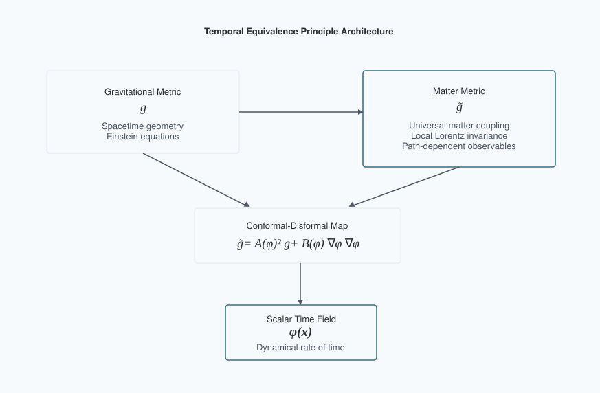
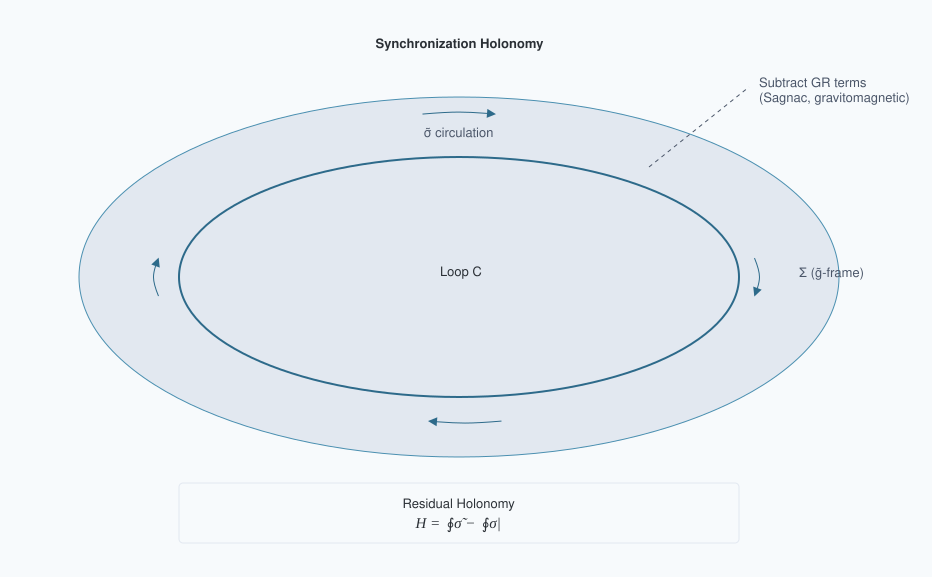
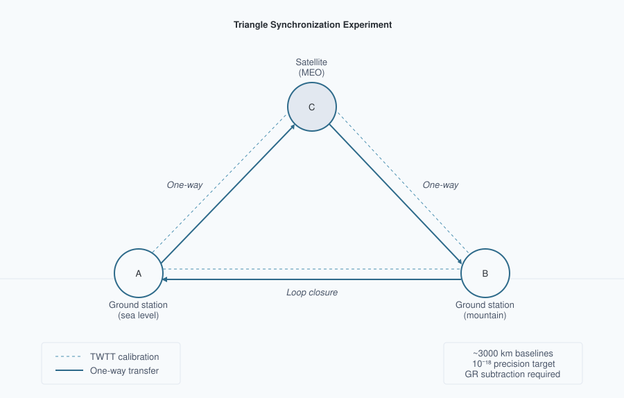

# Temporal Equivalence Principle: Dynamic Time & Emergent Light Speed
**Matthew Lukin Smawfield**
Version: v0.15 (Jakarta)
First published: 18 August 2025 · Last updated: 30 September 2026
DOI: 10.5281/zenodo.16921911

---

## Abstract

This paper proposes a covariant, testable reformulation of relativity in which proper time is a dynamical field and the "speed of light" is an emergent, strictly local invariant rather than a global constant. The framework is built on a single spacetime manifold endowed with two metrics: a gravitational metric $g_{\mu\nu}$ and a causal (matter) metric $\tilde{g}_{\mu\nu}$ to which all non-gravitational fields and clocks couple. The metrics are related by a controlled disformal map, $\tilde{g}_{\mu\nu} = A^2(\phi) g_{\mu\nu} + B(\phi) \nabla_\mu\phi \nabla_\nu\phi$, where $\phi$ is the time field, $A(\phi) = \exp(\beta_A \phi/M_{\text{Pl}})$ is a universal conformal factor, and $B(\phi)$ encodes tiny, direction-dependent deformations of the light cone consistent with GW170817-class multi-messenger constraints ($|c_\gamma - c_g|/c \lesssim \text{few}\times10^{-15}$ today). Proper time is elevated to a field by postulating that all matter, electromagnetism, and quantum phases evolve with respect to $\tilde{g}$-proper time $\tau$; in local freely falling frames, this guarantees exact local Lorentz invariance and a locally invariant c, while globally it implies that synchronization procedures and one-way light-time measurements can become path-dependent in the disformal/non-exact sector of a dynamical-time background. The covariant action, field equations, conservation laws, and PPN mapping are developed; screening is formulated via continuous Temporal Topology and the Temporal Shear. The breakdown of global simultaneity is formalized using a synchronization-transport law, deriving a convention-independent "synchronization holonomy," an invariant measure of non-integrability of time transport around closed loops. In the purely conformal subclass this holonomy vanishes after subtraction of the full GR, kinematic, clock-scale, and reference-frame synchronization model; nonzero holonomy at leading order requires residual non-exact synchronization structure, supplied in the minimal TEP model by disformal coupling $B(\phi)\neq0$, and in more general extensions by non-metricity or other explicitly non-exact transport structure. Explicit small-$B$ formulas are provided for the holonomy and the effective photon phase speed, showing how the measured one-way asymmetry is related to $\phi$-gradients and disformal scales under current constraints. The analysis demonstrates that Einstein's assumption of a universal c was a brilliant local theorem arising from the Temporal Equivalence Principle; transcending it demands dynamical time: c remains exactly invariant locally, but global, one-way-inferred "c" values differ by path-dependent amounts that experiments can detect or bound. Cosmologically, TEP adopts an eternal, spatially infinite, inhomogeneous background whose physical volume does not undergo cosmological expansion. Neither space nor matter changes size. The matter unit of time drifts relative to the static gravitational geometry, and because $c$ is locally invariant, the matter unit of length drifts with it. Distances and densities expressed in matter units therefore evolve without any physical stretching, allowing the observed redshift and apparent Hubble relation to emerge directly from the macroscopic historical drift of the inhomogeneous temporal network over coordinate time, governed principally by the conformal endpoint ratio, with constrained non-exact propagation corrections through the temporal topology. An exactly solved closed-static branch establishes that the specified action admits a static, eternal gravitational configuration with conformal unit drift; that branch is an analytical benchmark, neither an attractor nor capable of near-flat matter geometry. Numerical noncompact solutions now demonstrate a constraint-consistent, on-shell inhomogeneous temporal landscape and sustained secular temporal roll, with a positive-definite linear fluctuation spectrum on the gauge-constrained physical subspace (lowest eigenvalue $\lambda_1 = +38.81$; the single negative unprojected eigenvalue is the boundary-violating homogeneous rescaling); the remaining cosmological closure is quantitative: fixing the universal master-potential branch such that the evolved temporal history reproduces the observed redshift–distance relation, horizon behaviour, and perturbation observables without imposing the empirical clock map. A candidate early-universe closure, in which the Big Bang gravitational singularity is replaced by a matter-frame temporal boundary without phenomenological thermal screening, is developed through the companion transport analyses (TEP-BBN), whose conformal temporal geometry preserves the observed CMB acoustic structure. Known weaknesses in the variable-c literature are addressed by supplying a correct, operationally invariant observable (holonomy), clarifying when conformal couplings cannot produce a signal, and providing realistic, constraint-consistent benchmark sensitivity windows with explicit error budgets and statistical plans (pre-registration, blinding, publicly released code and data). The resulting theory preserves the empirical pillars of relativity (local Lorentz invariance, gravitational-wave causality, PPN bounds) while extending its conceptual foundation: simultaneity is not only relative but generally non-integrable; the speed of light is not a global constant but the local echo of a deeper, dynamical temporal geometry.

Long-standing confusions about "variable $c$" are resolved by replacing convention-dependent statements with invariant observables tied to measurement procedures. A synchronization one-form $\tilde{\sigma}$ is defined on spacelike slices of the matter metric; its curl $d\tilde{\sigma}$, after subtraction of the full GR, kinematic, clock-scale, and reference-frame synchronization model, yields a residual "temporal holonomy" $H$ that vanishes in GR and becomes nonzero only when time is dynamical in this sense. Two key theorems are proven: (i) conformal matter coupling preserves null cones, so photons and gravitons share the same causal structure at late times; (ii) a static $\phi$-gradient produces no direct propagation asymmetry in the static purely conformal limit—the cancellation is exact, not merely first-order. Disformal tilts ($B \neq 0$) can source holonomy subject to multi-messenger constraints. A corrected Earth–Sun triangle calculation gives a converged conditional benchmark $|H_{\rm resid}|\simeq4.33\times10^{-13}$ s per loop, with zero circulation in the exact-connection control. The normalization and environmental response remain specified benchmark inputs; an absolute TEP prediction requires their derivation from the common action and field solution. The effective covariant architecture is presented; field equations, conservation laws, invertibility/causality conditions, and a 3+1 decomposition are derived to make the observables explicit. Screening via a continuous Temporal Topology governed by non-linear superposition of field gradients (Temporal Shear) reconciles precision local tests with cosmological evolution, with mapping to Parametrized Post-Newtonian parameters and to the EFT-of-dark-energy $\alpha$-functions with $c_T = 1$ enforced. Decisive experiments with quantitative error budgets are outlined: (1) a ground–ground–satellite triangle time-transfer experiment targeting holonomy at below $10^{-18}$ fractional after GR subtraction; (2) portable-clock "clock anholonomy" around closed paths at the $10^{-19}$ level over days; (3) multi-species clock networks seeking phase-locked annual modulations at $10^{-19}$–$10^{-17}$; (4) interplanetary one-way optical links at picoseconds over AU; (5) altitude-dependent screening maps with optical clocks and atom interferometers; and (6) ensemble multi-messenger tests. Cosmological inference is implemented through native hi_class and Cobaya analyses (Papers 18, 26), with commitment to open data and blinded analyses.

Einstein's postulate of universal $c$ was a brilliant, operationally perfect approximation in regimes where time's flow is effectively uniform. In a universe where the rate of time is dynamical yet locally Lorentzian, "the speed of light" emerges as an invariant in every local lab but ceases to be globally universal. The new invariant content resides in path-dependent synchronization defects and holonomies of time transport, not in naive one-way "speeds." If detected, these invariants would inaugurate a post-Einsteinian era: from dynamic geometry to dynamic time.

## 1. Introduction: From a Universal Speed to a Universal Principle of Time

Relativity and quantum theory disagree about time. General relativity (GR) makes proper time geometric—$d\tau^2 = -g_{\mu\nu} dx^\mu dx^\nu / c^2$—dynamical, and observer-dependent. Quantum mechanics (QM) treats time as an external parameter t in the Schrödinger equation, $i\hbar \partial_t|\psi\rangle = \hat{H}|\psi\rangle$. The clash has haunted quantization programs for a century and manifested operationally as subtle ambiguities in defining one-way light speeds and simultaneity across extended regions. Precision clocks and time-transfer links now measure gravitational redshifts and velocity-dependent dilations at $10^{-18}$ fractional levels, while cosmology exhibits persistent $H_0$ and $S_8$ tensions. In this context, Einstein's postulate of a universal speed c must be sharpened: it is exact for any local freely falling laboratory, but it cannot be a global property if the flow of time itself is dynamical.

The Temporal Equivalence Principle (TEP) is proposed: all non-gravitational dynamics, signals, and quantum phases evolve according to the proper time defined by a single causal metric $\tilde{g}_{\mu\nu}$ that couples universally to matter. The rate at which proper time accrues is a field. This elevates "when" to the status "where" acquired in 1915: as space was geometrized, now time's rate is dynamized. The consequence is that synchronization conventions can become globally non-integrable when the dynamical-time background contains a disformal or otherwise non-exact transport component: even after removing known GR effects, closed-loop time transport can then retain a residual path-dependent offset. The measured "speed of light" between distant clocks is revealed as an emergent ratio of distance to accrued proper time, not a fundamental constant comparable across regions without a theory of time's flow. Locally, c remains exactly invariant; globally, dynamical time imprints tiny, path-dependent asymmetries that can be detected or bounded.



Figure 1. Temporal Equivalence Principle (TEP) architecture. Matter couples to $\tilde{g}_{\mu\nu}$ via a conformal–disformal map controlled by the scalar time field $\phi$, preserving local Lorentz invariance while enabling new global invariants.

## 2. Axioms and the Temporal Equivalence Principle

The framework adopts four axioms:

- **A1. Two-metric structure on a single manifold.** Gravity is described by a Lorentzian metric $g_{\mu\nu}$; matter fields, clocks, and rulers couple to a causal (matter) metric $\tilde{g}_{\mu\nu}$. The metrics are related by a disformal map
$$\tilde{g}_{\mu\nu} = A^2(\phi) g_{\mu\nu} + B(\phi) \nabla_\mu\phi \nabla_\nu\phi,$$
with a universal conformal factor $A(\phi) = \exp(\beta_A \phi/M_{\text{Pl}})$ and a small disformal function $B(\phi)$ consistent with multi-messenger constraints today.

- **A2. Temporal Equivalence Principle (TEP).** All non-gravitational processes evolve according to proper time $d\tau$ defined by $\tilde{g}_{\mu\nu}$: $i\hbar d|\psi\rangle/d\tau = \hat{H}|\psi\rangle$, nongravitational fields propagate on $\tilde{g}$-null cones, and ideal clocks tick $d\tau^2 = -\tilde{g}_{\mu\nu} dx^\mu dx^\nu/c^2$. In local freely falling frames for $\tilde{g}_{\mu\nu}$, physics reduces to special relativity with invariant c.

- **A3. Causal safety and locality.** Today, $c_g = c_\gamma$ within current bounds ($|c_g - c_\gamma|/c \lesssim \text{few}\times10^{-15}$). This is enforced by choosing $A(\phi)$ universal, such that conformal transformations preserve null cones for photons and gravitons when $B = 0$, and by constraining the observable combination $B(\phi)(\partial\phi)^2$ along late-time astrophysical propagation paths. Different experiments constrain different integrals or responses involving the single disformal function $B(\phi)$; GW170817 does not require $B$ to vanish identically in all regimes. Hyperbolicity holds within the EFT domain. On the admissible kinetic branch ($P_X > 0$, $P_X + 2XP_{,XX} > 0$) the scalar stress tensor obeys the null energy condition pointwise, $T_{\mu\nu}k^\mu k^\nu = P_X(k\cdot\nabla\phi)^2 \geq 0$; the weak and dominant conditions are violated in the void sector of the eternal static solution, where the integrability condition of Section 8 requires a negative cell-averaged effective energy density supplied by the potential rather than by a wrong-sign kinetic term (Appendix E, step_20: void-sector mean $-0.58$, cell mean $-0.52$ in slice units).

- **A4. Screening and universality.** The coupling $A(\phi)$ is universal at leading order; loop-induced composition dependence is tightly bounded. Environmental suppression of the locally observable Temporal Shear/source-charge sector reconciles local tests with cosmological dynamics. Chameleon, Vainshtein, Galileon, DBI, and symmetron mechanisms are treated as candidate microscopic completions, not as the defining ontology of TEP. Screening manifests as a continuous spatial and covariance structure of the scalar time field (Temporal Topology) governed by the temporal potential field and its gradient (Temporal Shear), suppressing geometric deviations in screened regimes while leaving cosmology accessible to dynamics.

These axioms encode Einstein's local invariance as a theorem and extend it: c is exactly invariant for every tangent space of $\tilde{g}_{\mu\nu}$, but global synchronization and one-way timing depend on the dynamical field $\phi$.

The scalar time field $\phi$ is defined on the spacetime manifold of Axiom A1 and is present at every event. The ambient cosmological value $\phi_\infty = 0$ is a boundary condition, not an absence of the field — and a convention fixed at the present epoch, not an eternal pinning: past ambient values are set by the solved landscape and remain within the fixed-time spatial contrast $|\delta u| \lesssim 10^{-3}$–$10^{-2}$ (Section 8), since no source term drives the unsourced void sector secularly. What distinguishes dense from dilute environments is not the presence or absence of $\phi$ but the matter trace $T^{(\rm m)}$ and the environmental state vector $\mathcal{E}$ (ambient density, compactness, gradients, boundary geometry). The term "vacuum" is retained in its standard field-theory sense — the $T^{(\rm m)} = 0$ limit of the matter sector — and does not denote a region devoid of the temporal field.

Environmental screening $\mathcal{S}_\Sigma(\mathcal{E})$ suppresses the conformal gradient $\Sigma_\mu = \nabla_\mu \ln A$. In TEP, this spatial gradient—measuring how clock tick-rates slope from one point to another—is formally named the Temporal Shear. It governs the geometric refraction of matter: when the slope is steep, matter geodesics bend; when it is flat ($\Sigma_\mu \to 0$), matter follows standard General Relativity paths. The Temporal Shear is suppressed via temporal-topology pinning: the environmental-state operator $\mathcal{S}_\Sigma(\mathcal{E})$ acts on the solved environmental state — set by source density, compactness, boundary geometry, and ambient field — and its derived shear branch pins the incremental gradient where the ambient time-gradient is steep (in weak-field terms, $g \gg g_t \approx cH_0/2$; Section 7). It does not suppress the disformal sector $B(\phi)$, which is governed by its own field-space envelope (Section 2.2). The two are distinct mechanisms operating on distinct sectors of the disformal map. The amplitude/shear split ($\mathcal{S}_\Sigma \to 0$, $S_A \sim 1$) suppresses the spatial gradient while preserving the field value: $A(\phi)$ continues to vary inside screened matter, which is why clocks run slower in deeper wells. What is pinned is the gradient, not the field amplitude. Theorem 2 (Section 6) further establishes that a static conformal gradient produces no directional photon-propagation asymmetry; direction-dependent null propagation requires the disformal sector, time-dependent geometry, or another non-exact transport contribution.

## Sector mapping

| Sector | Physical effect | Coupling | Key bound |
| --- | --- | --- | --- |
| **Conformal $A(\phi)$** | Clock rates, proper time rescaling | Universal ($\beta_A$) | Cassini PPN-$\gamma$ (via $S_\Sigma$ source charge), redshift tests |
| **Disformal $B(\phi)$** | Null cone tilts, direction-dependent propagation | Small, environment-dependent | GW170817: $|c_\gamma - c_g|/c \lesssim \text{few}\times10^{-15}$ |
| **Temporal Topology** | Spatial/covariance structure of $\ln A(\phi)$ | Field configuration + gradient suppression | Clock/covariance correlation length $\lambda_T$ |

The conformal sector governs clock rates; the disformal sector governs cone tilts. GW170817 directly bounds disformal cone splits governed by $B$. It does not directly test common-mode conformal clock-rate structure governed by $A$, although local conformal gradients/source charges remain constrained by PPN, gravitational-redshift, clock-comparison, and equivalence-principle tests.

## 2.1 Relation to Other Modified Gravity Frameworks

The TEP framework can be situated within the broader landscape of modified gravity and scalar-tensor theories. To clarify its unique features, a comparative analysis is provided:

Table 1: Comparison with Other Scalar-Tensor Frameworks

| Theory/Framework | Key Fields | Matter Coupling | $c_g = c_γ$? | Key Observable Signature |
| --- | --- | --- | --- | --- |
| **TEP (This work)** | $g_{\mu\nu}$, $\phi$ | Universal to $\tilde{g}_{\mu\nu} = A^2 g_{\mu\nu} + B \partial_\mu\phi \partial_\nu\phi$ | Equal in conformal/common-mode limit; differential deviations possible through $B$ and constrained by same-path EM–GW timing | Synchronization Holonomy $H_{\rm resid}$ |
| **Horndeski** | $g_{\mu\nu}$, $\phi$ | Minimal to $g_{\mu\nu}$ | Yes, after GW170817 constraints | Modified growth, ISW |
| **DHOST** | $g_{\mu\nu}$, $\phi$ | Minimal to $g_{\mu\nu}$ | Yes, for specific degenerate classes | Modified growth, screening |
| **TeVeS** | $g_{\mu\nu}$, $A_\mu$, $\phi$ | To a combined metric | No | MOND phenomenology, lensing |
| **SMEFT** | SM fields | Lorentz-violating operators | Model-dependent | Anisotropic propagation, CPT violation |

The multi-messenger constraint from GW170817 constrains the integrated EM–GW differential disformal contribution along observed late-time astrophysical paths. It does not require the disformal sector to vanish identically in all regimes. In the conformal limit, common-mode path effects cancel in EM–GW timing; residual $B$-sector structure remains testable through multipath delays, closed-loop holonomy, and topological or interferometric regimes. The model, with a universal conformal coupling $A(\phi)$ and a disformal term $B(\phi)$, automatically satisfies $c_g = c_γ$ in the conformal limit ($B=0$). A non-zero $B(\phi)$ introduces a calculable deviation $c_γ ≠ c_g$ constrained by future multi-messenger observations.

Conceptually, TEP differs from many scalar-tensor theories by its foundational principle: the universal coupling of matter to a single metric $\tilde{g}_{\mu\nu}$. This is philosophically closer to Bekenstein's TeVeS theory, which also introduced a separate matter metric, but the framework is more minimal, using only a scalar, and makes a distinctive operational prediction in the form of the synchronization holonomy.

## 2.2 Minimal covariant action

The displayed low-curvature action below represents the leading sector of the master TEP Effective Field Theory. The strong-curvature completion includes higher-order curvature operators (such as the scalar-Gauss-Bonnet coupling $\alpha_{\rm GB} f(\phi)\mathcal{G}$) which are negligible in the weak-field and cosmological regimes studied here, but become active in the strong-field regime to supply real backreaction (as detailed in TEP-BH, Paper 28). The unified action, including the strong-curvature sector, is

$$S = \int d^4x\sqrt{-g} \left[ \frac{M_{\rm Pl}^2}{2}R +P(X,\phi) +\alpha_{\rm GB}\,f(\phi)\,\mathcal{G} \right] + S_m[\psi_i,\tilde g_{\mu\nu}],$$

with the conformal-disformal matter metric

$$\tilde g_{\mu\nu} = A^2(\phi)\,g_{\mu\nu} + B(\phi)\,\nabla_\mu\phi\,\nabla_\nu\phi .$$

The adopted kinetic realization is $P(X,\phi)=X-V(\phi)+X|X|/\Lambda_X^4$, with $X=-\tfrac12(\nabla\phi)^2$, as developed below. The canonical scalar theory $P\to X-V$ is its low-kinetic limit, not a distinct screening law. The strong-curvature term is evaluated in the black-hole completion (Paper 28); the weak-field calculations neglect that term while retaining the nonlinear kinetic response where required. Canonical-only and alternative-kinetic calculations are identified as benchmarks of their stated branches.

### Canonical microscopic structure

The universal conformal coupling, the conformal–disformal matter metric architecture, and the observable Temporal-Topology response structure are fixed. The framework cleanly divides responsibilities: the two-body operator $\mathcal{S}_{\rm eff}$ governs pairwise Temporal Shear recovery, while the scalar self-interaction $V(\phi)$ must remain flat/shallow across the matter-hosting domain to satisfy cosmological background constraints. The candidate master potential of Section 8 is a single smooth ($C^\infty$) function whose essential singularity supplies the locally flat potential floor required by the temporal-well roll (Appendix E, R3). The items below specify the canonical microscopic structure.

*Conformal coupling.* The conformal factor is fixed universally as

$$A(\phi) = \exp\!\left(\frac{\beta_A\,\phi}{M_{\rm Pl}}\right), \qquad \beta_A = -1.0,$$

so that the dimensionless coupling $d\ln A/d\varphi = \beta_A = -1$ is frozen (equivalently $\alpha_0 = \sqrt{2}\,\beta_A$ in DEF normalization), where $\varphi \equiv \phi/M_{\rm Pl}$ is the dimensionless field variable. The weak-field Solar-System safety is not a second parameter $\beta\approx -0.013$ but the screened source charge $S_\Sigma^{(\odot)}\,\alpha_0$: because the photon probe is unscreened while the source charge is suppressed, the PPN deviation is linear in the solar charge fraction, providing the strict, sign-definite prediction $\gamma_{\rm PPN}-1 = -4\beta_A^2 S_\Sigma^{(\odot)}/(1+2\beta_A^2 S_\Sigma^{(\odot)}) < 0$, constrained by Cassini to $|\gamma_{\rm PPN}-1| < 2.3\times10^{-5}$, fixing $S_\Sigma^{(\odot)} \lesssim 5.8\times10^{-6}$ in the Solar-System environment. The terrestrial amplitude factor $S_A^{(\oplus)}$ characterizes Earth's static conformal-depth response; time-dependent GNSS clock covariance is described by $C_A$ together with the perturbation and measurement transfer of the same solved configuration. The Solar-System source-charge factor $S_\Sigma^{(\odot)}$ is a different projection and need not equal $S_A^{(\oplus)}$.

*Sign convention for $\phi$ (corpus-wide).* The scalar field is defined such that $\phi > 0$ in the vicinity of a mass concentration, with the ambient cosmological value taken as the zero point by convention, $\phi_\infty = 0$. Combined with the frozen coupling $\beta_A = -1$, this fixes every downstream sign in the framework:

- $A(\phi) = \exp(\beta_A\varphi) < 1$ near a mass, so the conformal factor is *suppressed* in a potential well.

- Since matter clocks tick at $d\tau/dt \simeq A(\phi)$, clocks run slower in deeper wells. This reproduces the sign of the ordinary gravitational redshift and is therefore the convention consistent with general relativity in the screened limit.

- The Temporal Shear $\Sigma_\mu \equiv \nabla_\mu \ln A = \beta_A \nabla_\mu \varphi$ points *outward* from a mass (since $\beta_A < 0$ and $\nabla_\mu\varphi$ points inward).

- Consequently $\beta_A \phi < 0$ near a mass, and $\Delta \ln A < 0$ relative to the ambient environment.

The opposite choice ($\phi < 0$ near a mass, giving $A > 1$ and clocks running *faster* in wells) is inconsistent with the measured sign of gravitational redshift and is not used anywhere in this corpus. Any paper reporting a conformal-sector sign should be checked against this convention before its result is compared with another paper's. Where a manuscript quotes $\lvert\beta_A\rvert$ or an unsigned effective coupling, that is a magnitude and carries no sign information.

*Bidirectionality and the weak-field normalization ledger.* The prohibition above concerns the sign of $A$ in potential wells. The conformal factor nevertheless deviates symmetrically relative to the ambient medium ($A = 1$): $A < 1$ in overdensities (clocks tick slower) and $A > 1$ in underdensities (clocks tick faster). Here $\Phi_N$ denotes the Einstein-frame Newtonian metric potential, fixed by $\nabla^2\Phi_N=\rho_*/(2M_{\rm Pl}^2)$ and $\Phi_N=-GM/(c^2r)<0$ outside an isolated positive mass. In the canonical quasistatic limit, $\nabla^2\delta\phi=\beta_A\rho_*/M_{\rm Pl}$ therefore gives

$$\frac{\delta\phi}{M_{\rm Pl}}=2\beta_A\Phi_N, \qquad \ln\!\frac{A}{A_\infty}=2\beta_A^2\Phi_N.$$

For a static scalar, the matter-frame lapse is $\tilde N=A N$. With $N/N_\infty=e^{\Phi_N}+O(\Phi_N^2)$, the bare unscreened branch obeys

$$\frac{\tilde N}{\tilde N_\infty} =\exp\!\left[(1+2\beta_A^2)\Phi_N\right]+O(\Phi_N^2) =e^{3\Phi_N}+O(\Phi_N^2), \qquad \frac{G_{\rm eff}}{G}=1+2\beta_A^2=3,$$

where the final equalities use the frozen value $\beta_A=-1$. Thus $\Phi_N$ is not the potential inferred from unscreened matter motion: the latter is $3\Phi_N$ at leading order. This factor is precisely why environmental suppression is required for every macroscopic source, not only the Sun. For a screened exterior source, the observable lapse gradient is instead

$$\nabla\ln\tilde N =\left[1+2\beta_A^2S_\Sigma(\mathcal E)\right]\nabla\Phi_N,$$

so $S_\Sigma\to0$ recovers the GR lapse gradient and $G_{\rm eff}\to G$. A common ambient value of $A$ cancels from local clock comparisons; it must not be confused with the exterior source-charge gradient governed by $S_\Sigma$, while finite clock-amplitude offsets remain governed separately by $S_A$. The coefficient ledger is derived independently of fitted data (Appendix E, R9). Along an extended line of sight through the cosmic web, exact conformal excursions spatially average out to recover the smooth cosmological background. However, the non-exact covariance $\mathcal{C}_T$ (Paper 26) retains a cumulative, macroscopic residual that resists spatial averaging. This distinction between exact conformal averaging and non-exact residual survival is the physical content of the $\Sigma_\parallel + \mathcal{C}_{T,\parallel}$ decomposition of Paper 26.

*Disformal coupling.* The matter metric contains a disformal coupling function $B(\phi)$. Observable disformal effects depend on the complete combination $B(\phi)\nabla_\mu\phi\nabla_\nu\phi$, rather than on $B(\phi)$ alone. Paper 28 employs the field-space envelope

$$B(\phi) = B_0\,\frac{\varphi^2}{1+\varphi^2}\, \exp\!\left(-\frac{\varphi^4}{2\,\sigma_B^4}\right), \qquad \varphi\equiv\phi/M_{\rm Pl},$$

as a prescribed strong-field realization. At weak-field values ($\varphi \sim 10^{-10}$), the exponential damping factor is unity to extremely high precision and $\varphi^2/(1+\varphi^2)\simeq\varphi^2$, so $B(\phi)\simeq B_0\varphi^2$ throughout terrestrial and typical astrophysical environments. Its rapid large-$|\varphi|$ damping provides additional strong-field suppression of the disformal contribution, enforcing conformal dominance and protecting the Lorentzian matter-metric branch when scalar gradients become extreme. This field-space envelope is not identified with ordinary environmental Temporal-Topology screening, which arises primarily through the environment-dependent scalar configuration and its active gradient. The unique corpus-wide microscopic form and normalization of $B(\phi)$ therefore remain part of the action-closure problem. In the dimensionful Jakarta field convention, $B_0$ carries mass dimension $-4$ so that $B(\phi)\,\nabla_\mu\phi\,\nabla_\nu\phi$ is dimensionless; numerical normalizations employed in Paper 28's geometrized, dimensionless-field strong-field construction are therefore not imported directly into the weak-field theory. GW170817 constrains the path-integral combination $B(\phi)(\partial\phi)^2$ along observed late-time astrophysical paths; it does not require $B\equiv 0$ in every regime. The theory field $\phi$ remains dimensionful (mass dimension 1) throughout, consistent with the canonical kinetic term $-\frac12(\nabla\phi)^2$ and the conformal factor $A=\exp(\beta_A\phi/M_{\rm Pl})$; $\varphi$ is introduced only as a shape variable for $B$. The strong-field regime in which this envelope is exercised by Paper 28 lies beyond the small-$B$ EFT domain in which the invertibility and signature conditions of Section 4 are established; those applications are conditional on the completed nonlinear realization.

*Temporal-Topology saturation sector.* Environmental suppression in TEP is defined by the continuous response of the Temporal Topology rather than by a discrete density threshold or thin-shell boundary. Writing $\Theta \equiv \ln A(\phi)$ and $\Sigma_\mu \equiv \nabla_\mu \Theta$, the conformal-amplitude response $S_A$ and the Temporal-Shear/source-charge response $S_\Sigma$ are distinct observable projections of the same environment-dependent scalar configuration. The macroscopic scale

$$\rho_T \simeq 20\ {\rm g\,cm^{-3}}$$

denotes the empirically calibrated Temporal-Topology saturation/reference scale. It is not a universal microscopic density cutoff and does not define a binary screened/unscreened transition. In the weak-field, canonical $K\to 1$, $B\to 0$, quasistatic limit, a particular microscopic completion must satisfy the scalar field equation $\nabla^2\phi = V_{,\phi} + \mathcal{Q}_m$, with the matter-source convention defined consistently with the action of Section 2.2. Defining the conserved Einstein-frame density $\rho_* = A^3\tilde\rho$, the field equation reads

$$\nabla^2\phi = V_{,\phi} + \rho_*\,A_{,\phi}.$$

In regions where a particular completion admits an adiabatic density-dependent equilibrium, this may reduce to a local balance of the form $V_{,\phi} + \rho_*\,A_{,\phi} \simeq 0$. Such an effective minimum is one possible local realization of Temporal-Topology saturation; it is not the defining screening ontology of TEP. Chameleon, Vainshtein, Galileon, DBI, symmetron, and related mechanisms therefore remain candidate microscopic realizations rather than definitions of the framework. The observable spatial gradient suppression is natively handled by the two-body kinetic operator, leaving the potential $V(\phi)$ free to satisfy the shallow background conditions required by cosmology.

*Screening operators.* Two projections of the solved nonlinear field configuration are needed. The field-amplitude (clock) screening $S_A$ measures the suppression of the conformal factor excursion relative to its unscreened cosmological baseline (Paper 26; Appendix E, R7):

$$S_A(\mathcal{E}) \equiv \frac{\bigl(A(\phi(\mathbf r)) - 1\bigr)_{\rm local}} {\bigl(A(\phi) - 1\bigr)_{\rm unscreened}},$$

The source-charge (shear) screening $S_\Sigma$ measures the suppression of the local scalar response relative to the unscreened expectation — in the kinetic realization adopted here, the ratio of the solved nonlinear gradient to its linear extrapolation, equivalently the inverse stiffness for an incremental source on an ambient kinetic background:

$$S_\Sigma(\mathcal{E}) \equiv \frac{|\nabla\phi|_{\rm nonlinear}}{|\nabla\phi|_{\rm linear}} \;\simeq\; \frac{Q_{\rm eff}}{Q_0} = \frac{\alpha_{\rm eff}}{\alpha_0},$$

where $\phi(\mathbf r)$ is the solved static profile for the given source geometry, density, compactness, and boundary conditions. The effective-charge form $Q_{\rm eff}/Q_0$ is the far-field matching shorthand: in the $P(X,\phi)$ realization the Gauss flux $\oint P_{,X}\,\nabla\phi\cdot d\mathbf A$ is conserved through the nonlinear shell (the source charge is not destroyed), and the suppression an observer infers is the local field gradient, which the constant-charge PPN parametrization then records as a reduced effective exterior coupling. Both projections are observable responses of the same physical nonlinear field configuration rather than independent domain-by-domain couplings. Their macroscopic environmental response is supplied by the corpus-wide $\mathcal{S}_\Sigma(\mathcal{E})$ construction; the kinetic realization adopted in this paper is specified at the end of this section, with alternative $K(X)$ forms standing as candidate realizations to be tested against its derived predictions. $S_A$ characterizes the static conformal-depth response; $S_\Sigma$ characterizes the specified gradient/source response. Time-dependent clock covariance is carried by $C_A$ together with the perturbation and measurement transfer of the same solved configuration. These responses need not be numerically identical. Appendix E, R17 computes static boundary susceptibilities and finite-excursion responses, not a universal transmission: approximately additive response is a regime-dependent limit, and propagation through the ambient medium must be distinguished from penetration into the body. No independent clock-sector coupling is introduced. In composite observables the assignment is positional at leading order in the test-probe expansion: the probe's perturbation of the host's solved field and the resulting mixed boundary terms are neglected. This assignment is not a decomposition of the scalar action into independent habitat and probe fields; finite-mass binaries require the nonlinear boundary-value problem with both sources present. Within that stated approximation, the assignment is positional: the factor multiplying a host's potential contribution to the environmental field coordinate is the source-side charge suppression, $\mathcal S_\Sigma$ evaluated at the habitat density — the ambient-density limit $[1+(\rho/\rho_{\rm half})^2]^{-1}$ with $\rho_{\rm half}\approx0.5\,M_\odot\,{\rm pc}^{-3}$ (Paper 26) — while the probe's own clock-amplitude response is $S_A$ evaluated at the probe's material density, a per-source factor absorbed into the channel response coefficient (e.g., the Cepheid $\kappa_{\rm Cep}$ of Papers 11 and 31) rather than into the environmental coordinate. Strong gradient flattening suppresses $S_\Sigma$, while $S_A$ depends separately on the local field amplitude relative to its reference environment. The mesoscopic screening law of Paper 25 ($\mathcal{S}_\Sigma^{\rm meso} = S_{\rm TEP}\times S_{\rm TF}\times S_{\rm boundary}\times S_{\rm decoherence}$) is a factorization of $S_\Sigma$ at intermediate scales.

*Radial ODE closure calculation.* The static weak-field scalar equation $\nabla^2\phi = V_{,\phi} + \rho_*\,A_{,\phi}$ is solved numerically for a spherical source with the bidirectional conformal coupling $A(\phi) = \exp(-\phi/M_{\rm Pl})$, $\beta_A = -1$, using `scipy.integrate.solve_bvp` with core regularity ($\phi'(0)=0$) and cosmological relaxation ($\phi(r_{\max})\to 0$) boundary conditions (Appendix E, R1). The key dimensionless parameter is the unscreened field amplitude $\psi_{\rm uns} = M/(4\pi M_{\rm Pl}^2 R)$, which controls the strength of the conformal nonlinearity. Two theoretical baselines are evaluated against the Cassini bound $|\gamma_{\rm PPN}-1| < 2.3\times 10^{-5}$ (requiring $S_\Sigma^{(\odot)} \lesssim 5.8\times 10^{-6}$ at 1 AU):

(i) $V = 0$ (pure bidirectional conformal screening). The nonlinear source $-(\rho_*/M_{\rm Pl})\exp(-\phi/M_{\rm Pl})$ provides gradient flattening in overdensities ($\phi > 0$, $\exp(-\phi/M_{\rm Pl}) < 1$, source weakened) and enhancement in underdensities ($\phi < 0$, $\exp(-\phi/M_{\rm Pl}) > 1$). The screening correction is $O(\psi_{\rm uns}) \sim 4\times 10^{-6}$ for the Sun — only a fractional reduction of the effective charge, leaving $S_\Sigma \approx 1$, far above the Cassini requirement $S_\Sigma \lesssim 5.8\times 10^{-6}$. The conformal nonlinearity alone is too weak for Solar-System screening.

**(ii) Kinetic completion of two-body screening — microscopic realization.** The effective Temporal-Topology response is produced by the nonlinear interaction of overlapping scalar-field gradients in the nested environmental landscape. The minimal noncanonical completion of the scalar sector is

$$P(X,\phi)=X-V(\phi)+\frac{X\,|X|}{\Lambda_X^{4}},\qquad X=-\frac12(\nabla\phi)^{2},$$

whose kinetic response function on the static branch is $P_{,X}=1+2|X|/\Lambda_X^4$. (The sign-safe form $|X|$ is required: on the static branch $X<0$, and the power law is otherwise defined only for even integer powers. The $X|X|$ representation is understood piecewise on the timelike and spacelike kinetic branches, with continuous matching at $X=0$; where a $C^\infty$ regulator is required numerically, $X|X|$ may be replaced by $X\sqrt{X^2+\epsilon_X^2}$ with $\epsilon_X$ taken below all resolved physical kinetic scales, leaving the quoted asymptotic screening laws unchanged.) The static spherical field equation $\partial_r(r^2P_{,X}\phi')=r^2\mathcal Q$ integrates to $P_{,X}\phi'=\mathcal C/r^2$: a configuration immersed in an ambient gradient answers an incremental source charge only through the inverse stiffness, so the observable Temporal Shear is suppressed by

$$\mathcal S_\Sigma(\mathcal E)=\frac{1}{P_{,X}(X_{\rm amb})}=\left[1+\left(\frac{g}{g_t}\right)^{2}\right]^{-1},\qquad g_t=\frac{cH_0}{2|\beta_A|}\simeq3.4\times10^{-10}\ {\rm m\,s^{-2}},$$

where the shear-to-acceleration map $\Sigma=2\beta_A^{2}g/c^2$ converts the kinetic ratio $2|X|/\Lambda_X^4$ into the gradient channel of the covariant environmental operator constructed phenomenologically in Paper 26 \S2.5 — here recovered with $n=2$ as a consequence of the lowest-order noncanonical term. The kinetic scale is the single scale of the sector, fixed by the cosmological shear floor: $\Lambda_X^4=M_{\rm Pl}^{2}H_0^{2}$, i.e. $\Lambda_X=\sqrt{M_{\rm Pl}H_0}\simeq1.9$ meV, the dark-energy scale. The shear threshold therefore carries no free parameter. The two-body response is obtained by solving the same equation for the pair's mutual shear: flux conservation $P_{,X}\phi'=\mathcal C/r^2$ with $P_{,X}\simeq2|X|/\Lambda_X^4\simeq\phi'^2/\Lambda_X^4$ deep inside the shell gives $\phi'\propto r^{-2/3}$, i.e. the exact implicit profile

$$y\left(1+y^2\left(\frac{r_*}{r}\right)^4\right)=1,\qquad y\equiv\frac{\phi'}{\phi'_{\rm lin}},\qquad r_*(M)=\sqrt{\frac{GM}{g_t}}\propto M^{1/2},$$

and the full pairwise response propagates this mutual shear with the ambient inverse-stiffness factor at the emission and response vertices,

$$\mathcal R(s)=\mathcal S_\Sigma(X_{\rm env})^{2}\,y(s),$$

where $X_{\rm env}$ is the embedding ambient kinetic value of the hierarchy level above the pair (specifically the external Galactic ambient floor $2X_{\rm gal}/\Lambda_X^4 \approx 0.52$ for field wide binaries — a value originally calibrated to the wide-binary plateau under the pre-propagator bookkeeping; the directly measured solar-circle field gives the independent estimate $u_{\rm sun}=a_\odot/g_t\simeq0.57$, $2X_{\rm sun}/\Lambda_X^4\simeq0.32$ ($v_c=220$ km s$^{-1}$, $R_0=8.1$ kpc; step 32), which the fully-coupled propagator-plus-vertex reading of Paper 13, step 017, uses to reproduce the plateau amplitude at the percent level without calibration — the ambient bracket $u_0\simeq0.55$–$0.72$ is a physical range, not a tuned value, because the ambient field is itself a solved quantity, or the dominant member's pre-existing shell for hierarchical pairs), excluding the pair's own co-generated mutual field $g_{\rm mut}=GM/s^2$ to avoid suppressing a response by the response itself in the transition region. Two regimes of this single operator follow directly. For a comparable-mass pair the mutual field is the measured response — the two members' gradients oppose and cancel at the pair's bridge region — so the vertex ambient saturates at the external environmental floor and the observable transition profile is the flux-conserving $\mathcal R\sim s^{4/3}$ law, the exponent the wide-binary population selects. For a hierarchical pair — a test member embedded in a dominant member's pre-existing nonlinear shell — the dominant member's field is itself the embedding ambient; the identity $2X_{\rm dom}/\Lambda_X^4=(1-y)/y$ then makes the vertex factors equal to $y(s)$, giving $\mathcal R=y^{3}\sim s^{4}$: the steep deep-interior response required by the Solar-System benchmarks (constraint F4) is recovered exactly, with the radius law $R_s=r_*=\sqrt{GM/g_t}$ and the transition-radius scaling derived from the action rather than fitted. Evaluated at zero free parameters, the operator returns $\mathcal R\simeq2.2\times10^{-15}$ for the Earth–Moon pair (the vertex ambient there carries both Earth's nonlinear field and the solar field at 1 AU; the corpus's earlier $2.5\times10^{-14}$ bookkeeping is reproduced at the same order), $1.0\times10^{-23}$ at the Cassini conjunction (earlier bookkeeping $\sim6\times10^{-23}$), $2.7\times10^{-11}$ at Saturn's orbit (earlier bookkeeping $\sim10^{-10}$), and $1.2\times10^{-21}$ for the terrestrial shear environment — the value independently quoted by the covariant-operator evaluation of Paper 26 — while the derived wide-binary transition scale $R_s=\sqrt{GM/g_t}\simeq4.7$ kAU at $1.24\,M_\odot$ overshoots the fitted $2646\pm182$ AU by a factor $\simeq1.8$. The residual is stated plainly: a normalization of the same functional form, with the transition acceleration fitted directly to the wide-binary data, could reproduce the fitted radius nearly exactly — but that agreement would be by construction rather than prediction. The derived $g_t=cH_0/(2|\beta_A|)$ contains no adjustable constant, so the factor $\simeq1.8$ constitutes the first genuinely independent comparison of the scale. Its sign is the one the environmental baseline predicts: the operator measures the pair's internal gradient against the ambient environmental floor, which inside the Galactic disk exceeds the asymptotic cosmological value $\Sigma_{\rm bg}=H_0/c$. Specifically, the ambient Galactic temporal potential exceeds the pair's mutual gravitational potential by $\Phi_{\rm gal}/\Phi_{\rm pair} \approx (v_0^2/c^2)/(GM_{\rm pair}/(s c^2)) \sim 9\times10^{4}$ at the fitted separation $s = 2646$ AU (with Galactic rotational potential $\Phi_{\rm gal}/c^2 \approx 5.4\times 10^{-7}$ dominating the mutual well $\Phi_{\rm pair}/c^2 \approx 4.6\times 10^{-12}$, even while the local mutual acceleration gradient dominates the ambient Galactic acceleration, $g_{\rm gal}/g_{\rm pair} \approx 0.06$). Under the isolated-profile reading the ambient floor enters the operator only through the vertex factor $\mathcal S_\Sigma(X_{\rm env})^2$, modulating the response amplitude rather than the shape scale $r_*$; a same-estimator comparison (folding the mass-convolved derived profile through the paper's own sem-weighted single-scale exponential estimator; Paper 13 step 017) then returns $\simeq5.1$ kAU against the measured $2646\pm609$ AU — ratio $\simeq1.9$ — with the half-excess marker agreeing at $\simeq3.4$ kAU against the observed $\simeq1.7$–$1.9$ kAU. The earlier heuristic explanations fail quantitatively: the exponential-fit scale reduction is $\lesssim2\%$ (the gradual $s^{4/3}$ recovery pulls the fitted scale upward, not downward), $\sqrt{M}$-weighting accounts for only $\sim4\%$, and mass convolution broadens the transition toward larger fitted scales. The resolution is not a new coefficient but the embedded problem: the ambient enters not only at the vertices but in the perturbation propagator itself. The residual is substantially resolved by the propagator the ambient itself supplies. Solving the source perturbation on the Galactic nonlinear background (step 32: the full nonlinear elliptic problem $\nabla\!\cdot\![P_{,X}\nabla\phi]=\rho$ around a uniform ambient $u_0=\sqrt{X_{\rm gal}}\simeq0.72\,g_t$) shows the background stiffness $Z_{ij}=P_{,X}\delta_{ij}+2P_{,XX}a_ia_j$ — anisotropic, $Z_\parallel=1+3X_{\rm gal}\simeq2.56$ parallel and $Z_\perp=1+X_{\rm gal}\simeq1.52$ transverse — suppressing the pair's orientation-averaged far-field response to $y_{\rm far}\simeq0.56$ and compressing the half-excess transition marker to $\simeq0.44\,r_*$ (from $0.74\,r_*$ isolated, fitted-scale ratio $\simeq0.60$). Folded through Paper 13's own mass distribution and sem-weighted estimator (step 017), the embedded prediction returns $R_s\simeq3{,}300$ AU against the fitted $2646\pm609$ AU and a half-excess marker at $\simeq1{,}715$ AU, coincident with the observed value — a residual factor $\simeq1.26$ inside the systematic band. The $\eta_{\rm env}\simeq3.7$ coefficient required by the isolated-profile reading is therefore not a tuning parameter: the ambient stiffness supplies the transition-scale compression as a derived consequence of the same kinetic term. Two sub-questions remain open and are now sharp rather than diffuse: the amplitude factorization — the observed $\alpha_{\rm sat}=0.366$ lies between the pure-propagator reading ($\simeq0.455$) and the propagator-times-vertex reading ($\simeq0.24$), so the data discriminate the division of environmental suppression between source charge, propagator and response vertex — and the environmental ordering, which refines under the corrected ambient variable: the operator's environmental coordinate is the field *gradient* $X=(\nabla\phi)^2/\Lambda_X^4$, not the density, and the observed subsamples show the midplane more suppressed under either estimator — the free-$\alpha$ fits give ($R_s$, $\alpha$) = ($2{,}821$ AU, $0.244$) at $|Z|<0.1$ kpc versus ($4{,}681$ AU, $0.401$) at $|Z|>0.15$ kpc — and inverting the amplitudes on the fully-coupled sweep requires the effective ambient to be $\sim36\%$ *stronger* at the midplane ($u_{\rm eff}\simeq0.71$ versus $\simeq0.52$ in the halo; Paper 13). The supply-versus-demand check (Paper 13, step 017) closes the naive rescue: Galactic geometry supplies only $\sim4\%$ between the subsample median heights — the vertical field contributes $u_z\simeq0.17$ at $248$ pc against a common radial floor $u_r\simeq0.57$ pinned by the locally measured centripetal acceleration, which cannot be screened down inside the disk without contradicting the observed dynamics. The linear supply fails on both counts: $u=|a|/g_t$ grows with $|Z|$ — the wrong sign for an ordering that strengthens toward the midplane — and supplies only $\sim4\%$ of the required contrast. That estimator is the weak-field exterior reading: inside the nonlinear disk the local acceleration is not the ambient field state. The ordering is produced instead by the landscape's nonlinear response to density on the same operator's $k$-branch: the embedded pair-scale solve (step 67; Paper 13 AUD-3) shows the response charge carried by the ambient boundary variable, $D^{-1}\propto u_{\rm amb}^{-1.58}$ with background-density sensitivity below $0.4\%$, and the local $k$-branch balance $P_X u = 4\pi G\rho L/g_t$ with $P_X \sim Ku/\sqrt{2}$ yields the ambient map $u_{\rm amb}=\sqrt{4\sqrt{2}\pi G\rho L/(K g_t)}$. Calibrated once at the midplane inversion, $L\simeq0.84$ kpc reproduces all five Galactic strata within $\simeq10\%$ and the endpoint ordering exponent $p\simeq0.46$–$0.5$ — the environmental dependence is thereby an operator output, not a phenomenological proxy. The environmental dependence of the measured transition scale is a genuine empirical datum rather than an operator output: the wide-binary stratifications measure $R_s$ rising with ambient density ($R_s \propto \rho_{\rm amb}^{p}$; free-fit exponent $p \approx 0.4 \pm 0.1$, centered between the $\rho^{1/3}$ and $\rho^{1/2}$ ambient channels, Paper 13), i.e. pairs embedded in more strongly screening environments retain suppression to larger separations — the ordering stated in constraint F5. The derived scaling $R_s\propto M^{1/2}$ differs from the $M^{1/3}$ read of the wide-binary demographic splits; that read is independently flagged as degenerate with the disk size–mass relation, so the derived exponent constitutes the sharper discriminant for that test.

*Scope of the two-body projection.* The $\mathcal R(s)$ law is an effective projection of the static scalar solution, not an exact solution for unequal finite-sized bodies in a solar background. On the static branch $J_i=P_{,X}\partial_i\phi$ can have $dJ=dP_{,X}\wedge d\phi\neq0$ when the solved kinetic stiffness varies transversely; by contrast the conformal force derives from $d\ln A(\phi)$ and remains exact. A low-gradient bridge may locally reduce $P_{,X}$, but it does not by itself unscreen a body's integrated scalar charge or evade LLR: the external solar gradient, finite source size, nonlinear flux conservation, and boundary conditions all enter the force and synodic range observable. In particular, while the canonical $X|X|$ action has $P_{,X}\to 1$ as $X\to 0$, candidate completions with low-gradient vacuum regulators (such as the two-branch numerical sector of step 61) have $P_{,X}\to\varepsilon_{\rm reg}$ at vanishing gradient. The dimensionless two-centre calculations in steps 59, 72 and 75 test this limitation under specified sources and boundaries, including arbitrary pair-to-ambient orientations on a Cartesian grid (step 75); Paper 17, step 086 solves a coupled smoothed Earth–Moon source benchmark in a uniform solar-gradient background at syzygy; it does not resolve the physical body interiors or the solar tide. An observable-level lunar range fit remains required before revising the quoted LLR bound.

The physical-scale Earth–Moon–Sun bridge is evaluated in Paper 17 at two levels. Step 086's coupled source solve in the specified solar background supersedes Step 084's matched-profile diagnostic for that collinear benchmark: at syzygy the nonlinear solution finds no low-stiffness bridge — the solar-dominated field keeps $P_{,X}\sim1.2\times10^{5}$ along the pair axis where the ansatz predicted near-exact cancellation. An LLR range-model integration of the residual force is the remaining observable-level step. The shared action and exact/non-exact transport distinction are specified here, while the LLR-specific observational comparison resides in Paper 17.

With this projection the single operator satisfies the stated benchmark constraints (Appendix E, R2): it recovers the Temporal Shear at wide-binary scales, suppresses the pairwise Solar Temporal Shear to $\sim10^{-23}$ at the conjunction separation $s=1.6\,R_\odot$ and $\sim10^{-10}$–$10^{-11}$ at Saturn ($9.5$ AU), and yields a pairwise Earth–Moon benchmark far below the nominal LLR acceleration scale (the definitive observable comparison remaining the range-model integration described above), while suppressing the Earth-vicinity pairwise response $F(7013\text{ km})\to0$. This is a statement about $\mathcal S_\Sigma$ alone: the clock sector is a different projection, and neither the terrestrial static-depth factor $S_A^{(\oplus)}$ nor the covariance functional $C_A$ is suppressed by $\mathcal S_{\rm eff}(s)$, so the GNSS clock-rate and covariance observables are unaffected.

*Amplitude sector.* The clock-amplitude projection is fixed by the potential sector. In the unified master potential $V(u) = V_{\rm matter}(u)e^{-(u/u_s)^4} + V_0 e^{-(u_s/u)^4}$ of Section 8, the matter-hosting weak-field branch is realized by $V_{\rm matter}(u) = \frac{\lambda}{4}M_{\rm Pl}^4 u^4 = \frac{\lambda}{4}\phi^4$. For field values $u = \phi/M_{\rm Pl} \ll u_s \simeq 10$, the non-perturbative horizon factor $e^{-(u_s/u)^4}$ vanishes to all orders in Taylor expansion around $u=0$ (underflowing identically to zero at physical screening densities), while $e^{-(u/u_s)^4} \to 1$, reducing the master potential identically to the quartic self-interaction across the matter-hosting domain. The quartic is the minimal admissible self-interaction on the $\beta_A=-1$ branch: an inverse-power form admits no stable minimum on this coupling branch (constraint F1), while a quadratic potential lacks the required density dependence. Minimizing the matter-sourced effective potential $V_{\rm eff} = \frac{\lambda}{4}\phi^4 + \rho A(\phi)$ on the $A(\phi) = e^{-\phi/M_{\rm Pl}}$ branch yields the equilibrium field $\phi_{\min} = (\rho/\lambda M_{\rm Pl})^{1/3}$ and an effective scalar mass $m_{\rm eff} = \sqrt{3}\lambda^{1/6}(\rho/M_{\rm Pl})^{1/3}$. The associated Compton wavelength $\lambda_c = m_{\rm eff}^{-1}$ satisfies a universal, density-independent relation with the geometric saturation radius $R_T = (3M/(4\pi\bar\rho))^{1/3}$, namely $\lambda_c/R_T = 3^{-1/2}(4\pi/3)^{1/3}\lambda^{-1/6}(M_{\rm Pl}/M)^{1/3}$ ($\approx 4.07$ for Earth at the reference coupling $\lambda_{\rm ref} \approx 7.5\times 10^{-71}$; Appendix E, step 03). The reference normalization is a fiducial point of the potential family, not the operative weak-field value: the corrected linear-in-$S_\Sigma$ Cassini evaluation fails at $\lambda_{\rm ref}$ by $\sim 250\times$ ($\gamma_{\rm PPN}-1 \approx -5.8\times 10^{-3}$ versus the $2.3\times 10^{-5}$ bound) and requires the $\times 10^{5}$-rescaled branch, so wherever the quartic normalization enters the corpus adopts $\lambda_{\rm Cassini} = 10^{5}\lambda_{\rm ref} \approx 7.5\times 10^{-66}$ (step 03; shared corpus constants `LAMBDA_QUARTIC_REF`/`LAMBDA_QUARTIC_CASSINI`). The two quoted values are the reference and Cassini-compatible points of the same quartic normalization, not two independent couplings. The transition density $\rho_T$ is calibrated through Earth's saturation radius: identifying $R_T$ with the terrestrial GNSS clock-covariance correlation length $\lambda_T \approx 4200$ km fixes $\rho_T = 3M_\oplus/(4\pi R_T^3) \approx 19.2$–$20\text{ g cm}^{-3}$ from real timing residuals. The measured correlation length is an estimator-dependent family rather than a point value — the precise-product bracket spans $\sim 1.9$–$4.5\times10^{3}$ km (MGEX $1862\pm155$ km; IGS inter-center $3{,}330$–$4{,}549$ km), with the $\sim30$–$40\%$ epoch/window scatter the dominant systematic, propagating to an effective $\rho_T$ band of roughly $8$–$70\text{ g cm}^{-3}$; raw single-point channels bound the scale from below at $\sim 0.7$–$1.1\times10^{3}$ km (Papers 1, 3, 6, 14). The quoted $4{,}200$ km is the IGS precise-product convention adopted as the corpus normalization; the estimator-independent cross-checks on that normalization — the atomic-scale radius $R_T(m_p)\sim a_0$ and the magnetar critical period — are catalogued in Paper 6. Here $\rho_T$ is the formal reference constant of the saturation scaling law $R_T(M) = (3M/4\pi\rho_T)^{1/3}$ — the mean density a body would carry if its entire mass occupied the saturation radius — not the local density of Earth's interior at $r = R_T$ (the lower-mantle value there is $\approx 5.5$ g cm$^{-3}$, and no terrestrial material reaches $20$ g cm$^{-3}$); the physical content of the calibration is the radius $R_T$ itself and its tested mass scaling, not a density claim about Earth's structure. This in turn determines the unsaturated clock-amplitude factor $S_A = \min[1,(\bar\rho/\rho_T)^{1/3}]$ with no additional free parameter once the empirical $\rho_T$ calibration is fixed, returning the transitional value $S_A^{(\oplus)} \simeq 0.65$ ($0.43$–$0.88$ across the $\rho_T$ band) at Earth mean density $\bar\rho_\oplus = 5.515\text{ g cm}^{-3}$. Furthermore, at its matter-sourced equilibrium the quartic energy density obeys $V(\phi_{\min}) = \rho\,\phi_{\min}/4$ — always a negligible fraction of the local matter density wherever the truncation is solved ($\approx 3\times10^{-8}\text{ g cm}^{-3}$ at terrestrial conditions against $\bar\rho_\oplus = 5.5\text{ g cm}^{-3}$, $\sim10^{-41}\text{ g cm}^{-3}$ at interstellar densities, $\sim10^{-49}\text{ g cm}^{-3}$ in voids) — so the quartic sector carries no appreciable energy budget in any matter-hosting environment and remains dynamically flat exactly where it is the operative potential. Its certified domain is the weak-field regime $u \ll u_s$: at cosmological field excursions $u \sim \ln(1+z) \sim 1$ the operative potential is the master family's $V_{\rm matter}(u)$ branch itself, not the weak-field truncation, and the flatness-compatibility condition constrains that branch directly — the non-perturbative floor $V_0\,e^{-(u_s/u)^4}$ remains identically zero there and leaves the constraint free. The floor activates only at horizon pileup scales $u \sim u_s \simeq 10$. Shear suppression ($\mathcal S_\Sigma$) and clock amplitude ($S_A$) are thereby distinct, mutually consistent projections of one scalar-sector completion, not independent mechanisms. The two sector scales are likewise distinct by construction: the kinetic completion is normalized by $\Lambda_X = \sqrt{M_{\rm Pl}H_0} \simeq 1.9$ meV, the gradient/shear threshold anchored to the measured drift; the potential sector is normalized by the dimensionless $\lambda$, equivalently $\Lambda_V \equiv \lambda^{1/4}M_{\rm Pl} \simeq 1.3\times10^{2}$ GeV on the operative branch; and $\rho_T$ is a third, geometric quantity — the constant of the $R_T(M)$ law — whose energy-density reading $\rho_T^{1/4} \simeq 96$ keV is not the potential normalization. Identifying $\rho_T$ with $\Lambda_V^4$ would fix $\lambda = \rho_T/M_{\rm Pl}^4 \simeq 2.5\times10^{-90}$, a branch excluded because it drives $u_{\min}$ past the knee $u_s$ inside ordinary neutron-star cores and yields a Compton length vastly exceeding any terrestrial body (Paper 6, Appendix C). The order-unity self-quenching crossing instead sits at $\rho_{\rm sat} \sim \lambda M_{\rm Pl}^4 \sim 10^{26}$ g cm$^{-3}$, inside the temporal-well domain.

*Status of the derivation.* What is derived here is a realization, not a uniqueness theorem: the static-branch operator structure, the scale $g_t$, the radius law $R_s=\sqrt{GM/g_t}$, the flux-conserving profile $y[1+y^2(r_*/r)^4]=1$, and the two-body vertex structure $\mathcal R=\mathcal S_\Sigma(X_{\rm env})^2\,y(s)$ follow from the specified $P(X,\phi)$ — yielding the $s^{4/3}$ transition steepness for comparable-mass pairs (confirmed by the wide-binary forward model) and the $s^4$ deep-interior asymptote for hierarchical pairs (constraint F4). The ellipticity and fluctuation-sector certificates already cover this noncanonical completion: step 61 scans the static and cosmological branches of all three candidate sectors and certifies strict hyperbolicity and no-ghost conditions ($Z_\perp=P_{,X}>0$, $Z_\parallel=P_{,X}+2\xi P_{,XX}>0$, $Z_t>0$) across all regimes: on the timelike cosmological branch the scalar fluctuation sound speed is subluminal ($c_s^2 = (1+2q)/(1+6q) \in [1/3, 1]$), while on the static spacelike branch the spatial background gradient produces an anisotropic characteristic cone with widened longitudinal velocity $v_\parallel^2 = (1+6q)/(1+2q) \in [1, 3]$ without ghost or gradient instability. The uniqueness question across the wider $K(X)$ class and the microscopic form of the disformal sector $B(\phi)$ remain open calculations. The corpus's observational content is computed on this completion — the $s^{4/3}$ and $s^4$ asymptotes, the scale $g_t$, and the radius law $R_s=\sqrt{GM/g_t}$ are properties of $X|X|/\Lambda_X^4$ specifically — so alternative $K(X)$ forms are candidate realizations to be tested against these predictions, not residual freedom retained by the framework.

*The Nested Hierarchy and the Pairwise Projection.* The use of a two-body operator does not imply the universe consists of isolated pairs in a vacuum. The full reality is a continuous nested hierarchy: a global cosmological baseline hosts galactic ambients, which in turn host solar and terrestrial wells. At Earth's surface, the field decomposition is overlapping and nested (approximately 93% galactic, 6.5% solar, 0.5% terrestrial). The two-body operator $\mathcal{S}_{\rm eff}$ is simply the effective pairwise projection of the master environmental operator $\mathcal{S}_\Sigma(\mathcal{E})$ — whose covariant EFT form, unifying the gradient and density control parameters, is constructed in Paper 26 \S2.5 — when solving a specific two-body Keplerian orbit (such as Saturn around the Sun, or wide binaries). It describes how the mutual separation $s$ allows the local gradient to recover against the ambient Galactic floor.

*Finite-probe boundary effects.* Coherent transponder phase turnaround cancels the endpoint conformal clock factor in the idealized link, but it is not a proof that every propagation or finite-probe correction to a complete round trip vanishes. A spacecraft's density alone does not set the extent of a kinetic screening region: its scalar charge, ambient gradient, body size, and the time-dependent boundary-value solution determine any such effect. A moving, non-reciprocal disformal boundary contribution must be derived from the same matter metric and checked against the actual uplink/downlink geometry; it cannot be inferred from a curl of $P_{,X}d\phi$ or from the spacecraft's speed alone. The present analysis neither explains the published coherent flyby residuals by this mechanism nor supplies a bound on it.

*The Flyby Reduction Artefact.* Because the two-body operator strongly screens the Earth-vicinity Temporal Shear, the $\sim 10^{-3}\,\mathrm{m/s}$ Earth flyby anomaly in $\Delta v$ cannot be a Temporal Shear anomaly. Instead, it is identified as a candidate Clock-Sector Reduction Artefact. Orbit determination codes reconstruct velocities using an assumed GR time standard; highly asymmetric, fast hyperbolic flybys accumulate rapid proper-time offsets at perigee due to the Temporal field's gradient, which are misread by the separate pre- and post-encounter fits as a $\Delta V$ discontinuity *where the tracking link carries the spacecraft's own time reference*. The channel accounting is exact: in a fully coherent two-way transponder link the endpoint conformal factors cancel identically at the turnaround ($\nu_{\rm ret} = R\,\nu_u$), so the term survives only in clock-carrying observables — one-way, non-coherent, or regenerative-ranging links and onboard-clock telemetry — while the published anomaly catalogue was recorded in the coherent class (Paper 15 §5.2). The artefact is therefore a falsifiable prediction for clock-carrying flyby passes — a $c\,\eta \sim$ m/s raw signature at perigee — rather than an attribution of the recorded anomalies. This is consistent with the absence of the effect in circular orbits (GP-B, LAGEOS, GRACE), and with its intermittency across hyperbolic encounters, which a geometry- and pipeline-dependent reduction artefact predicts but a fixed dynamical anomaly does not.

*Cassini constraint interpretation.* The Cassini Shapiro-delay measurement is a round-trip radio ranging experiment performed during solar conjunction. The signal path samples the Sun's deep potential well, which in TEP corresponds to the strongly screened solar environment of the single-body response. The bound $S_\Sigma^{(\odot)} \lesssim 5.8\times 10^{-6}$ applies to the solar-vicinity environment along the signal path, not to the dilute interstellar medium where the effective coupling recovers for wide-binary dynamics. The pairwise factor $\mathcal S_{\rm eff}(s)$ governs two-body orbital dynamics and is not the projection tested by a massless probe; the Cassini channel is therefore governed by the effective screened single-source solar response, represented in the PPN limit by $S_\Sigma^{(\odot)}$ through the screened-limit PPN relation $\gamma_{\rm PPN}-1 = -4\beta_A^2 S_\Sigma/(1+2\beta_A^2 S_\Sigma)$ of §7. The photon-probe projection of the recovery operator is specified in the companion screening analyses.

*Wide-binary and cross-scale consistency.* The wide-binary velocity excess (Paper 13, $\alpha_{\rm sat} = 0.366 \pm 0.012$, $R_s = 2646 \pm 182$ AU) is a geodesic kinematics observable. The cross-scale architecture rests on the universal two-body operator $\mathcal R(s)=\mathcal S_\Sigma(X_{\rm env})^2\,y(s)$. The ten-order-of-magnitude gap between the Cassini and wide-binary response requirements is resolved naturally by the nested structure of that single operator: hierarchical Solar-System pairs sit deep inside the dominant member's shell where $\mathcal R\sim s^{4}$ ($\sim10^{-23}$ at the conjunction separation, $\sim10^{-11}$ at Saturn), while comparable-mass field binaries sample the saturated-ambient regime where the transition profile is $\mathcal R\sim s^{4/3}$. The cross-scale structure spans from the solar-conjunction separation $s = 1.6\,R_\odot$ through $1$ AU (LLR), $9.5$ AU (Saturn), and up to $2646$ AU (wide binaries), satisfying the stated cross-scale benchmark constraints within the effective response model; the Cassini bound itself acts on the single-body charge $S_\Sigma^{(\odot)}$ rather than on this pairwise factor. The terrestrial scale is independently resolved, as the Earth-vicinity Temporal Shear is strongly screened, moving the Earth-flyby anomaly into the clock sector as a reduction artefact — scoped to the link classes that carry the term (Paper 15 §5.2).

*Recovery operator — defining constraints.* Locally the time field recovers Temporal Shear (a geometric acceleration) only in low-acceleration, two-source configurations, and saturates everywhere else. The recovery operator is fixed by six constraints: F1 — excludes the inverse-power thin-shell branch: with $\beta_A = -1$, the inverse-power potential has no admissible minimum and predicts the wrong environmental direction; F2 — not a universal hard-gradient cap (a constant gradient-cap scale $g_{\rm cap} \sim g_{\rm TEP}$ would leave an unsuppressed Solar-System acceleration floor $\approx 2\beta^2 g_{\rm cap} \approx 10^{-9}$ m s$^{-2}$, $10^5\times$ the Saturn bound); F3 — $K > 3\Omega_m$ (kinetic-sector stability bound); F4 — per-system recovery steepness $k \geq 4$ in separation, derived from the Saturn ephemeris bound and the wide-binary transition radius; the corresponding two-body configuration-dependent realization is developed in the companion screening analyses; F5 — transition radius larger in denser environments, amplitude rises with mass ratio $q$, transition radius scales with primary mass while amplitude falls with it (weaker self-screening in lower-mass systems revealing larger unsuppressed response; measured, Paper 13; the demographic read $R_s\propto M^{1/3}$ is degenerate with the disk size–mass relation, while the derived kinetic completion predicts $R_s\propto M^{1/2}$); F6 — environmental coupling normalisation differs by $\approx 4$–6% between host disks and anchors (measured, Paper 11). The six conditions F1–F6 are the physical consistency constraints satisfied by the derived kinetic completion; the scaling is derived from the master action $P(X,\phi) = X - V + X|X|/\Lambda_X^4$ rather than prescribed ad-hoc. F3 is the screening-sector counterpart of the invertibility, hyperbolicity, and no-ghost conditions of Section 4: those conditions are certified for the adopted noncanonical completion by the sector scan of Appendix E (step 61), which confirms strict positivity of the principal coefficients and hyperbolicity/no-ghost conditions ($Z_\perp > 0$, $Z_\parallel > 0$, $Z_t > 0$) across all regimes: on the cosmological timelike branch the scalar fluctuation sound speed is subluminal ($c_s^2 \in [1/3, 1]$), while on the static spacelike branch the spatial background gradient produces the anisotropic characteristic cone with widened longitudinal velocity $v_\parallel^2 = (1+6q)/(1+2q) \in [1, 3]$ without ghost or gradient instability.

Variation with respect to the Einstein-frame metric, $\phi$, and matter fields gives the Einstein-frame field equations, scalar equation of motion, and matter-frame conservation law.

## 2.3 Field equations and conservation laws

The field equations below are displayed first in the baseline canonical limit ($P \to X - V$, $K\to 1$, $\alpha_{\rm GB}f(\phi)\mathcal{G}\to 0$). The general noncanonical completion adopted for the screening, wide-binary, and astrophysical sectors is stated directly alongside them. Varying the action with respect to the Einstein-frame metric, $\phi$, and the matter fields yields three sets of equations.

### Einstein-frame field equations

$$G_{\mu\nu} = \frac{1}{M_{\rm Pl}^2}\left[ T_{\mu\nu}^{(\phi)} + T_{\mu\nu}^{(m)} \right],$$

with the scalar stress-energy in the baseline canonical limit

$$T_{\mu\nu}^{(\phi)} = \nabla_\mu\phi \nabla_\nu\phi - g_{\mu\nu}\left[\frac{1}{2}(\nabla\phi)^2 + V(\phi)\right].$$

For the operative noncanonical completion $P(X,\phi)$ with $X = -\frac12(\nabla\phi)^2$, the scalar stress-energy tensor is

$$T_{\mu\nu}^{(\phi)} = P_{,X}\nabla_\mu\phi \nabla_\nu\phi + P(X,\phi)\,g_{\mu\nu},$$

which reduces identically to the canonical form for $P = X - V(\phi)$.

The Einstein-frame matter stress-energy $T_{\mu\nu}^{(m)}$ is obtained from $S_m[\tilde{g}]$ by functional differentiation with respect to the inverse Einstein-frame metric $g^{\mu\nu}$:

$$T_{\mu\nu}^{(m)} = -\frac{2}{\sqrt{-g}}\frac{\delta S_m}{\delta g^{\mu\nu}} = \frac{\sqrt{-\tilde{g}}}{\sqrt{-g}}\,\tilde{T}_{\alpha\beta}^{(m)}\,\frac{\partial\tilde{g}^{\alpha\beta}}{\partial g^{\mu\nu}},$$

where $\tilde{T}_{\alpha\beta}^{(m)} = -\frac{2}{\sqrt{-\tilde{g}}}\frac{\delta S_m}{\delta\tilde{g}^{\alpha\beta}}$ is the matter-frame stress-energy. For the disformal inverse

$$\tilde{g}^{\mu\nu} = A^{-2}\left[g^{\mu\nu} - \frac{(B/A^2)\,\partial^\mu\phi\,\partial^\nu\phi}{1+(B/A^2)(\partial\phi)^2}\right],$$

the Jacobian $\partial\tilde{g}^{\alpha\beta}/\partial g^{\mu\nu}$ can be evaluated exactly. Writing $Y \equiv g^{\mu\nu}\nabla_\mu\phi\,\nabla_\nu\phi = -2X$, $D_2=B/A^2$ and $W=1+D_2Y$, so that $\sqrt{-\tilde g}=A^4\sqrt W\,\sqrt{-g}$, variation of $S_m[\psi,\tilde g]$ with respect to $g^{\mu\nu}$ at fixed $\nabla_\mu\phi$ gives

$$T_{\mu\nu}^{(m)} = A^2\sqrt W\left[\tilde T_{\mu\nu}^{(m)} - \frac{2D_2}{W}\,\phi^\alpha\tilde T_{\alpha(\mu}^{(m)}\phi_{\nu)} + \frac{D_2^2}{W^2}\,(\phi^\alpha\phi^\beta\tilde T_{\alpha\beta}^{(m)})\,\phi_\mu\phi_\nu\right],$$

which reduces to the conformal result $T_{\mu\nu}^{(m)}=A^2\tilde T_{\mu\nu}^{(m)}$ at $B=0$ (indices on $\tilde T_{\alpha\beta}^{(m)}$ are lowered with the matter metric $\tilde g_{\alpha\beta}$ throughout). Thus the Einstein-frame equations reduce to a scalar-tensor theory with conformally-coupled matter at leading order; disformal corrections enter through the $\phi$-contraction terms at $O(B)$ and are suppressed by the same multi-messenger bounds that constrain the light-cone tilt. The exact (untruncated) source would be required in any regime where the volume-preservation condition of Section 8 were met by a large disformal correction, since the small-$B$ expansion is not uniformly valid there; Section 8 shows that no such regime is physically admissible — the reconstruction is excluded by its own null cone — so the untruncated source is needed only in the formal reconstruction test itself, not on the realized background.

### Scalar equation of motion

For the scalar equation it is useful to define the matter-frame stress tensor by

$$\tilde T^{\mu\nu} \equiv \frac{2}{\sqrt{-\tilde g}} \frac{\delta S_m}{\delta \tilde g_{\mu\nu}} .$$

This is equivalent to the covariant definition

$$\tilde T_{\mu\nu} = -\frac{2}{\sqrt{-\tilde g}} \frac{\delta S_m}{\delta \tilde g^{\mu\nu}},$$

with indices raised and lowered using $\tilde g_{\mu\nu}$.

The density-weighted tensor is also defined as

$$\mathcal T^{\mu\nu} \equiv \frac{\sqrt{-\tilde g}}{\sqrt{-g}} \tilde T^{\mu\nu}.$$

Varying the matter metric with respect to $\phi$ gives

$$\delta_\phi \tilde g_{\mu\nu} = 2AA_{,\phi}g_{\mu\nu}\delta\phi + B_{,\phi}\nabla_\mu\phi\nabla_\nu\phi\,\delta\phi + B \left( \nabla_\mu\delta\phi\,\nabla_\nu\phi + \nabla_\mu\phi\,\nabla_\nu\delta\phi \right).$$

After integrating the derivative terms by parts, the scalar equation can be written as

$$\Box\phi - V_{,\phi} = -\mathcal Q,$$

where

$$\mathcal Q = AA_{,\phi}g_{\mu\nu}\mathcal T^{\mu\nu} + \frac12 B_{,\phi} \mathcal T^{\mu\nu} \nabla_\mu\phi\nabla_\nu\phi - \nabla_\mu \left( B\mathcal T^{\mu\nu}\nabla_\nu\phi \right).$$

Equivalently,

$$\Box\phi = V_{,\phi} - AA_{,\phi}g_{\mu\nu}\mathcal T^{\mu\nu} - \frac12 B_{,\phi} \mathcal T^{\mu\nu} \nabla_\mu\phi\nabla_\nu\phi + \nabla_\mu \left( B\mathcal T^{\mu\nu}\nabla_\nu\phi \right).$$

In the conformal limit $B\to0$, this reduces to the standard conformally coupled scalar-tensor source equation,

$$\Box\phi - V_{,\phi} = - AA_{,\phi}g_{\mu\nu}\mathcal T^{\mu\nu}.$$

For the operative noncanonical sector $P(X,\phi)$, variation of the action yields the noncanonical equation of motion

$$\nabla_\mu\left(P_{,X}\nabla^\mu\phi\right) + P_{,\phi} = -\mathcal Q,$$

which recovers the canonical $\Box\phi - V_{,\phi} = -\mathcal Q$ when $P_{,X} \to 1$ and $P_{,\phi} \to -V_{,\phi}$. This noncanonical form is the operator whose static limit $\nabla\cdot(P_{,X}\nabla\phi) = \rho_* A_{,\phi}$ derives the screening stiffness and wide-binary response throughout Sections 2.2 and 7, while the canonical limit applies wherever the kinetic ratio $|X|/\Lambda_X^4$ is negligible.

Equivalently, in terms of the effective scalar coupling

$$\alpha(\phi)\equiv \frac{d\ln A}{d\phi},$$

the conformal source is proportional to the matter trace. Nonrelativistic matter sources the scalar through $T\simeq-\rho$, while radiation with $T\simeq0$ weakly sources the conformal sector, as used in the cosmological discussion.

### Matter-frame conservation law

$$\tilde{\nabla}_\mu \tilde{T}^{\mu\nu}_{(m)} = 0,$$

which follows from diffeomorphism invariance of $S_m[\tilde{g}]$ and implies that non-gravitational test particles and light follow geodesics of the matter metric $\tilde{g}_{\mu\nu}$. In the Einstein frame, matter and the scalar exchange energy-momentum. Diffeomorphism invariance gives

$$\nabla_\mu T^{\mu\nu}_{(m)} = \mathcal Q\nabla^\nu\phi,$$

while the scalar stress tensor satisfies

$$\nabla_\mu T^{\mu\nu}_{(\phi)} = -\mathcal Q\nabla^\nu\phi .$$

Therefore the total Einstein-frame stress tensor is conserved:

$$\nabla_\mu \left( T^{\mu\nu}_{(m)} + T^{\mu\nu}_{(\phi)} \right) = 0.$$

The matter-frame conservation law remains

$$\tilde\nabla_\mu\tilde T^{\mu\nu}_{(m)}=0,$$

because matter is minimally coupled to $\tilde g_{\mu\nu}$.

These equations define the EFT structure used throughout the paper. The scalar source $\mathcal Q$ displays the leading conformal-disformal matter coupling explicitly.

## 3. Operational Foundations: Measurement, Simultaneity, and One-Way Light

## 3.1 What is actually measured

No measurement of c uses null proper time along the photon's worldline; that would be $c = dx/d\tau$ with $d\tau = 0$. Instead, a distance is compared with an elapsed proper time on an observer's clock. For two spatially separated clocks A and B with worldlines $\gamma_A$, $\gamma_B$ and a light path $\lambda$ from A to B, the measured one-way time $t_{AB}$ is the difference in B's proper time between emission and reception, after a synchronization convention has assigned simultaneity between A and B. Two-way measurements are convention-independent; one-way measurements are not, unless an invariant observable is provided.

## 3.2 The synchronization problem in a dynamical-time background

Einstein synchronization assumes (i) reciprocity of propagation and (ii) homogeneity of time standards along the path. If the rate $d\tau/dt$ varies spatially or directionally, synchronization by light exchange over extended loops becomes path-dependent. The proper formalism invokes the congruence $u_\mu$ of observers (clocks) and the null geodesics $k^\mu$ of $\tilde{g}_{\mu\nu}$. Define simultaneity as orthogonality to $u_\mu$ (where Frobenius integrability allows it), and define time transport by mapping a proper-time interval at A to B using $\tilde{g}$-null signals. In GR, the non-closure of such transports arises from rotation of the congruence (vorticity) and spacetime curvature (Sagnac/Shapiro); both can be modeled and removed. In a dynamical-time geometry with disformal couplings, there is an additional, tiny non-exact contribution to time transport that cannot be removed by coordinate choices: a synchronization holonomy.

## 3.3 A convention-independent observable: synchronization holonomy

The operational observable is not a raw one-way speed and not the integral of a scalar proper-time differential. It is the residual non-closure of synchronization transport around a closed loop after subtracting the GR prediction.

Let $\tilde{\sigma}$ denote the matter-frame synchronization transport one-form induced by $\tilde{g}_{\mu\nu}$ and the chosen clock congruence, and let $\sigma_{\rm GR}$ denote the corresponding GR one-form including Sagnac, gravitomagnetic / Lense–Thirring, Shapiro delay, gravitational redshift, station motion, clock-scale realization, and reference-frame corrections. The residual holonomy is:

$$H_{\rm resid}(C) \equiv \oint_C (\tilde{\sigma} - \sigma_{\rm GR}) = \iint_\Sigma (d\tilde{\sigma} - d\sigma_{\rm GR}), \qquad C = \partial\Sigma.$$

Equivalently, defining $\tilde{F} = d\tilde{\sigma}$ and $F_{\rm GR} = d\sigma_{\rm GR}$:

$$H_{\rm resid}(C) = \iint_\Sigma (\tilde{F} - F_{\rm GR}).$$

This quantity is invariant under admissible synchronization re-gaugings because the matter-frame connection $\tilde\sigma$ and the corresponding GR reference connection $\sigma_{\rm GR}$ shift by the same exact one-form, leaving the residual connection $\Delta\sigma=\tilde\sigma-\sigma_{\rm GR}$ unchanged. Equivalently, any representative shift by an exact form integrates to zero around a closed loop.

### Conformal exactness and vanishing loop holonomy

In the conformal-only subclass ($B = 0$), the scalar contribution to local clock-rate transport is generated by the exact one-form $\omega^{(A)} = d\ln A$. For any closed loop $C$ in a simply connected region where $A(\phi)$ is smooth and single-valued:

$$\oint_C \omega^{(A)} = \oint_C d\ln A = 0.$$

Thus a conformal-only scalar may affect local rates and open-path redshift comparisons, but it cannot by itself generate a closed-loop residual synchronization holonomy. A leading-order nonzero $H_{\rm resid}$ requires residual synchronization curvature $d(\tilde{\sigma} - \sigma_{\rm GR}) \neq 0$, which in this framework arises from the disformal sector, non-metricity, or other explicitly non-exact transport structure.

This reframes "variable c" claims: the invariant diagnostic is not a raw one-way c, but $H_{\rm resid}$. A nonzero $H_{\rm resid}$ means simultaneity is not integrable beyond GR; this is what dynamic time does to measurement.



Figure 2. Synchronization holonomy on a spacelike slice in the matter frame. The residual invariant $H_{\rm resid}$ subtracts all GR corrections (Sagnac, gravitomagnetic / Lense–Thirring, Shapiro delay, gravitational redshift, station motion, clock-scale realization, and reference-frame corrections), isolating dynamical-time effects.

## 4. Disformal Invertibility, Causality, and Hyperbolicity

## Invertibility and signature

The inverse of $\tilde{g}_{\mu\nu}$ exists for $A>0$ and $1 + (B/A^2)(\partial\phi)^2 \neq 0$:

$$\tilde{g}^{\mu\nu} = A^{-2} \left[ g^{\mu\nu} - \frac{(B/A^2) \partial^\mu\phi \partial^\nu\phi}{1 + (B/A^2)(\partial\phi)^2} \right].$$

For Lorentzian signature, require $A>0$ and $B(\partial\phi)^2 > -A^2$. $B$ is assumed small and gradients bounded in all regimes of interest.

## Causality

The matter cone is inside or equal to the gravitational cone when $B \geq 0$ and gradients are modest; no closed causal curves arise for small $B$. When the observable disformal deformation $\frac{B(\phi)}{A^2(\phi)}(\partial\phi)^2$ is negligible along the relevant late-time propagation paths, gravitational and matter null cones coincide to the required observational accuracy. Laboratory resonator tests independently constrain orientation-dependent components of the same local disformal deformation in the terrestrial environment, while multi-messenger observations strongly constrain its integrated realization along astrophysical propagation paths. These constraints bound the complete disformal deformation on the realized scalar background rather than requiring $B(\phi)$ itself to vanish identically. With $B$ small, any phase differences in propagation are minute and bounded by multi-messenger results.

## Hyperbolicity

The canonical scalar equation has a hyperbolic principal operator on a Lorentzian background; $V''>0$ supplies positive-mass stability near an equilibrium. In the small-disformal EFT used here the theory is treated perturbatively about that background. On the admissible branch $B\geq 0$ the disformal perfect-fluid principal coefficients are $Z_t=1+B(1+w)\rho/A^2\geq 1$ and $Z_s=1+B(1-w)\rho/(3A^2)\geq 1$ for $-1\leq w\leq 1$ and $\rho\geq 0$, so this sector is strongly hyperbolic wherever the matter metric is non-degenerate. The elliptic counterexamples require $B<0$. The null-cone condition therefore selects $B\geq0$ as the unconditionally admissible branch: on it the signature condition $B(\partial\phi)^2>-A^2$ and the hyperbolicity inequalities hold wherever the matter metric is non-degenerate, and the matter cone lies inside or on the gravitational cone. $B<0$ is not excluded a priori; it carries a pointwise admissibility condition — signature ($|B|(\partial\phi)^2<A^2$), hyperbolicity ($Z_t,Z_s>0$), and causality (the matter cone remaining inside the gravitational cone) — evaluated on each realized configuration, and sign-indefinite forms $B(\phi)$ inherit the same condition along the realized profile. The configurations computed to date fail it on the negative branch: the volume-balance disformal reconstruction returns its required $b(\varphi)$ negative and drives $Q=1+(B/A^2)(\partial\phi)^2\to-1$ — a matter-metric degeneracy with superluminal longitudinal photons along $\nabla\phi$ (Appendix E, R5). The exclusion is therefore conditional rather than axiomatic: any future sign-indefinite realization enters the corpus through this ledger, not through a relaxation of it. The ledger is evaluated numerically on the corpus's realized scalar profiles in step 52. On the GW170817-type galactic profile the signature wall sits $10^{15}$ above the multimessenger bound and the fluid-hyperbolicity wall $10^{6.5}$ above it, so a negative excursion is formally admissible there far beyond phenomenologically relevant amplitudes; in dense bodies the same fluid wall collapses to $|B_0|\lesssim0.7$ inside Earth and $\lesssim2\times10^{-16}$ inside a neutron star, because the condition is gradient-independent ($R\mathcal D=\rho\,\mathrm{shape}(u)\,R_H^2/(M_{\rm Pl}\hbar c)^2$, a coupling–density bound $|B(\phi)|\rho\lesssim A^2$). In the timelike-gradient drift channel the roles reverse: the negative branch is lapse-safe while the positive branch carries the lapse boundary $u(\varphi)=B(\varphi)\dot{\bar\phi}^{\,2}/A^2<1$. The relevant bound is realized rather than fiducial: under the adopted clock map $\bar\varphi=\ln(1+z)$, with $\dot u=H_T(z)\approx4$–$5\,H_0$ and $A\approx0.22$–$0.29$ at the absorber epochs, the ambient lapse cap on the canonical envelope falls to $B_0\lesssim0.03$ near $z\approx3$ — three-to-four orders below the phenomenological requirements ($B_0^{\rm req}\sim52$ in the per-length estimate, $\simeq420$ under the step-63 NFW deprojection) and the conservative multimessenger envelope $B_0\lesssim78$ — while the negative branch is simultaneously bounded at $|B_0|\lesssim10^{-2}$ by the ambient fluid wall at absorber-epoch densities (step 52; Paper 29, Gates 10-b/10-c). Neither sign can therefore carry the phenomenological amplitude on the bare ambient: ambient closure of the environment-modulated form $B_{\rm eff}=B(\phi)G(X_{\rm local})$ is lapse-mandated independently of the absorber-amplitude argument, and the required suppression $G_{\rm ambient}\lesssim4\times10^{-4}$ at $B_0=78$ is consistent with the in-well saturation $G\sim10^{-3}$ that Gate 10-b infers phenomenologically — the lapse wall and the absorber amplitudes select the same modulated form, while a uniform positive $B_0$ has no realized window. The step-63 NFW deprojection independently excludes the uniform-$B_0$ Refsdal carrier ($B_0^{\rm req}\simeq420$ against the bound $\lesssim78$), while the same gated form returns $B_0^{\rm req}\simeq0.02$ against a same-convention bound $\sim10^{10}$ — the modulated coupling leaves that channel viable as well. The dangerous sign is gradient-character selective rather than universal, which is the computed content of the branch statement. The characteristic analysis of the noncanonical completion $P(X)$ is treated separately from the disformal matter-metric analysis and is summarized in §2.2 and Appendix E (step 61); the strong-field black-hole interior in which $|(B/A^2)X|$ is not small is treated in Paper 28. Multi-messenger observations strongly constrain the relevant late-time disformal combinations along astrophysical paths, while the realized background solution must independently satisfy the signature condition in other environments. Within the small-$B$, canonical-scalar EFT regime considered here, no ghost or gradient instability is introduced at leading order. The EFT is valid below the disformal scale $M$, with higher-dimensional operators suppressed. The specific phenomenological window for the cutoff scale $M$ is bounded from below by the requirement that the EFT remains strictly valid across terrestrial and solar-system density gradients, and from above by the requirement that $B(\phi)$ generates a detectable macroscopic holonomy without violating the $|c_\gamma - c_g|/c$ multi-messenger constraints. These conditions are established within the small-$B$ EFT regime: companion analyses that remain within it, such as the conformal-sector early-universe calculations of TEP-BBN, inherit them directly, while strong-field applications such as the black-hole construction of Paper 28 extend beyond it and must re-establish them on the realized configuration.

## 5. Local Lorentz Invariance, Proper Time, and the Emergence of c

## Proper time

Clocks measure $d\tau^2 = -\tilde{g}_{\mu\nu} dx^\mu dx^\nu/c^2$. In a local lab with small velocities and $\partial_0\phi \ll |\nabla\phi|$, $-\tilde{g}_{00} \approx A(\phi)^2 (-g_{00}) - B(\partial_0\phi)^2$, so

$$\frac{d\tilde{\tau}}{d\tau_g} = A(\phi),$$

up to $O(B)$ corrections. This "dynamical time law" rescales all frequency standards locally.

## Local c

All small labs measure an invariant $c$; the conformal factor rescales both clocks and rulers uniformly, preserving null cones. Thus the empirical fact "$c$ is constant" remains a theorem of the theory at the local level.

## Global measures

Global "speeds" involve synchronized endpoints. Because the matter metric depends on the dynamical temporal field, global synchronization can acquire non-integrability when the resulting transport contains a disformal or otherwise non-exact component. That non-integrability—not a local violation of Lorentz invariance—is the source of observable departures.

## 6. Synchronization in a Dynamical Time: One-Way Light and Holonomy

## Operational definitions

Two-way light speed is synchronization-independent and has established $c$'s local invariance. One-way measures require synchronized clocks at A and B; Einstein synchronization assumes time-orthogonal slices and propagation symmetry. In a dynamical $\phi$ background, slow clock transport and one-way synchronization are path and history dependent.

## Key theorems

### Theorem 1 (Conformal null-cone invariance)

For $\tilde{g}_{\mu\nu} = A(\phi)^2 g_{\mu\nu}$, null vectors of $g_{\mu\nu}$ are null for $\tilde{g}_{\mu\nu}$. Maxwell's action is conformally invariant in 4D, so photon trajectories are null with respect to both metrics. Gravitational and electromagnetic waves share null cones when $B = 0$ at late times.

### Theorem 2 (Exact direct conformal propagation null)

In the purely conformal limit $B = 0$, the multiplicative conformal factor $A^2(\phi)$ preserves the null cone exactly. A static conformal rescaling therefore produces no direct direction-odd same-path photon-propagation delay:

$$\Delta t_{\rm prop}^{(A)} = 0.$$

The conformal clock connection is exact, $\omega^{(A)} = d\ln A$, and hence $\oint_C d\ln A = 0$ in a smooth simply connected region. Observable conformal effects remain possible through clock-rate differences, accumulated proper-time histories, and open-path redshift comparisons. Scalar-induced backreaction on $g_{\mu\nu}$, time-dependent geometry, the disformal sector, or another non-exact transport structure are separate channels and are not excluded by this theorem.

**Proof sketch.** For $\tilde{g}_{\mu\nu} = A^2(\phi)\,g_{\mu\nu}$ with $B = 0$, a photon null condition $\tilde{g}_{\mu\nu}k^\mu k^\nu = 0$ reduces to $g_{\mu\nu}k^\mu k^\nu = 0$ because $A > 0$. The conformal factor therefore cancels exactly from the null propagation condition and cannot act as a direction-dependent refractive index at fixed $g_{\mu\nu}$; see Appendix A2 for the full derivation. The scalar's backreaction on $g_{\mu\nu}$ can still alter ordinary gravitational lensing and Shapiro delays, which require a solved metric and are not implied by a curl of a screened scalar current.

## Synchronization one-form and holonomy

Decompose $\tilde{g}_{\mu\nu}$ in 3+1 form:

$$\tilde{g}_{\mu\nu} dx^\mu dx^\nu = -\tilde{N}^2 dt^2 + \tilde{h}_{ij} (dx^i + \tilde{N}^i dt)(dx^j + \tilde{N}^j dt).$$

Define the coordinate synchronization connection by the threading representative

$$\tilde{\sigma}_i = \frac{\tilde g_{0i}}{\tilde g_{00}},$$

up to the overall sign convention adopted for simultaneity transport. In ADM variables, for small shift,

$$\tilde{\sigma}_i \simeq -\frac{\tilde N_i}{\tilde N^2}.$$

The representative used throughout is the fixed coordinate-time connection $\tilde\sigma_i=\tilde g_{0i}/\tilde g_{00}$ defined above, applied identically to $\tilde\sigma$ and $\sigma_{\rm GR}$. A proper-time-normalized representative $N\tilde\sigma$ is a different loop observable when the lapse varies spatially — $\oint_C N\tilde\sigma\neq N\oint_C\tilde\sigma$, and under a re-gauging $\tilde\sigma\to\tilde\sigma-d\chi$ the shift $N\,d\chi$ is not exact — so normalization is part of the observable's definition. The operational conversion is specified at link level: each measured one-way desynchronization between neighbouring clocks, $\Delta\tilde\tau_{\rm link}$, is divided by the local matter-frame lapse $\tilde N$ to recover the connection element $\tilde\sigma_i\,dx^i=\Delta\tilde\tau_{\rm link}/\tilde N$, and summing over the loop reconstructs $\oint_C\tilde\sigma$; the identical reduction applied to the GR model yields $H_{\rm resid}$. Appendix A3 supplies the connection's transformation properties and leading disformal contribution; the timestamp reduction follows from the fixed convention above rather than from an additional assumption. For a closed spatial loop $C$, the raw loop integral is

$$H = \oint_C \tilde{\sigma},$$

but the physical TEP observable is the GR-subtracted residual

$$H_{\rm resid}(C) = \oint_C (\tilde{\sigma} - \sigma_{\rm GR}) = \iint_\Sigma (d\tilde{\sigma} - d\sigma_{\rm GR}), \qquad C = \partial\Sigma.$$

In GR with stationary spacetimes, the raw holonomy reproduces the Sagnac/gravito-magnetic effect; these known contributions are subtracted using geodesy and ephemerides. The residual holonomy beyond GR is therefore

$$H_{\rm resid}(C) = \iint_\Sigma \left(d\tilde{\sigma}-d\sigma_{\rm GR}\right), \qquad C=\partial\Sigma ,$$

where $\sigma_{\rm GR}$ includes the standard Sagnac, gravitomagnetic/Lense--Thirring, Shapiro, gravitational-redshift, station-motion, clock-scale, and reference-frame contributions. This residual vanishes in SR/GR with $B=0$ and stationary $A$; it becomes non-zero only where the transport produces a residual circulation, requiring the drift rate's gradient to be misaligned with the field gradient — the disformal-curvature condition $d(\delta\tilde\sigma) = -(B/A^2)\,d(\dot\phi/N^2)\wedge d\phi$ of §7. The Temporal Topology is thereby expressed as a measurable geometric consequence. Because $\tilde\sigma_i=\tilde g_{0i}/\tilde g_{00}$ is a ratio, the conformal factor cancels from it identically, so a time-dependent $A$ cannot generate synchronization holonomy; the residual is generically nonzero only with disformal corrections ($B \neq 0$) or other non-exact transport. Path-dependent accumulated proper time under a time-dependent $A$ is a distinct observable, the clock anholonomy of Section 10B. Configurations in which $C$ does not bound a smooth surface — non-simply-connected transport, or a connection that is locally closed but not globally exact — are not described by this Stokes expression and are treated as a separate topological case in Appendix A3.

## Gauge and protocol invariance

$\tilde{\sigma}$ and $\sigma_{\rm GR}$ are synchronization-connection representatives for the same physical clock network and the same loop, evaluated in the matter-frame model and the corresponding GR reference model respectively. A synchronization re-gauging $t\to t+\chi(x^i)$ shifts both representatives by the same exact one-form. Therefore the GR-subtracted connection

$$\Delta\sigma=\tilde{\sigma}-\sigma_{\rm GR}$$

and its closed-loop integral

$$H_{\rm resid}(C)=\oint_C\Delta\sigma$$

are invariant under admissible synchronization changes. This addresses the critique that holonomy is conventional: the observable is the residual loop class of $\Delta\sigma$, not the exact part of any raw one-way synchronization convention.

## Disformal corrections to σ̃

For small $B$ and modest $\partial\phi$,

$$\tilde{N} \approx A N \left[1 - \frac{B}{2A^2 N^2} (n \cdot \partial\phi)^2\right], \quad \tilde{N}_i \approx A \left[N_i + \frac{B}{A^2} (\partial_i\phi)(n \cdot \partial\phi)\right],$$

with $n^\mu$ the unit normal to slices. Then $\delta\tilde{\sigma}$ denotes the leading disformal correction to the chosen synchronization representative. Its covariant clock-congruence form is derived in Appendix A3; in a hypersurface-orthogonal $3+1$ slicing it reduces, up to lapse/shift convention and overall sign, to the expression proportional to

$$-\frac{B}{A^2N}(\partial_i\phi)(n\cdot\partial\phi)\,dx^i .$$

At leading order beyond the GR-subtracted reference model,

$$d(\Delta\sigma) = d(\tilde\sigma-\sigma_{\rm GR}) \supset d(\delta\tilde\sigma),$$

where the $\Delta$ indicates the residual beyond GR. Time dependence and a spatial gradient permit, but do not guarantee, non-vanishing curl: on a fixed spatial slice the leading representative is $\delta\tilde\sigma=-C\,d_3\phi$, with $C=(B/A^2)(u\cdot\nabla\phi)$ in the local clock frame (or the corresponding lapse-weighted expression in the stated slicing), hence $d_3(\delta\tilde\sigma)=-d_3C\wedge d_3\phi$. A spatially uniform drift or any $C=C(\phi)$ gives zero circulation. In particular $B/A^2$ depends on $\phi$ alone in the stated action and contributes no separate wedge term; the spatial variation of the drift/lapse relative to $\nabla\phi$ is the operative condition. This is distinct from $d[P_{,X}d\phi]$, the curl of the scalar kinetic flux: neither that flux nor a phenomenological $S_\Sigma d\phi$ is the photon synchronization connection.

## 7. Screening, PPN, Equivalence Principle, and Disformal Bounds

## Screening

Screening in TEP is described as suppression of the locally observable Temporal Shear/source-charge sector, not as a commitment to a specific chameleon, Vainshtein, Galileon, DBI, or symmetron microphysics. Those mechanisms may be studied as candidate completions. In the effective theory used here, screening is expressed through the conformal factor $\ln A(\phi)$, its gradient $\Sigma_\mu$, and its covariance $C_A$. Source structure, environmental state, and boundary conditions suppress the locally active shear sector in screened regimes.

The saturation scale $\rho_T$ denotes the Temporal Topology saturation scale. It is not a local on/off condition of the form $\rho > \rho_T \Rightarrow$ GR and $\rho < \rho_T \Rightarrow$ active. Recovery of GR in local tests is controlled by suppression of the observable shear/source-charge sector, $\Sigma_\mu^{\text{obs}} = \mathcal S_\Sigma(\mathcal E)\Sigma_\mu$ with $\mathcal S_\Sigma \to 0$ in screened regimes, where $\mathcal E$ includes source structure, environment, boundary conditions, and density.

**Screening is not a single density switch.** It is an environmental suppression operator $\mathcal S_\Sigma(\mathcal E)$ whose observable projection depends on scale. The environmental state $\mathcal E$ includes: ambient density $\rho$, gravitational compactness $\Phi/c^2$, density gradients $\nabla\rho$, potential gradients $\nabla\Phi$, proximity to field sources, coherence volume, boundary geometry, and asymptotic horizon proximity. Each domain uses a different projection of $\mathcal E$:

- **GNSS/clock:** clock-amplitude (static conformal-depth) projection $S_A^{(\oplus)} \approx 0.65$ ($0.43$–$0.88$ across the $\rho_T$ band) of the conformal time field; the time-dependent spatial covariance is carried by $C_A$.

- **UCD/galaxy scales:** mass-radius-density saturation projection through the geometric scale $R_T(M)$.

- **NIST/laboratory G:** lab-scale geophysical column projection of $\mathcal S_\Sigma(\mathcal E)$.

- **MSP pulsars:** cluster-potential response with stellar/environmental transfer.

- **Cepheids:** galactic-potential clock-bias response.

- **JWST/high-z:** halo-potential response transferred from Cepheid prior.

- **Wide binaries:** weak-field recovery / low-acceleration environmental un-screening.

- **Flyby:** clock-sector reduction artefact in clock-carrying links (Section 2.2); the Earth-vicinity shear is pairwise-screened and carries no flyby shear signal, and the coherent two-way class of the published catalogue carries no clock term — the artefact is a prediction for one-way/non-coherent radio science.

- **LLR:** compactness-dependent Earth/Moon differential screening.

- **LHC:** proximity-saturated hadronic coherence-volume screening.

- **SPIN/QF/KIN:** subatomic proximity/topological-core screening as microscopic projection of $\mathcal S_\Sigma(\mathcal E)$.

- **C0/HC/TH:** temporal-horizon asymptotic transport and late-time conformal acoustic equivalence.

These projections are not interchangeable. Each is calibrated against the environmental variables active in its domain, and evaluating a projection outside the regime where its governing variable dominates yields screening factors that are physically meaningless, as the omitted terms can exceed the retained ones by many orders of magnitude.

The local and cosmological screening responses form a continuous nested hierarchy, not two independent regimes separated by a boundary. The temporal field varies both spatially and temporally: the rate of time differs from place to place, and at any given location it also evolves over time. The cosmological temporal background — the ambient clock-rate field $A(\phi_\infty)$ — is itself spatially varying, with gradients across large-scale structure that can differ substantially between cosmic environments, and temporally evolving within its bounded contrast. This evolution is to be distinguished from the secular cosmological drift, which is sector-asymmetric: the drift rate $H_{\rm drift}$ is carried by the matter-hosting field values sourced through $\nabla^2\phi = V_{,\phi} + \rho_* A_{,\phi}$, while the unsourced void sector relaxes toward the contemporaneous ambient configuration with excursions bounded by $|\delta u| \lesssim 10^{-3}$–$10^{-2}$ at every epoch (Section 8). The ambient's "temporal evolution" is therefore variation within the contrast band, not carriage of the secular drift — a distinction that fixes which field components enter the loop-holonomy kernel of Section 10A. Within this cosmological baseline, local environmental screening produces additional spatial fluctuations in the observable clock rate and Temporal Shear, smaller in amplitude and varying across shorter scales, and these local fluctuations themselves evolve as the local environment and the cosmological background evolve. The local response is defined relative to the cosmological baseline at the corresponding epoch, not in isolation from it. Both layers are dynamical and continuous in space and time; neither constitutes a discrete transition. The environmental state vector $\mathcal{E}$ therefore carries information at multiple nested scales simultaneously: the cosmological ambient field, the local environmental perturbation, and their coupling, all evaluated at the relevant cosmic epoch. The structure is analogous to temperature in a room: local temperature fluctuates from point to point within the room, but is also defined relative to the external temperature, which itself varies more radically between regions, and all of these temperatures change over time — the room cools at night, the outside temperature shifts with seasons. The temporal field exhibits the same nested character in both dimensions — local clock-rate fluctuations sit within a cosmological time-rate background, both vary continuously across space, and both evolve continuously over time.

The nested structure is quantitative, not merely schematic. Solving the radial field equation for each level of the hierarchy with the containing environment's field as the asymptotic condition — a single continuous profile $\phi_{\rm total} = \phi_{\rm env} + \delta\phi$, in which the conformal nonlinearity acts on the total field and the perturbation decays to the ambient value rather than to zero — yields the following nested-hierarchy decomposition (Appendix E, R1). The galactic field at the solar circle is $\phi_{\rm gal}(8\,{\rm kpc}) \simeq 2.8\times10^{-7}$ ($1.4$–$5.7\times10^{-7}$ across galactic model variants, consistent with the independent circular-velocity estimate $(v_c/c)^2 \simeq 5.4\times10^{-7}$), while the Sun's own perturbation at 1 AU is only $2.0\times10^{-8}$: the ambient field exceeds the solar contribution beyond $\sim 15\,R_\odot \approx 0.07$ AU, in the $V = 0$ baseline the ambient-to-perturbation ratio is $\sim 9\times10^{4}$ at the wide-binary separation (2646 AU), rising to $\sim 10^7$ across the stellar population — the binary is embedded almost entirely in the galactic field. At the terrestrial surface the decomposition is approximately 93% galactic, 6.5% solar, and 0.5% terrestrial: a local clock measures a small perturbation on a much larger ambient baseline, and because the ambient component is common-mode it cancels in local comparisons. For the same reason the Cassini bound is intrinsically local: it constrains the Sun's gradient perturbation $S_\Sigma^{(\odot)}$, while the ambient galactic field carries negligible gradient over AU scales and drops out of the observable. Under the nested two-body kinetic operator the pairwise shear at the conjunction separation is suppressed to $\mathcal{R}(1.6\,R_\odot) \approx 1\times10^{-23}$ — orders of magnitude deeper than required — while the Cassini bound itself constrains the single-body exterior source charge, $S_\Sigma^{(\odot)} \lesssim 5.8\times10^{-6}$, which the adopted Solar-System source-charge convention $S_\Sigma^{(\odot)} \sim 2\times10^{-6}$ satisfies comfortably (consistent with the kinetic completion of Section 2, whose static-branch operator reproduces the corpus screening values at zero free parameters; the exact single-source Cassini observable is a projection of the solved solar profile — the constant-charge expression retained here is the weak-field benchmark shorthand, not the output of a dedicated single-body extraction). The baseline itself is not uniform: the ambient clock rate differs by $\Delta\ln A \simeq 2.2\times10^{-7}$ between the solar circle and the galactic halo, so the proper-time field is genuinely position-dependent across the galaxy — one continuous multi-scale profile with no boundaries between levels. The nested field hierarchy has two complementary properties: the field value at any point is dominated by the largest enclosing structure (Galaxy, then Sun, then Earth), while the field gradient is dominated by the nearest mass. This gives the clock/shear split its physical content: clock rates are set by the whole nested hierarchy, while the local Temporal Shear is set by the nearest body's gradient.

The parameter $\rho_T \approx 20$ g/cm³ is a macroscopic phenomenological saturation scale for the scalar response. It is not a universal microscopic density cutoff, a binary screened/unscreened switch, or automatically applicable to quantum cores without a transfer map. For quantum and accelerator domains, the microscopic topological-core regulator is a proximity/coherence-volume projection of $\mathcal S_\Sigma(\mathcal E)$, not literal bulk density.

### Temporal Topology and Temporal Shear: Canonical Formulation

The screening ontology is organized through a sector dictionary. The Temporal Shear is defined as the gradient of the conformal factor:

$$\Sigma_\mu \equiv \nabla_\mu \ln A(\phi) = \frac{\partial \ln A}{\partial \phi} \nabla_\mu \phi = \frac{\alpha(\varphi)}{M_{\rm Pl}} \nabla_\mu \phi,$$

where $\alpha(\varphi) \equiv d(\ln A)/d\varphi$ is the dimensionless conformal coupling strength, and $\varphi \equiv \phi/M_{\rm Pl}$. For compactness one may write $\Theta \equiv \ln A$, but the canonical series notation remains $\ln A$, $\Sigma_\mu = \nabla_\mu \ln A$, and $C_A$.

The observable Temporal Shear is suppressed by the environmental screening operator $\mathcal S_\Sigma(\mathcal E)$:

$$\Sigma_\mu^{\text{obs}} = \mathcal S_\Sigma(\mathcal E) \, \nabla_\mu \ln A(\phi),$$

where the environmental state is $$\mathcal E = \{\rho, \Phi/c^2, \nabla\rho, \nabla\Phi, \text{compactness}, R_T(M), \text{proximity}, T, z, \text{boundary geometry}, \text{coherence volume}\}.$$ The common environmental state $\mathcal{E}$ organizes these domain-specific observable projections; the projections themselves need not be numerically identical.

The Temporal Topology correlation function $C_A(x,x')$ characterizes correlations of conformal-factor fluctuations:

$$C_A(x,x') \equiv \langle \delta\ln A(x) \, \delta\ln A(x') \rangle.$$

It is measured through clock/covariance data. Because $\Sigma_\mu = \nabla_\mu\ln A$, Temporal Topology and Temporal Shear are not independent fields: $C_A$ describes spatial correlations of the field value, while Temporal Shear describes its gradient structure.

The temporal correlation length $\lambda_T$ is the characteristic scale extracted from $C_A(x,x')$ in covariance measurements, not a derived algebraic combination of local fields.

The temporal saturation scale $\rho_T$ is the characteristic scale at which Temporal Topology effects saturate in screening; it is a property of the theory's non-linear regime, not a local temporal energy density.

Finally, the observable response of any measurement channel $X$ is parameterized by response coefficients $\kappa_X$:

$$\Delta O_X = \kappa_X \cdot \mathcal S_X(\mathcal E) \cdot \mathcal F_X[\Delta\ln A, \Sigma_\mu, C_A; \Phi, \rho, z],$$

where $\kappa_X$ is an observable response coefficient for channel $X$, not the microscopic conformal coupling $\beta_A$ and not a PPN coupling. The locally active PPN coupling is suppressed by the environmental/source screening factor $\mathcal S_\Sigma(\mathcal E)$ and should not be confused with channel response coefficients $\kappa_X$.

*Phantom-mass amplitude.* Temporal Shear affects matter dynamics, whereas the conformal factor adds no direct null-ray deflection at fixed $g_{\mu\nu}$. For spherical weak-field mass inference at a matched radius, with scalar backreaction negligible and the same mass normalization in both channels, the dynamical excess is

$$\frac{M_{\rm dyn}(r)}{M_{\rm lens}(r)} = 1 + \frac{a_\phi(r)}{a_N(r)} \equiv 1 + 2\beta_A^2\,\mathcal R_{\rm dyn}(r).$$

Here $\mathcal R_{\rm dyn}$ denotes the response extracted from the existing scalar solution and tracer dynamics, not another coupling or screening law. For an unscreened test probe, it reduces to the solved source-gradient ratio $S_\Sigma$; finite-body and pairwise approximations must retain their stated source, ambient and response assumptions. In particular, the nested benchmark $\mathcal R(s)=S_\Sigma(X_{\rm env})^2y(s)$ is not a universal lens-aperture prescription. The PPN notation below remains $\alpha_{\rm eff}=\alpha_0S_\Sigma$, with $\alpha_0=\sqrt{2}\beta_A$; its product $\alpha_0\alpha_{\rm eff}$ must not be relabelled as $\alpha_{\rm eff}^2$. Stellar-orbit weighting and lens-model refitting determine how the dynamical excess enters a measured aperture or a time-delay inference (Papers 4, 5, 19).

*Amplitude adequacy at galactic scales.* On the adopted unit-term kinetic branch, with $\beta_A = -1$, the conformal-shear enhancement saturates at $M_{\rm dyn}/M_{\rm lens} \to 1 + \alpha_0^2 = 1 + 2\beta_A^2 = 3$ in the fully unscreened limit ($\mathcal S_\Sigma \to 1$). Galaxy-outskirt mass discrepancies are measured at factors of $5$–$10$ in extreme cases, so the conformal ceiling does not by itself carry the full dynamical anomaly. For the isolated, potential-negligible weak-field branch of $P=X-V+X|X|/\Lambda_X^4$, $P_{,X}\to1$ at small gradients, so its exterior recovery returns to an inverse-square scalar force rather than an unbounded enhancement. This ceiling is a property of that branch, not of every kinetic realization of the TEP matter coupling.

*Existing low-gradient realization.* The flat-tail mechanism is already derived and evaluated in Paper 6, Section 3 (Steps 10–13). That alternative uses $P_{,X}(\xi)=k\sqrt{\xi}+2\xi$, with $\xi=|X|/\Lambda_X^4$, rather than the unit-term baseline $1+2\xi$. In its low-gradient, potential-negligible spherical limit, flux conservation gives $\phi'\propto1/r$ and hence $g_{\rm obs}^2\simeq a_{\rm eff}g_{\rm bar}$ and $v_{\rm flat}^4=GM_ba_{\rm eff}$. Under the normalization used in Paper 6, $a_{\rm eff}=4\sqrt{2}\,g_t/k$ and $k\simeq16.03$ is fixed by the adopted empirical $a_0$. The existing SPARC radial-acceleration and outer-edge tests quantify this realization without galaxy-by-galaxy parameter adjustment. These are concrete branch-specific galactic predictions, not consequences of the baseline's threefold ceiling; a combined local, binary and galactic comparison must retain the same kinetic realization and source/ambient normalization. The unit-term baseline and the low-gradient realization have not yet been shown to be one action that passes the local, binary and galactic tests jointly.

For a matched spherical radius in the potential-negligible deep-tail limit, if the lensing mass is inferred from the baryonic gravitational potential alone, the low-gradient branch gives the conditional dynamical-to-baryonic-lensing ratio $M_{\rm dyn}/M_{\rm lens}\simeq g_{\rm obs}/g_{\rm bar}\simeq\sqrt{a_{\rm eff}/g_{\rm bar}}$, rather than the unit-term branch's ceiling of three. At $a_{\rm eff}=1.2\times10^{-10}\,{\rm m\,s^{-2}}$ and $g_{\rm bar}=1.2\times10^{-12}\,{\rm m\,s^{-2}}$ this formal ratio is about ten; it is not an upper bound or an already measured dynamical–weak-lensing ratio. Scalar backreaction on $g_{\mu\nu}$, stellar-orbit weighting and the absolute cluster and CMB lensing potentials must be included before using it as a CDM-free lensing prediction. Since $P_{,X}=k\sqrt{\xi}+2\xi\to0$ as $\xi\to0$, the finite-background stability scan does not regulate the zero-gradient limit; a nonzero ambient field is a candidate regulator only if the common solution keeps the relevant local gradients bounded away from zero. No such global lower bound is established by the galactic fit.

### Universal transfer map ($\beta_A \to \kappa_X$)

The transfer map translates the microscopic coupling $\beta_A = -1.0$ into domain-specific observable response coefficients ($\kappa_X$). Channel-specific response coefficients are observable projections of the universal conformal sector, with $\kappa_X = |\beta_A|S_X(\mathcal E_X)\Gamma_X$. They encode the channel geometry and environmental response and are distinct from the frozen microscopic coupling $\beta_A = -1$:

Observable channel coefficients are defined as positive response magnitudes

$$\kappa_X \equiv \lvert\beta_A\rvert\,S_X(\mathcal E_X)\,\Gamma_X.$$

They are not the bare coupling. $S_X$ is the response projection appropriate to the channel: $S_A$ labels static conformal depth, while time-dependent clock/covariance data require the fluctuation transfer carried by $C_A$ and the measurement model. Source-gradient and dynamical responses are expressed through $S_\Sigma$ under their specified geometry. J0437's phase-closure channel tests non-exact transport, not a static $S_A$ attenuation. $\mathcal{E}_X$ is the environmental state evaluated for the target channel. $\Gamma_X$ is a geometric/kinematic projector — a known function of the channel geometry that converts the screened field excursion into the observable's native response. The projectors for the primary channels are derived and tabulated below (Appendix E, R12): the GNSS covariance channel is quadratic in the coupling, $\Gamma_{\rm GNSS} = |\beta_A|$, with the fluctuation spectrum and correlation scale $\lambda_T \approx R_T$ carried by the channel functional $\mathcal F_X$ rather than the projector; the Cepheid and galactic channels carry the magnitude conversion $\Gamma_{\rm Cep} = 5/\ln 10$, the millisecond-pulsar channel the direct proper-time projection $\Gamma_{\rm MSP} = 1$, and $\Gamma_{\rm LLR}=1$ records the unit range normalization. The $S_\Sigma(g)$ factor belongs to the R11 force benchmark; it is not the clock-to-range transfer for a passive reflector or the onboard-clock response of a flyby link. The wide-binary saturation amplitude remains the one channel in which $\Gamma_X$ is only partially constrained, so $\kappa_{\rm WB}$ carries an explicit conditional flag.

*Canonical notation registry.* The corpus uses a small fixed symbol set, and the same physical scale is not re-lettered between papers. $\lambda_T$ is the clock/covariance correlation length — the characteristic decay scale of $C_A(x,x')$; its terrestrial realization is the GNSS-measured covariance length $L_c$, the instrument value of $\lambda_T$ rather than a separate parameter. $L_c$ is estimator- and product-dependent — $\approx 3.2\times10^3$ km in the isotropic estimator and $4.2\times10^3$ km in the directional cross-sector dispersion (Paper 2), $1.9\times10^3$ km in the MGEX multi-constellation product (Paper 14), and $\gtrsim 0.7$–$1.1\times10^3$ km as a raw-SPP noise-floor lower bound (Paper 3) — and the identification $\lambda_T \approx R_T(M_\oplus)$ is anchored on the directional-dispersion value, which coincides with $R_T(M_\oplus) = 4146$ km at the order-unity level under the terrestrial transfer sketch (Paper 6). $R_T(M) = (3M/4\pi\rho_T)^{1/3}$ is the geometric saturation radius of the amplitude sector, with $\rho_T$ its macroscopic scale. Every channel response coefficient takes the single form $\kappa_X = |\beta_A|\,S_X(\mathcal E_X)\,\Gamma_X$, a dimensionless number bounded by order-unity projectors; the per-channel names appearing in the companion papers — $\kappa_{\rm MSP}$, $\kappa_{\rm LLR}$, the wide-binary plateau $\alpha_{\rm sat}$, and the population-level shear response $\Gamma_t$ — are evaluations of this map on their respective channels, not independent couplings. Two magnitudes-quoted coefficients share the letter but are different objects: the $\kappa_{\rm Cep}$ and $\kappa_{\rm gal}$ of Papers 11–12 are ladder-level response slopes in magnitudes — composite products $\kappa_{\rm Cep} = -(b/\ln 10)\,\lambda_{\rm Cep}$ that convert a dimensionless depth excursion $X \sim 10^{-7}$ into a magnitude shift — not the dimensionless $\kappa_X$ of this map (Paper 11, Appendix C.3). $S_\Sigma(\mathcal E)$ and $S_A(\mathcal E)$ are the only screening projections; environment-conditioned factors written elsewhere ($S_{\rm env}$, $S_{\rm eff}$, channel subscripts, or multiplicative products such as $S_{\rm local}\times S_{\rm group}$) denote one of these two operators evaluated on the stated environment vector. (In Section 8 the symbol $L_{\rm hom}$ is used for the unrelated cosmological local-to-Hubble-flow crossover scale, to keep it distinct from the GNSS $L_c$.)

| Domain | Base coupling | Screening projection | Projector $\Gamma_X$ | Observable response | Status |
| --- | --- | --- | --- | --- | --- |
| Solar System / GNSS | $\beta_A = -1.0$ | $S_A^{(\oplus)}$ (clock depth); $C_A$ (covariance) | $\Gamma_{\rm GNSS} = |\beta_A|$ | $\lambda_T$, clock response $\kappa_{\rm GNSS}$ | Derived (R12); $\lambda_T \approx R_T$ in $\mathcal F_X$ |
| Wide binaries | $\beta_A = -1.0$ | $S_\Sigma(\rho_{\rm gal\ disk})$ | $\Gamma_{\rm WB}$ open | $\alpha_{\rm sat}$ | Partial — $\Gamma_{\rm WB}$ unvalidated (R12) |
| Cepheids ($H_0$) | $\beta_A = -1.0$ | $S_A(\rho_{\rm host\ gal})$ | $\Gamma_{\rm Cep} = 5/\ln 10 \approx 2.17$ | $\kappa_{\rm Cep}$ | Derived projector (R12); $\kappa$ normalization open below |
| JWST high-$z$ | $\beta_A = -1.0$ | Stellar-population transfer | $\Gamma_{\rm gal} = \Gamma_{\rm Cep}(1+z)^{\beta_A\Delta u} \approx 2.17$ | $\kappa_{\rm gal}$ | Inherited (R12) |
| Globular clusters | $\beta_A = -1.0$ | $S_\Sigma(\text{cluster env})$ | $\Gamma_{\rm MSP} = 1$ | Pulsar $\Gamma$ | Derived projector (R12) |
| LLR / flyby | $\beta_A = -1.0$ | $S_\Sigma(g_{\rm lunar}) = 1.6\times10^{-14}$ | $\Gamma_{\rm LLR} = 1$ | $\kappa_{\rm LLR}$ | Derived (R11, R12); screened below current LLR sensitivity |

With the candidate kinetic realization now specified (Appendix E, R11), any discrepancy between the predicted $\kappa_X$ and empirical fits (such as the variation in $\kappa_{\rm Cep}$ between 0.266–0.452 $\times 10^6$ mag (Paper 11 v0.10) and the theory benchmark of 0.96 $\times 10^6$ mag) ceases to be an unconstrained liability and becomes a direct constraint on the kinetic structure of the action.

*On the canonical value and its unit.* The canonical figure $\kappa_{\rm canonical} = 0.96 \times 10^6$ mag is a prespecified response coefficient, not a fitted parameter: it is declared in advance so that downstream analyses (for example the JWST application, Paper 12) can be run without any domain-specific refitting, which is what makes those applications tests rather than fits. The unit “mag” is a bookkeeping convention inherited from the Cepheid period–luminosity relation in which the coefficient was first expressed; in the transfer-map sense of the equation above, $\kappa_X$ is a dimensionless response magnitude, and the magnitude unit simply records the observational channel through which it is measured. It should not be treated as a physical dimension carried by the coupling. That separation is now a number from one profile, not an open slot. On the uniform $10^{11}\,M_\odot$, $30\,\mathrm{kpc}$ host, at $8\,\mathrm{kpc}$, the same $\phi(r)$ gives $S_\Sigma = 0.99985$ and $S_A = 0.99936$. Host screening is not the Cepheid coefficient. The two clocks the ladder divides share each galactic potential, so the common rate cancels in the ratio $q=r_{\rm spec}/r_{\rm Cep}$. On this host against a $10^{10}\,M_\odot$ anchor the nested ratio is $\Delta\ln q=2.4\times 10^{-10}$, a clock-channel coefficient of $\kappa_{\rm nested}=-7.5\times 10^{-4}$ mag under the Leavitt projector $b/\ln 10$; alternative reference-clock conventions — the volume-mean light depth or the direct Cepheid-to-Cepheid comparison retaining the cross-galaxy baseline — leave $|\kappa_{\rm nested}|$ of order unity at most and of the same sign, opposite to the measured positive response. The raw conformal clock channel is therefore negligible, more than eight orders of magnitude below the empirical interval: $\kappa_X$ is carried by the response and screening sector, not by differential clock drift, and the interval $0.266$–$0.452\times 10^6$ mag is a fit to that response, not a clock ratio. $B(\phi)$ is the family $B_0\,u^2/(1+u^2)\,e^{-u^4/2}$ with $B_0\ge 0$ and $B_0\le 78$ from the $10^{-15}$ cone split on this profile; the holonomy scales linearly across that interval. The kinetic sector of the R11 completion is the regulated form $X\sqrt{X^2+\varepsilon}/\Lambda_X^4$ of $X|X|/\Lambda_X^4$ — identical for $|X|\gg\sqrt{\varepsilon}$ and smooth at the origin — giving $P_{,X}\ge 1$ everywhere including $X=0$.

Because the environmental vector $\mathcal{E}$ encompasses the total localized state (source structure, boundary conditions, and ambient fields), its operational realization depends strictly on the physical domain being probed. In dense macroscopic matter, it manifests via a density proxy; in cosmological voids and local potential wells, it tracks potential-depth gradients; in kinematic orbital phase space, it follows velocity-dispersion transitions; in geodetic clock networks, it is defined by geometric covariance lengths $\lambda_T$; and in subatomic environments, it is bounded by geometric proximity regulators. These are not competing mechanisms, but domain-specific macroscopic projections of the same underlying continuous saturation of the Temporal Topology.

## PPN mapping

The PPN parameter is $\gamma_{\rm PPN} = (1 - 2\beta_A^2 S_\Sigma) / (1 + 2\beta_A^2 S_\Sigma)$, which at leading order gives the strict, sign-definite prediction $\gamma_{\rm PPN} - 1 \simeq -4\beta_A^2 S_\Sigma < 0$, where $S_\Sigma$ is the source's screening fraction. With $\alpha_0 = \sqrt{2}\,\beta_A = -\sqrt{2}$, Cassini's $|\gamma_{\rm PPN} - 1| < 2.3\times10^{-5}$ requires the bound $S_\Sigma^{(\odot)} \lesssim 5.8\times10^{-6}$ in the Solar-System environment. Near massive bodies, the suppression of Temporal Shear (vanishing field gradient) suppresses the effective scalar charge, cleanly preserving PPN bounds without invoking rigid thin-shell approximations.

**PPN recovery in the screened limit.** For $A(\phi) = \exp(\beta_A\phi/M_{\rm Pl})$, the dimensionless microscopic coupling is $d\ln A/d\varphi = \beta_A = -1$ (equivalently $\alpha_0 = \sqrt{2}\,\beta_A$ in DEF normalization). Environmental screening does not alter this universal microscopic coupling. Instead, it suppresses the effective exterior scalar charge,

$$\alpha_{\rm eff} = S_\Sigma(\mathcal E)\,\alpha_0,$$

where $S_\Sigma(\mathcal E) \to 0$ in screened source/ambient configurations. In an isolated spherical kinetic benchmark, the high-acceleration condition is $g_N=GM_{\rm enc}(r)/r^2\gg g_t$; density alone is neither a universal cutoff nor a substitute for the solved field and boundary conditions. Because the photon probe is unscreened while the source charge is suppressed, the PPN deviation is bilinear in the probe and source charges, enforcing the sign-definite prediction $\gamma_{\rm PPN} - 1 < 0$:

$$\gamma_{\rm PPN} - 1 = -\frac{2\alpha_0\,\alpha_{\rm eff}}{1 + \alpha_0\,\alpha_{\rm eff}} = -\frac{4\beta_A^2 S_\Sigma}{1 + 2\beta_A^2 S_\Sigma},$$

which is linear in $S_\Sigma$ at leading order. Therefore $S_\Sigma \to 0 \;\Longrightarrow\; \alpha_{\rm eff} \to 0 \;\Longrightarrow\; \gamma_{\rm PPN} \to 1$. The remaining PPN parameters likewise recover their GR values in the screened limit. No independent running of the frozen microscopic coupling $\alpha_0$ is required.

## Equivalence principle

TEP ensures universality in the matter frame. In the Einstein frame, the anomalous geometric acceleration (conventionally parameterized as a fifth force) is bounded by Eötvös experiments; MICROSCOPE gives $\eta \lesssim 10^{-15}$. Sectoral dilaton-like couplings (to $\alpha$, $\mu$, quark masses) are constrained to $|d| \lesssim 10^{-5}$–$10^{-6}$ by composition tests and clock ratios.

## Radiative strong-field bounds: binary pulsars and stellar interiors

The −1PN scalar dipole channel is the standard executioner of $|\alpha_0| \sim 1$ scalar-tensor theories and is resolved here from the action (Appendix E, step_69). The charge content follows from the scalar equation of motion: on the quasi-static sector the equation is $\nabla_i(P_X\,\nabla^i\phi) = S$, so the flux of $P_X\nabla\phi$ through any sphere equals the enclosed source — the asymptotic scalar charge of a compact body is conserved through its nonlinear shell and is not a screened quantity. Each body therefore carries $\alpha_A = \alpha_0(1 - 2s_A)$, where $s_A = -\partial\ln m_A/\partial\ln G$ is its sensitivity, the response of the body's self-binding energy to the ambient field. The exponential coupling gives $\beta_0 = 0$, which removes spontaneous scalarization but does not remove sensitivities: a neutron star ($s \sim 0.1$–$0.3$, equation-of-state dependent) and a white dwarf ($s \approx 0$) carry different charges, exactly as in Brans–Dicke theory. This is a strong-equivalence-principle effect — the body's own gravitational binding is not a material species — and is fully compatible with the universal coupling of Axiom A1, which constrains how matter couples to $\phi$, not how self-gravitating configurations respond to it. The suppression lies instead in propagation: linearising the kinetic operator on the pair's nonlinear shell gives the anisotropic fluctuation metric $Z_\parallel = 1 + 6u$, $Z_\perp = Z_t = 1 + 2u$ (the step_32 embedded propagator), and the solved $\ell = 1$ radial equation at orbital frequency, with an outgoing-wave boundary, yields an amplitude transmission $T_{\rm amp}$ of order $a/r_*$ — $\simeq 1.4\times10^{-5}$ for J1738+0333, $8\times10^{-6}$ for J0348+0432 and J0737-3039, and $4\times10^{-5}$ for J0437-4715 — several orders weaker in amplitude than any static-scale estimate because the emitted mode must traverse the impedance of the whole shell, not merely the pair-scale vertex. The effective dipole asymmetry is $\Delta\alpha_{\rm eff} = 2\alpha_0|s_A - s_B|\,T_{\rm amp}$: for J1738+0333, $\Delta\alpha_{\rm eff} \simeq 7\times10^{-6}$ against the bound $|\Delta\alpha| \lesssim 4\times10^{-3}$, a margin of $\sim 6\times10^{2}$; J0348+0432 and J0737-3039 clear by $\sim 2\times10^{3}$ and $\sim 4\times10^{3}$ respectively, and every margin persists across the full equation-of-state sensitivity bracket. The triple-system strong-equivalence test J0337+1715 is a static channel: the inner binary sits at $a_{\rm in}/r_{*,{\rm WD}} \simeq 1.2\times10^{-5}$ inside the outer white dwarf's shell, giving a predicted differential-acceleration ratio $\eta \simeq 2.5\times10^{-7}$ against the measured bound $2.6\times10^{-6}$ even under the weakest (single-vertex) suppression reading. The stellar-interior fifth-force channel closes on the same operator: a fluid element embedded in its own star's nonlinear shell carries $\mathcal R_{\rm local} \sim y^3$, giving $G_{\rm eff}/G - 1 \sim 10^{-20}$–$10^{-31}$ at solar-core and RGB-core radii — more than twenty orders below the RGB-tip luminosity bound $G_{\rm eff}/G \lesssim 1.02$. The residual theory debt is thereby narrowed to a definite question answered by step_69 rather than bracketed: the binary-pulsar sector passes with the sensitivity term included, and a cubic-Galileon impedance is not invoked — the specified $P(X)$ operator generates no such term.

## Disformal constraints

GW170817/GRB170817A constrain $|c_\gamma - c_g|/c \lesssim \text{few}\times10^{-15}$ at $z \approx 0.01$, bounding the observable combination $B(\phi)(\partial\phi)^2$ along the observed astrophysical path. This does not require $B$ to vanish identically. In regimes where common-mode conformal effects dominate, $B$ may remain active as a source for synchronization holonomy, multipath propagation anomalies, or interferometric signatures without violating the same-path EM–GW timing bound.

## Disformal holonomy and the screening ontology

As established in Section 3.3, the invariant synchronization observable is the GR-subtracted residual

$$H_{\rm resid}(C) = \oint_C \Delta\sigma, \qquad \Delta\sigma \equiv \tilde{\sigma}-\sigma_{\rm GR}.$$

In the conformal-only subclass, the scalar clock-rate contribution is the exact one-form $d\ln A$, so it cannot by itself generate closed-loop residual synchronization holonomy in a smooth simply connected region. A leading-order nonzero $H_{\rm resid}$ requires residual synchronization curvature,

$$d\Delta\sigma \neq 0 .$$

In the minimal TEP model this curvature is supplied by the disformal sector; in more general extensions it may arise from non-metricity or other explicitly non-exact transport structure.

To state the disformal contribution in a measurement-defined way, let $u^\mu$ denote the four-velocity field of the physical clock network or observer congruence used to define the synchronization protocol. The $(-+++)$ signature is used, so that

$$u^\mu u_\mu = -1 .$$

Let

$$P_\mu{}^\nu = \delta_\mu{}^\nu + u_\mu u^\nu$$

be the spatial projector into the local rest space of that congruence. To leading order in the disformal correction, the projected contribution to the synchronization connection has the representative form

$$\delta\tilde{\sigma}_\mu \simeq -\frac{B}{A^2} (u\cdot\nabla\phi) P_\mu{}^\nu \nabla_\nu\phi ,$$

up to the sign convention used for the synchronization one-form and higher-order disformal corrections.

Appendix A3 derives this expression from the mixed time-space projection of the disformal matter metric. It also shows that synchronization re-gaugings shift both the matter-frame synchronization connection and the corresponding GR reference connection by the same exact one-form. Therefore the GR-subtracted residual connection $\Delta\sigma$ is invariant under synchronization convention changes, and

$$H_{\rm resid}(C) = \oint_C \Delta\sigma$$

is independent of the arbitrary simultaneity convention used to coordinatize the specified physical clock network.

The invariant claim is therefore precise: $H_{\rm resid}$ is not independent of which physical clock network is used, but for a specified physical clock-network protocol it is independent of arbitrary synchronization re-labelling.

For a hypersurface-orthogonal clock network, $u^\mu=n^\mu$, the projected expression reduces to the familiar $3+1$ form

$$\delta\tilde{\sigma}_i \approx -\frac{B}{A^2N} (\partial_i\phi)(n\cdot\partial\phi),$$

where $N$ is the lapse and $n^\mu$ is the unit normal to the spatial slices. This ADM expression should be read as a special-case representation of the physical congruence formulation, not as the definition of the observable.

Unlike $d\ln A$, the disformal contribution is not generically exact. In the local non-topological case, its curvature satisfies

$$d(\delta\tilde{\sigma}) = -\frac{B}{A^2} d\left(\frac{\dot{\phi}}{N^2}\right) \wedge d\phi$$

whenever the prefactor multiplying the projected scalar gradient varies independently around the loop, for example through time dependence, anisotropic boundary conditions, inhomogeneous field structure, lapse/shift structure, or spatial variation of the disformal response within a fixed physical clock-network protocol. For a loop $C$ bounding a smooth surface $\Sigma$, the local non-exact contribution to the residual holonomy may be written

$$H_{\rm resid}(C) = \oint_C \Delta\sigma = \iint_\Sigma d(\Delta\sigma).$$

At leading order beyond the GR-subtracted reference model, $d(\Delta\sigma)$ contains the disformal curvature $d(\delta\tilde{\sigma})$. Topological holonomy, where the loop does not bound a smooth surface or the connection is locally closed but not globally exact, is a separate case and is not represented by the Stokes expression above.

The conformal and disformal responses arise from the same environment-dependent scalar configuration. For the universal exponential coupling,

$$\Sigma_\mu \equiv \nabla_\mu\ln A = \frac{\beta_A}{M_{\rm Pl}}\nabla_\mu\phi,$$

while the leading disformal deformation relative to the conformal metric is

$$\mathcal{D}_{\mu\nu} \equiv \frac{B(\phi)}{A^2(\phi)}\nabla_\mu\phi\nabla_\nu\phi = \frac{B(\phi)\,M_{\rm Pl}^2}{A^2(\phi)\,\beta_A^2}\,\Sigma_\mu\Sigma_\nu.$$

Environmental flattening of the Temporal Topology therefore suppresses both responses: Temporal Shear is linear in the locally active scalar gradient, whereas the leading disformal deformation is quadratic in that gradient for fixed $B/A^2$. Their observable suppression is nevertheless not represented by a single universal numerical factor, because the disformal response additionally depends on $B(\phi)$, the solved field profile, path geometry, boundary conditions, and the observer congruence. The body-level exterior source-charge factor

$$S_\Sigma \equiv Q/Q_0$$

is an integrated observable projection of the field configuration and should not be inserted directly as a universal local $S_\Sigma^2$ multiplier for disformal observables. At leading disformal order, the synchronization correction may equivalently be written

$$\delta\tilde{\sigma}_\mu \simeq -\frac{B(\phi)\,M_{\rm Pl}^2}{A^2(\phi)\,\beta_A^2}\,(u\!\cdot\!\Sigma)\,P_\mu{}^\nu\Sigma_\nu.$$

Thus synchronization holonomy depends on the local field value and Temporal Shear, the observer motion relative to that field, the orientation of the gradient, and the complete path geometry. Experimental response therefore cannot in general be inferred from ambient density or a body-level source-charge factor alone.

Accordingly, high-energy, mesoscopic, and topological probes should not be modeled solely by the ambient bulk-density screening function used in astrophysical applications. Their responses are represented by channel-specific coefficients $\kappa_X$, depending on momentum transfer, interaction topology, boundary geometry, and microscopic field structure. These probes test whether non-exact disformal transport remains measurable in regimes where the conformal clock-rate response is screened.

## 8. Cosmology: Static Spatial Geometry, Temporal Horizon, and EFT Mapping

## Background & The Temporal Horizon

*Supersession Note: Earlier formulations of TEP utilized phenomenological epoch-screening functions to artificially preserve a standard hot-plasma expansion history. The framework now develops thermodynamic closure natively within the canonical eternal-universe architecture. The "hot Big Bang" — a singular, hot, dense early state of an expanding space — is formally rejected in the canonical architecture. The observed thermal history is not: recombination, the blackbody spectrum, and the acoustic peaks are reconstructed as conformal images of the standard history on the static background (TEP-TH, TEP-HC), and discrimination between the two readings lives where the dynamics differ — growth and lensing, clock channels, siren transport, and the native production mechanisms (TEP-BBN) — not in the CMB's gross features.*

The canonical TEP cosmology is spatially infinite, non-compact, physically eternal, and inhomogeneous: space has no boundary and does not close on itself. The physical (gravitational) volume is static, while the matter-unit volume drifts. Local curvature, gravitational dynamics, shear, and motion remain permitted. The causal matter metric $\tilde g_{\mu\nu}=A^2(\phi)\,g_{\mu\nu}+B(\phi)\nabla_\mu\phi\nabla_\nu\phi$ inherits its temporal evolution entirely from the scalar field, so that the expansion inferred from redshift–distance observations is a derived consequence of temporal-field transport rather than growth of physical volume in either sector (Paper 30, Appendix C). A conformal field redefinition may relocate $A(\phi)$ between sectors, but no single transformation maps the gravitational and matter sectors simultaneously onto a minimally coupled FLRW spacetime; the two sectors carry independent physical content, and their separation is itself observable (standard sirens, below). The temporal horizon bounds the history accessible to an observer; it is not an edge of space or a beginning of the universe, and the finite age reconstructed from cosmological observation is distinguished from the universe's infinite physical history.

Cosmological expansion in TEP is a chronometric projection rather than a spatial collapse. The resolution arises natively from the dual-metric foundation:

- **Gravitational Frame:** The underlying gravitational manifold $g_{\mu\nu}$ is static. The number density is constant in the gravitational frame; the matter energy density there scales as $A$, which the scalar sector must balance to maintain a static $g_{\mu\nu}$. The gravitational volume $V_g$ of any coordinate region does not change.

- **Matter Frame:** Because local Lorentz invariance is strictly maintained (Axiom 2), the local speed of light $c=1$ is invariant in any freely falling frame of the matter metric $\tilde{g}_{\mu\nu}$. Consequently, if the matter unit of time scales by the conformal factor $A(\phi)$, the matter unit of length must scale identically. The physical volume of a coordinate region, measured in matter units, is therefore $\tilde{V} \propto A^3 V_g$.

Conservation of matter mass $M$ then dictates that the matter density, measured by local observers, evolves as $\tilde{\rho} = M / \tilde{V} \propto A^{-3}$. Given the observational clock map $A_{\rm clock}(z) = (1+z)^{-1}$ — adopted here as a consistency input, its derivation from the realized landscape being part of the open cosmological construction — this yields the standard cosmological density history:

$$\tilde{\rho}(z) = \tilde{\rho}_0 (1+z)^3$$

The matter-unit density history of standard cosmology, $\tilde\rho(z) = \tilde\rho_0(1+z)^3$, then reads as unit drift — the shrinking matter ruler in the deep past ($A \to 0$) — rather than by a physical crushing of gravitational space. The density scaling alone does not settle the corresponding dimensionless ratios (for example $T/m_e$ at the emitting region); those follow from the Proper-Time Reaction Flow below, and are the observables that distinguish the two readings. Distances and densities expressed in matter units evolve without any physical stretching. This dual-frame resolution removes the need for mechanical balance mechanisms: neither a negative disformal coupling ($B < 0$) nor complex matter-flow partitions are required to cancel volume expansion artificially, because there is no volume expansion in the gravitational frame to begin with.

Solving the rolling-floor ansatz $u(r,t)=U(r)-\bar\Pi\,t$ directly on a Painlevé–Gullstrand interior background — regular across $r_h$, with the shift $\beta^r=\sqrt{2M/r}$ encoding the relativistic infall — refines this picture in three ways (Appendix E, R3). First, the scalar profile steepens toward the horizon, reaching $u\simeq9$–$10$ at $1.01\,r_h$, smoothly connecting the weak-field exterior to the finite-minimum temporal floor. Second, the solution lands natively on the temporal-well branch the cosmology requires ($A < 1$), identifying the deep-well boundary with the operational clock-rate horizon of TEP-TH and distinguishing it from the disformal degeneracy surface $\det\tilde g_{2D}=0$ and from the prescribed $A\to\infty$ test profile that TEP-BH shows to be unattainable on a fixed Schwarzschild background (its Theorem D.1); the dynamics select the cosmological branch rather than being assigned it — the same temporal-well branch on which the TEP-BH coupled construction lands at $\eta=+0.3$. Third, self-consistency of the rolling ansatz requires $\Box u$ to be time-independent along the roll, which holds only when the interior drive is locally flat: a constant $V_{,u}+\mathcal{Q}_m$ closes to $7\times10^{-14}$, while steep or exponential potentials fail secularly — the floor region demands a locally flat potential or a matter-dominated source, a derived constraint on the $V(\phi)$ programme rather than an assumed one.

The candidate master potential is

$$V(u) = V_{\rm matter}(u) e^{-(u/u_s)^4} + V_0 e^{-(u_s/u)^4}$$

The transition scale ($u_s$) must be selected so that the deep-field sector contributes to the temporal-well solution as the scalar reaches $u\sim9$–$10$, while the total potential remains compatible with the field values and gravitational constraints of the cosmological matter-hosting landscape. These are simultaneous requirements on a single potential, not independently adjustable mechanisms. The floor $V_0$ and the precise transition scale are fixed by that joint compatibility calculation, which remains open; pending its completion, $V(u)$ is a parametrized family rather than a fixed potential.

*Temporal-well construction target.* Paper 28 develops exterior and interior benchmarks; their completion into one globally regular static mass family is not assumed here. The target interprets a black hole not as a collapsed singular object but as a temporal well: gravitationally regular space in which the matter clock rate drops to a finite, non-zero minimum ($N_{\min} > 0$), never actually reaching or asymptotically approaching zero. The scope of this statement is the deep-well sector: it is the local coupling inside a temporal well that is floored by the master potential $V_0$. The cosmological temporal horizon discussed below is a different object — on the homogeneous closed branch the conformal factor itself approaches $A \to 0$ as $\rho_m \to 0$, and on the inhomogeneous realization it is the reconstructed observational clock map $A_{\rm clock,obs} \equiv 1/(1+z)$ that vanishes as $z \to \infty$. Neither statement assigns a zero clock rate to a local well interior. What standard general-relativistic interpretation reads as collapse is the extreme slowing of matter-frame time transport. The underlying gravitational metric $g$ never collapses and its radial coordinate never becomes timelike; the interior is gravitationally regular, static space, not an expanding geometry, and the field equations remain strictly static all the way to $r=0$. The Temporal Horizon is not an absolute causal barrier, but an operational, observer-relative boundary of practical signal inaccessibility where extreme gravitational redshift renders signals practically undetectable from the exterior. Because the core density is generated by the master potential floor $V_0$, the interior is completely scale-invariant: supermassive black holes like M87* and Sgr A* share the exact same static regular core as stellar-mass wells, differing only in their spatial extent. Externally, a temporal well reproduces the shadow, photon sphere, and orbital dynamics of a standard black hole. The temporal roll on cosmic scales and the horizon structure in deep wells are dual manifestations of the universal scalar sector: the ambient field evolves over cosmic time across the landscape, while establishing regular, static potential wells around compact mass concentrations.

The scalar field on this background is not a homogeneous fluid but a dynamic, inhomogeneous network. At any given coordinate time $t$, the field forms a lumpy temporal landscape where local wells and voids possess distinct local values—an undulating terrain of temporal "hills" (voids where clocks run faster) and "valleys" (gravitational wells where clocks run slower). Light reaches the observer by propagating through this evolving landscape over cosmic journeys spanning billions of years, and the measured redshift is the record of that passage. The Temporal Shear $\Sigma_\mu = \nabla_\mu\ln A(\phi)$ (Appendix A.3) is a spatial gradient, so its accumulated effect along a null ray is exact whenever the background is stationary: along each ray, $k_t$ is conserved by the timelike Killing symmetry of a static $g$ — the conformal factor drops out of the null covector, so $\dot k_t = 0$ holds even when $A$ varies spatially along the path — so the endpoint form generalizes to $1+z = (A\,N)_{\rm obs}/(A\,N)_{\rm em}$ with $N$ the gravitational lapse (so that $AN$ is the matter-frame lapse), without any assumption of spatial homogeneity of $A$: the conformal part of the redshift depends on the macroscopic historical trend of the field values hosting matter over coordinate time. This telescoping is a statement about the net frequency bookkeeping, not about the photon's interaction with the terrain: the ray responds to the matter-frame topology continuously, at every point of the path — each well blueshifts the locally measured frequency on descent and redshifts it on ascent, asymmetric entry and exit slice the residual to the intervening field difference, and the dwell time accumulated while crossing each nested structure is positive and never returned. Nested and overlapping structures are handled by the total solved field rather than by independent additive kicks; on a strictly static background only the frequency sum collapses to the endpoints. Crucially, the physical landscape is dynamic: as the photon journeys across space, background time continues to evolve, and the intervening hills and valleys are themselves moving and evolving over time. Where the fields evolve during transit ($\partial_t \ln A \neq 0$, $\partial_t N \neq 0$), a path-integrated (integrated Sachs–Wolfe and Rees–Sciama type) contribution arises — each nested structure contributing in proportion to its own evolution rate and the time the photon dwells within it — and the disformal sector contributes its own non-exact transport; both are intrinsic parts of the total redshift rather than external corrections, computed within the same moving-endpoint framework alongside endpoint kinematics.

Applied to a single observer's worldline, this endpoint identity factorises into two pieces: the secular temporal evolution of the observer's conformal clock rate since emission, $(AN)_{\rm obs}(t_{\rm now})/(AN)_{\rm obs}(t_{\rm em})$, and the spatial contrast between observer and emitter at the emission epoch, $(AN)_{\rm obs}(t_{\rm em})/(AN)_{\rm em}(t_{\rm em})$. Local ranging constrains the present secular variation of the dimensionless gravitational coupling inferred from Earth–Moon dynamics ($|\dot G/G|\lesssim4\times10^{-13}\,{\rm yr}^{-1}$; Williams et al.). Translating this into a bound on the historical conformal clock factor $A(\phi)$ requires the full matter-frame Earth–Moon–Sun observable, including the environment-dependent scalar charges and the transformation of gravitational and atomic units. Consequently, the present local LLR bound is not extrapolated here as a linear constraint on $A(t)$ over cosmological lookback times. Cosmological redshift arises predominantly from the secular temporal drift of the common matter-frame clock field across cosmic time ($\Delta\bar u \sim \ln(1+z)$), while the bounded spatial landscape perturbations ($|\delta u| \sim 10^{-3}$–$10^{-2}$) naturally account for the observed dispersion in the redshift–distance relation.

The three times involved must be kept distinct: the gravitational coordinate time $t$ in which the stationary metric $g$ is written; the dynamical (ephemeris) time into which orbital fits absorb; and the matter proper time $\tilde\tau$ of atomic clocks and ranging codes, which locally runs on $A(\phi)\,dt$. A universal drift of $A$ rescales every matter clock and ruler together and therefore cancels from comparisons among them — clock-only networks are blind to it by construction. Lunar laser ranging is not a clock-only comparison: it measures dynamics governed by $g$ against a readout governed by $\tilde g$, which is precisely the mixed channel in which a secular drift of $A$ would appear, as $\dot G/G$. The same mixed comparison motivates the clock-sector interpretation tested in Paper 17; the detected quantity there is the post-fit synodic range coefficient, whose absolute field-to-range mapping is not supplied by the clock identity alone.

The general observable is $1+z=(-\tilde k_\mu \tilde u^\mu)_{\rm em}/(-\tilde k_\mu \tilde u^\mu)_{\rm obs}$ with $\tilde u^\mu$ the physical four-velocities of the emitting and receiving galaxies, so that genuine relative motion contributes to the measured redshift on the same footing as the temporal-geometry contribution. Applying it requires a moving-endpoint problem: emitter and receiver worldlines are evolved through the matter metric and the photon must satisfy the meeting condition $\mathbf x_\gamma(t_{\rm arr})=\mathbf x_{\rm obs}(t_{\rm arr})$ on the observer's past light cone; the energy ratio then already incorporates the appropriate motion and must not be supplemented by a separate Doppler correction. The redshift alone is not the observational prediction: the angular-diameter distance must be obtained simultaneously from the Sachs optical equation for the photon bundle in $\tilde g_{\mu\nu}$, with $D_L=(1+z)^2D_A$ under photon-number conservation, so the completed calculation delivers $z(\mathbf x)$ and $D_A$ together.

The two contributions to the measured redshift separate cleanly by scale. For a photon traversing a distance $L$ between congruence members, the matter-frame frequency ratio combines the drift of the matter-hosting field values accumulated over lookback time with endpoint kinematics,

$$1+z\simeq\exp\!\bigl(H_{\rm drift} L/c\bigr)\,\frac{1+\mathbf v_{\rm em}\cdot\hat n}{1+\mathbf v_{\rm obs}\cdot\hat n},$$

with $\hat n$ the source direction on the sky, $\mathbf v\cdot\hat n$ the recession velocity, and $H_{\rm drift}\equiv-\dot u$ (in $M_{\rm Pl}=1$ units) the macroscopic drift rate of the field values hosting the emitting and observing matter. The temporal drift establishes the overall Hubble flow, while the Doppler factor is bounded by local peculiar velocities. The local redshift field is therefore scatter-dominated — including blueshifted nearby galaxies — and the smooth linear relation emerges only beyond the crossover scale $L_{\rm hom}\sim c\,|\mathbf v_{\rm pec}|/H_{\rm drift}$: for $v_{\rm pec}\sim10^{-3}c$ and $H_{\rm drift}\sim H_0\simeq2.3\times10^{-4}\ {\rm Mpc}^{-1}$, $L_{\rm hom}\approx4$ Mpc. (This homogeneity crossover is distinct from the GNSS covariance length $L_c$ of Section 7.) The transition from local kinematic noise to the Hubble flow is thereby a structural expectation of the nested temporal landscape rather than an environmental accident. Because the global drift operates on an inhomogeneous spatial landscape, observations carry a small predicted dispersion in the redshift–distance relation of order the endpoint $\ln A$ contrast between the emission and observation host wells: a falsifiable signature of landscape inhomogeneity that a perfectly smooth FLRW metric expansion does not naturally produce without extensive dark matter tuning.

The non-expansion requirement is a consistency condition on the scalar sector rather than a free assumption, and the gravitational constraint equations determine which spatial geometries can realize it. On a maximal slice ($\mathcal K=0$; the traceless part of $\mathcal K_{ij}$ remains free, so local deformation is permitted) the Hamiltonian constraint reads ${}^{(3)}R = 2\rho_{\rm tot}/M_{\rm Pl}^2 + \mathcal K_{ij}\mathcal K^{ij} \ge 0$ for nonnegative total energy. Exactly flat static sections would require $\rho_{\rm tot}\le-\tfrac12 M_{\rm Pl}^2\mathcal K_{ij}\mathcal K^{ij}\le 0$, which is impossible for strictly positive total energy. The realized background is accordingly volume-static rather than strictly time-independent: the spatial metric determinant is preserved along the congruence while the lapse and Newtonian-sector potentials respond to the evolving landscape. This is a statement about the total energy density entering the constraint, not an equivalence between negative energy and ghost structure — a negative scalar potential can lower $\rho_{\rm tot}$ without reversing the kinetic sign, and the further restrictions imposed by the full Einstein equations must be analyzed separately. Standard homogeneous kinetic-braiding contributions, being proportional to the expansion rate, vanish identically in the static limit. The static requirement therefore does not select flatness. For a homogeneous isotropic realization the constraint sharpens to the classical Einstein-static result — positive curvature everywhere, hence a closed three-sphere of finite volume — whereas on a noncompact inhomogeneous manifold no such conclusion follows, positive scalar curvature being compatible with infinite spatial extent. The homogeneous closed branch is therefore retained strictly as an analytical benchmark: evidence that the specified action admits a static, eternal configuration at all, not a model of the physical universe's topology. On that benchmark, with dust-like matter transported by the conformal exchange, $\rho_m=\bar\rho\,A(\phi)$, the Einstein equations for a static 3-sphere of radius $a$,

$$3M_{\rm Pl}^2/a^2 = \rho_m + \tfrac12\dot\phi^2 + V(\phi),\qquad -M_{\rm Pl}^2/a^2 = \tfrac12\dot\phi^2 - V(\phi),$$

together with the scalar equation of motion, are satisfied identically by the exact potential

$$V(\phi) = \frac{2M_{\rm Pl}^2}{a^2} - \frac{\bar\rho}{2}\,A(\phi), \qquad \dot\phi^2 = \frac{2M_{\rm Pl}^2}{a^2} - \rho_m,$$

giving a closed, static, eternal gravitational solution with $V>0$ and no ghost degrees of freedom (verified numerically, residuals $<10^{-11}$; Appendix E, R4). On this branch the temporal horizon is approached as $\rho_m\to 0$ ($A\to 0$), the accumulated matter-frame proper time remains finite, and the apparent expansion reverses at the turnaround density $\rho_m = 2M_{\rm Pl}^2/a^2$. Because the homogeneous solution carries no spatial gradient, its disformal volume-compensation term vanishes ($Q=0$) and its matter-frame volume does evolve ($\tilde a=aA$): it exhibits gravitational staticity together with temporal redshift — the gravitational volume is static and the matter-unit evolution $\tilde a=aA$ is the conformal unit drift of the general case. Two transport rates must be distinguished. The conformal-drift rate per gravitational coordinate time, $\dot A/A$, follows $H_t(z)/H_t(0) = \sqrt{1+3\Omega_0\,z/(1+z)}$ and saturates at high redshift; the operational rate measured by matter clocks, $H_{\rm matter}=(aA)^{-1}d(aA)/d\tau=\dot A/A^2$ with $d\tau=A\,dt$, carries an additional factor of $1+z$,

$$H_{\rm matter}(z)/H_{{\rm matter},0} = (1+z)\sqrt{1+3\Omega_0\,z/(1+z)},$$

growing linearly at high redshift rather than as $(1+z)^{3/2}$ — a property of the closed-static branch, not yet a prediction of the inhomogeneous realization. The reconstructed potential is to be read as a constraint on the master family rather than a demonstration of it: it fixes what the matter-domain factor $V_{\rm matter}(u)$ must approach on the closed branch and identifies the deep-field floor with the curvature scale, $V_0 = 2M_{\rm Pl}^2/a^2$ — the same constant toward which the reconstructed profile asymptotes as $u\to\infty$ ($A\to0$). An exact algebraic representation within the parametrized family is exhibited explicitly (Appendix E, R4): the family member with $V_{\rm matter}(u) = \bigl[V_{\rm rec}(u) - V_0\,e^{-(u_s/u)^4}\bigr]e^{+(u/u_s)^4}$ reproduces the reconstructed profile identically (fractional deviation $\sim10^{-16}$ over the branch), while the natural shallow member $V_{\rm matter}(u) = V_{\rm rec}(u)$, $V_0 = 2M_{\rm Pl}^2/a^2$ departs from it only inside the transition band ($\lesssim 6\%$ below $u_s/2$, a $\sim26\%$ dip localized at $u\sim u_s$, asymptotically exact at the floor). The screening–interior join can therefore be modeled analytically: the candidate master potential introduced above smoothly accommodates the weak-field background without disrupting the kinetic screening and flattens onto the floor $V_0$ at deep-well field values. The remaining open condition is quantitative: any candidate potential must remain compatible with the cosmological field range $\Delta u \sim \ln(1+z)$ required by conformal unit drift while flattening onto the deep-well floor — the weak-field screening burden being carried by the kinetic sector of Section 2.2 rather than by $V(\phi)$ — a compatibility whose demonstration belongs to the inhomogeneous solution. The corresponding derivation-level open item is the extension of the Section-4 stability proofs to the noncanonical kinetic branch, not the potential range.

Localized positive-energy structure is accommodated on non-expanding slices through the Lichnerowicz form of the Hamiltonian constraint: writing $h_{ij}=\psi^4\hat h_{ij}$ with $\mathcal K=0$, trace-free extrinsic curvature $\mathcal K^{ij}=\psi^{-10}\hat{\mathcal A}^{ij}$, and scalar momentum $\Pi=n^\mu\nabla_\mu\phi$,

$$\hat\nabla^2\psi = \frac{\hat R}{8}\,\psi - \frac18\,\psi^{-7}\hat{\mathcal A}_{ij}\hat{\mathcal A}^{ij} - \frac{\psi^5}{4M_{\rm Pl}^2}\left(\rho_m+V+\tfrac12\Pi^2\right) - \frac{\psi}{8M_{\rm Pl}^2}\,|\hat\nabla\phi|^2,$$

supplemented by the momentum constraint — an inhomogeneous field with $\dot\phi\neq0$ and $\nabla_i\phi\neq0$ generally carries momentum, requiring compensating matter momentum or an appropriately constructed configuration. Preservation of $\mathcal K=0$ under evolution imposes the maximal-slicing lapse equation $D^2N=N\bigl(\mathcal K_{ij}\mathcal K^{ij}+(\rho_{\rm total}+S_{\rm total})/2M_{\rm Pl}^2\bigr)$, with the source taken from the exact (untruncated) matter stress tensor of Section 2; an initial zero-expansion state is insufficient if the coupled evolution immediately drives it away, and Raychaudhuri's equation — $\nabla_\mu a^\mu=\sigma_{\mu\nu}\sigma^{\mu\nu}+R_{\mu\nu}u^\mu u^\nu$ for a nonrotating zero-expansion congruence — identifies precisely which acceleration, curvature or shear terms must balance to keep the congruence non-expanding. The $\hat R\psi/8$ term is essential on closed slices, where the equation would otherwise admit no positive solution; on the intended noncompact slices $\hat R$ is unconstrained in sign. The shear term $\hat{\mathcal A}_{ij}\hat{\mathcal A}^{ij}$ is the precise place where the permitted volume-preserving deformation enters the constraint. This defines a constraint problem for initial data — the spatial realization of the inhomogeneous temporal network through which the macroscopic shear trend is expressed — and is to be distinguished from an evolved solution: the homogeneous closed branch does not by itself establish existence of the required inhomogeneous cosmos. That existence has now been demonstrated numerically (Appendix E, R8): on a periodic cell whose universal cover is a non-compact inhomogeneous slice, the constraint admits a smooth positive conformal factor for a landscape of matter-hosting wells embedded in a void sector, converging to residual $\sim10^{-10}$ under a bordered Newton solve of the full nonlinear equation. The Gauss integrability condition $\int\psi^5\rho_{\rm tot}\,dV=-\tfrac12\int\psi\,|\hat\nabla\phi|^2dV-\tfrac12M_{\rm Pl}^2\int\psi^{-7}\hat{\mathcal A}^2dV<0$ makes one structural feature compulsory rather than optional: on the non-compact covering slice the eternal solution requires the total energy density to change sign across the landscape — positive inside matter-hosting wells, negative in the void sector. Only the scalar potential can carry the negative budget, and the master family supplies it natively: the reconstructed branch $V_{\rm rec}(u)=V_0-\tfrac{\bar\rho}{2}e^{-u}$ crosses zero at $u_*=\ln(\bar\rho a^2/4M_{\rm Pl}^2)<0$, so void field values — where matter clocks run faster than ambient — carry $V<0$. The mean gravitational-frame curvature on the solved slice is driven to $\sim10^{-3}$ of the local scale rather than to the closed branch's uniform positive value. The two remaining sectors of the initial-data construction have since been closed on the same landscape (Appendix E, R13). First, the maximal-slicing lapse equation $\hat\nabla^2 N = N\,q(x)$, with $q$ built from the constraint's own closed energy combination $\rho_m - |\hat\nabla u|^2/2 - 2(V+\lambda_*)$, admits a strictly positive ground state (principal eigenvalue $\mu_*=+1.53$, eigen-residual $10^{-12}$), so a $\mathcal K=0$ time development can be imposed. Second, the momentum/shear sector is now solved rather than assumed away: the drift momentum of the scalar on the gradient landscape sources the momentum constraint through $j_i \propto \Pi\,\hat\nabla_i u$, the conformal Killing construction $\hat{\mathcal A}_{ij}=(\hat L W)_{ij}$ satisfies the constraint identically, and the full Hamiltonian equation including the $\hat{\mathcal A}^2\psi^{-7}/8$ volume-preserving-shear term admits a positive conformal factor at every drift amplitude scanned ($c_\Pi = 0$–$8$; $\psi\in[0.75,1.81]$ throughout), with the linearized constraint operator invertible at each solution — no flat or marginal direction, so the data are locally unique. What remains open is evolution, not existence. An initial evolution attempt on prescribed wells failed at the initial-data level, and diagnosing it identified a construction error rather than a defect of the drift law. On the prescribed slice the scalar equation of motion carried an rms residual of order $10^{2}$ at $t=0$, so the integration relaxed off its constraint shell rather than evolved; the apparent drift reversal within $\Delta t\sim0.01$ is reproduced exactly by a momentum kick opposing the ambient slope, which turns any positive $\Pi$ at $t\sim\Pi_0/|\lambda_c|\sim0.02$, where $\lambda_c$ is the periodic-domain solvability constant of the scalar equation (of order the constraint offset $\lambda_*$). The uniform part of the scalar residual is the homogeneous roll itself, not an error term: on the reconstructed branch $V_{,u}\propto e^{-u}>0$ drives $u$ downward, so matter clocks ran slower at earlier times — the secular redshift trend is the natural downhill roll, not an imposed motion. With the field instead solved from its elliptic equation on the matter landscape — a bordered Newton solve of $D^2u=V_{,u}-\rho_m+\lambda_c$ in mean-field gauge, iterated against the Lichnerowicz solve — the initial slice satisfies the scalar equation to $10^{-8}$ and the constraint to $10^{-12}$ (Appendix E, R14). The same integration machinery then produces a sustained drift without reversal: the field descends monotonically through $\Delta u\simeq3.4$, a lookback redshift span $z\lesssim28$, with the Hamiltonian residual held near $10^{-5}$ when the constraint and the maximal-slice lapse are re-solved on the evolved sources. The residual limitation is the drift's profile rather than its existence: at the benchmark parameters the ambient field sits on the steep reconstructed region where $V_{,u}\propto e^{-u}$ grows as $u$ falls, so the roll accelerates; a Hubble-law-shaped $H_T(z)$ requires the ambient on the shallow quartic-suppressed region of the master potential, making the ambient-branch identification an explicit theory input rather than a numerics obstruction. The same solved construction carries the hierarchical structure of Rules 22–23 directly: adding a broad overdense envelope beneath the well lattice and solving the scalar equation globally produces three coexisting levels on one slice — an exterior ambient, a deeper parent-envelope ambient ($\Delta u\simeq+0.022$, i.e. envelope-interior clocks slower than the exterior ambient by $\simeq2\%$), and embedded host wells — each with its own baseline and drift rate, with deeper-baseline hosts descending measurably faster. The kinetic screening operator of Section 3, evaluated a posteriori on the evolved slice with $\Lambda_X^4=M_{\rm Pl}^2H_0^2$ fixed by the slice's own drift rate, returns $P_{,X}-1\simeq5\times10^{-6}$ everywhere: the global landscape benchmark sits deep in the weak-gradient regime, so nested screening is present in the operator but not activated at landscape amplitudes — as expected, since screening responds to temporal-field steepness (deep, narrow wells), not to spatial compactness, and the cosmological fabric carries only shallow gradients. The estimate is conservative in a second sense: it is normalized on the accelerating branch's inflated drift rate $H_T\simeq40$, which overestimates $\Lambda_X^4=M_{\rm Pl}^2H_0^2$; on a Hubble-normalized branch ($H_T\sim1$) the same landscape would sit at $P_{,X}-1\sim10^{-2}$, and a microscopic well of depth $\Delta u\sim1$ — the Rule-23 high-redshift configuration — crosses the screening threshold outright.

*Energy-condition bookkeeping.* The negative void-sector energy quoted above is the Einstein-frame effective total $\rho_{\rm tot}$ entering the Hamiltonian constraint — the combination the slice geometry responds to — and the sign change is carried entirely by the scalar potential ($V_{\rm rec}<0$ for $u<u_*$), not by a wrong-sign kinetic term. Pointwise, the scalar obeys the null energy condition on the admissible branch, $T_{\mu\nu}k^\mu k^\nu = P_X(k\cdot\nabla\phi)^2 \geq 0$ since $P_X>0$; what the integrability condition forces is a violation of the weak and dominant conditions inside the void sector and a negative cell average ($\langle\rho_{\rm tot}\rangle = -0.52$ in slice units, step_20), which is precisely the energetic cost of an eternal non-expanding solution on a non-compact cover. This does not conflict with the positive dark-energy-like readings of the scalar sector elsewhere in the corpus (Papers 18, 26, 30): those concern the effective energy contribution of the scalar on the matter-hosting drift sector, where $V>0$ — the two statements refer to different regions of the same landscape, not to two different stress tensors. The same bookkeeping is imported by the horizon-sector analysis (Paper 27), whose strong-energy-condition argument inherits this framing.

The static solution is not a dynamical attractor: linearization of the homogeneous system exhibits an Eddington-type secular mode with e-folding time $\sim a/c$. Nor can this branch approach observationally relevant flatness: with $\dot\phi^2=2M_{\rm Pl}^2/a^2-\rho_m$ and matter-frame rate $H_{\rm matter}=\dot A/A^2$, the reconstructed curvature parameter satisfies $|\Omega_k|=M_{\rm Pl}^2/(a^2\dot\phi^2)\ge\tfrac12$ for $\rho_m\ge0$, so the closed-static solution cannot realize a near-flat matter geometry; its stability window is therefore of mathematical rather than observational significance; the analogous direction in the solved inhomogeneous realization is classified quantitatively by the eigenmode computation reported below.

*Classification and numerical eigenmode spectrum of the secular mode.* The linear perturbation spectrum of the static Einstein–scalar configuration separates into boundary-preserving physical modes and boundary-violating rescaling directions. In the homogeneous closed benchmark, the Eddington-type secular mode corresponds to a uniform spatial volume rescaling against the homogeneous scalar roll—an unconstrained shift of the spatial curvature radius $a$. On the non-compact inhomogeneous slice with prescribed asymptotic or periodic boundary conditions, uniform rescalings of the spatial volume violate the boundary conditions and the maximal-slicing condition $\mathcal K = 0$, placing them outside the physical fluctuation space. Admissible fluctuations must satisfy the linearized Hamiltonian and momentum constraints $\delta\mathcal H = 0$ and $\delta\mathcal M_i = 0$. On the solved Lichnerowicz slice, the linearized constraint operator is positive-definite and invertible (Appendix E, R13), transverse-traceless gravitational tensor modes are strictly luminal and hyperbolically stable, and scalar perturbations are governed by the self-adjoint elliptic operator on the inhomogeneous spatial metric. Direct numerical computation of the linear fluctuation operator on the solved inhomogeneous background (Step 79, `results/step_79_inhomogeneous_eigenmodes.json`) confirms this classification: the physical inhomogeneous spectrum on the gauge-constrained zero-mean subspace is strictly positive-definite, with lowest physical eigenvalue $\lambda_1 = +38.81 > 0$ (oscillation frequency $\omega_1 \approx 6.23 > 0$), establishing that the inhomogeneous landscape is stable against localized runaway perturbations. The single negative eigenvalue in the unprojected operator ($\lambda_0 \approx -0.439$, e-folding time $\tau \approx 1.51$) is purely homogeneous—its eigenfunction exhibits a relative spatial variation of only $2.2 \times 10^{-5}$ across the cell—confirming that the unstable direction is the uniform secular roll along the potential gradient (the cosmological arrow of clock drift), not an internal breakdown of the spatial geometry.

The flatness ledger of the inhomogeneous slice closes differently (Appendix E, R8). With ${}^{(3)}R=2\rho_{\rm tot}/M_{\rm Pl}^2+\mathcal K_{ij}\mathcal K^{ij}$ the gravitational-frame mean curvature vanishes on the constraint-satisfying landscape, and the matter-frame mean curvature reduces to a landscape-smoothness statement,

$$\bigl\langle{}^{(3)}\tilde R\bigr\rangle \;\sim\;\bigl\langle A^{-2}\bigl({}^{(3)}R-4\,\nabla^2\!\ln A-2\,|\nabla\ln A|^2\bigr)\bigr\rangle \;\simeq\; \mathcal O(1)\,\bigl\langle|\nabla u|^2\bigr\rangle,$$

so that $|\Omega_k^{\rm eff}|\sim\langle|\nabla u|^2\rangle/H_{\rm drift}^2$ up to a coefficient of order unity. The large field excursion $\Delta u\sim\ln(1+z)$ accumulates along the drift direction in coordinate time, not across space; the spatial contrast at fixed time is bounded by the observed redshift scatter, $\delta u\lesssim\delta z\sim10^{-3}$–$10^{-2}$ per landscape scale. Numerically, $|\Omega_k^{\rm eff}|$ falls to $\sim7\times10^{-2}$ at spatial contrast $\Delta u=0.1$ and to $\sim10^{-3}$ at $\Delta u=0.02$, reaching the observationally flat regime for the contrast level the scatter implies. The homogeneous branch's $|\Omega_k|\ge\tfrac12$ is therefore a property of the closed benchmark, not of the eternal realization.

The past-ward drift is accordingly sector-asymmetric rather than a rigid shift of the full landscape. The drift rate $H_{\rm drift}\equiv-\dot u$ is defined on the field values hosting emitting and observing matter — the sector sourced by the matter trace through $\nabla^2\phi=V_{,\phi}+\rho_*A_{,\phi}$. The void sector is unsourced ($\rho_*\to0$) and relaxes toward the contemporaneous ambient configuration, so its excursions remain bounded by the fixed-time spatial contrast $|\delta u|\lesssim10^{-3}$–$10^{-2}$ at every epoch; no term in the field equation drives void field values secularly negative, and a growing contrast would conflict with the scatter bound just stated. The deep-past direction is therefore occupied by deepening matter-hosting wells, while voids remain anchored within the contrast scale of ambient, $A_{\rm void}-1\lesssim|\delta u|$ — clocks faster than ambient by at most the contrast scale, never diverging. The sector is moreover doubly inert observationally: emitters and absorbers reside in wells, so the endpoint ratio samples only matter-hosted field values, and photons traversing voids accumulate no conformal shift because the conformal factor drops out of the null covector — the void contribution is confined to the path-integrated lapse channel already enumerated, and the high-redshift scatter distribution is set by the depth scatter of the emitting well population rather than by a void tail. Correspondingly, no large-negative-$\phi$ domain is realized on the eternal slice, and the admissibility conditions on $B(\phi)$ established within the small-$B$ EFT of Section 4 are required only over the bounded realized range.

The apparent spatial singularity conventionally written as $a \to 0$ is formally re-expressed as a temporal horizon ($\mathscr{T}^-$) where the macroscopic observational clock map $A_{\rm clock} \to 0$ — a gravitationally regular, matter-frame singular boundary: the gravitational sector remains smooth and eternal while matter-frame curvature invariants diverge as $A^{-2}$, so that the horizon carries exactly the apparent-singularity phenomenology the standard interpretation reads as a Big Bang. Two quantities must be distinguished here: the local coupling $A(\phi)$ appearing in the action, and the reconstructed clock factor $A_{\rm clock,obs}(z)\equiv 1/(1+z)$ defined by photon observation. They coincide on the homogeneous conformal branch; in the inhomogeneous theory the observational map follows from the evaluation of the temporal field $\phi(t,\mathbf{x})$ across the realized landscape, together with motion and any disformal term, and TEP-TH's horizon regularity and completeness results — derived in a homogeneous conformal model — must be formally verified on the realized inhomogeneous geometry. Likewise, $z\to\infty$ is a statement about temporal depth, not by itself a visibility cutoff: the effective bound on the observable universe follows from opacity — the diverging apparent optical depth demonstrated as the 1D Global Opacity Theorem in TEP-BBN — rather than from redshift alone. In the matter frame, the continuity equation for $\tilde{\rho}_m$ is standard, while apparent kinematic acceleration manifests entirely from the evolving Temporal Shear. The FLRW form adopted within the companion Boltzmann and transport integrations (Papers 18, 26) realizes the reconstructed scale factor of the static-conformal isomorphism — a computational decomposition of matter-sector observables — and attributes no expansion to the gravitational sector.

## Temporal-Horizon Chemical Equilibrium and Proper-Time Reaction Flow

Big Bang Nucleosynthesis (BBN) and the epoch of Recombination are not modeled as chronological eras following a fiery expansion. Instead, early-universe closure is governed natively by the Proper-Time Reaction Flow over a gravitational history that is eternal in coordinate time; the accumulated matter-frame clock time is finite on the closed-static benchmark branch of Section 8 — an existence result, not the physical realization — while the observational temporal depth remains unbounded ($A\to0$, $z\to\infty$).

The classical stellar astration paradox is resolved natively. On the benchmark branch a finite accumulated matter-frame clock time bounds stellar processing, which shows the mechanism is available in principle; in the general inhomogeneous realization that carries the physical claim, the corresponding bound is supplied where local chemical evolution approaches a steady-state fixed point, subject to the temporal-exposure convergence condition. The unbounded accumulation of heavy elements is prevented by local temporal sequestration: the formation of local Temporal Horizons (black holes) produces extreme but finite transport delays that effectively remove heavy metals from the active baryonic cycle. Consequently, the observed light-element abundances are not primordial artifacts of a global singularity; rather, TEP-BBN demonstrates — within the small-$B$ EFT regime of Section 4 — a candidate asymptotic chemical equilibrium in which the observed light-element abundances can arise through long-term baryonic cycling, subject to the temporal-exposure convergence condition derived there. The steady-state budget is closed quantitatively in TEP-BBN (Gate 11): the reaction-flow map relaxes to within one per cent of the asymptotic abundances in approximately nine star-formation timescales from any tested initial composition; the asymptote itself ($Y_{\rm eq}=0.247$, $Z_{\rm eq}=10^{-4}$) reproduces the observed abundances; and metal overproduction is excluded because the dominant low-metallicity channel sequesters its metal yield behind temporal horizons while total astration exposure remains finite ($p+q=1.3>1$).

A candidate TEP origin of the Cosmic Microwave Background is the steady-state thermalization of distributed radiation, with its blackbody form preserved by achromatic conformal propagation; TEP-BBN demonstrates this mechanism as a local radiative-transfer proof of concept. The universe becomes completely opaque at high redshift because the diverging temporal depth stretches the apparent optical depth to infinity, creating an observable boundary without a physical plasma wall (demonstrated as the 1D Global Opacity Theorem in TEP-BBN). The thermalization budget is quantitative rather than merely asymptotic: for dust-grade absorptivity at millimetre wavelengths the unit-optical-depth surface lies at temporal depth $z_{\rm therm}\sim10^{2}$–$10^{3}$ on the power-law horizon branch, so the column required to reprocess distributed starlight into a 2.7 K blackbody is reached at finite depth, with infinite column beyond. At late times, distance–redshift observables are reconstructed through the endpoint clock ratio evaluated on the realized inhomogeneous landscape. Growth and lensing provide independent consistency tests of the realized cosmological solution; their quantitative response must be derived from that solution rather than imposed through a generic unscreened scalar–tensor growth law.

*Status of $\Lambda$ in this framework.* Within TEP, $\Lambda$ is reinterpreted rather than removed: the accelerating-distance signature normally attributed to a cosmological constant is reconstructed as the kinematic bookkeeping contribution of the clock-drift mapping, $\Omega_\phi$ — not a literal energy density (Papers 18, 26). The temporal-transport account is a reinterpretation of the Hubble-diagram phenomenology, not a claim that no corresponding energy density exists; the observational content of $\Lambda$ is preserved and re-sourced, not denied. At the level of distance–redshift observables, the temporal-transport description can be degenerate with an expanding-$\Lambda$CDM fit on the Hubble diagram (Paper 30). Discrimination therefore requires independent observables, including structure growth, lensing, and clock/transport tests, rather than the distance sector alone.

## EFT of dark energy mapping

For comparison with standard cosmological perturbation analyses, the late-time scalar sector can be represented in EFT-of-dark-energy language, with $\alpha_T=0$ enforcing $c_T=1$. The braiding and effective Planck-mass-running functions provide a phenomenological dictionary for perturbations of the realized TEP cosmological solution. This mapping does not identify the underlying static spatial manifold with a physically expanding FLRW background; quantitative constraints on the effective functions are developed in the companion cosmology analyses.

## Standard sirens

In TEP, gravitational perturbations propagate in the gravitational sector, whereas interferometric detectors measure strain through matter-frame clocks, rulers and electromagnetic signals. The detector response can therefore depend on the conformal field ($A(\phi)$); scalar temporal perturbations may also contribute to the observed waveform. The proposed conformal standard-siren relation is

$$\frac{d_L^{\rm GW}}{d_L^{\rm EM}} = A(z) = \frac{1}{1+z}.$$

This relation is established at the detector level on the tensor-ripple branch through a four-stage mapping, each link symbolic-verified in the pipeline record (Appendix E, R10). (i) Emission: the $g$-sector wave equation is sourced by the Einstein-frame stress tensor $T_g^{\mu\nu}=A^6\tilde T^{\mu\nu}$, under which a matter-frame binary of chirp mass $\tilde{\mathcal M}$ radiates with effective mass $\mathcal M_e=A_e\,\tilde{\mathcal M}$, and the coordinate-time phase evolution follows the quadrupole law $\dot f_e\propto \mathcal M_e^{5/3}f_e^{11/3}$. (ii) Transport: the background gravitational geometry is stationary, so coordinate intervals are preserved in propagation ($\Delta t_o=\Delta t_e$), the coordinate frequency is conserved ($f_o=f_e$), and the tensor amplitude decays geometrically as $1/r$ with no expansion stretch factor. (iii) Readout: the interferometer counts cycles against matter clocks, $\tilde f_o=f_o/A_o$, while the measured strain is a dimensionless length ratio, invariant under the ambient conformal factor ($\tilde h=h$) because $A_o$ does not vary across the wave train. (iv) Inference: matching the observed phase evolution to the standard template returns the chirp mass $\mathcal M_{\rm det}=A_o\,\mathcal M_e=A_oA_e\,\tilde{\mathcal M}$, and amplitude matching returns $d_L^{\rm GW,inf}=A_o\,r$; the matter-frame luminosity distance follows from the source area distance $D_A=A_e\,r$ on $\tilde g$ through Etherington reciprocity, $d_L^{\rm EM}=(1+z)^2D_A=(1+z)A_o\,r$. The ratio of the inferred distances therefore reduces to the transport factor stated above, with no propagation content hidden in the mass or amplitude inference. The mapping carries one immediate population-level discriminator: the inferred chirp mass is $\mathcal M_{\rm det}=\tilde{\mathcal M}/(1+z)$ for $A_o=1$ — the inverse conformal factor relative to the FLRW convention $(1+z)\tilde{\mathcal M}$ — so the redshift trend of an intrinsic source population separates the two maps by a factor $(1+z)^2$. Residual items on the same branch are higher-order: scalar-mode admixture in the waveform, dipole back-reaction corrections to $\dot f$, and modulation of the effective sourcing mass by the source's screening environment remain part of the joint gravitational-wave derivation and perturb the mass map beyond leading quadrupole order. Catalogue-level constraints on modified GW propagation are obtained under an FLRW distance–redshift relation and the standard mass mapping, so they bound the transport factor conditionally rather than the completed endpoint map. Common null cones alone establish propagation causality; the chain above supplies the amplitude and mass bookkeeping that connects the theory to the quantity actually inferred from data.

A consistency question remains at the emission link: if a source binary is entirely standard in its own local units, a local observer at the source should infer the standard chirp mass — raising the possibility that the nonstandard mapping cancels out. Tracking the dimensionless inspiral invariant $I = G_{\rm loc}\,\mathcal M f/c^3$ through the full chain settles this (Appendix E, step_70): a source-local observer using the locally measured Cavendish constant $G_{\rm loc,e} = G_*A_e^2(1+\alpha_e^2)$ infers $\mathcal M_{\rm loc} = \tilde{\mathcal M}(1+\alpha_A\alpha_B)/(1+\alpha_e^2) \to \tilde{\mathcal M}$ for screened systems — the source *is* locally standard — and the end-to-end ratio $I_{\rm det}/I_{\rm src} = A_o^2(1+\alpha_o^2)/(1+\alpha_A\alpha_B) \to 1$ today. The $(1+z)^{-1}$ mass map therefore survives the invariant check because it is a transport statement — coordinate frequency conserved on the static background — not a claim of nonstandard source physics. The check does expose the physical content of the assumption: the locally measured gravitational constant varies with the ambient field as $G_{\rm loc}=G_*A^2(\phi)(1+\alpha_{\rm amb}^2)$, where $A^2$ converts between the gravitational and matter metrics and $(1+\alpha_{\rm amb}^2)$ is the screened Temporal-Shear contribution. Its evolution is dominated by the conformal factor itself, $\dot G/G \simeq 2(\dot A/A)$ evaluated at the system — a conditional local clock/dynamics relation. Relating it to an imposed ambient drift requires the appropriate environmental and temporal response; Appendix E, R17 evaluates static boundary responses rather than a universal $T=1$. Paper 17 measures a synodic range residual, not a directly identified conformal excursion. Published LLR analyses bound $|\dot G/G|\lesssim4\times10^{-13}\,{\rm yr}^{-1}$ (Williams et al.), which gives $|\dot A/A|\lesssim2\times10^{-13}\,{\rm yr}^{-1}$ at the Earth–Moon location today only under the stated fixed-response and unit-conversion assumptions: the corresponding local drift would then be bounded to within $\sim0.3\%$ of the Hubble rate. Where the ambient does carry the epochal contrast, the unscreened rate $\sim1.4\times10^{-10}\,{\rm yr}^{-1}$ applies — the epoch-dependence of $G_{\rm loc}$ at the source end is where the siren claim can fail, and it is now a stated, checkable prediction rather than a hidden one.

The same epoch-dependence propagates into the intrinsic source population (Appendix E, step_71). The additive interior profile $\phi_{\rm int}=\phi_{\rm amb}+\delta\phi_{\rm local}$ supplies a useful limiting case when the local profile is insensitive to the imposed shift. The static calculations of Appendix E, R17 distinguish this limit from finite-amplitude response and do not determine the time-dependent host transfer. Under the fixed-response assumptions above, the local LLR comparison corresponds to $\lesssim0.3\%$ of the Hubble rate; that local bound is not extrapolated to the cosmological history. Applied at a source where the interior ambient carries the epochal contrast, the locally measured $G$ inside a source galaxy at redshift $z$ is $G_{\rm loc}(z)/G_{\rm loc}(0)\simeq(1+z)^{-2}$ under the canonical map. Characteristic gravitational mass scales in baryon units scale as $G^{-3/2}$ (Chandrasekhar, TOV, Jeans and core-collapse thresholds alike), giving an intrinsic matter-frame drift $\tilde{\mathcal M}^*(z)\propto(1+z)^{3}$ at full tracking. The detector-frame discriminant is therefore not simply $(1+z)^{-1}$ versus $(1+z)$: writing $\epsilon$ for the fraction of the ambient drift carried by the source galaxy's interior ambient — $\epsilon$ summarizes the assumed source-host evolution for this population test, rather than a new microscopic coupling or a universal transmission inferred from step_76 — $\mathcal M_{\rm det}\propto(1+z)^{3\epsilon-1}$, the GR trend is recovered identically at the critical value $\epsilon=2/3$, while full k-mouflage tracking ($\epsilon=1$) would predict detector masses rising as $(1+z)^2$ — a reversed discriminant in which high-redshift 'over-massive' binary black holes would signal the weaker-$G$ epoch; this flip endpoint is the branch excluded by the Pantheon+ bound below, leaving the naive inverse direction as the surviving prediction. The binding constraint is cross-sector: the same drift rescales the Chandrasekhar mass and hence Type~Ia peak luminosity as $L\propto(1+z)^{3\epsilon}$, an intrinsic brightening of $-1.3$~mag at $z=0.5$ and $-2.3$~mag at $z=1$ under full tracking, against which the supernova distance-ladder bookkeeping in TEP-H0 must be re-evaluated before the $\epsilon\simeq1$ endpoint can be claimed; shallower galactic wells at earlier epochs push the effective $\epsilon$ below unity rather than above it. The discriminant's status is accordingly sharpened, not weakened: its sign and magnitude are set by a single interior-response parameter that the compact-body solver and the supernova channel jointly bound. That bound is confirmed rigorously by the full-sample profile likelihood in Paper 26 (results/step_03_11_sn_luminosity_drift_profile.json): confronting the 1,701 Pantheon+ supernovae with the complete Cholesky covariance matrix and allowing the TEP distance-redshift relation and line-of-sight shear to completely re-optimize at every point, full tracking $\epsilon=1$ is excluded at $\Delta\chi^2=1064$ (a $-2.3$~mag intrinsic trend at $z=1$ cannot be absorbed by flexing the distance relation), and the joint 3-sigma bound confirms $\epsilon < 0.034$. Deep-well interiors are effectively pinned against the ambient cosmological drift over the observed range: $\epsilon$ is thereby an empirically bounded parameter, not a fitted one — the Pantheon+ profile likelihood constrains the fraction of ambient drift reaching source interiors, and the bound applies to the model's interior-response prescription rather than to the background redshift relation itself. With $\epsilon < 0.034$, $\mathcal M_{\rm det}\propto(1+z)^{3\epsilon-1}\approx(1+z)^{-0.9}$–$(1+z)^{-1}$: the discriminant survives at essentially naive strength, a separation of $\sim(1+z)^{1.9}$–$(1+z)^{2}$ from the GR trend, in the same inverse direction as the leading-order map.

## 9. Quantum Clocks, Interferometry, and Composition Dependence

## Quantum evolution

Proper-time quantum evolution is defined with respect to matter-frame proper time: $i\hbar d|\psi\rangle/d\tau = \hat{H}|\psi\rangle$, where $\tau$ is the proper time defined by the matter metric $\tilde{g}_{\mu\nu}$. Relative to an Einstein-frame or reference coordinate time $t$, stationary clocks satisfy $d\tau \simeq A(\phi)\,dt$ in the weak field, meaning a single clock's tick rate relative to $t$ carries the $A(\phi)$ scaling. Because this conformal rescaling is locally universal, it cancels exactly from dimensionless ratios of co-located ideal matter clocks. Observable conformal clock signatures arise strictly from comparisons between different spacetime environments, transported clock histories, or small sectoral dilaton-like sensitivities:

$$\delta \ln \nu = \delta \ln A + K_\alpha \delta \ln \alpha + K_\mu \delta \ln \mu + K_q \delta \ln X_q + \ldots$$

where the first term represents the universal conformal clock-rate contribution relative to the specified reference standard.

## Species sensitivity

For a dimensionless ratio of two co-located clock transitions $X$ and $Y$, the universal conformal contribution cancels:

$$\delta \ln \frac{\nu_X}{\nu_Y} = (K_{\alpha,X} - K_{\alpha,Y})\delta \ln \alpha + (K_{\mu,X} - K_{\mu,Y})\delta \ln \mu + (K_{q,X} - K_{q,Y})\delta \ln X_q + \ldots$$

Multi-species clock comparisons therefore constrain non-universal sectoral couplings, while universal $A(\phi)$ signatures are tested through comparisons of clock rates or accumulated proper-time histories across distinct spacetime environments.

## Interferometry

Phases acquire contributions proportional to the integral of $A(\phi)$ along arms. Atom interferometers with vertical baselines can sense $\partial_h\ln A$ at $10^{-21}$–$10^{-22}$ m$^{-1}$; photon interferometers are sensitive at different bands.

## Decoherence

Rapid $\phi$ variations would induce dephasing at rates $O(\partial_t\phi)$, strongly bounded by clock stabilities. Adiabatic evolution in the lab is assumed, consistent with null drift bounds.

## Inset: What "no-variable-c" tests do—and don't—probe (TEP view)

**Gauge-invariant observable.** The synchronization holonomy is the loop non-closure of calibrated time transport after GR subtraction. Let $\sigma$ denote the time-transport one-form whose line integral equals the calibrated proper-time increment along each leg. The residual holonomy is

$$H_{\rm resid}(C) \equiv \oint_C (\tilde\sigma - \sigma_{\rm GR}) = \iint_\Sigma (\tilde F - F_{\rm GR}),$$

the integral of the residual curvature two-form over a surface $\Sigma$ bounded by the closed loop $C = \partial\Sigma$. It is built from measured proper-time increments along each leg and has units of time. Because it is the closed-loop integral of the GR-subtracted synchronization connection, $\Delta\sigma=\tilde\sigma-\sigma_{\rm GR}$, it is invariant under admissible synchronization re-gaugings. Re-gaugings shift both the matter-frame connection and the corresponding GR reference connection by the same exact one-form, leaving $\Delta\sigma$ invariant (since $\oint_C d\chi = 0$ for single-valued $\chi$). It vanishes in SR/GR and in the conformal-only limit of TEP. The GR subtraction includes Sagnac, Lense–Thirring/gravito-magnetic, Shapiro, gravitational redshift, station motion, clock-scale realization, and reference-frame corrections, computed with ITRF ephemerides and TT/TDB standards.

How flagship constraints map to $H_{\rm resid}$:

- **GW170817 (GW–EM coincidence).** $|c_\gamma-c_g|/c\!\lesssim\!\text{few}\times10^{-15}$ constrains global cone splits. In TEP, late-time conformal coupling preserves null cones, so EM and GW share causal structure; small disformal tilts today are allowed. This is a boundary condition, not a loop-holonomy test.

- **Cassini (PPN-$\gamma$).** Two-way Doppler/Shapiro is reciprocity-even; it calibrates $\sigma_{\rm GR}$ to subtract but does not bound $H_{\rm resid}$.

- **Resonator MM/KT tests.** Cavities provide strong terrestrial bounds on even-parity orientation-dependent photon propagation, including the disformal $D(\hat n\cdot\nabla\phi)^2$ deformation derived in Appendix B. They do not directly measure the distinct odd/non-exact loop-closure observable $H_{\rm resid}$, whose leading synchronization kernel additionally depends on observer motion and path geometry.

- **"GPS works."** Network self-consistency uses explicit GR+Sagnac modeling and largely two-way/common-view calibration. This verifies internal consistency under assumed GR model; not a direction-reversing one-way loop-closure null.

- **Clock redshift & pairwise A↔B tests.** Exquisitely confirm GR locally; **only closed loops** (A→B→C→A with direction reversal) can reveal non-integrability captured by $H_{\rm resid}$.

Why classics can be null while $H_{\rm resid}\neq0$:

- Conformal null-cone invariance ⇒ no large GW–EM kinematic delays (consistent with GW170817).

- **$\partial_t\phi = 0$ over loop timescale; gradients conservative: no direct conformal propagation asymmetry.** In the purely conformal limit ($B = 0$), the conformal factor cancels exactly from the null condition, so forward/back propagation times are identical. Residuals require the disformal sector, time dependence, or non-exact transport structure. Thus two-way/closed-path nulls can hold while a loop-holonomy test remains sensitive.

**Experimental falsifier (primary endpoints).** Run a closed-loop, one-way time-transfer (and/or portable-clock) test and report:

- Leg-wise antisymmetry: $\Delta t_{AB}=t_{AB}-t_{BA}$ (and optionally $\Xi_{AB}\!\equiv\!(t_{AB}-t_{BA})/(t_{AB}+t_{BA})$).

- Loop holonomy $H_{\rm resid}$ after subtracting the full GR, kinematic, clock-scale, and instrumental synchronization model.
Use triangle/quadrilateral geometries with direction reversal; extend with interplanetary one-way links and multi-species clock networks.

## 10. Experimental Proposals and Falsifiability

A suite of decisive, cross-checking experiments is proposed that can falsify, constrain, or provide controlled support for the theory. All observables are dimensionless ratios or calibrated residuals; all designs include nulls, blinding, and open data.



Figure 3. Triangle synchronization experiment geometry. Two ground stations (sea level and mountain) and a medium-Earth-orbit satellite form ~3000 km baselines; two-way time transfer calibrates each edge while one-way transfers around the loop probe $H_{\rm resid}$ after GR subtraction.

## A. Triangle synchronization holonomy (ground–ground–satellite)

**Geometry.** Three stations A, B, C forming 1000–3000 km baselines: two ground sites (sea level and high-altitude) and a medium-Earth-orbit satellite. Optical two-way time transfer (TWTT) on each edge provides calibration; stabilized fibers and free-space optical links carry both calibration and one-way signals.

**Protocol.** Establish Einstein synchronization on each edge via TWTT. Execute one-way transfers around the loop in both senses at high cadence for months. Record raw timestamps, environmental monitors (pressure, temperature, humidity), refractivity profiles, TEC for ionosphere, and precise ephemerides.

**Modeling.** Subtract GR Sagnac (Earth rotation, frame dragging), Shapiro delays, gravitational redshift differences, tropospheric and ionospheric delays, fiber dispersion and thermomechanical drifts. Use GNSS and gravimetric models.

**Observable.** The measured loop residual is

$$H_{\rm resid}(C) = \oint_C(\tilde{\sigma}-\sigma_{\rm GR}) = \oint_C\Delta\sigma ,$$

where $\sigma_{\rm GR}$ is computed from the full GR, kinematic, geodetic, atmospheric, instrumental, and clock-scale model for the same loop.

**Benchmark sensitivity window.** The target bounds are designed to be independent of the disformal sign. Phenomenological estimates motivate sensitivity in the $10^{-18}$–$10^{-16}$ fractional range per loop time (0.1–1 s). The corrected numerical benchmark (Appendix E, R6) integrates $\delta\tilde\sigma_i\simeq-(B M_{\rm Pl}^2/A^2N^2)\,S(r_E)\partial_i u\,(\dot u/c)$ on two visible ground–satellite links and a surface return route. The satellite is 2000 km above the angular bisector of two ground stations separated by 60 degrees. The physical solar gradient is retained, and parametric quadrature converges from 32 to 256 nodes per leg. Under the explicitly defined dimensionless normalization $B M_{\rm Pl}^2=B_0[c/H_0]^2\,u^2(1+u^2)^{-1}\exp(-u^4/2\sigma_B^4)$ with $B_0=+1$, the signed result for the stated orientation is $H_{\rm resid}\simeq-4.33\times10^{-13}$ s. The spherical-field and exact-connection ($S=1$) controls return zero within numerical precision; setting $B_0=0$ or $\dot u=0$ gives zero, and orientation reversal changes the sign. This is a conditional non-exact-connection benchmark, not yet an absolute prediction from the universal action. Its dimensionless $B_0$ must not be identified directly with the dimensionful strong-field normalization. The repaired calculation supplies a reproducible forward test for the completed field solution without fixing a universal amplitude ceiling or excluding that solution from a null at the benchmark sensitivity.

The reduced connection keeps the assumed radial screening profile $S(r_E)$ separate from the Earth–Sun field $u$. This separation permits a nonzero curl because $d[S(r_E)f(u)\,du]=dS\wedge f(u)\,du$; the drift weight $W(u)$ alone is a function of the field and cannot generate circulation. The calculation therefore tests the numerical transport of a specified connection. Deriving its active gradient, environmental screening and temporal drift from one consistent scalar configuration remains the physical completion required by Rules 11, 13 and 18. Uniform drift alone need not make an otherwise non-exact screened connection exact.

**Error budget (fractional per loop, targets after months):**

- Clock instability after averaging: $5 \times 10^{-19}$

- Two-way calibration residual: $2 \times 10^{-19}$

- Troposphere residual: $2 \times 10^{-19}$

- Fiber path noise after stabilization: $5 \times 10^{-20}$

- Ephemeris/geodesy: $2 \times 10^{-19}$

- GR subtraction residual: $5 \times 10^{-19}$

- **Total systematic floor (rss): $\sim 8 \times 10^{-19}$**

**Target:** below $10^{-18}$; projected capability with advanced turbulent cancellation techniques reaches the $10^{-19}$ regime.

**Falsification.** Null at the $10^{-18}$ fractional target across seasons/geometry bounds the non-exact-transport kernel and normalization at the calibrated level; reaching the projected $10^{-19}$ capability would bound the disformal normalization at $|B_0|\lesssim5\times10^{-8}$, more than four orders below the value the volume-balance reconstruction required ($|B_0|\sim3\times10^{-3}$; Appendix E, R6) — an independent observational exclusion of the channel already closed analytically by its own null cone (Section 4, small-$B$ EFT). The same calibration carries a terrestrial consistency condition: laboratory resonator and isotropy tests bound the directional cone deformation $B(\phi)(\partial\phi)^2$ at the $\sim10^{-18}$ level, which at $|B_0|\sim3\times10^{-3}$ is respected only if the near-surface shear pinning reaches $\mathcal S_\Sigma\lesssim10^{-10}$ — four orders of magnitude deeper than the solar-vicinity Cassini value. This is a consistency condition whose verification belongs to the same open single-body calculation as the Solar-System source charge (Section 7), not a derived output of the stated screening operator; and because the quoted $|B_0|$ calibration sits on the sign-excluded branch, the required pinning relaxes with whatever amplitude the admissible $B\geq0$ realization supplies. The condition is in any case decoupled from the loop signal: the resonator bound tests $B(\phi)\Sigma^2$ at the surface, while the holonomy tests $B(\phi)\Sigma\,\dot u$ integrated along the transit.

## B. Portable-clock "clock anholonomy"

**Design.** Two identical optical clocks transported from A to B along distinct paths (e.g., sea-level highway vs. mountain pass), durations ~1–3 days, then compared at B to a stationary clock. Common-view time transfer provides epoch.

**Prediction.** Path-dependent discrepancy $\Delta_{12}$ at few$\times10^{-19}$ for plausible $\alpha \dot{\phi}_0$ and $\partial_h\ln A$ under screening; null at $10^{-20}$ bounds $\partial_t\ln A$ and $\partial_h\ln A$ tightly. The smooth matter-frame lapse $A\cdot N$ reproducing standard gravitational redshift is subtracted within the $\sigma_{\rm GR}$ modeling, so the observable residual $\Delta_{12}$ is sourced strictly by temporal-landscape fluctuations $\delta\ln A$ beyond the smooth Newtonian potential and by the time-dependent conformal drift $\partial_t\ln A$.

**Systematics.** Temperature, vibration, transport-induced shifts, gravitational potential changes modeled and controlled; use transport pods with environmental control.

## C. Multi-species clock network: annual modulations

**Network.** Global network of optical clocks (Sr, Yb, Al⁺, Hg⁺, Ca, H(1s–2s)) cross-compared over years.

**Conditional extension-sector test.** Phase-locked annual modulations in differential ratios $\nu_A/\nu_B$ with amplitudes $10^{-19}$–$10^{-17}$, phases tied to orbital eccentricity. The universal conformal factor cancels identically in co-located dimensionless ratios (Section 9), so this channel tests non-universal sectoral couplings rather than the canonical action: species-amplitude ratios reflect $\alpha_A - \alpha_B$; a fit yields $\alpha(\phi)$ and dilaton coefficients $d_e$, $d_\mu$, $d_q$.

**Nulls.** Compare to environmental seasonality, tidal potentials, solar activity; require phase-locked global coherence characteristic of orbital eccentric anomaly.

## D. Interplanetary one-way optical time transfer

**Design.** Two drag-free spacecraft with $10^{-18}$-class optical lattice clocks, separated by 1–5 AU. Optical comb-based one-way time transfer, with third node for calibration (Earth or a relay). Kinematic synchronization via slow-clock transport or common-view transponders.

**Benchmark sensitivity window.** Geometry-dependent one-way asymmetry parameter $\Xi_{AB} \equiv (t_{AB} - t_{BA})/(t_{AB} + t_{BA})$ at $10^{-15}$–$10^{-14}$ (0.05–5 ps) for disformal tilts consistent with GW bounds. The absolute signal magnitude remains to be derived from the solved path-dependent kernel; this range is a benchmark target, not a no-refit prediction.

**Systematics.** Plasma delays, pointing jitter, thermal drifts, deep-space clock performance; anticipate >decade timeline.

## E. Clock Network Correlation Analysis and Environmental Screening Maps

**Objective.** Detect spatial correlations and environmental screening signatures in atomic clock frequency residuals consistent with screened scalar field coupling $A(\phi)$ to transition frequencies.

**Design.**
*Phase I - Distance Correlation Analysis:*
• Analyze existing precision clock networks (GNSS, optical clock arrays) for distance-dependent correlations in frequency residuals
• Apply phase-coherent cross-spectral analysis between station pairs
• Bin pairs by 3D distance, fit exponential correlation model: $C(r) = A \cdot \exp(-r/\lambda_T) + C_0$
• Cross-validate across independent analysis centers to control systematics

*Phase II - Environmental Screening Maps:*
• Deploy identical optical clocks at sea-level, mountain, stratospheric balloon, and LEO; intercompare with two-way optical links
• Subtract GR redshift and Doppler shifts; correlate residuals with detailed geophysical models and gravimetry to isolate screening signatures

**Forecast.**
• Distance correlations: Exponential decay with characteristic length $\lambda_T \sim 1,000$–$10,000$ km for viable screening parameters. The empirical terrestrial calibration $L_c \approx 4{,}200$ km, obtained from GNSS clock analysis (Papers 1, 2, 6), and the held-out MGEX multi-GNSS replication $\lambda = 1{,}862 \pm 155$ km (cluster-robust; within-fit $\pm 112$ km; Paper 14; single-year realizations scattering across 1,050–1,935 km) represent empirical calibrations across differing constellation geometries and filter transfer functions; their containment within the decade-wide $\lambda_T \sim 1,000$–$10,000$ km window represents a broad consistency check rather than an independently derived parameter prediction. Forward analyses that adopt $\lambda_T \approx 4{,}200$ km should state it as a calibration input.
• Altitude dependence: $10^{-19}$–$10^{-18}$ frequency shifts over tens of kilometers for $\lambda_{\text{scr}} \sim 10$ km near Earth
• Multi-center cross-validation expected to show $\sim 10$–$15\%$ variation in fitted parameters (revised from the v0.4 forecast of $<5\%$ after Paper 1)

## F. Multi-messenger ensemble

**Design.** Stack $N \gtrsim 30$ multi-messenger events with prompt EM counterparts; marginalize astrophysical lag distributions. Seek distance-correlated trends in $t_{\text{EM}} - t_{\text{GW}}$.

**Prediction.** In late-time conformal subclass, no kinematics-induced trend; disformal residuals bounded to sub-100 ms over 40–200 Mpc. Nulls constrain $B(\phi_0)(\partial\phi)^2$.

## 11. Statistical and Open Science Principles

**Pre-registration.** Publish analysis plans (models, priors, nulls, thresholds) for triangle and portable-clock experiments; record any deviations.

**Blinding.** Blind event-time stamps and calibration offsets; employ independent teams for calibration and analysis.

**Open data/code.** Release raw timestamps, environmental monitors, calibration logs, and pipelines with DOIs; release CLASS/HyRec modification, atom-sensitivity database, and meta-analytic code.

**Hierarchical inference.** Use heavy-tailed likelihoods (Student-t) to mitigate outliers; multi-level random effects by domain; selection models for publication bias; explicit covariance modeling for shared systematics.

## 12. Addressing Critiques and Clarifying Claims

**No EM–GW kinematic delay in conformal subclass.** With $B=0$ today, EM and GW share null cones; any observed delays are astrophysical/source or detector-time-standard effects. Because the apparent macroscopic expansion is carried natively by the dual-frame conformal unit drift of Section 8 rather than by a physical spatial stretching or disformal metric deformation, the cosmology does not drive $B$ to large late-time values, and the shared-cone structure is preserved without fine-tuning. Earlier overstatements are corrected and aligned with GW170817 constraints.

**Static $\phi$ gradients do not generate directional propagation asymmetry.** The conformal factor cancels from the null condition (Appendix A2), so $A(\phi)$ cannot act as a photon refractive index; clock-rate and open-path redshift effects remain.

**Holonomy invariant and not a synchronization artifact.** The observable $H_{\rm resid}$ is constructed from physical proper-time measurements as the closed-loop integral of the GR-subtracted synchronization connection, $\Delta\sigma=\tilde\sigma-\sigma_{\rm GR}$. Synchronization re-gaugings shift both the matter-frame connection and the corresponding GR reference connection by the same exact one-form, leaving $\Delta\sigma$ and therefore $H_{\rm resid}$ invariant.

**Causality and hyperbolicity.** The disformal matter-metric causality analysis is established in the canonical small-$B$ EFT regime, while the noncanonical $P(X)$ scalar characteristic conditions are separately certified in §2.2 and Appendix E; matter-frame causality is preserved throughout the physical branches. The small-$B$ regime is safe.

The cosmological implementation has been tested with native hi_class MCMC fits (Paper 18) and Cobaya joint-likelihood analyses (Paper 26), demonstrating that the temporal-horizon architecture respects Planck acoustic anchors while producing late-time environmental observables. In the inhomogeneous realization the constraint equation does not require a residual Hubble-scale curvature: with ${}^{(3)}R=2\rho_{\rm tot}/M_{\rm Pl}^2+\mathcal K_{ij}\mathcal K^{ij}$ the gravitational-frame mean curvature vanishes on the constraint-satisfying landscape, and the observationally relevant curvature is the matter-frame quantity $|\Omega_k^{\rm eff}|\sim\langle|\nabla u|^2\rangle/H_{\rm drift}^2$, controlled by landscape gradient contrast and reaching the observationally flat regime for the spatial contrast the redshift scatter implies (Section 8).

## 13. Philosophical and Conceptual Implications

**Simultaneity beyond Einstein.** Special relativity makes simultaneity observer-dependent; dynamic time permits globally non-integrable synchronization through its non-exact transport sector. The invariant content is a holonomy of time transport: moving clocks around closed loops in a dynamical time background returns path-dependent offsets after subtracting GR effects.

**Constants clarified.** The speed of light is an invariant in local tangent spaces; globally, "$c$" is not a number but a family of operational ratios dependent on clock histories in a time field. Variation of constants becomes a question about dimensionless ratios across environments and epochs.

**Machian undertone.** The rate of time responds weakly to the stress-energy of matter through $\alpha T$, giving a principled, covariant flavor to the idea that the "rest of the universe" influences local rates, without violating local physics.

## 14. Conclusions

This paper articulates a covariant framework in which the rate of time is a dynamical field with universal matter coupling. The architecture preserves local Lorentz invariance and null-cone structure (in the conformal limit), conforms to multi-messenger bounds, and yields new invariant observables—synchronization holonomy and clock anholonomy—whose GR-subtracted residuals vanish in GR and are measurable with modern clocks. The Temporal-Shear response is realized explicitly by the nonlinear kinetic sector $P(X,\phi)=X-V(\phi)+X|X|/\Lambda_X^4$, which derives the environmental inverse stiffness, the characteristic acceleration scale, the flux-conserving recovery profile, the transition-radius scaling, and the distinct comparable-mass and hierarchical screening regimes, with static ellipticity and time-dependent hyperbolicity/no-ghost conditions certified on the adopted branch; remaining precision-test calculations are observable projections and finite-source boundary-value problems of this fixed realization rather than unspecified screening physics, while uniqueness within the wider $K(X)$ class and the microscopic form and normalization of the disformal sector $B(\phi)$ remain open calculations. The theory is falsifiable with realistic experiments: a null closed-loop residual at the $10^{-18}$ fractional level, after full GR subtraction, bounds the disformal sector and excludes the holonomy channel at the calibrated instrumental scale. The framework promises to clarify persistent cosmological tensions.

Einstein moved physics from absolute time to relative simultaneity and dynamic geometry. The next step is to recognize that the flow of time itself is a dynamical field. TEP grounds this in strict axiomatic foundations and identifies a static, eternal, non-expanding gravitational geometry as the target physical realization: exact and numerical branches demonstrate how apparent cosmological expansion and the Big Bang arise natively as temporal transport on an on-shell inhomogeneous temporal landscape, while quantitative reproduction of the observed redshift–distance history from a fixed universal potential remains the decisive cosmological closure. The framework separates the macroscopic Temporal Shear—which drives structure and dynamics—from the topological saturation that screens it where the ambient landscape is steep. The two-metric architecture yields a proposed standard-siren discriminator, ($d_L^{\rm GW}/d_L^{\rm EM}=A(z)=1/(1+z)$), arising from the distinct gravitational propagation and matter-frame measurement sectors. The source-to-detector mapping is derived at leading quadrupole order on the tensor branch — Einstein-frame sourcing mass $\mathcal M_e=A_e\tilde{\mathcal M}$, stationary-coordinate transport, matter-frame readout — returning the detector-inferred ratio $1/(1+z)$ together with the chirp-mass map $\mathcal M_{\rm det}=A_oA_e\tilde{\mathcal M}$ — moderated to $\mathcal M_{\rm det}\propto(1+z)^{3\epsilon-1}$ by the interior-tracking factor, bounded to $\epsilon<0.034$ by the full Pantheon+ likelihood (Section 8) — whose inverse direction relative to the FLRW convention is itself a population-level discriminator; scalar-mode admixture and higher-order back-reaction remain within the gravitational-wave programme. It enforces sign-definite deviations from GR ($\gamma_{\rm PPN} < 1$), yields measurable invariant observables like residual synchronization holonomy where the drift rate's gradient is misaligned with the field gradient (the disformal-curvature condition $d(\delta\tilde\sigma)\propto d(\dot\phi/N^2)\wedge d\phi$), and provides sharp multi-messenger discriminators. If residual holonomies at the targeted scale and the predicted cosmic distances are observed, physics will enter a new epoch in which dynamic time joins dynamic geometry as a foundation. If not, uniquely strong bounds will have been set and the operational bedrock of $c$ and simultaneity clarified to unprecedented precision.

### 14.1 Recovering GR is Not Regressing to GR

Recovering standard General Relativity in the Solar System is not a regression—it is the baseline requirement to avoid being immediately falsified by a century of precision experimental data. The effective screened limit recovers GR to the required observational accuracy where GR is experimentally established (local, screened systems), while permitting distinct phenomenology on unscreened astrophysical and cosmological scales. The framework remains radically non-GR:

- **GR has one metric; TEP has two.** In GR, geometry is dictated solely by the Einstein tensor of $g_{\mu\nu}$. In TEP, all matter, light, and clocks move along geodesics of a distinct, dynamical matter metric $\tilde{g}_{\mu\nu}$.

- **Standard GR-based cosmology requires dark matter; in the dynamical sector TEP attributes the corresponding phenomenology to Temporal Shear.** Galactic rotation curves motivate the dark-matter comparison, while wide binaries test the local weak-field force law without requiring a dark halo around each pair. In TEP, active Temporal Shear bends matter geodesics. The unit-term kinetic branch supplies the bounded enhancement of Section 7, with an unscreened ceiling of three under the stated mass-inference assumptions. Flat outer rotation curves and baryonic Tully–Fisher scaling are derived in the alternative low-gradient realization already tested against SPARC in Paper 6, Steps 10–13. Those galactic results belong to that declared realization rather than to the baseline's inverse-square asymptote; the two kinetic realizations have not yet been shown to form one action passing local, binary and galactic tests jointly. The conformal shear acts on matter trajectories without directly changing photon paths at fixed $g_{\mu\nu}$; scalar stress can still contribute to the gravitational metric. The phantom-mass signature is a matched dynamical–lensing inference difference wherever the shear is active (Paper 19), not a substitute for the absolute photon deflection. Replacing particulate dark matter additionally requires a CDM-free gravitational-metric prediction of galaxy, cluster and CMB lensing; that common optical-sector closure is not established by the present force calculation.

- **Standard GR-based cosmology models redshift as expanding space from a Big Bang; TEP rejects both.** The standard cosmological interpretation asserts that space itself physically stretches. TEP holds that spatial geometry is eternal and static; apparent cosmological expansion is the chronometric projection of clocks running slower in the deep past.

- **GR predicts the reference synchronization holonomy; TEP permits an additional residual.** GR itself produces closed-loop transport effects such as the Sagnac term; the residual remaining after the complete GR contribution is subtracted vanishes. TEP permits a nonzero closed-loop synchronization residual sourced by non-exact temporal transport ($H_{\rm resid} \neq 0$).

- **Standard GR-based clock models do not predict TEP's residual spatial covariance.** After accounting for known gravitational, environmental, and measurement correlations, TEP predicts a distance-structured residual across continental baselines ($C_A(r) \propto \exp(-r/\lambda_T)$ with $\lambda_T \sim 1{,}000\text{--}10{,}000\text{ km}$). Standard geodetic pipelines apply common-mode signal removal that demonstrably attenuates injected clock offsets (Paper 1 reports ≈96% attenuation in CODE R5 injection tests), yet the measured correlation survives in the residuals — consistent with a physical signal that reduction attenuates rather than eliminates.

### 14.2 Master Falsification Ledger and Deciding Observables

The program maintains an explicit master ledger of its primary empirical claims, open closures, and deciding observables. Each item is paired with a quantitative falsification criterion and a definitive observational or computational channel; statuses cite the registered pipeline outputs on which they rest.

| Load-bearing item | Current status in corpus | Deciding observable / test | Falsification criterion |
| --- | --- | --- | --- |
| **Static-frame stability** (§8; Papers 0, 27) | Inhomogeneous constraint slice solved ($\sim 10^{-10}$ residual); reduced scalar spectrum on the solved slice computed (Step 79): single negative mode is homogeneous to $2\times10^{-5}$ relative variation (secular roll); all inhomogeneous modes positive ($\lambda_1=+38.8$, stable under $N=24\to32$ refinement) | Full gauge-invariant coupled Einstein–scalar perturbation spectrum on the solved non-compact background (metric–scalar mixing beyond the reduced scalar/static-slice operator) | Appearance of a physical boundary-preserving inhomogeneous mode with negative eigenvalue in the coupled analysis, with e-folding faster than the secular drift rate $\epsilon_{\rm dyn}\sim 5.5\times10^{-3}$ |
| **Optical-sector lensing** (Papers 4, 18, 19) | Null-cone invariance proven ($B=0$ channel); scalar back-reaction foreclosed ($\sim 2\times10^3$ below required); Refsdal sign confirmed ($p=0.031$); CDM-free lensing open | Stellar-kinematics mass-sheet breaking; blind time-delay prediction for SN 2025wny; CDM-free cluster deflection | Absence of the predicted time-delay scale shift in the next long-baseline lensed supernova; failure of the dynamical–lensing mass split |
| **LLR synodic residual** (Paper 17) | Precision-weighted residual detection $\eta_{\rm resid}=-(3.91\pm0.56)\times10^{-4}$ ($6.9\sigma$) in INPOP19a post-fit residuals; cross-ephemeris support in DE430 | Full numerical orbit-integrator refit (INPOP/DE430-class) with $\eta_{\rm resid}$ left free in the dynamical equations | Complete absorption of the synodic $\cos D$ amplitude into standard ephemeris parameters ($\eta_{\rm resid}\to0$) during integrator-level refit |
| **BBN & VMO recycling** (Paper 29) | Asymptotic chemical equilibrium yields $Y_{\rm eq}\approx0.247$; Strömgren ionization budget computed (margin $\approx0.97$); deuterium extended channels ledger registered | Pop-III stellar archaeology; nucleosynthetic yield matching from VMO partial-burning ejecta ($f_{\rm VMO}$) | Direct stellar-archaeological exclusion of metal-free VMO enrichment channels; failure to sustain D/H $\approx2\times10^{-5}$ under bounded astration |
| **J0437 phase closure** (Paper 16) | Phase-domain detection $\psi=1.12$ rad ($p=1.3\times10^{-44}$); canonical disformal sector supplies $\le1.5\%$ of implied amplitude; within-source sub-band delay ratio consistent with achromatic transport (Step 061) | Multi-pulsar phase closure (PSR J1603-7202, MeerKAT samples); secondary-spectrum arc curvature & DM regression | Scaling of the delay with $\nu^{-2}$ (plasma dispersion) across octave bands; absence of phase-closure concentration in independent high-dispersion pulsars |
| **Cosmic shear $S_8$** (Paper 18) | CMB joint MCMC gives $S_8=0.868\pm0.025$; Limber shear-kernel projection (Step 22) demonstrates observable-level growth consistent with $\Lambda$CDM at $z_{\rm eff}\approx0.46$ — the scalar $S_8$ comparison is not the correct observable match | Stage-IV weak lensing (Euclid, Rubin LSST, Roman) tomographic cosmic-shear power spectra and non-linear scale matching | Detection of scale-dependent growth suppression at $k\sim0.1\text{--}1\,h/{\rm Mpc}$ incompatible with the computed kernel-projected spectrum |
| **GNSS clock correlations** (Papers 1, 2, 3) | Spatial covariance $\lambda_T\approx3{,}210\pm389$ km; orbital-velocity correlation $r=-0.888$; velocity vs calendar model comparison registered (Step 2.10: generic annual sinusoid preferred globally, orbital-waveform discrimination underpowered at 10-day resolution) | Independent-chain time transfer: raw TWSTFT and BIPM Circular T inter-laboratory clock links; synthetic GNSS signal injection | Complete disappearance of the $\sim3{,}000\text{--}4{,}000$ km correlation structure in non-GNSS (TWSTFT) clock networks; identification as an IGS datum-processing artifact |
| **Standard sirens $\Xi(z)$** (Paper 22) | Canonical map $\Xi(z)=1/(1+z)$ registered on 51 independent events ($\Delta\chi^2=+5.1$ over $\Lambda$CDM); interior-tracking bound $\epsilon<0.034$ | LVK O4/O5 bright standard sirens with spectroscopic host identification; detector-frame chirp-mass population trend | Spectroscopic bright sirens at $z\gtrsim0.3$ confirming standard $d_L^{\rm GW}=d_L^{\rm EM}$; detection of $(1+z)\mathcal M$ chirp-mass trend without tracking |

## Appendix A: Proofs and Key Derivations

## A1. Conformal null-cone invariance

Let $\tilde{g}_{\mu\nu} = A(\phi)^2 g_{\mu\nu}$ with $A > 0$. A vector $k^\mu$ null with respect to $g_{\mu\nu}$, $g_{\mu\nu} k^\mu k^\nu = 0$, satisfies $\tilde{g}_{\mu\nu} k^\mu k^\nu = A^2 g_{\mu\nu} k^\mu k^\nu = 0$. Maxwell's action $S = -(1/4) \int \sqrt{-g} F_{\mu\nu} F^{\mu\nu}$ is conformally invariant in 4D: under $\tilde{g}_{\mu\nu} = \Omega^2 g_{\mu\nu}$, $\sqrt{-\tilde{g}} F_{\mu\nu} F^{\mu\nu} = \sqrt{-g} F_{\mu\nu} F^{\mu\nu}$. Hence photon geodesics are conformally invariant; null cones coincide.

## A2. Exact direct conformal propagation null

Consider the purely conformal subclass $\tilde{g}_{\mu\nu} = A^2(\phi)\,g_{\mu\nu}$, $B = 0$. A photon trajectory satisfies

$$\tilde{g}_{\mu\nu}\,k^\mu k^\nu = A^2(\phi)\,g_{\mu\nu}\,k^\mu k^\nu = 0.$$

Because $A(\phi) > 0$, this is equivalent to $g_{\mu\nu}\,k^\mu k^\nu = 0$. Thus the conformal factor does not alter the local null cone or act as a direction-dependent refractive index. In a static conformal background, forward and backward propagation along the same geometrical path therefore acquire no conformal propagation-time antisymmetry:

$$\Delta t_{\rm prop}^{(A)} \equiv t_\to - t_\leftarrow = 0.$$

The conformal sector nevertheless remains observable through matter-clock rates and open-path comparisons. For stationary clocks, $d\tilde{\tau} = A(\phi)\,d\tau_g$, so clocks situated in different field environments can acquire different proper-time histories. The corresponding infinitesimal conformal transport is $\omega^{(A)} = d\ln A$, which is exact. Hence, in a smooth simply connected region,

$$\oint_C d\ln A = 0.$$

A static, purely conformal field can therefore produce clock-rate differences and open-path redshift effects, but cannot by itself generate a direction-odd same-path propagation residual or a non-zero closed-loop synchronization holonomy. Such a residual requires the disformal sector $B \neq 0$, explicit time dependence combined with motion through the field, or some other non-exact/topological transport structure.

*Photon theorem (general $A(x,t)$).* The result does not rely on $A$ being static, and the stronger observable statement — that the conformal contribution to a measured timing or frequency observable is endpoint-only — is a theorem of the measurement chain, not merely an inference from null-cone invariance. Two facts must be distinguished. First, at the trajectory level: for arbitrary $A(x,t)$ the unparametrized null curves of $\tilde{g}=A^2 g$ and $g$ coincide exactly, so no conformal factor produces additional photon deflection, altered image positions, or a propagated conformal contribution to inter-image coordinate delay. Second, at the observable level the experiment measures a chain — source clock $\to$ electromagnetic phase $\to$ receiver clock — that lives entirely in $\tilde g$. That chain still telescopes, for two reasons. The eikonal covector $k_\mu=\nabla_\mu S$ is an affinely parametrized null geodesic covector of *both* metrics: contracting the conformal connection difference gives $k^\nu k_\rho\,C^\rho_{\ \nu\mu} = k_\mu(k\cdot\partial\ln A) - k_\mu(k\cdot\partial\ln A) = 0$, so $k_\mu$'s transport along the path is governed by $g$ alone, whatever $A(x,t)$ does. And the matter-frame observer on a given worldline carries $\tilde u^\mu = u^\mu/A$, so the measured frequency is $\tilde\omega = -k_\mu\tilde u^\mu = \omega_g/A$ evaluated locally at the point of measurement. The observed frequency ratio therefore factorizes,

$$\frac{\tilde{\omega}_{\rm obs}}{\tilde{\omega}_{\rm emit}} = \left(\frac{\omega_g^{\rm obs}}{\omega_g^{\rm emit}}\right) \cdot \frac{A_{\rm emit}}{A_{\rm obs}},$$

where the first factor is the gravitational-metric redshift accumulated along the path and the second is endpoint-only for *any* $A(x,t)$ — intermediate evolution of $A$ along the trajectory telescopes out identically, because the only place $A$ enters the measurement is the normalization of the endpoint clocks. The same bookkeeping applies to arrival times: the null curves coincide as spacetime trajectories, so image $i$ arrives at coordinate time fixed by $g$'s Fermat surface, and the observer's proper-time delay is $\Delta\tilde\tau_{\rm obs}=A_{\rm obs}\,\Delta t_{\rm obs}$ — a single endpoint factor common to all images. Applied to the four combinations of static/evolving source and static/evolving $A$, the conformal sector contributes only through endpoint clock factors: emission-epoch differences at the source (the temporal-composite channel, which requires intrinsic source time-structure and vanishes for static sources), the observer-clock readout rate, and the endpoint ratio. A genuinely path-dependent photon residual — integrated drift of $\tilde\omega$ along the ray, extra delay, extra deflection — cannot originate in the conformal sector at any order: it requires scalar stress-energy backreaction on $g_{\mu\nu}$, or the disformal sector $B(\phi)\nabla_\mu\phi\nabla_\nu\phi$ (or derivative matter couplings outside the minimal action), each bounded independently. This is the theorem used throughout the corpus: it is why the dark-sector signature is a dynamical–lensing mass difference rather than a deflection anomaly (Paper 4), and why the photon-sector ledger of Paper 19 separates the tiny direct backreaction channel from the disformal transport channel.

## A3. Synchronization holonomy invariance and projected disformal connection

This appendix derives the leading-order disformal contribution to the synchronization connection used in Section 7 and shows why the GR-subtracted closed-loop residual is invariant under synchronization re-gauging.

### A3.1 Synchronization connection and re-gauging

Consider a local threading decomposition of the matter-frame metric relative to a physical clock-network congruence:

$$d\tilde s^2 = \tilde g_{00} \left(dt+\tilde\sigma_i dx^i\right)^2 + \tilde h_{ij}dx^i dx^j .$$

Equivalently, up to the sign convention used for $\tilde\sigma_i$,

$$\tilde\sigma_i = \frac{\tilde g_{0i}}{\tilde g_{00}} .$$

If the opposite sign convention is adopted, all shifts below acquire the opposite sign, but the closed-loop result is unchanged.

A synchronization re-gauging of the same physical clock network assigns a different simultaneity offset to the same clock worldlines:

$$t' = t+\chi(x^i),$$

where $\chi$ is a single-valued spatial clock-offset function on the network at the epoch of the loop measurement. Then

$$dt = dt' - \partial_i\chi\,dx^i .$$

Substituting into the metric gives

$$dt+\tilde\sigma_i dx^i = dt' + \left(\tilde\sigma_i-\partial_i\chi\right)dx^i .$$

Therefore

$$\tilde\sigma_i \longrightarrow \tilde\sigma_i' = \tilde\sigma_i-\partial_i\chi .$$

In one-form notation,

$$\tilde\sigma \longrightarrow \tilde\sigma-d\chi .$$

With the opposite sign convention for $\tilde\sigma$, the sign reverses. In either convention, the change is exact.

The same simultaneity re-labelling acts on the threading combination $g_{0i}/g_{00}$ of any metric in the same way. The GR reference connection $\sigma_{\rm GR}$ is the corresponding threading connection computed from the GR reference metric on the same physical clock-network congruence, with the same loop, same coordinate convention, and the standard Sagnac, Lense--Thirring, Shapiro, gravitational-redshift, station-motion, clock-scale, and reference-frame corrections included. Therefore the same re-labelling gives

$$\sigma_{\rm GR} \longrightarrow \sigma_{\rm GR}-d\chi .$$

The GR-subtracted residual connection

$$\Delta\sigma \equiv \tilde\sigma-\sigma_{\rm GR}$$

therefore transforms as

$$\Delta\sigma \longrightarrow (\tilde\sigma-d\chi)-(\sigma_{\rm GR}-d\chi) = \Delta\sigma .$$

Thus the closed-loop observable

$$H_{\rm resid}(C) = \oint_C \Delta\sigma$$

is invariant under synchronization re-gauging.

Equivalently, if one works with a representative in which the residual connection itself shifts by an exact form,

$$\Delta\sigma\rightarrow \Delta\sigma+d\chi_{\rm res},$$

then the loop integral is still invariant because

$$\oint_C d\chi_{\rm res}=0$$

for single-valued $\chi_{\rm res}$. The observable is the loop class of the residual connection modulo exact one-forms, not a raw one-way synchronization convention.

This proof is local in time. The loop $C$ is evaluated on the spatial network at a specified epoch. Time dependence of $\phi$, $B(\phi)$, or the matter metric may change the value of $\Delta\sigma$ from one epoch to another, but it does not change the synchronization-gauge argument at a fixed epoch. The gauge freedom relevant to the closed-loop observable is the spatial simultaneity re-labelling $\chi(x^i)$ of the specified physical clock network.

For experimental campaigns extending over months, the integrated data does not evaluate a single 4D spacetime loop, but rather generates a continuous time-series of instantaneous 3D spatial loop integrations, $H_{\rm resid}(C, t)$. At any given temporal slice $t$, the spatial simultaneity re-labeling remains strictly exact ($\oint_C d\chi(t, x^i) = 0$). Slow temporal variations in $\phi(t)$, or shifts in the Earth's environmental screening state $\mathcal{E}$ along its orbit, merely manifest as predictable, time-dependent modulations (e.g., annual or diurnal phases) of a continuously gauge-invariant spatial holonomy.

### A3.2 Projected disformal contribution

The matter metric is

$$\tilde g_{\mu\nu} = A^2(\phi)g_{\mu\nu} + B(\phi)\nabla_\mu\phi\nabla_\nu\phi .$$

Let $u^\mu$ be the four-velocity of the physical clock network defining the synchronization protocol, with

$$u^\mu u_\mu=-1$$

in the $(-+++)$ signature. The spatial projector into the local rest space of this congruence is

$$P_\mu{}^\nu = \delta_\mu{}^\nu + u_\mu u^\nu .$$

The scalar gradient decomposes as

$$\nabla_\mu\phi = D_\mu\phi - (u\cdot\nabla\phi)u_\mu ,$$

where

$$D_\mu\phi = P_\mu{}^\nu\nabla_\nu\phi$$

is the spatial gradient measured by the clock network.

*Corpus signature convention.* The canonical corpus convention, used throughout this paper and Papers 1–23 and 26–37, is $(-+++)$: timelike vectors obey $u^\mu u_\mu = -1$, the matter-metric lapse satisfies $N^2 = -\tilde g_{00}$, timelike scalar gradients have $\Sigma^2 = (\nabla\phi)^2 < 0$, and the null-cone condition selects $B \geq 0$ as the unconditionally admissible branch (the pointwise admissibility condition for sign-indefinite forms is stated in Section 4). Papers 18, 23, 24, and 25 declare the opposite signature $(+---)$. The mapping between conventions is $g_{\mu\nu} \to -g_{\mu\nu}$: covariant statements, scalar observables, and closed-loop holonomies are unaffected, but component-level sign relations reverse — the lapse is $+\tilde g_{00}$ rather than $-\tilde g_{00}$, the mass-shell condition reads $\tilde g^{\mu\nu}p_\mu p_\nu = +m^2$ rather than $-m^2$, and written signs of $B$-admissibility and $\Sigma^2$ statements flip. No error is committed within those papers; the note exists so that formulas are not copied across conventions without the sign map.

The disformal part of the matter metric is

$$\delta_B \tilde g_{\mu\nu} = B\nabla_\mu\phi\nabla_\nu\phi .$$

Its mixed time-space projection relative to the clock-network congruence is

$$P_\mu{}^\alpha u^\beta \delta_B\tilde g_{\alpha\beta} = B \left(P_\mu{}^\alpha\nabla_\alpha\phi\right) \left(u^\beta\nabla_\beta\phi\right),$$

so

$$P_\mu{}^\alpha u^\beta \delta_B\tilde g_{\alpha\beta} = B D_\mu\phi (u\cdot\nabla\phi).$$

The synchronization connection is the normalized mixed time-space component of the matter metric. In a local rest frame of the clock congruence, the conformal background gives

$$\tilde g_{00}^{(A)} = -A^2 ,$$

while the disformal correction gives

$$\delta_B\tilde g_{0i} = B (u\cdot\nabla\phi) D_i\phi .$$

The disformal sector also corrects $\tilde g_{00}$ at order $B(u\cdot\nabla\phi)^2$. However, in the local rest frame of the clock congruence the conformal background has no mixed time-space component, $\tilde g_{0i}^{(A)}=0$. Therefore the correction to $1/\tilde g_{00}$ multiplies a vanishing conformal numerator and first contributes only at higher order in $B$. To leading order, the denominator may consistently be evaluated at $\tilde g_{00}^{(A)}=-A^2$.

Therefore, to leading order in $B$, using the convention $\tilde\sigma_i=\tilde g_{0i}/\tilde g_{00}$,

$$\delta\tilde\sigma_i \simeq \frac{\delta_B\tilde g_{0i}}{\tilde g_{00}^{(A)}} \simeq -\frac{B}{A^2} (u\cdot\nabla\phi) D_i\phi .$$

With the opposite convention for the synchronization one-form, the overall sign is reversed; the closed-loop invariance and exact/non-exact distinction are unaffected.

In covariant projected form this is

$$\delta\tilde{\sigma}_\mu \simeq -\frac{B}{A^2} (u\cdot\nabla\phi) D_\mu\phi ,$$

or equivalently

$$\delta\tilde{\sigma}_\mu \simeq -\frac{B}{A^2} (u\cdot\nabla\phi) P_\mu{}^\nu\nabla_\nu\phi .$$

Higher-order terms include corrections from the disformal contribution to $\tilde g_{00}$, lapse-shift mixing, and higher powers of $B(\nabla\phi)^2/A^2$.

In a hypersurface-orthogonal $3+1$ slicing, where $u^\mu=n^\mu$, this reduces to

$$\delta\tilde{\sigma}_i \approx -\frac{B}{A^2N} (\partial_i\phi)(n\cdot\partial\phi),$$

up to lapse-shift convention and higher-order disformal corrections.

Furthermore, because the reference connection $\sigma_{\rm GR}$ is constructed using the exact same non-inertial clock congruence $u^\mu$, any purely kinematic effects arising from the network's proper acceleration or rotation (such as Sagnac or Thomas precession) enter both $\tilde{\sigma}$ and $\sigma_{\rm GR}$ symmetrically. These kinematics therefore cancel identically in the residual connection $\Delta\sigma = \tilde{\sigma} - \sigma_{\rm GR}$, ensuring that non-inertial cross-terms do not artificially mimic or contaminate the genuine disformal synchronization holonomy.

On the specified spatial slice this leading connection has the schematic form $\delta\tilde\sigma=-C\,d_3\phi$, where $C$ contains the clock-frame drift, lapse factors and $B/A^2$. Therefore $d_3(\delta\tilde\sigma)=-d_3C\wedge d_3\phi$; a uniform drift with fixed lapse, or a coefficient depending only on $\phi$, gives no curvature. The relation quoted in the main text with $B/A^2$ outside the wedge applies when $B/A^2$ is a function of $\phi$ only and with the corresponding lapse convention. A non-exact kinetic current $J=P_{,X}d\phi$ does not change the exactness of $d\ln A$ and does not by itself constitute a synchronization residual; the metric and physical clock congruence must provide the connection.

This establishes the two claims used in the main text: the leading disformal synchronization representative is the projected mixed time-space component of the matter metric, and the GR-subtracted closed-loop residual is invariant under admissible synchronization re-gaugings of the fixed physical clock network.

## A4. Disformal inverse and causality condition

Given $\tilde{g}_{\mu\nu} = A^2 g_{\mu\nu} + B \partial_\mu\phi \partial_\nu\phi$, define the scalar-gradient one-form $q_\mu \equiv \partial_\mu\phi$. The inverse satisfies $\tilde{g}^{\mu\nu} \tilde{g}_{\nu\sigma} = \delta^\mu_\sigma$. Ansätz: $\tilde{g}^{\mu\nu} = A^{-2} (g^{\mu\nu} + C q^\mu q^\nu)$. Solve for $C$:

$$A^{-2} [g^{\mu\nu} + C q^\mu q^\nu] [A^2 g_{\nu\sigma} + B q_\nu q_\sigma] = \delta^\mu_\sigma$$
$$\Rightarrow \delta^\mu_\sigma + A^{-2} (B + A^2 C + B C (q \cdot q)) q^\mu q_\sigma = \delta^\mu_\sigma$$
$$\Rightarrow A^2 C + B + B C (q \cdot q) = 0 \Rightarrow C = - \frac{B}{A^2 + B (q \cdot q)}.$$

Thus $\tilde{g}^{\mu\nu} = A^{-2} \left[ g^{\mu\nu} - \frac{(B/A^2) q^\mu q^\nu}{1 + (B/A^2) (q \cdot q)} \right]$. Lorentzian signature requires $1 + (B/A^2)(q \cdot q) > 0$.

## Appendix B: Photon Phase Speed and GW–EM Constraints

In a local inertial frame ($g_{\mu\nu} = \eta_{\mu\nu}$), the photon dispersion relation is $\tilde{g}^{\mu\nu} k_\mu k_\nu = 0$. Using the disformal inverse from A4,

$$\eta^{\mu\nu} k_\mu k_\nu = \frac{(B/A^2)(q \cdot k)^2}{1 + (B/A^2)(q \cdot q)}.$$

For a photon with 4-momentum $k^\mu = (\omega/c,\, k\hat{n})$, where $k \equiv |\vec{k}|$ is not assumed equal to $\omega/c$, and a static scalar gradient $q_\mu = (0, \nabla\phi)$, $q \cdot k = k\,\partial_{\hat{n}}\phi$ and $q \cdot q = |\nabla\phi|^2$. Defining $D \equiv B/A^2$, the dispersion relation gives

$$-\frac{\omega^2}{c^2} + k^2 = \frac{D\,k^2(\partial_{\hat{n}}\phi)^2}{1 + D|\nabla\phi|^2}.$$

Solving for $k^2$ and extracting the phase speed $v_{\rm ph} = \omega/k$ yields

$$v_{\rm ph} = c\sqrt{1 - \frac{D(\partial_{\hat{n}}\phi)^2}{1 + D|\nabla\phi|^2}}.$$

For propagation along the gradient ($\partial_{\hat{n}}\phi = |\nabla\phi|$), this simplifies to

$$v_\parallel = \frac{c}{\sqrt{1 + D|\nabla\phi|^2}}.$$

For small $D$, the leading-order result is $v_{\rm ph}/c \simeq 1 - \frac{1}{2}D(\partial_{\hat{n}}\phi)^2 + \mathcal{O}(D^2)$.

Gravitons propagate on $g_{\mu\nu}$, so $c_g = c$ exactly. The maximal fractional speed difference between photons and gravitons, for propagation perpendicular to $\nabla\phi$ ($\partial_{\hat{n}}\phi = 0$, $v_\perp = c$) versus along it ($\partial_{\hat{n}}\phi = |\nabla\phi|$, $v_\parallel = c/\sqrt{1 + D|\nabla\phi|^2}$), is

$$\frac{|c_\gamma - c_g|}{c} = \left| 1 - \frac{1}{\sqrt{1 + D|\nabla\phi|^2}} \right| \approx \frac{|D|}{2}|\nabla\phi|^2 \quad \text{(for small } D\text{)}.$$

The GW170817/GRB170817A bound $|c_\gamma - c_g|/c \lesssim {\rm few} \times 10^{-15}$ therefore requires

$$|D|\,|\nabla\phi|^2 \lesssim \text{few}\times10^{-15}$$

along typical lines of sight today, bounding the present-day disformal coupling $B(\phi_0)$. This derivation assumes a quasi-static gradient, $q_\mu\simeq(0,\nabla\phi)$, appropriate to the present-day local field; it is the $\Pi=0$ specialization of the general two-parameter cone relation of Section 8 and must not be applied to the evolving cosmological configuration, where temporal and spatial gradients coexist and the bound is evaluated along the realized photon path.

## Appendix C: Glossary of Symbols

| Symbol | Description | Section |
| --- | --- | --- |
| $g_{\mu\nu}$ | Gravitational metric tensor | 2 |
| $\tilde{g}_{\mu\nu}$ | Matter/causal metric tensor | 2 |
| $\phi$ | The scalar time field | 2 |
| $A(\phi)$ | Conformal coupling factor, $\exp(\beta_A \phi/M_{\text{Pl}})$ | 2 |
| $B(\phi)$ | Disformal coupling function | 2 |
| $\sigma_B$ | Dimensionless field-width parameter of the strong-field disformal suppression envelope, $B(\phi)=B_0\,\varphi^2(1+\varphi^2)^{-1}\exp(-\varphi^4/2\sigma_B^4)$ | 2.2 |
| TEP | Temporal Equivalence Principle | 1, 2 |
| $\tau$ | Proper time defined by $\tilde{g}_{\mu\nu}$ | 2 |
| $H_{\rm resid}$ | residual synchronization holonomy, $H_{\rm resid}(C) \equiv \oint_C (\tilde{\sigma} - \sigma_{\rm GR})$ | 3, 6 |
| $\Delta\sigma$ | GR-subtracted synchronization connection, $\Delta\sigma \equiv \tilde{\sigma}-\sigma_{\rm GR}$ | 3, 6, 7, A3 |
| $u^\mu$, $u_\mu$ | four-velocity field of the physical clock-network congruence (upper index contravariant, lower index covariant) | 3, 7, A3 |
| $P_\mu{}^\nu$ | spatial projector into the local rest space of the clock-network congruence, $P_\mu{}^\nu=\delta_\mu{}^\nu+u_\mu u^\nu$ in $(-+++)$ signature | 7, A3 |
| $q_\mu$ | scalar-gradient one-form, $q_\mu \equiv \partial_\mu\phi$ | A4, B |
| $c_g$, $c_\gamma$ | Speed of gravity, speed of light (photons) | 5 |
| $V(\phi)$ | Scalar self-interaction potential; master form $V_{\rm matter}(u) e^{-(u/u_s)^4} + V_0 e^{-(u_s/u)^4}$ in the dimensionless field $u = \phi/M_{\rm Pl}$ — remains shallow across the matter domain, with a Planck-scale floor at depth | 2.2, 8 |
| $\alpha(\phi)$ | Conformal coupling strength, $d(\ln A)/d\phi$ | 4 |
| $\beta_A$ | Dimensionless conformal coupling parameter | 2 |
| $M$ | Suppression scale for disformal/EFT operators | 4 |
| PPN | Parametrized Post-Newtonian formalism | 7 |
| $\gamma_{\rm PPN}$, $\beta_{\rm PPN}$ | Eddington PPN parameters | 7 |
| $H_0$ | Hubble constant today | 1, 8 |
| $S_8$ | Cosmological parameter for structure growth | 1, 8 |
| $r_s$ | Sound horizon at recombination | 8 |
| $\Xi_{AB}$ | One-way time asymmetry between A and B | 9, 10 |
| $k^\mu$ | Four-wavevector of a null signal | 3.2 |
| $\ln A(\phi)$ | conformal factor controlling matter-frame proper time | 7 |
| $\Sigma_\mu$ | Temporal Shear vector, $\Sigma_\mu \equiv \nabla_\mu \ln A(\phi)$ | 7 |
| $C_A$ | covariance of conformal-factor fluctuations, $C_A(x,x') = \langle \delta\ln A(x) \, \delta\ln A(x') \rangle$ | 7 |
| $\lambda_T$ | Temporal Topology correlation length measured in clock/covariance data | 7 |
| $\rho_T$ | Temporal Topology saturation scale; not a binary ambient-density switch | 7 |
| $\kappa_X$ | Observable response coefficient for channel X, not a microscopic coupling | 7 |

## Appendix D: Terminology and Usage Glossary

### Canonical Terms

| Term | Usage |
| --- | --- |
| **Temporal Topology** | Spatial/covariance structure of the time field $\phi$. |
| **Temporal Shear** | Active gradient $\Sigma_\mu = \nabla_\mu \ln A(\phi)$. |
| **Screening** | Suppression of local observable shear/response by $\mathcal S_\Sigma(\mathcal E)$ (not applicable to global cosmological origins). |
| **Conformal sector** | $A(\phi)$, clock rates, open-path transport. |
| **Disformal sector** | $B(\phi)$, cone tilts, non-exact transport. |
| **Synchronization holonomy** | Closed-loop residual only ($H_{\rm resid}$). |
| **Clock-network covariance** | GNSS/SLR/MGEX-type spatial correlation. |
| **Response coefficient** | Channel transfer parameter $\kappa_X$, distinct from the microscopic coupling. |
| **Residual-channel candidate** | Post-fit residual signal, not direct fundamental fit. |
| **Stress test** | Mixed/null/diagnostic paper. |
| **Inherited calibration** | Parameter imported from earlier paper. |
| **No-refit prediction** | External prior applied without tuning. |

### Sector Consistency Rules

**Conformal sector.** The conformal sector ($A(\phi)$) governs clock-rate, redshift, open-path, and covariance observables. Because $\nabla_\mu \ln A$ is exact, pure conformal shear does not produce closed-loop residual synchronization holonomy. Holonomy requires disformal or otherwise non-exact transport structure.

**Response-coefficient rule.** Fitted quantities such as $\kappa_X$, $\alpha_{\rm sat}$, and $\eta_{\rm resid}$ are observable response parameters. They are not bare scalar couplings unless a solved transfer function is supplied. The geometric projectors $\Gamma_X$ are supplied by the transfer-map calculation for the primary channels (Appendix E, R12); $\Gamma_{\rm WB}$ alone remains partially constrained.

**Evidence-status rule.** Every corpus paper is classified as primary evidence, consistency check, stress test, candidate application, null audit, or theoretical completion. Its result is counted accordingly in the corpus-level evidence ledger.

## Appendix E: Reproducibility Record

Every numerical claim in the body of this paper traces to a registered pipeline step in `scripts/steps/`, executed in the pinned environment described in `scripts/README.md`. The table below keys each claim to its step and output artifact in `results/`; the body text cites the corresponding record identifier rather than implementation paths.

| ID | Claim supported | Step | Output artifact |
| --- | --- | --- | --- |
| R1 | Radial ODE closure and the nested galactic–solar–terrestrial field decomposition (Sections 2, 7): $\phi_{\rm gal}(8\,{\rm kpc}) \simeq 2.8\times10^{-7}$, solar perturbation at 1 AU, ambient-to-perturbation ratios, surface composition. | `scripts/steps/step_01_radial_ode.py` | `results/step_01_radial_ode.json` |
| R2 | Two-body operator benchmark evaluation (Section 2): wide-binary shear recovery at 2646 AU, conjunction suppression $\mathcal R(1.6\,R_\odot)\sim1\times10^{-23}$, Saturn suppression $2.7\times10^{-11}$, Earth–Moon pairwise response factor $\sim2.2\times10^{-15}$ (resolved nested operator, R11). | `scripts/steps/step_19_operator_evaluation.py` | `results/step_19_operator_evaluation.json` |
| R3 | Interior rolling-floor solution on the Painlev&eacute;–Gullstrand background (Sections 2, 8): logarithmic pileup to $u\simeq9$–$10$ at $1.01\,r_h$, native $A\to0$ branch selection, flatness closure to $7\times10^{-14}$. | `scripts/steps/step_16_interior_roll.py` | `results/step_16_interior_roll.json` |
| R4 | Closed static eternal cosmological benchmark (Section 8): field-equation residuals below $10^{-11}$; algebraic representation of the reconstructed closed-static potential within the parametrized master family confirmed numerically to machine precision; the natural shallow choice $V_{\rm matter}=V_{\rm rec}$ provides the non-trivial approximate comparison across the transition region. | `scripts/steps/step_12_cosmology_solution.py` | `results/step_12_cosmology_solution.json` |
| R5 | Volume-balance disformal reconstruction (Section 10A): $|b|\sim10^{-3}$ at $u\sim0.75$, envelope normalization $B_0\simeq-3\times10^{-3}$ on the sign-excluded branch. | `scripts/steps/step_13_disformal_closure.py` | `results/step_13_disformal_closure.json` |
| R6 | Corrected conditional loop benchmark (Section 10A): $H_{\rm resid}\simeq-4.33\times10^{-13}$ s at the stated dimensionless $B_0=+1$; quadrature convergence, orientation reversal, spherical/exact-connection zeros and $B_0=0$, $\dot u=0$ controls. Fixed-action normalization and common-field screening remain open. | `scripts/steps/step_15_holonomy_amplitude.py` | `results/step_15_holonomy_amplitude.json` |
| R7 | Clock-amplitude screening baseline $S_A$ (Section 2): computed in the companion screening paper's pipeline. | Paper 26 (TEP-C0), `step_02_02` | Paper 26 results. |
| R8 | Inhomogeneous non-compact slice existence demonstration and flatness ledger (Section 8): nonlinear Lichnerowicz constraint solved on a periodic cell (universal cover $R^3$), residual $\sim10^{-10}$; required sign-changing total-energy structure with negative-energy void sector ($\lambda_*=-2.42$ in slice units); mean gravitational-frame curvature $\sim10^{-3}$ of local scale; matter-frame curvature scaling $|\Omega_k^{\rm eff}|\sim7\times10^{-2}$ at $\Delta u=0.1$ falling to $\sim10^{-3}$ at $\Delta u=0.02$. | `scripts/steps/step_20_landscape_existence.py` | `results/step_20_landscape_existence.json` |
| R9 | Canonical weak-field normalization ledger (Section 2): $\delta\phi/M_{\rm Pl}=2\beta_A\Phi_N$, $\ln(A/A_\infty)=2\beta_A^2\Phi_N$, bare unscreened matter lapse $\tilde N/\tilde N_\infty=e^{3\Phi_N}+O(\Phi_N^2)$ and $G_{\rm eff}/G=3$ for $\beta_A=-1$, with GR recovery as $S_\Sigma\to0$. | `scripts/steps/step_26_weak_field_lapse_ledger.py` | `results/step_26_weak_field_lapse_ledger.json` |
| R10 | Standard-siren source-to-detector mapping (Section 8): Einstein-frame sourcing mass $\mathcal M_e=A_e\tilde{\mathcal M}$, stationary-coordinate transport $\Delta t_o=\Delta t_e$, matter-frame readout $\tilde f_o=f_o/A_o$ with strain invariant, inferred chirp mass $\mathcal M_{\rm det}=A_oA_e\tilde{\mathcal M}$, inferred distances $d_L^{\rm GW}=A_o r$ and $d_L^{\rm EM}=(1+z)A_o r$, ratio $\Xi(z)=1/(1+z)$; all four links symbolic-verified. | `scripts/steps/step_21_waveform_inference.py` | `results/step_21_waveform_inference.json` |
| R11 | Master-action screening closure (Section 2): kinetic completion $P=X-V+X|X|/\Lambda_X^4$ with $\Lambda_X^4=M_{\rm Pl}^2H_0^2$ gives $\mathcal S_\Sigma=[1+(g/g_t)^2]^{-1}$, $g_t=cH_0/(2|\beta_A|)=3.4\times10^{-10}$ m s$^{-2}$, and the nested pairwise response $\mathcal R=\mathcal S_\Sigma(X_{\rm env})^2\,y(s)$ with $y$ the flux-conserving profile $y[1+y^2(r_*/r)^4]=1$ and $r_*=\sqrt{GM/g_t}$; benchmark table returns $1.0\times10^{-23}$ (Cassini conjunction), $1.6\times10^{-14}$ (Earth–Moon; $2.2\times10^{-15}$ including the solar ambient in the vertex factors), $2.7\times10^{-11}$ (Saturn — hierarchical $\mathcal R=y^3\sim s^4$, corresponding to $\delta a\simeq3.5\times10^{-15}$ m s$^{-2}$ against the $\sim5\times10^{-13}$ ephemeris bound), $1.2\times10^{-21}$ (terrestrial shear), and the wide-binary transition scale at zero free parameters (comparable-mass pairs: $\mathcal R=\mathcal S_{\rm env}^2 y\sim s^{4/3}$, the exponent selected by the 341k-binary forward model). | `scripts/steps/step_27_master_action_screening_closure.py` | `results/step_27_master_action_screening_closure.json` |
| R12 | Channel-response transfer map (Section 7): $\kappa_X = |\beta_A|\,S_X\,\Gamma_X$ evaluated across the six primary channels (GNSS, Cepheid, millisecond pulsar, wide binary, galactic, LLR/flyby). Derived projectors: $\Gamma_{\rm GNSS}=|\beta_A|$ (quadratic covariance channel), $\Gamma_{\rm Cep}=5/\ln 10$, $\Gamma_{\rm MSP}=1$, $\Gamma_{\rm gal}=\Gamma_{\rm Cep}(1+z)^{\beta_A\Delta u}$, $\Gamma_{\rm LLR}=1$ as a unit range normalization, with $S_\Sigma(g_{\rm lunar})=1.6\times10^{-14}$ retained as the R11 force benchmark rather than a clock-to-range derivation; wide-binary saturation amplitude flagged partial. | `scripts/steps/step_05_gamma_all_channels.py` | `results/step_05_gamma_all_channels.json` |
| R13 | Lapse and momentum/shear sectors of the landscape slice (Section 8): the maximal-slicing lapse equation on the R8/R8-deep landscape admits a strictly positive ground state ($\mu_*=+1.53$, residual $10^{-12}$); the $\hat{\mathcal A}_{ij}\neq0$ sector is solved by the conformal-Killing construction $\hat{\mathcal A}_{ij}=(\hat L W)_{ij}$ for the drift-sourced momentum $j_i\propto\Pi\hat\nabla_i u$ (momentum-constraint residual $\sim10^{-3}$, truncation level), and the full Hamiltonian constraint including the $\hat{\mathcal A}^2\psi^{-7}/8$ shear term admits a positive conformal factor at every scanned drift amplitude ($c_\Pi=0$–$8$, $\psi\in[0.75,1.81]$), with the linearized constraint operator invertible at each solution. | `scripts/steps/step_21_lapse_solvability.py`, `scripts/steps/step_28_momentum_shear_sector.py` | `results/step_21_lapse_solvability.json`, `results/step_28_momentum_shear.json` |
| R14 | On-shell landscape evolution (Section 8): the scalar field is solved from its elliptic equation $D^2u=V_{,u}-\rho_m+\lambda_c$ on the matter landscape (bordered Newton, mean-field gauge, iterated against the Lichnerowicz solve) rather than prescribed, giving initial data on-shell at $10^{-8}$ with constraint residual $10^{-12}$; the same integration machinery then produces a monotonic drift over $\Delta u\simeq3.4$ (lookback $z\lesssim28$) without reversal, and constrained evolution on the step-21 maximal-slice eigen lapse holds the Hamiltonian residual near $10^{-5}$. Three variants isolate the earlier failure: prescribed wells, an uphill momentum kick against the ambient slope, and the two-zone lapse rescaling. A nested-landscape variant (broad envelope plus embedded wells, one global scalar solve) realizes the Rule-22 hierarchy on a single slice — parent-ambient/exterior-ambient offset $\Delta u\simeq+0.022$ with level-dependent drift — and evaluates the screening operator $P_{,X}-1\simeq5\times10^{-6}$ (normalized on the slice's own drift rate; conservative since that branch inflates $H_0$), i.e. the benchmark is in the unscreened weak-gradient regime — screening responds to temporal-field steepness, not spatial compactness. | `scripts/steps/step_51_onshell_landscape_evolution.py` | `results/step_51_onshell_landscape_evolution.json` |
| R15 | Scalar-dipole transmission on the pair shell (Section 8, radiative bounds): the compact-body charge $\alpha_A=\alpha_0(1-2s_A)$ is conserved through the shell (Gauss flux of $P_X\nabla\phi$); suppression enters only through the solved $\ell=1$ radial propagator on the nonlinear background ($Z_\parallel=1+6u$, $Z_\perp=1+2u$ — the R-embedded propagator), giving amplitude transmission $T_{\rm amp}\sim a/r_*$ ($1.4\times10^{-5}$–$4\times10^{-5}$ across the systems). With per-body EOS-bracketed sensitivities, the effective asymmetry clears every binary-pulsar bound by $\sim5\times10^2$–$6\times10^3$ (tightest: J1738+0333) and the J0337+1715 free-fall channel by $\gtrsim10\times$ under the weakest suppression reading; the $\omega\to0$ limit reproduces the analytic impedance integral. A Vainshtein-class reading is not generated by the specified $P(X)$ operator. | `scripts/steps/step_69_dipole_transmission.py` | `results/step_69_dipole_transmission.json` |
| R16 | Standard-siren invariant and intrinsic-population bookkeeping (Section 9): the dimensionless inspiral invariant $I=G_{\rm loc}\mathcal M f/c^3$ is tracked through locally measured constants at both endpoints — a source-local observer recovers the standard chirp mass for screened systems ($M_{\rm loc}=\widetilde M(1+\alpha_A\alpha_B)/(1+\alpha_e^2)\to\widetilde M$), so the $(1+z)^{-1}$ detector-mass map is a transport statement (coordinate frequency conserved on the static background), with $\Xi(z)=A_e/A_o$. The frame-consistent chirp identity $M_{\rm det}=(A_e/A_o)(1+\alpha_A\alpha_B)/(1+\alpha_o^2)\,\widetilde M$ is verified symbolically. The physical content is the epoch-dependence of $G_{\rm loc}\propto A^2(\phi)$: if interiors track the ambient drift by fraction $\epsilon$, characteristic masses drift as $(1+z)^{3\epsilon}$ and the discriminant runs as $(1+z)^{3\epsilon-1}$ (null at $\epsilon=2/3$, reversed at $\epsilon=1$). The Chandrasekhar-channel diagnostic assumes $L\propto G^{-3/2}$, giving $\Delta m=-7.5\epsilon\log_{10}(1+z)$. Step_73 records the residual-floor estimate $\epsilon\lesssim0.05$–$0.10$; Paper 26's existing joint profile calculation returns $\epsilon<0.034$ under its stated distance model and luminosity prescription. These are conditional source-population constraints, not a derivation of host pinning or a model-independent transmission bound. | `scripts/steps/step_70_siren_invariant.py`, `scripts/steps/step_71_intrinsic_mass_drift.py`, `scripts/steps/step_73_sn_luminosity_bound.py`; Paper 26 (TEP-C0) `scripts/steps/step_03_11_sn_luminosity_drift_profile.py` | `results/step_70_siren_invariant.json`, `results/step_71_intrinsic_mass_drift.json`, `results/step_73_sn_luminosity_bound.json`; Paper 26 `results/step_03_11_sn_luminosity_drift_profile.json` |
| R17 | Static ambient-boundary response (Sections 8–9): step_53 solves the kinetic/quartic radial boundary-value problem with central flux regularity and an enforced outer Dirichlet value. Step_76 separates linearized susceptibility from finite-excursion secants and explicitly varies both the quartic branch and outer radius. For the Earth at the reference coupling and an outer radius of $10^{10}R_\oplus$, the tangent is $0.9966$ while the secant at imposed $\delta u=2.5\times10^{-11}$ is $1.5\times10^{-5}$; at the Cassini-compatible coupling the same outer-radius readings are $0.217$ and $9.6\times10^{-9}$. With that coupling but imposed comparison interfaces at $235R_\oplus$ and $23{,}500R_\oplus$, the finite secants instead reach $0.99999$ and $0.9893$. The massless-vacuum control returns unit response: the falloff is potential- and domain-dependent, not a universal loss of clock amplitude inside Earth. A separate local gradient benchmark evaluates the cross-term of isolated Earth and Solar profiles at 1 AU: their aligned-to-antialigned kinetic-stiffness span is $0.345$ relative to Earth's isolated value. The comparison interfaces and local gradient bracket are not a self-consistent coupled Earth–Sun solution, nor a frequency-dependent lunar-clock, GNSS or cosmological transfer. The static depth ratio $S_A$ remains distinct from both transmission and clock covariance. | `scripts/steps/step_76_ambient_transmission.py` | `results/step_76_ambient_transmission.json` |

The full step registry, execution order, and pinned dependency versions are documented in `scripts/README.md`; the complete output set in `results/` also archives the intermediate diagnostics for steps not cited in the body.

## References

Einstein, A. (1905). Zur Elektrodynamik bewegter Körper. Ann. Phys. 17, 891–921.
Einstein, A. (1916). Die Grundlage der allgemeinen Relativitätstheorie. Ann. Phys. 49, 769–822.
Will, C. M. (2014). The Confrontation between General Relativity and Experiment. Living Rev. Relativity 17, 4.
Bertotti, B., Iess, L. & Tortora, P. (2003). A test of general relativity using radio links with the Cassini spacecraft. Nature 425, 374–376.
Bekenstein, J. D. (1993). The relation between physical and gravitational geometry. Phys. Rev. D 48, 3641.
Damour, T. & Polyakov, A. M. (1994). The string dilaton and a least coupling principle. Nucl. Phys. B 423, 532.
Khoury, J. & Weltman, A. (2004). Chameleon fields: Awaiting surprises for tests of gravity in space. Phys. Rev. Lett. 93, 171104.
Hinterbichler, K. & Khoury, J. (2010). Symmetron fields. Phys. Rev. Lett. 104, 231301.
Abbott, B. P. et al. (LIGO/Virgo) (2017). GW170817: Observation of gravitational waves from a binary neutron star inspiral. Phys. Rev. Lett. 119, 161101.
Abbott, B. P. et al. (2017). Multi-messenger observations of a binary neutron star merger. ApJ 848, L12.
Planck Collaboration (2020). Planck 2018 results. VI. Cosmological parameters. A&A 641, A6.
Riess, A. G. et al. (2022). A comprehensive measurement of the local value of the Hubble constant. ApJ 934, L7.
Bothwell, T. et al. (2022). JILA Sr optical lattice clock with 10−18 stability and accuracy. Nature 602, 420–424.
Touboul, P. et al. (2022). MICROSCOPE mission: test of the equivalence principle in space. Phys. Rev. Lett. 129, 121102.
Burrage, C. & Sakstein, J. (2018). Tests of chameleon gravity. Living Rev. Relativity 21, 1.
Bettoni, D. & Liberati, S. (2013). Disformal invariance of second-order scalar-tensor theories. Phys. Rev. D 88, 084020.
Koivisto, T. S. & Zumalacárregui, T. (2013). Disformal gravity. Phys. Rev. D 88, 084016.
Ashby, N. (2003). Relativity in the Global Positioning System. Living Rev. Relativity 6, 1.
Uzan, J.-P. (2011). Varying constants, gravitation and cosmology. Living Rev. Relativity 14, 2.
Michelson, A. A. & Morley, E. W. (1887). On the relative motion of the Earth and the luminiferous ether. Am. J. Sci. 34, 333–345.
Kennedy, R. J. & Thorndike, E. M. (1932). Experimental establishment of the relativity of time. Phys. Rev. 42, 400–418.
Müller, H. et al. (2003). Modern Michelson-Morley experiment using cryogenic optical resonators. Phys. Rev. Lett. 91, 020401.
Herrmann, S. et al. (2005). Test of the isotropy of the speed of light using a continuously rotating optical resonator. Phys. Rev. Lett. 95, 150401.
IERS Conventions (2010). Gérard Petit and Brian Luzum (eds.). IERS Technical Note No. 36, Frankfurt am Main: Verlag des Bundesamts für Kartographie und Geodäsie.
Damour, T. & Esposito-Farèse, G. (1992). Tensor-multi-scalar theories of gravitation. Class. Quantum Grav. 9, 2093.
Everitt, C. W. F. et al. (2011). Gravity Probe B: final results. Phys. Rev. Lett. 106, 221101.
Belgacem, E. et al. (2018). Modified gravitational-wave propagation and standard sirens. Phys. Rev. D 98, 023510.
Wetterich, C. (2013). A universe without expansion. Phys. Dark Univ. 2, 184.

## How to cite

You can cite all versions by using the DOI: 10.5281/zenodo.16921911

**BibTeX:**

```
@misc{Smawfield_TEP_2025,
  author       = {Matthew Lukin Smawfield},
  title        = {Temporal Equivalence Principle: Dynamic Time & 
                  Emergent Light Speed},
  year         = {2025},
  publisher    = {Zenodo},
  doi          = {10.5281/zenodo.16921911},
  url          = {https://doi.org/10.5281/zenodo.16921911},
  note         = {Preprint}
}
```

## Contact

For questions, comments, or collaboration opportunities regarding this work, please contact:

**Matthew Lukin Smawfield**
matthew@mlsmawfield.com

---

*This document was automatically generated from the TEP research site. For the interactive version with figures and enhanced formatting, visit: https://mlsmawfield.com/tep/theory/*

*Source code and data available at: https://github.com/matthewsmawfield/TEP*
